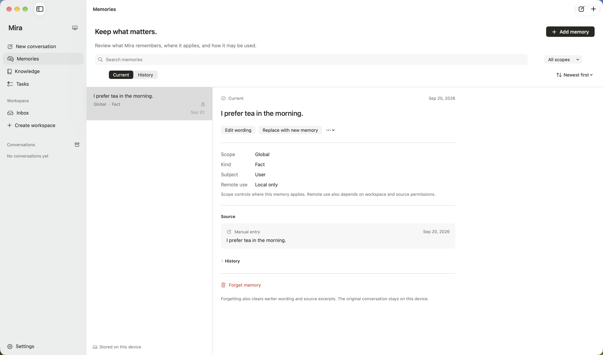

<!-- User-facing Simplified Chinese translation of README.md; keep both versions aligned. -->

<p align="center">
  <picture>
    <source media="(prefers-color-scheme: dark)" srcset="designs/mira-app-icon/final/mira-logo-white.svg" />
    <source media="(prefers-color-scheme: light)" srcset="designs/mira-app-icon/final/mira-logo-black.svg" />
    
  </picture>
</p>

<h1 align="center">Mira</h1>

<p align="center">
  本地优先的 AI 助理，让对话、个人记忆与知识持续相连。
</p>

<p align="center">
  <a href="https://github.com/alwynou/mira/actions/workflows/ci.yml"></a>
  
  
  
</p>

<p align="center">
  <a href="README.md">English</a> · <strong>简体中文</strong>
</p>

<p align="center">
  <a href="#功能">功能</a> ·
  <a href="#路线图">路线图</a> ·
  <a href="#快速开始">快速开始</a> ·
  <a href="#文档">文档</a>
</p>

Mira 是一个原生 macOS 工作空间，将你自己的模型服务与对话、工具和可复用的个人知识连接起来。它围绕一条简单的路径构建：记住有用的内容，在之后的对话中恰当召回，查看来源，并在情况变化时纠正或遗忘。

资料库保存在你的 Mac 上。你自带 API Key（BYOK）、选择模型，并控制哪些记忆和知识可以发送给模型。Mira 无需注册账号，也不依赖 Mira 托管的后端。

> **项目处于早期开发阶段。** 核心功能已有实现，v0.1 发布验收仍在推进。目前请从源码构建体验。开发版本使用可丢弃的资料库，不兼容旧数据格式。Knowledge（知识）与 Tasks（任务）管理界面仍待实现。

## 功能

- **原生对话体验** — 工作空间、流式 Markdown、代码与公式渲染、独立思考内容，以及取消、重试和恢复。
- **自选模型与配置** — 支持 OpenAI Chat Completions、OpenAI Responses 和 Anthropic Messages 协议适配，可配置兼容端点、发现模型、手工填写模型 ID，并明确上下文限制。
- **可纠正的个人记忆** — 自动提取符合条件的用户自述事实与偏好，结合本地语义与文本检索；原生管理界面支持查看来源、编辑、替代、归档和遗忘。
- **有来源的知识** — 核心已支持 Markdown 快照导入、资料版本、本地检索和可验证引用，管理界面仍待完成。
- **可查看的 Agent 活动** — 有界工具执行、权限校验、可展开的结果，以及在服务商提供足够数据时展示的前台／后台用量与费用估算。
- **本地数据自主权** — 本机存储、Keychain 凭据、范围与远程使用控制，以及资料库备份和恢复。
- **英文与简体中文** — 在设置中切换界面语言，不改变你的内容或模型回复语言。

<p align="center">
  
</p>

<p align="center">
  <sub>使用合成演示数据的原生记忆管理界面。Knowledge 与 Tasks 界面仍待完成。</sub>
</p>

## 路线图

已勾选表示能力已有实现并经过限定范围的验证，不代表全部发布门槛已通过。详细范围和验收状态以 [MVP 计划](docs/MVP.md) 为准。

### 已实现

- [x] 原生 macOS 对话工作空间与双语设置。
- [x] BYOK 连接、模型池、三种模型协议，以及思考与工具调用续接。
- [x] 以日志为权威的 Agent 运行时，支持取消、重试与崩溃恢复。
- [x] 自动记忆提取，以及本地语义／文本混合召回。
- [x] 原生记忆管理：当前与历史视图、来源、纠正和遗忘。
- [x] 核心中的 Markdown 导入、版本化知识检索与来源验证。
- [x] 本地资料库备份、恢复，以及未签名的开发打包流程。
- [x] 任务工具与一次性本地提醒底层能力；替代管理界面仍待完成。

### 接下来

- [ ] 扩大真实模型评估，覆盖记忆提取、纠正、遗忘与相关召回。
- [ ] 扩大真实服务商验证，覆盖思考与工具调用续接。
- [ ] 实现 Knowledge 与 Tasks 管理界面。
- [ ] 完成 macOS 15 原生运行、Intel、可访问性与交互验收。
- [ ] 达到剩余的大资料库、延迟与长对话性能门槛。
- [ ] 准备签名、公证的下载包，验证安装与更新。

### 后续／暂缓

- [ ] 验证开启专注模式时的提醒送达。
- [ ] 探索重复提醒和向 Apple 日历／提醒事项发布。
- [ ] 扩展结构化记录，并探索 iOS 应用。

以上是开发方向，不构成发布日期承诺。已验证范围与剩余缺口见[记忆界面验收](docs/engineering/MEMORY_MANAGEMENT_VERIFICATION.md)、[记忆集成限制](docs/engineering/LOCAL_MEMORY_IMPLEMENTATION.md)和[发布验收记录](docs/engineering/MVP_EXECUTION.md)。

## 快速开始

### 环境要求

- macOS 15 或更新版本。当前原生界面与本地嵌入模型的验证来自 Apple Silicon；Intel 运行验收仍未完成。
- Xcode 26.3 或更新版本，并选择其命令行工具。Host 依赖要求 Swift 6.2+，工程使用 Swift 6 语言模式。
- 真实对话需要你自己的模型服务凭据；下方 Debug 演示不需要 API Key。

### 构建与运行

```sh
git clone https://github.com/alwynou/mira.git
cd mira
xcodebuild -project Mira.xcodeproj -scheme Mira -configuration Debug \
  -destination 'platform=macOS' -derivedDataPath .build/xcode \
  -onlyUsePackageVersionsFromResolvedFile CODE_SIGNING_ALLOWED=NO build
open .build/xcode/Build/Products/Debug/Mira.app
```

也可以打开 `Mira.xcodeproj`，选择共享 **Mira** Scheme 运行。生成的工程已经提交；只有修改工程定义或文件组织时才需要 XcodeGen。

### 连接模型

1. 打开**设置 → 服务商**，添加内置服务商或兼容的自定义服务商，填写端点与 API Key，保存并启用连接。
2. 获取模型列表或手工填写模型 ID，启用需要加入模型池的模型。
3. 检查模型的上下文窗口、输出上限与能力，在发送请求前补充缺失的上下文限制。
4. 在对话中选择模型，或配置默认模型，然后开始聊天。

API Key 保存在 Keychain 中。模型发现只查询所选服务商的目录；主动测试会发送合成提示，可能产生服务商费用。模型选择失效时会明确报错，不会静默切换服务商。

记忆会在回合完成后按批次自动提取，使用该批次最后一个已完成回合的对话路线。这会产生额外的服务商请求和可能的用量费用；无需单独配置提取模型，也没有每日提取配额，单次请求的模型限制仍然生效。**设置 → 记忆**展示本地嵌入模型的准备情况与状态。语义召回通过 MLX 使用下载到本机的 Qwen 嵌入模型。详情见[记忆行为](docs/product/MEMORY_AND_KNOWLEDGE.md)和[本地模型集成](docs/engineering/LOCAL_MEMORY_IMPLEMENTATION.md)。

### 体验离线演示

先退出正在运行的 Mira，再用隔离的临时资料库启动 Debug 应用：

```sh
open .build/xcode/Build/Products/Debug/Mira.app --args \
  --demo --data-directory /tmp/mira-demo
```

演示使用合成回复，不发送服务商请求，也不访问凭据。它用于预览界面；真实记忆质量需要通过真实模型评估。Release 构建不提供演示模式。

## 数据与隐私

- 对话与执行历史保存在本地会话日志中；领域记录和搜索投影保存在 SQLite 与托管文件中。
- 默认资料库位于 `~/Library/Application Support/Mira`。可通过绝对路径 `--data-directory` 使用隔离的开发资料库，切换前请退出 Mira。
- 远程模型会收到当前连接获准使用的上下文。本地存储不意味着模型请求离线运行。
- 手动新增的记忆默认仅限本地，你可以查看和更改其远程使用设置；自动提取会跳过被分类为敏感的内容。
- 已实现资料库备份和恢复。开发期数据格式可能变化且不提供迁移支持，体验时请使用可丢弃的数据。

范围、披露、导出、删除与遗忘规则见[数据与隐私规范](docs/product/DATA_AND_PRIVACY.md)。

## 架构

Mira 采用端口与适配器架构，依赖指向仅使用 Foundation 的核心：

```text
MiraMac (SwiftUI + AppKit, composition, platform services)
  ├── MiraData      ──┐
  ├── MiraProviders ──┼──> MiraCore (Foundation only)
  └──────────────────┘
```

应用运行时独立于视图管理长时间执行。会话日志是对话执行的权威来源，SQLite 投影可以重建。Keychain、通知和 MLX 等平台服务留在 macOS 宿主中。

| 路径 | 职责 |
| --- | --- |
| `Apps/MiraMac/` | 原生应用、展示模型、设计系统与平台适配 |
| `Packages/MiraKit/Sources/MiraCore/` | 领域值、用例、Agent 运行时与端口 |
| `Packages/MiraKit/Sources/MiraData/` | 持久化、搜索、托管文件与备份适配 |
| `Packages/MiraKit/Sources/MiraProviders/` | 模型协议、发现与传输适配 |
| `Tests/` | 使用合成数据的宿主、组装与原生 UI 测试 |
| `docs/` | 产品范围、架构契约与工程证据 |
| `designs/` | 品牌资源、设计探索与导出的设计令牌 |

详情见[架构总览](docs/ARCHITECTURE.md)与 [Agent 核心设计](docs/architecture/AGENT_CORE_PROPOSAL.md)。

## 开发与贡献

欢迎提交问题和范围明确的贡献。请先创建 [GitHub issue](https://github.com/alwynou/mira/issues)，说明问题与验收标准，并阅读[贡献者约定](AGENTS.md)和[开发指南](docs/engineering/DEVELOPMENT.md)。从最新 `main` 创建 `codex/` 任务分支，使用 Conventional Commits 提交，发起关联 issue 的 Pull Request，必要检查通过后再合并。

| 命令 | 用途 |
| --- | --- |
| `swift test --package-path Packages/MiraKit` | 运行包测试；可添加 `--filter` 缩小验证范围 |
| `python3 scripts/check_language_policy.py` | 检查英文源码与双语界面资源 |
| `python3 -m unittest discover -s scripts/tests` | 检查模型目录及辅助脚本 |
| `xcodegen generate` | 修改工程或文件组织后，使用 XcodeGen 2.46.0 重新生成工程 |

按修改行为选择相关测试。界面语言变更还需运行 `MiraHostTests`；原生 UI 变更需要实际交互验证。CI 使用合成数据，不依赖付费模型端点。请勿在贡献中包含 API Key、真实对话或开发资料库。

如需从已提交版本生成 ZIP，请遵循[本地打包流程](docs/engineering/LOCAL_DELIVERY.md)。公开分发验收仍待完成。

## 文档

| 指南 | 内容 |
| --- | --- |
| [产品总纲](docs/PRD.md) | 产品方向、用户掌控与成功标准 |
| [MVP 与里程碑](docs/MVP.md) | 已实现范围、后续增量与验收门槛 |
| [架构](docs/ARCHITECTURE.md) | 模块边界与技术契约 |
| [记忆与知识](docs/product/MEMORY_AND_KNOWLEDGE.md) | 提取、召回、来源、纠正与遗忘 |
| [开发](docs/engineering/DEVELOPMENT.md) | 工具链、构建、测试与贡献流程 |
| [质量标准](docs/engineering/QUALITY.md) | 评估方法与发布门槛 |
| [视觉标识](docs/product/VISUAL_IDENTITY.md) | Contour Silver 标志与应用形象 |

产品与架构文档目前包含中文内容；工程证据按增量记录各次验证的实际范围。

## 许可证

项目目前尚未声明统一许可证。所包含的依赖保留各自许可证，详见[第三方声明](Apps/MiraMac/Resources/ThirdPartyLicenses.txt)。
