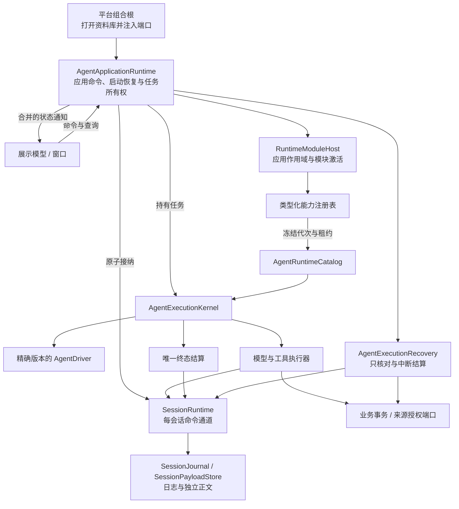
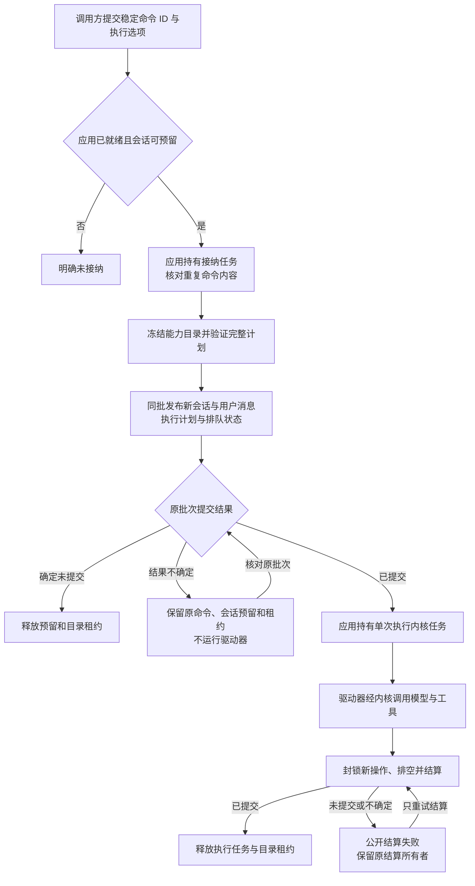
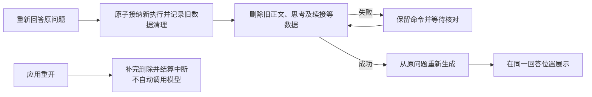

# Agent 应用运行时与持久执行计划

<!-- Simplified Chinese documentation is explicitly requested by the user on 2026-09-12. -->

本文定义新核心的应用命令、任务所有权和启动恢复边界。它通过[执行内核](AGENT_EXECUTION_KERNEL.md)与[工具执行器](AGENT_TOOL_EXECUTION.md)运行一个回合，不接入旧 `MiraApplication` 或 SQL 会话权威路径。生产 Provider、领域模块、查询投影、隐私维护、备份与原生宿主已直接接入新核心；完整验收仍按[实施计划](../engineering/AGENT_CORE_IMPLEMENTATION_PLAN.md)推进。

## 核心架构

`MiraCore` 只依赖 Foundation。平台组合根注入文件日志、业务数据库、模型传输、凭据和平台服务；应用运行时与驱动器不包含 macOS、iOS 或领域判断。模型、工具、上下文贡献器和驱动器通过同一作用域注册表组合。可共享能力注册为共享模块，平台能力注册为相应宿主模块；本次没有新增平台工具或实现 iOS。

`AgentApplicationRuntime` 负责生命周期与应用命令；`AgentExecutionKernel` 负责一个执行的受限操作与决定；`SessionRuntime` 负责单会话事实的串行提交。应用运行时不拥有模型循环、领域处理器或万能存储接口。窗口销毁和观察者退出均不释放执行所有者。

图示导出：[架构图 SVG](diagrams/agent-application-architecture.svg) · [PNG](diagrams/agent-application-architecture.png)。

## 持久执行计划

首条消息通过 `AgentSubmitCommand.opening` 提供新会话标题与工作区，在同一批次发布会话创建、用户正文与排队执行；失败不能留下只创建了一半的会话。已有会话的接纳同批发布用户正文引用与 `SessionAdmission`；后者引用一个必需的 `AgentExecutionPlan` 正文。计划包含：

| 字段 | 契约 |
|---|---|
| `runtimeID` | 本次应用运行时实例身份；重启不会继承执行能力 |
| `catalogGeneration` | 接纳时一次冻结的能力注册代次；目录持有原模块租约 |
| `driverID` / `driverRevision` | 精确匹配驱动器版本；没有隐式选择最新版本 |
| `instructions` | 本次执行的基础指令，不随显示语言或后续设置变化 |
| `limits` | 模型步骤、工具数量与并行数、预留输出额度、尝试期限与总期限 |
| `priority` | 模型资源调度优先级；不意味着本地驱动器占用模型额度 |
| `route` | 明确冻结的模型路线，或本地执行的空路线 |

`SessionAdmission.hasModelRoute` 是归约所需的结构标记；使用计划前必须检查它与计划正文一致。执行内核只从持久计划读取配置，并核对运行时身份与目录代次，构造调用方不能另传指令或限制覆盖它。计划使用独立的 `executionPlan` 正文种类，已直接移除先前的 `route` 正文格式，没有旧格式解码器。

驱动器和模型都按标识与修订精确查找。同一目录可以注册同一驱动器的不同修订，同一标识与修订的重复项被拒绝；模型适配器每个标识只能注册一个修订。缺少指定版本会在接纳前失败。

## 接纳与执行流程

图示导出：[接纳流程 SVG](diagrams/agent-admission-flow.svg) · [PNG](diagrams/agent-admission-flow.png)。

接纳在第一次异步操作之前预留会话；同一命令的并发调用共享原任务，不同命令不能占用该预留。实际活动执行唯一性仍由日志归约器保证，内存字典不能取代持久仲裁。

同一已提交命令被再次提交时，核对原接纳的执行、消息身份、文本、时区和完整选项，再返回原批次游标；不得再次运行驱动器。已清理正文无法重新核对时明确失败，不猜测原请求。执行任务按 `(sessionID, executionID)` 定位，避免跨会话相同执行标识互相取消或覆盖。

`AgentTurnInput.retry` 复用原用户消息身份、日期和时区；归约器只允许重试最近的、未成功且副作用已知的合格执行。新执行重新冻结计划。同一执行内的[有限模型重试](AGENT_MODEL_RETRY.md)使用独立尝试身份，继续复用该步骤的完整冻结请求；它不重新接纳用户回合。

用户重试表示**重新回答原问题**。应用在同一接纳批次中追加 `admitted` 与 `retryCleared`，后者必须紧跟本批次的新执行接纳。归约器核对原问题、源执行和完整清理集合：该问题之前所有尝试尚未失效的生成正文、思考、续接、请求、草稿、工具正文及错误数据均被退休；原始用户消息、标题和冻结执行计划不在集合中。生成数据为空也记录空清理事实，以保持命令核对一致。

日志确认后，应用仍持有会话预留和冻结目录，等待正文存储完成实际删除；失败返回 `indeterminate`，禁止模型／工具派发，通过同一命令的 `reconcileAdmission` 继续清理。删除不在日志索引安装的中途执行，避免已落盘的批次与内存索引只安装一半。重开文件库时从持久失效集合补完删除；应用启动也在恢复活动执行前经过清理屏障，恢复只结算中断，不自动重新回答。

新回答从原问题重新构建上下文，不拼接旧回复。旧执行仅保留必要状态、计量和身份元数据，已清理正文在查询／审计中返回 `.purged`，搜索追赶时移除相应文档。已经提交的任务、记忆等工具业务效果不被撤销；副作用未知的执行仍不允许重试。此操作不使用会递归作废依赖执行的来源隐私撤销流程。

会话创建、重命名、归档也由应用任务持有，并使用同一会话预留。重命名与归档检查预期修订。命令结果不确定时只核对它自己的批次；如果会话被另一个命令的不确定批次隔离，新命令明确返回未提交，不能接管那个批次的身份。

## 取消、恢复与关闭

- **取消：** 立即登记会话或待确认接纳的取消意图。接纳尚未确认时不运行驱动器；确认后执行内核先检查取消，再决定是否运行。调用方 Task 的取消与显式取消命令分开：已预留的接纳由应用继续完成。
- **启动：** 读取绑定权威日志前缀的[恢复摘要](AGENT_SESSION_READS.md#应用启动恢复摘要)，为活动会话加载完整状态，核对未终态执行的已有工具结果与业务回执，再以中断终态保存可恢复草稿。恢复协调器没有可执行工具目录，也不调用模型或驱动器。恢复未结算时应用保持 `recovering`，可查询和重试结算，不能接纳新任务。
- **仅结算重试：** 保留终结器首次构造的意图和命令 ID。重试先解决原批次，不重建模型请求，不重复业务写入。关闭运行时本身不能被当成成功结算。
- **关闭：** 先停止接纳并登记取消，等待接纳和会话命令，再核对不确定接纳；排空所有执行并尝试原结算。随后关闭会话观察、调度和审批，最后释放模块与应用作用域。不可协作的 Swift 任务须实际退出后才能完成清理，不能声称已被强制终止。
- **关闭报告：** `AgentApplicationShutdownReport` 列出未核对命令、未结算执行和仍活动／隔离的会话。报告不会因内存所有者被释放而消失；下次打开仍以日志为准恢复。报告不是已经完成一致性备份的证明。

物理资料库由平台组合根拥有，必须等应用关闭返回后再关闭其存储。权威日志损坏或不可读时拒绝打开整个运行时，不跳过会话继续执行。启动恢复会立即释放已结算会话；若未结算会话超过缓存上限，同样拒绝打开并排空已持有工作，保留日志供后续恢复。当前 `open` 默认最多缓存 128 个会话，同时最多预留 64 条接纳／会话命令；配置上限分别为 4,096 与 1,024。只允许显式释放没有应用工作或活动执行的缓存会话。持久偏移索引、完整检查点、查询投影及精确恢复摘要已有实现；大库核心启动与原生启动是独立指标，实测及未完成项见[规模验收](../engineering/AGENT_CORE_SCALE_VERIFICATION.md)。

## 事件与查询

应用状态通知使用 `bufferingNewest(1)`，最多 256 个观察者，发布阶段、待确认命令、执行所有者、待解决的恢复／结算失败和关闭报告。慢观察者收到最新状态，完整执行历史仍通过日志游标读取。会话观察同样是唤醒提示，既不拥有任务，也不充当领域事件消费记录。

`observeSessionOutput` 另行提供[实时可见输出](AGENT_LIVE_OUTPUT.md)：当前尝试的回答／思考累计快照与清空状态。它采用有界合并，不包含私人续接；订阅者退出不取消执行。实时内存修订不能代替日志游标或终态，原生调用方需随工作组更换重新绑定。

`sessionSnapshot`、`observeSession` 与 `readSession` 是当前无 UI 查询入口。面向列表的[读取投影](AGENT_SESSION_READS.md)和可独立组合的[持久消费者](AGENT_SESSION_CONSUMERS.md)已有基础实现；正文访问／维护租约、领域授权及宿主自动唤醒／公平扫描已按各自契约整合，具体边界与未完成验收由对应文档记录。

验收命令、合成故障注入方式和未完成范围见[核心验证记录](../engineering/AGENT_CORE_VERIFICATION.md)。

## 库访问与维护

应用必须显式接收同库 `AgentLibraryAccess`，启动前取得应用租约，直到接纳、恢复、执行、模块和会话全部排空后释放。维护期间新命令被拒绝；维护所有者仍须等待应用关闭报告，不能仅请求取消后开始清理。详见[库级访问关口](AGENT_LIBRARY_MAINTENANCE.md#访问关口与作用域所有权)。

## 会话模型选择与接纳修订

会话模型选择使用日志事实 `modelSelectionChanged`，明确区分继承与选定的连接／model ID／配置实例／预设。选择具有独立修订。发送携带读取时的选择修订，首次发送可在同一批次提交选择变化、用户消息和执行接纳；复核失败不产生半份事实。稳定 commandID 对完整请求去重。删除配置保留失效引用，不能回退默认项。准确契约见[模型配置](AGENT_MODEL_CONFIGURATION.md)。
