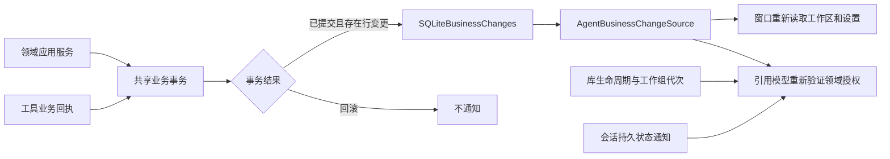

# 业务提交通知

<!-- Simplified Chinese documentation is explicitly requested by the user on 2026-09-12. -->

`AgentBusinessChangeSource` 是核心定义、数据适配器实现的无正文唤醒接口。它解决手动记忆修改、工作区和模型设置提交后，已打开的宿主页面需要重新读取的问题。通知不能提供来源授权，也不承担会话日志、业务回执或持久消费者检查点的职责。

## 核心架构

当前实现监听同一个 `Business.sqlite` 连接队列上的已提交行变更。事务内多次修改合并为一个修订；完整事务回滚及没有其他有效修改的保存点回滚均不产生修订。只读查询不产生通知。查询投影位于独立数据库，投影追赶不会触发业务通知循环。

通知仅含当前进程修订 `revision` 和关闭标记 `isClosed`。修订不是持久游标，不能跨库或跨打开实例比较；它不包含表名、对象 ID、正文或凭据。订阅先返回当前快照，随后采用容量为 1 的最新值缓冲。因此消费者应把它当作重新读取提示，不能假设收到每个事务。订阅建立时也必须安排读取，避免初始快照被并发提交合并后漏掉变更。

## 所有权与关闭

`MacLibraryStorage` 拥有实际观察器，与业务数据库同寿命。`MacLibraryWorkloads` 仅暴露核心读取端口；维护或导出替换工作组时不关闭共享观察器。每个展示模型负责取消和排空自己的订阅、查询。

关闭流程先停止接纳通知，随后在数据库串行队列上移除事务观察器，结束原订阅，最后完成所有关闭等待者。并发或被取消的关闭调用都必须等待同一次实际移除完成。物理库在观察器排空后才关闭数据库。

当前适配器按库整体唤醒。领域级筛选和大库刷新成本仍需根据规模验收确定，不能仅凭通知已经接通宣称性能通过。会话持久通知、实时输出与业务通知分别见[实时输出契约](AGENT_LIVE_OUTPUT.md)和[会话展示层](MAC_CONVERSATION_PRESENTATION.md)。
