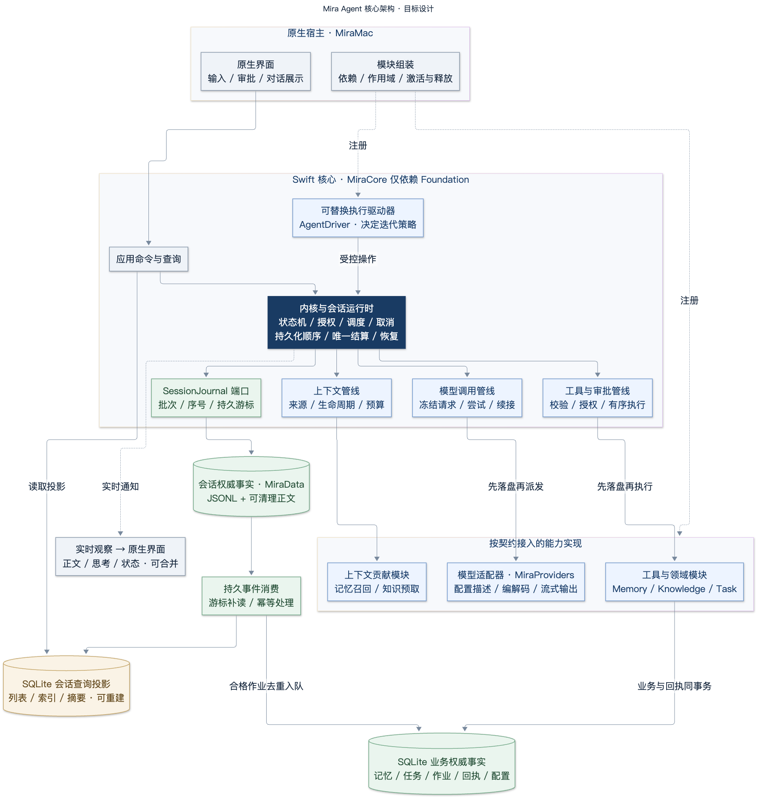
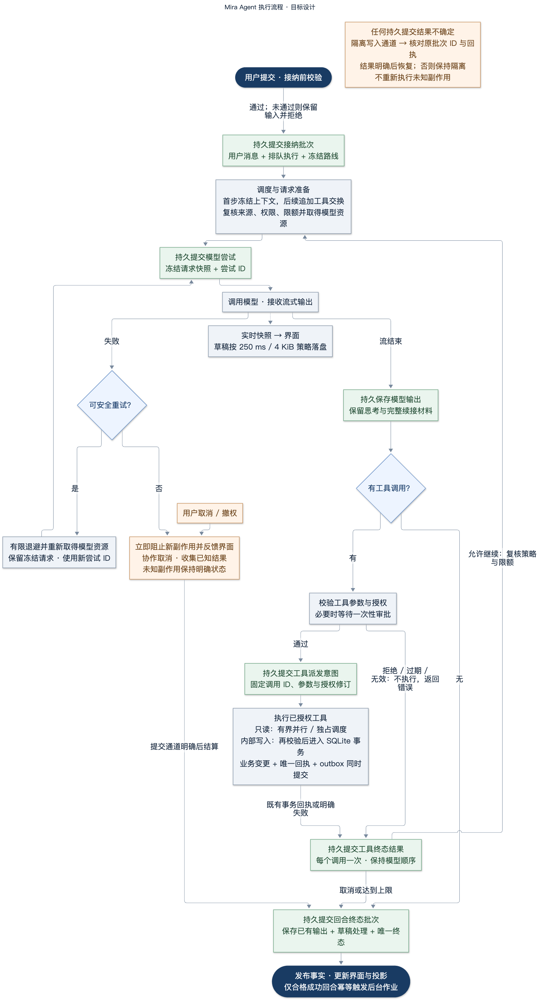

# 可扩展 Agent 核心架构方案

> 当前会话持久化以 [规范会话日志](AGENT_SESSION_LOG.md) 为准。本文保留方案背景；旧的 external 正文、活动草稿、完整 Request Snapshot、隐私计划和旧格式描述不定义当前实现。

<!-- Chinese prose is explicitly requested by the user on 2026-09-12. Implementation identifiers, commands, and source references remain unchanged. -->

日期：2026-09-12  
中文与图示更新：2026-09-13  
状态：新核心与 macOS 直接切换已实现；2026-09-14 按用户收缩范围完成本次重建。完成证据、架构／执行图及后续产品验收见[收尾说明](../engineering/AGENT_CORE_COMPLETION.md)。
实施顺序：[Agent 核心实施计划](../engineering/AGENT_CORE_IMPLEMENTATION_PLAN.md)
当前接纳与任务所有权：[应用运行时契约](AGENT_APPLICATION_RUNTIME.md)

## 1. 结论与优先级

使用 Swift 构建原生 Agent 核心：由一个职责明确的内核保证关键不变量，在其上提供可替换的执行驱动器、有作用域的能力模块、明确的拦截契约和持久化会话日志。借鉴 DSH 的职责划分和扩展机制，自主实现适合 Mira 的核心。

用户已明确要求：**核心质量优先，现有功能必须适配新核心。** 先定义目标契约；现有接口、数据库结构、对象所有权和文件组织都可以重做。只有符合目标边界的旧代码才值得复用。不能为了保留 `MiraStore` 的大而全接口而反向设计新端口，也不能继续让 `MiraApplication` 成为所有功能的中心。

必须保留的是产品正确性：已接受的输入可靠落盘、执行与工具只结算一次、授权明确、模型协议续接正确、取消可恢复、遗忘有效、备份与恢复一致。这些要求本身就是完善核心应当提供的保证。

取舍顺序为：**正确性与明确的事实源 → 独立的扩展契约 → 简单可控的运行维护与可观测性 → 现有代码复用。** 核心与某个业务永久耦合时，应直接重构；边界正确以后，再考虑减少改动量。

需要分别决定两件事：

1. **核心架构：** 内核和扩展契约不依赖特定数据库、UI、模型厂商或业务领域。
2. **正式会话存储：** 使用 DSH v3 追加式 JSONL 日志；不可变消息、思考、工具交换和已结算请求证据以内联事件内容保存，物理帧以 `mira/commit` 原子发布。未结算模型流和完整 HTTP 请求只存在于进程内。SQLite 保存业务权威事实和可重建的会话查询投影。

SQLite 同样可以正确实现事件日志。JSONL 本身不会使 Agent 架构更先进，也不存在“所有 Agent 都必须用 JSON 文件”的通则。本方案选择它的理由是：会话产物可以独立检查、因果历史明确、状态能够确定性重建、执行历史与业务表结构解耦。由此增加的一致性与维护成本必须落实到协议和测试中。

## 2. 重建前的证据与不足（历史基线）

Mira 源码基线：`c8be476fb999c8fe682c52e98afac5c610123547`。DSH 源码基线：`c291e7961a515f6d7af9304e7fd1d257929aef26`。本次审阅覆盖实现与契约，并非只阅读项目介绍。此前本机 Mira 包测试通过 43 个测试套件、394 个测试；这仅证明当时基线的已测行为。表中的旧文件已删除或直接重写，名称保留用于定位上述 Git 基线，不指向当前源码；新核心状态见收尾说明。DSH 测试只做了源码审阅，未执行。

| 领域 | 重建前 Mira 的证据 | 对核心设计的要求 |
|---|---|---|
| 执行所有权 | `MiraApplication.swift` 同时拥有流式任务、草稿、执行、记忆审批、记忆提取和提醒编排 | 拆出独立的会话运行时与领域服务，应用组装层不再拥有整个循环 |
| 事件 | `ApplicationEvent` 使用 `AsyncStream`，缓冲为 `bufferingNewest(128)` | 刷新通知不能充当权威事件流；需要游标重放和可靠业务消费 |
| 生命周期与调度 | 最多同时处理两个回复，第三个直接拒绝；持久状态少于设计中的状态 | 明确排队、资源占用、等待、取消和终态结算 |
| 工具 | `ToolRegistry.swift` 已验证工具定义，执行路径具备顺序、限额、授权和取消处理 | 保留经过验证的语义，以作用域注册和完整执行契约替代静态业务耦合 |
| 上下文 | `ContextBuilder.swift` 接收具体记忆和资料数据，循环直接调用对应存储 | 由上下文贡献模块提供结构化输入，驱动器不出现业务分支 |
| Provider 扩展 | `ProviderContracts.swift` 使用封闭的厂商与协议枚举，历史重放按厂商类型分支 | 除调用端口外，还要开放适配器身份、能力描述和续接策略 |
| 存储接口 | `MiraStore.swift` 合并会话、审计、配置和领域 API | 按具体操作与事务责任拆分端口，避免另一个万能服务容器 |
| 原子性 | `SQLiteMiraStore.swift` 原子接纳消息与执行，并约束活动执行及结算唯一性 | 在日志命令路径重新实现这些保证，内存任务字典不能承担最终仲裁 |
| 领域耦合 | `SQLiteTaskStore.swift` 与`SQLiteMemoryExtractionStore.swift` 依赖消息、执行表的关联查询及外键 | 业务证据必须引用权威会话事实，不能依赖可以删除重建的投影行 |
| 隐私与备份 | `SQLiteMemoryStore.swift`、`SQLiteSourceUsage.swift` 和`SQLiteLibraryBackup.swift` 都以 SQLite 加 Blob 为前提 | 日志切换必须同时覆盖这些路径，不能留到核心上线以后再补 |

当时 Mira 已经有能工作的产品循环和有意义的故障测试，但尚未形成这里定义的可扩展运行时。重命名文件、增加事件总线或包装现有存储，都不足以消除这些耦合。

## 3. 从 DSH 借鉴什么

DSH 通过 Cordis 组装服务、事件和具有作用域的注册项，将持久会话事实、实时 Agent 活动和能力拦截分开。Mira 应借鉴这种划分。“每个组件都可替换”描述的是组装机制，不代表任意组合都会自动满足 Mira 的正确性要求。[DSH 架构][dsh-architecture]

| DSH 机制 | Mira 的选择 |
|---|---|
| 服务定义、实现与使用方分离，注册可撤销 | 使用类型化端口、确定的激活顺序和明确的注册生命周期；不建设以字符串索引所有服务的全局容器。[Cordis 说明][dsh-cordis] |
| Agent 接口与默认循环分离 | 提供 `AgentDriver`，所有执行操作经过内核检查。[Agent 循环][dsh-loop] |
| 从会话历史重建模型输入 | 保存持久请求事实和结果事实，明确上下文与重放投影；不从 UI 消息反推请求。[Session][dsh-session] |
| 受保护的工具管线和有序执行 | 使用明确决策、不可变的已验证参数、有界调度和唯一终态回执；必要检查不能被卸载中间件移除。[工具系统][dsh-tools] |
| 与交互渠道无关的审批请求 | 提供通用一次性审批，绑定调用、提案、作用域、修订和取消状态。[审批][dsh-approval] |
| 可替换的会话持久化与 JSONL 实现 | 借鉴端口与契约测试，设计满足 Mira 批次提交和正文删除要求的格式。[持久化][dsh-persistence]、[JSONL][dsh-jsonl] |
| 调用模型、执行工具前的持久化检查点 | 采用先落盘再产生副作用的顺序，并将必要屏障固定为内核责任。DSH 将其作为单独策略安装。[检查点实现][dsh-checkpoint] |
| 重试与超时策略 | 使用明确且有限的策略。超时依赖协作取消，重复调用提醒也不能代替硬性循环上限。[超时][dsh-timeout]、[重复提醒][dsh-repeat]、[重试][dsh-retry] |

DSH 在一次模型尝试尚未结算时，不会持续持久化实时助手流；Mira 采用同一边界。结算前的流、续接和用量由执行进程持有，硬崩溃丢失未结算前缀。历史格式世代保留、npm 分发、热加载和程序化工具调用，也不属于本次借鉴的必要部分。

DSH 明确处于开发者预览阶段，可能发生不兼容变更。固定版本的实现是设计参考，不能代替 Mira 自身的生产验收。[DSH 项目说明][dsh-readme]

## 4. Swift 与其他路线的比较

| 方案 | 收益 | 成本与适配性 |
|---|---|---|
| 按独立扩展契约设计 Swift 核心 | 原生集成、统一并发模型、类型化领域边界，可供未来 Apple 平台宿主复用 | 需要自行实现并验证生命周期和持久化语义；最符合当前目标 |
| 在 Node 进程中嵌入 DSH | 直接复用运行实现与插件 | 增加进程管理、IPC、打包和原生能力桥接；现有 SDK 的取消、审批能力仍有延后项。用户不需要生态复用，因此主要收益有限。[SDK 限制][dsh-sdk] |
| 逐包将 Cordis、DSH 翻译为 Swift | 结构与参考项目接近 | 同时引入框架复杂度和运行时假设，仍需重新证明正确性；不采用 |
| 保留当前对象关系，仅增加 hooks | 当下修改量最少 | 执行所有权和存储耦合继续存在，不满足核心优先要求；不采用 |

Swift 的接口、值类型、异步流和隔离状态所有权足以表达这些机制。但跨越 `await` 的多步操作不会自动成为事务，必须处理 actor 重入。取消也是协作式的，任务组超时不能保证强制终止不配合的工具。这些约束需要进入设计和测试。[Swift actor][swift-actors]、[结构化并发][swift-tasks]

编译进应用的能力模块属于受信任代码。本方案提供产品内部扩展性，不承诺隔离恶意第三方代码；动态二进制加载和跨语言进程隔离应另行设计。

## 5. 核心架构图与职责边界

下图表示**目标架构，尚未实现**。实线表示调用或数据流，虚线表示注册、策略贡献或异步通知。可替换模块必须通过内核约束接入。

图源：[可编辑 Mermaid](diagrams/agent-core-architecture.mmd) · [矢量 SVG](diagrams/agent-core-architecture.svg)

保持正确的包依赖方向：`MiraCore` 只导入 Foundation，拥有契约与运行时；`MiraData` 实现文件系统和 SQLite 适配器；`MiraProviders` 实现模型适配器和协议编解码；`MiraMac` 负责平台服务与组装。只有确实存在独立依赖边界时才新增包，目录拆分本身足以承载初期实现。

### 5.1 稳定内核与可替换行为

内核负责命令身份、会话顺序、合法状态转换、资源占用、先持久化后副作用、强制授权检查、取消与撤权、唯一结算和恢复。只有内核命令能提交保留的执行事件。

默认 `AgentDriver` 负责模型与工具的迭代策略。它通过受限运行上下文请求组装上下文、发起模型尝试、执行工具批次和完成回合。它不能直接改写会话状态、授予审批、宣布业务写入成功，也不能绕过检查调用 Provider。其他驱动器可以通过相同入口改变迭代方式。若新的执行语义引入新的不变量，仍需修改并审查核心契约，不能以“可扩展”为由建立不可审查的万能工作流语言。

可替换策略包括调度顺序、上下文贡献、路线冻结前的模型选择、符合条件的重试、工具结果呈现和可选观察者。策略受内核限额与用户限制约束；中间件可以进一步收紧决定，不能推翻宿主拒绝或扩大已授予的能力。

### 5.2 第一批接口契约

下表定义责任边界，不要求为每个名词预建一个空协议。

| 契约 | 责任 |
|---|---|
| `SessionJournal` | 按期望序号和稳定命令 ID 提交批次；读取已验证区间与持久游标；明确返回提交结果 |
| `SessionRuntime` | 拥有一个会话的执行通道、状态归约结果和待处理命令 |
| `AgentDriver` 与运行上下文 | 通过内核受控操作表达执行策略 |
| `ModelAdapter` | 准备并流式执行冻结请求，验证配置和续接材料 |
| `ContextContributor` | 提供有界上下文项，声明来源、作用域、权威等级和生命周期 |
| `ToolDefinition` 与执行器 | 描述输入输出、读写副作用、并发方式、超时和结果上限，执行已授权调用 |
| `ApprovalService` | 独立于 UI 请求、解决、过期和取消一次性审批 |
| `RuntimePolicy` 各阶段 | 在规定节点返回类型化决定，不任意修改运行时状态 |
| 领域存储与来源解析器 | 拥有业务事务，验证持久来源引用，避免关联会话投影表 |
| 应用查询接口 | 提供不可变界面快照、分页历史和基于游标的变更 |

按调用方需要和事务责任拆分现有存储 API。构造函数直接接收需要的端口；注册表收集能力，不承担万能依赖容器的职责。

### 5.3 模块生命周期

模块声明稳定标识、显式依赖和提供的能力。宿主在激活前检查依赖缺失、依赖环、重复标识和顺序确定性。激活返回由模块拥有的作用域；部分激活失败时，按逆序释放已完成的注册。释放作用域同时取消其拥有的任务，并移除注册和订阅。

按实际需求使用库、应用、会话和执行作用域。库作用域绑定库 UUID，维护处理器与存储生命周期独立于待关闭的应用模块；详细保证见[库维护契约](AGENT_LIBRARY_MAINTENANCE.md)。每个回合冻结一个注册版本；普通变更在下一回合生效。撤权通过内核校验和取消立即生效，不修改正在使用的签名前缀，也不在工具仍执行时卸载其代码。

激活组共享提交门；嵌套模块宿主的门也受外层门约束。整组激活成功前冻结注册表会明确拒绝，不暴露部分能力。注册代次随注册、注销和作用域撤回推进，普通读取不推进代次。冻结快照持有作用域租约，调用方必须释放；并发释放者等待同一次资源释放完成。

卸载和失败回滚先标记整组作用域并取消自有任务，再撤回注册，最后等待任务／租约静止并逆序清理资源。失败模块的作用域也参与整组回滚，不能先等待其清理再取消其他模块。自有任务在取消处理里发起关闭不能等待自身结束。

Memory、Knowledge、Task 都成为普通能力模块，注册自己的工具、上下文贡献和业务消费者。驱动器不出现 `memory`、`knowledge`、`task` 分支。模块内部的领域规则仍归领域代码，不塞进通用内核策略。

## 6. 执行流程、事件与并发

### 6.1 执行流程图

下图覆盖一次用户回合的主路径，以及写工具、取消和失败处理。持久化提交点是后续操作的前提；遇到提交结果不确定，必须先核对原批次，不能继续调用模型或工具。

图源：[可编辑 Mermaid](diagrams/agent-execution-flow.mmd) · [矢量 SVG](diagrams/agent-execution-flow.svg)

图中“核对回执”只补齐已发生事实，不重新执行业务写入。实时快照可以合并；持久事实依靠序号和游标补读。后台任务的入队可以由持久事件触发，真正的网络调用仍需独立通过授权、预算和调度检查。

### 6.2 三种不同通道

| 通道 | 语义 | 使用方 |
|---|---|---|
| 持久会话事件 | 内核提交的有序事实；每个会话有序号和重放游标 | 重建、审计、查询投影、业务触发 |
| 实时观察 | 有界、可合并的正文、思考、进度和状态快照；通过序号与版本重新取快照 | 展示层和可选诊断 |
| 执行拦截阶段 | 按顺序等待的类型化决定，具有明确取消和失败语义 | 策略、上下文贡献、工具中间件 |

单一广播流不能同时提供这三类保证。持久消费者从游标读取，唤醒通知丢失后仍能补齐。业务消费者在本地事务中同时保存游标、业务变更和去重键。可选观察者不能阻塞日志提交；慢观察者应补读或明确断开。需要可靠外部副作用的观察者，必须建立自己的持久回执协议。

保留的生命周期事件使用封闭且经过验证的词汇。扩展事件使用带命名空间的类型 ID、结构版本、注册解码器和尺寸上限。未知的可选观察事件可以跳过；未知的必要执行事件或模型可见事件，应阻止相关历史继续执行。模块自定义事件不能冒充内核终态事件。

### 6.3 状态与调度

执行同时拥有终态结果和明确的运行阶段：排队、准备、等待模型、等待工具、等待用户、结算、取消中。并行工具各自记录阶段，不能将多个并存等待压成一个失真的全局枚举。所有终态经过同一套状态归约与提交路径。

一个会话由一个未结束执行占有执行通道。全局调度器对不同会话的合格执行排队，控制资源占用及前后台策略，并支持排队时取消。同会话输入注入或执行中转向需要单独的产品契约，不能随着调度器顺带加入。

模型并发额度分配给实际模型尝试，不由整个会话长期占用。等待用户审批时释放不需要的模型资源。审批期限与实际执行耗时使用不同计时器。当前步骤数、工具数、输出和时间上限可以作为初始策略值，不能写死为内核性质。重试使用独立尝试 ID，并保留冻结的路线与请求；需要改请求时，必须显式建立新的请求序列。

自动重试仅适用于明确分类的安全失败：没有已提交的可见输出、没有悬而未决的副作用，并受次数、时间和预算上限约束。没有收到输出不能证明服务端未接收请求；不确定的派发与计费需要保留明确状态。存储重试只重试结果提交，不重新调用模型或工具。

### 6.4 所有权与 actor 重入

`SessionRuntime` 在逻辑上串行处理命令，包含挂起中的提交。仅使用 actor 不够：进行中的追加需要预留序号，并持续拥有同一个批次 ID，直到结果核对结束。取消先登记意图，不能让第二次追加越过尚未确定的写入。迟到流回调必须核对执行、尝试和注册版本才能更新 process-local activity。

追加通道具有显式状态：空闲 → 已预留 → 写入中 → 已提交或明确未提交；结果不确定时进入隔离核对，完成后才能回到空闲。同一个操作跨越所有挂起点持有批次 ID。新变更排在后面；取消立即记录待处理意图，待通道结果确定后结算。只读调用只看最后已提交状态。核对需要验证存活批次，并完成必要同步后才能确认；仍无法确定时保持隔离，不能猜测。测试必须覆盖追加、核对和终态结算期间的回调重入。

Data 适配器通过串行文件执行器完成追加和同步。阻塞文件操作不能在主 actor 上运行，也不能用无限同步工作占住协作式执行器。网络调用不能进入 SQLite 事务或日志关键区间。

取消首先禁止新副作用，再请求协作取消、收集已知结果并提交终态批次。UI 可以立即反馈，实际收尾继续进行。工具不配合取消时，应隔离迟到回调和业务提交，不能声称进程或外部副作用已被强制终止。维护操作可以明确返回忙碌，不能生成不一致快照。

## 7. Provider、上下文和工具的扩展点

### 7.1 Provider 扩展点

使用稳定适配器 ID、带版本的配置描述和注册实现替代厂商身份分支。Core 保留通用且类型化的路线事实：连接身份、模型、凭据引用与版本、能力、预算和修订。端点及协议字段属于冻结的适配器配置；Core 限制其对象形状和大小，具体适配器必须校验协议结构、端点与凭据使用规则，不能成为任意未验证 JSON。

适配器准备阶段产出有界、不可变的请求表示，凭据使用独立引用。标准输出继续区分回答、可显示思考、不透明续接材料、工具、用量和结束状态。适配器拥有厂商专属续接资格与重放校验；内核独立检查来源、路线身份、作用域、正文可用性和预算。设置 UI 读取支持的控件描述，避免每新增适配器就增加厂商 `switch`。

准备是纯计算，不查凭据或发起网络请求；已审计的语义输入不得被适配器暗中替换。内核在调度等待之后、请求持久化之前和实际调用之前检查资格。请求追加结果不确定时停止派发，原尝试身份不能重新调用适配器。文本增量、累计思考、一次组装完成的工具列表、累计用量和明确结束事件组成标准流；缺少结束事件、结束后继续输出、用量倒退或不完整续接均为失败。

保留[思考与续接契约](THINKING.md)规定的行为：Anthropic 当前回合的签名块、支持的同路线思考重放、切换路线限制、部分结算输出和来源授权排除。实现类型可以重做，不能用普通文本重建绕过不透明续接协议。

### 7.2 上下文扩展点

贡献模块返回结构化条目，携带正文引用、来源修订、发送策略、优先级、Token 估算和生命周期。不受信任的召回内容与系统指令分开。稳定提示词、持久历史、当前回合观察和最新用户输入按确定顺序组装。

所有贡献完成后，由内核控制最终校验：授权、来源有效性、工具交换完整性、续接材料完整性和预算。活动回合冻结基础请求与注册版本。策略收紧时阻止下一次派发；贡献模块不能悄悄修改签名前缀。记忆召回和知识预取是验证这一扩展点的首批真实模块。

历史和当前工具轨迹必须与其传递来源一起传入，来源不能在转成消息数组时丢失。贡献条目以“贡献者 ID、条目 ID”共同标识；可选贡献失败或超预算可留下不含正文的省略记录，必需贡献不能被静默裁剪。终态绑定最后一次尝试，重放来源必须等于持久请求来源的并集，并在发布前重新检查当前授权。

### 7.3 工具扩展点

管线顺序为：解析冻结定义 → 校验参数 → 判断授权与审批 → 重新检查宿主限制 → 持久提交派发意图 → 执行一次 → 验证并限制输出 → 持久提交终态回执 → 发布观察。可选的前置、环绕、后置阶段需要明确顺序和类型化结果。环绕阶段不能调用两次工具正文，也不能伪造业务已提交回执。

工具描述包括输入输出契约、读写副作用、并行安全／独占／有序模式、结果上限、执行超时、确认要求和支持的幂等语义。并行完成顺序不改变模型工具交换的结果顺序。每个提出的调用都有唯一终态，包括拒绝、派发前取消和中断后结果未知。

审批绑定调用 ID、参数或提案哈希、执行身份、来源与目标修订、作用域和期限。缺少 UI、过期决定、取消和重启都不能视为批准。业务事务边界再次检查权限；之前有效的审批不能覆盖后来的撤权。

## 8. 会话事实源与持久化协议

### 8.1 权威事实源划分

“权威事实源”指发生冲突或需要恢复时，以哪份数据为准；查询投影只是由它派生的读取结构。

| 数据 | 切换后的权威事实源 |
|---|---|
| 会话身份、标题和归档变更、消息顺序、执行／步骤／尝试事实、请求证据、工具结果 | DSH v3 会话日志及 inline 内容 |
| 记忆、证据、抑制决定、提取任务、知识来源与片段、任务、提醒、预算、工作空间和模型配置 | SQLite 业务表及其受管领域正文 |
| 侧栏与历史索引、执行摘要、会话搜索、读取游标 | 可重建的 SQLite 投影 |
| 未结算模型流与完整 HTTP 请求 | 进程内 `AgentContextBuild`；不进入会话归档 |

现有会话身份直接作为 Session 身份。会话文件属于私有应用数据，不是普通诊断日志；规范 inline JSONL 与业务归档共同构成可恢复产物。

重建投影只删除投影数据，不能删除权威记忆、任务、决定或后台作业。权威业务表不能对可重建消息投影设置级联删除外键。

### 8.2 文件提交协议

每个会话使用一个 DSH v3 JSONL 文件。首行是 `session` header；语义事件
使用 `type`、连续零基 `seq`、毫秒 `time` 与 `data`。消息内容以内联
`SessionContent` 保存，没有 external 路径、retention group、stored digest
或 erasure state。`mira/request-start` 保存冻结路由、system/tool header、
用户消息、context contributions 和 `throughSeq`，不保存完整 request
snapshot、provider wire template、JSON path bindings 或完整 HTTP body。

每个物理 frame 由语义 JSON 行和最后的 `mira/commit` 行组成。commit marker
绑定 batch、sequence 范围和精确前缀 checksum，但不携带语义 `seq`、正文或
嵌入批次。只有有效 commit 发布整帧事实；不确定追加隔离原命令并在核对
前阻止新写入，未提交尾部可在恢复时截断。索引与 checkpoint 只是绑定
源字节的可重建缓存，不是活动模型 checkpoint。

接纳在同一物理帧写入 turn、system、user、route/context 与 Mira admission
fact；模型或工具只在确认提交之后派发。尝试结算写入 assistant/tool/result
事实和 terminal state。追加结果分为 committed、not committed、indeterminate；
不确定命令只能核对自身身份，不能换 ID 重试。

### 8.3 流、恢复与读取投影

模型累积 blocks、continuation、usage 和 stream records 只在进程内存在，
直到 attempt settlement。正常完成、失败、取消或 orderly shutdown 将已
消费前缀一次性结算；硬崩溃丢失未结算流。重启只结算已知工具回执和执行
事实，不重新派发模型或工具。重试创建新的 execution，保留已提交尝试，
由会话投影选择新的回答。

投影事务幂等应用已提交 frames 并推进业务游标。索引、查询投影和恢复摘要
都必须绑定 journal head、schema 与认证材料；缓存丢失或不匹配时从日志
重建。过期投影不能用于授权、活动执行唯一性判断或构建下一次模型请求。
上下文重建读取已提交消息和工具交换，并通过当前来源授权与预算检查；
不能从 unsettled stream 或未保存的 wire body 补造历史。

## 9. 跨存储操作与恢复

### 9.1 内部写工具

JSONL 与 SQLite 没有共同事务，使用明确的持久意图与业务回执协议：

1. 日志提交工具意图，保存调用身份、已验证参数引用与哈希、来源引用、业务幂等键和授权修订。
2. 进入业务写入关口，解析权威来源证据并重新检查撤权和目标修订，然后在**一个 SQLite 事务**中提交业务变更、唯一回执和待发布回执记录（outbox）。
3. 根据该回执追加会话结果；日志可靠结算后才能将 outbox 标为已确认。
4. 重启先核对回执，再结束中断执行。已有回执只补齐原调用结果，不重新执行工具。取得排他所有权、排除旧写入者后，只有意图而没有回执的内部写调用可以直接关闭。缺少事务回执的外部副作用保持未知状态，单独处理。

结构元数据使用内部调用 ID。Provider 返回的工具调用 ID、原始参数和结果放入可清理重放正文。现有任务回执具有可复用语义，其 SQL 关联结构可以重做。

来源引用包含会话和消息身份、序号、修订、内容哈希及原始时间上下文。哈希不是授权。撤权协调器串行仲裁来源失效与本地业务提交资格，领域事务检查持久策略和抑制修订。不能在 `await` 前读一次来源，就假定后续事务开始时仍有效。

意图、回执和 outbox 必须关联相同的调用 ID、业务键、参数哈希、来源修订和授权代次（epoch）。回执还记录结果业务修订与执行结果；outbox 指向回执和原意图序号。来源不可用或无效时禁止新写入。outbox 重试只重新发布既有回执，不能重新取得工具执行权限。

资料库授权代次是业务事务中的持久事实，独立于会话归约器的本地失效代次。两者不得共用一个计数器；会话事件拒绝迟到发布，资料库关口拒绝撤权后的业务提交。只有一个 UUID 或工具自行报告“效果已知”不能证明本地业务已提交。终态结算器在回执尚未核对时拒绝结束已派发写入。

写入关口授予显式提交许可，并跨越本地 SQLite 事务及执行器挂起持续持有，冲突撤权不能插入事务中间。等待日志结算前释放许可，避免关口与追加互相等待。所有失效路径都进入该关口，并在相关读取或新副作用重新具备资格前推进持久授权代次。撤权先完成则写入失败；事务先完成则保留已提交事实，后续遗忘执行领域清理并清除待发布回执正文。结算不能从 outbox 恢复已删除内容。即使结果正文已不可用，也可以保留不含正文的“业务曾提交”事实。

### 9.2 后台记忆提取

持久完成事件由幂等消费者处理，在一个 SQLite 事务中创建提取作业并推进消费游标，沿用来源、修订、提取器和策略的唯一性规则。遗漏唤醒或重复重建投影不能重复创建作业，也不能绕过抑制决定。

作业租约、预算预占、冻结提取路线、提取决定和记忆提交归记忆领域拥有。来源解析器提供权威用户证据，思考永远不是用户证据。派发与最终结算都重新校验来源资格。重放日志可以恢复本地作业记录，但不能将调用模型或安排通知作为重放副作用。

### 9.3 重启顺序

取得写所有权 → 检查待完成维护 → 验证会话有效前缀 → 核对已提交业务回执 → 补齐必要投影与消费者 → 结算中断执行 → 开放读取模型 → 允许新工作。

未完成模型尝试、未知工具副作用、审批和恢复的后台网络作业都不自动续跑。非活动会话采用有界、延迟恢复；尚未验证的会话继续保持访问限制。

## 10. 隐私、备份与恢复属于核心契约

### 10.1 隐私与领域清理

会话日志没有独立的 session erasure plan、retention group、sidecar 或
transitive invalidation graph。模型输出、思考、工具交换和用户消息在已
结算事件中以内联内容保存；未结算流在进程内。Memory、Knowledge 和其他
领域依照各自的数据与隐私契约清理业务事实、证据和查询投影，并在业务
事务中重新验证来源授权。会话读取只发布已提交且当前授权的事件内容，
不会从领域清理派生第二套会话正文存储。

### 10.2 备份与恢复

当前 Data 归档格式、写入屏障与模块契约见[新核心库归档](AGENT_LIBRARY_ARCHIVE.md)。

备份协调器先阻止新接纳和新副作用提交，让产生数据的任务在安全边界停靠或完成收尾，再同步会话写入器与业务事务，并暂停正文垃圾回收。写入器无法静止时，导出失败且不发布有效备份。

使用 SQLite 备份 API 创建数据库快照，捕获每个日志的已提交字节范围和序号，复制所有被引用正文。统一清单记录版本、哈希、大小、游标及待完成维护／回执状态。验证完整后再原子安装最终备份目录。这是在维护屏障下得到的一致快照，不是跨数据库事务。

恢复在暂存目录验证路径、大小、哈希、事件连续性和领域引用；根据捕获前缀重建会话投影，在不产生外部副作用的条件下执行中断／暂停规则并核对本地回执。凭据和操作系统授权不进入可移植产物，提醒按既有恢复契约保持暂停。

安装前，必须确认每个业务来源／意图序号和消费游标均位于所捕获会话前缀内。游标落后可以补齐，超前则说明备份不一致。已确认写回执必须匹配日志结算，未确认回执必须匹配日志意图。对照 SQLite 快照与维护记录验证正文可达性和允许的删除缺口。先在暂存目录完成本地维护与回执核对，再重建投影。无法解释的正文或回执缺失、非法跨引用、投影重建失败，都应在替换现有资料库前终止恢复。只有完整验证的暂存库才能安装，恢复执行仍保持暂停或中断。

## 11. 可扩展性验收与范围

测试组装必须能够在**不修改会话状态归约器和默认循环**的情况下加入以下能力，才能认为架构通过：

- 一个具有输入输出契约、审批和事务结果回执的新工具。
- 一个自带来源策略与生命周期的上下文贡献模块。
- 一类具有独立配置描述与续接策略的假 Provider，无须新增 Core 厂商枚举或 UI 厂商分支。
- 一个从游标恢复连接的持久只读观察者。
- 一个通过相同受控操作改变迭代行为的测试驱动器。
- 一个可以激活、激活失败、释放并重新激活，且没有注册和任务泄漏的模块。

上述扩展原则上只修改自身实现、组装注册和相关测试。新领域行为可以增加领域表和领域测试；执行语义、隐私保证或事实源发生根本变化时，仍需审查核心契约。

本次不实现 npm 兼容、动态二进制插件、嵌入脚本引擎、生产子 Agent、Shell 工具、同步后端、新模型协议、上下文压缩功能或 UI 重设计。扩展点需要由本次选定的验收案例实际使用。未来价值体现在能力可以独立加入、失败可以预测和处理，而不是空抽象数量。

## 12. 契约切换

本提案不会暗中改变当前要求。App 切换前，[AGENTS.md](../../AGENTS.md)、[架构总览](../ARCHITECTURE.md)、[运行时](RUNTIME.md)和[存储契约](DOMAIN_AND_STORAGE.md)中的 SQLite 原子接纳与活动执行唯一性仍有效。切换时同步更新这些文档和调用方，改为本文定义的日志批次与会话通道保证。

同一轮切换还要更新 Provider／思考所有权、上下文贡献、证据引用、任务、提取、隐私、备份、平台组装及 MVP 状态，由各自归属文档承载。依据用户已有授权，可以重建早期开发数据；不引入旧格式解码器、迁移桥、生产双写期或预防性资料库副本。本次规划与文档翻译不更改运行数据。

[dsh-architecture]: https://github.com/deepseek-ai/deepseek-harness/blob/c291e7961a515f6d7af9304e7fd1d257929aef26/docs/architecture.md
[dsh-cordis]: https://github.com/deepseek-ai/deepseek-harness/blob/c291e7961a515f6d7af9304e7fd1d257929aef26/docs/cordis-primer.md
[dsh-loop]: https://github.com/deepseek-ai/deepseek-harness/blob/c291e7961a515f6d7af9304e7fd1d257929aef26/packages/core/agent-loop/README.md
[dsh-session]: https://github.com/deepseek-ai/deepseek-harness/blob/c291e7961a515f6d7af9304e7fd1d257929aef26/packages/core/session/README.md
[dsh-tools]: https://github.com/deepseek-ai/deepseek-harness/blob/c291e7961a515f6d7af9304e7fd1d257929aef26/packages/core/tools/README.md
[dsh-approval]: https://github.com/deepseek-ai/deepseek-harness/blob/c291e7961a515f6d7af9304e7fd1d257929aef26/packages/interaction/user-approval/README.md
[dsh-persistence]: https://github.com/deepseek-ai/deepseek-harness/blob/c291e7961a515f6d7af9304e7fd1d257929aef26/packages/session/session-persistence/README.md
[dsh-jsonl]: https://github.com/deepseek-ai/deepseek-harness/blob/c291e7961a515f6d7af9304e7fd1d257929aef26/packages/session/session-persistence-jsonl/README.md
[dsh-checkpoint]: https://github.com/deepseek-ai/deepseek-harness/blob/c291e7961a515f6d7af9304e7fd1d257929aef26/packages/session/session-checkpoint-policy/src/index.ts
[dsh-timeout]: https://github.com/deepseek-ai/deepseek-harness/blob/c291e7961a515f6d7af9304e7fd1d257929aef26/packages/guard/timeout-policy/README.md
[dsh-repeat]: https://github.com/deepseek-ai/deepseek-harness/blob/c291e7961a515f6d7af9304e7fd1d257929aef26/packages/guard/repeat-tool-reminder/README.md
[dsh-retry]: https://github.com/deepseek-ai/deepseek-harness/blob/c291e7961a515f6d7af9304e7fd1d257929aef26/packages/llm/llm-retry/README.md
[dsh-readme]: https://github.com/deepseek-ai/deepseek-harness/blob/c291e7961a515f6d7af9304e7fd1d257929aef26/README.md
[dsh-sdk]: https://github.com/deepseek-ai/deepseek-harness/blob/c291e7961a515f6d7af9304e7fd1d257929aef26/packages/sdk/protocol/README.md
[swift-actors]: https://github.com/swiftlang/swift-evolution/blob/main/proposals/0306-actors.md
[swift-tasks]: https://github.com/swiftlang/swift-evolution/blob/main/proposals/0304-structured-concurrency.md
