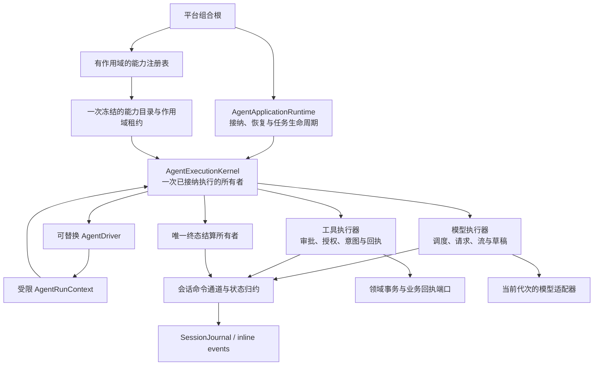
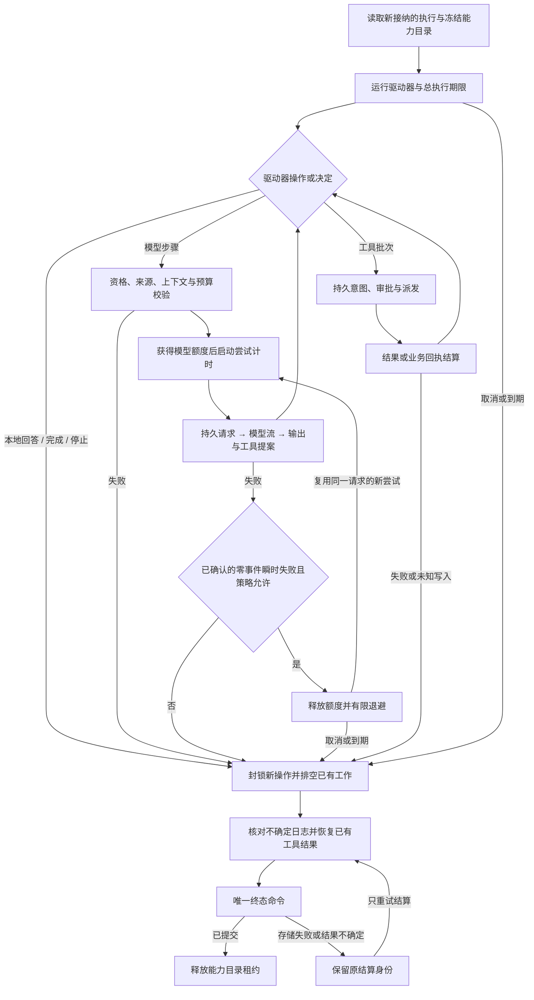
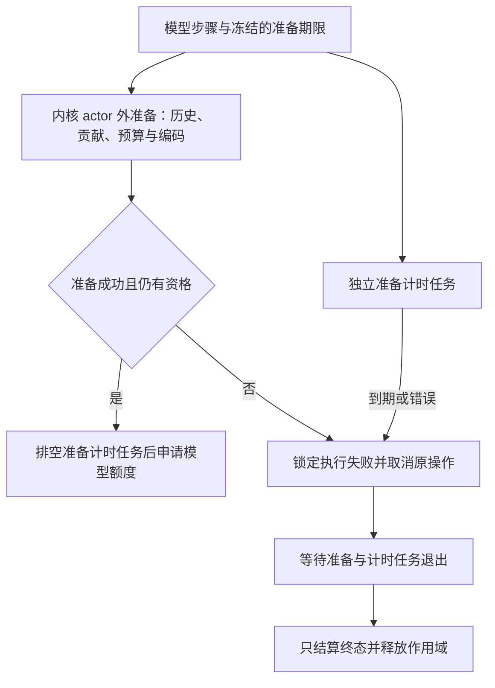
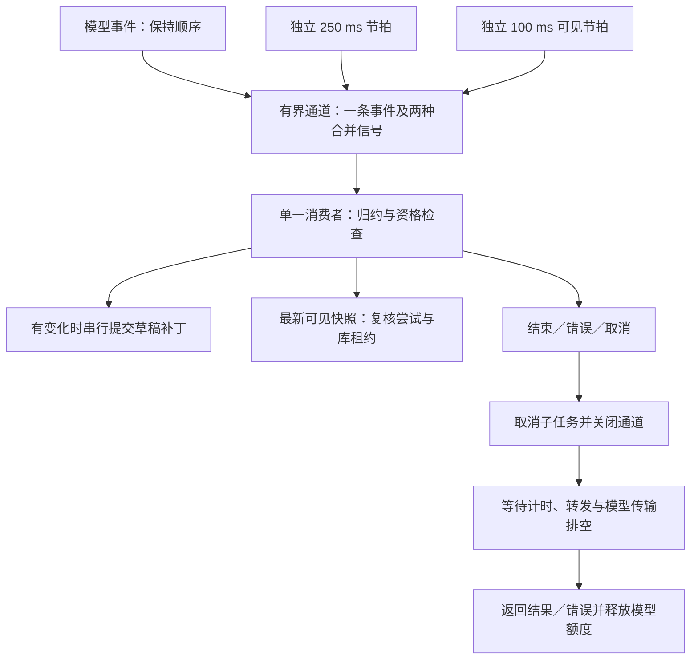

# Agent 执行内核与驱动器

<!-- Simplified Chinese documentation is explicitly requested by the user on 2026-09-12. -->

本文描述无 UI 执行内核的当前契约。它组装了[模型与上下文契约](AGENT_CORE_PROPOSAL.md)及[工具与业务回执](AGENT_TOOL_EXECUTION.md)，仍属于核心重建的中间交付。[应用级接纳与任务所有权](AGENT_APPLICATION_RUNTIME.md)已有无 UI 组合；生产领域模块、隐私维护、备份与原生宿主切换继续按[实施计划](../engineering/AGENT_CORE_IMPLEMENTATION_PLAN.md)推进。

## 所有权与扩展边界

核心只导入 Foundation。图中的模型、工具、持久化与业务端口由模块和宿主组合；内核没有 macOS、iOS、Memory、Task、Knowledge 或模型厂商分支。macOS 的平台能力以后由相应模块提供，当前没有新增平台工具，也没有实现 iOS。

`AgentExecutionKernel` 是内部类型，一次只拥有一个新接纳的执行。它读取接纳时持久化的完整计划，核对运行时身份与能力目录代次；同一执行不能在中途更换目录、指令、限制或优先级。`AgentRuntimeCatalog` 从一次注册表快照构造，验证模型、工具、贡献器、驱动器和持久消费者的语义身份；模型与驱动器查找精确匹配标识与修订。目录持有模块租约，执行结算成功后释放；显式关闭必须先取消和排空工作，再释放租约及底层服务。

持久消费者使用[独立的有限消费协调器](AGENT_SESSION_CONSUMERS.md)，不由驱动器或模型循环运行。

应用运行时负责冻结目录，并将其代次、驱动器版本、指令、限制、优先级和路线一起写入接纳计划。当前内部构造接口不再接受独立的执行配置；完整接纳／启动／关闭边界见[应用运行时契约](AGENT_APPLICATION_RUNTIME.md)。

## 驱动器操作与决定

| 入口 | 行为与限制 |
|---|---|
| `userText` | 只读原始接纳文本，不受显示语言或后续模型输出影响 |
| `modelStep()` | 内核组装上下文、校验资格与预算、持久化请求、调用模型并提交输出；返回内核创建的步骤凭证 |
| `executeTools(for:)` | 只接受当前步骤的凭证和精确输出；不能伪造提案、跳过审批或自行宣布写入成功 |
| `.complete` | 只能完成已有最终模型回答，且当前工具批次必须全部结算 |
| `.respond(text:)` | 在尚无模型尝试时发布有界、非空的确定性本地回答；不能附带工具结果、思考续接或来源证据 |
| `.stop` | 明确中断本回合，不自动开始下一步 |

默认驱动器只表达“模型 → 必要的工具批次 → 下一模型步骤”的迭代。原始用户输入、模型接口和工具接口之间的授权与持久化关口归内核所有。驱动器不能取得 journal、模型适配器、业务端口或审批解决接口。

接纳可以明确没有模型路线。本地驱动器无需模型注册或伪造一次模型调用；尝试调用模型则会失败。无模型回合的历史只能包含纯文本本地回答，不能伪造 Provider 续接。

一次只允许一个驱动器操作。预算、资格、步骤凭证或操作执行失败后，内核锁定失败状态并封锁新操作；驱动器捕获异常不能解除该状态。驱动器返回时仍有操作运行也属于失败。已保留的旧运行上下文不能在回合结束或取消后重新调用模型或工具。

原生模块属于受信任代码。这些约束保护内核操作面，不承诺隔离任意恶意 Swift 代码；不可协作的代码也不能被 Task 取消强制终止。

## 执行流程

`stepID` 标识已冻结的请求步骤，`attemptID` 标识一次实际尝试；两者独立。同一步骤可按[有限模型重试契约](AGENT_MODEL_RETRY.md)再次尝试：只接受已确认落盘的零事件瞬时失败，复用同一份持久请求，使用新的尝试身份并再次检查来源与预算。退避在释放模型额度之后进行。恢复和结算入口不会自动重新派发。

历史由完整的用户／回答交换组成，每个交换携带会话限定的执行来源及其传递来源，规则见[历史执行来源](AGENT_SESSION_READS.md#历史执行来源)。普通聊天与本地回答也有自身执行出处。裁剪最旧交换时只删除不被其他保留交换继承的来源。消息数、字节数和来源数都有上限；不得遗留孤立工具消息，也不得在隐藏重放缺失时回退到可见历史正文。

模型返回的最终轨迹须在结算前通过重放边界校验，避免成功决定形成无法保存的终态意图。上下文继承来源和新增贡献共用总来源上限；超出时裁剪可选贡献，必需内容无法满足上限则失败。跨步骤重复的工具调用 ID 在第二次工具派发前拒绝。模型因输出上限停止时保留可见部分回答并标记失败，不发布成功重放。

### 上下文贡献与预算

`AgentContextAssembler` 直接接收有完整交换边界的 `AgentSessionHistory`，由组装器统一负责预算裁剪。每个模型步骤按已固定的贡献器身份顺序收集一次内容，冻结条目、必需标记和收集失败的省略原因。不能为了调整历史预算而再次调用记忆／知识等贡献器；可选失败不会在同一步骤中自动重试，必需贡献器失败会结束组装。

组装器先从低优先级可选条目开始裁剪；全部可选内容移除后仍超限，才移除最旧的完整历史交换，再用同一份冻结条目重新计算。更短的历史可以重新容纳之前暂时移除的可选条目，最终只保存所接受方案的贡献省略原因。当前用户、当前步骤 ID 和本回合工具轨迹不会因预算调整改变；本回合来源不能通过裁剪历史删除。来源总数在收集之前已超限时，先裁剪历史到可接受范围。

冻结的是贡献内容，不是权限。历史改变后重新检查保留的继承来源，最终构建返回之前仍校验全部来源；明确撤权或权限存储不可用不能触发重新召回来替换证据。此实现避免重复召回，尚未证明最坏预算搜索满足上下文 P95 目标；完整 Inspector 的省略展示仍按实施计划推进。

### 模型步骤准备期限

`modelPreparationTimeoutMilliseconds` 是执行限制的独立必需字段，默认 30,000 ms，合法范围为 1–3,600,000 ms。接纳时随完整计划冻结；不会在读取缺少字段的旧计划时补默认值。它覆盖本回合轨迹重放、权威历史读取、贡献器收集、全部预算重排、纯适配器准备及最后资格校验，成功后才进入模型额度排队与尝试接纳。重试复用已经冻结的请求，不重新启动本步骤准备。

不可变的 `AgentModelPreparation` 在内核 actor 之外执行，避免同步适配器计算占住内核，阻塞取消和期限处理。内核拥有准备任务和计时任务；期限到达先锁定本次执行的失败状态，取消原操作，再等待两个任务退出。计时器异常使用固定 interrupted 诊断。锁定后驱动器即使捕获错误，也不能再调用模型或工具；迟到的准备结果必须丢弃，不生成请求尝试、草稿或模型派发。

准备期限与流式模型期限、总执行期限分别计时。准备阶段不占模型额度；取得额度后才启动模型尝试期限，总执行期限仍约束整个回合。超时和取消均遵循协作退出：不可合作的贡献器、同步 `prepare` 或时钟可以延迟物理排空。内核在排空前保留作用域租约，不提前发布终态或清理仍被调用的模块；Swift Task 取消不是强制终止。适配器的长计算应主动检查取消，准备接口仍禁止凭据读取、网络请求和业务副作用。

图示导出：[模型准备期限 SVG](diagrams/agent-model-preparation.svg) · [PNG](diagrams/agent-model-preparation.png)。

### 草稿定时检查点

请求持久化并派发模型后，执行器同时拥有事件转发任务、独立的 250 ms 持久草稿计时任务和 100 ms 可见输出计时任务。三者进入同一个有界通道：最多预存一条模型事件，发送方等待消费者接收；每种计时信号分别合并为一个。只有主消费者修改流归约器、草稿基线和检查点状态，计时器本身不能写日志。持久计时信号优先，其次是可见刷新，再处理待接收事件；持续的小事件不会使计时刷新饥饿。

文本与当前步骤思考的字节长度相对上次检查点变化合计达到 4,096，或计时信号到达且存在已消费的新事件时，消费者提交草稿补丁。暂停的流仍能保存小于 4 KiB 的内容；相同长度的思考／续接变化也由计时路径覆盖。没有事件、没有未保存变化时，计时器不创建日志批次。检查点中的 transcript 继续包含完整的思考状态与不透明续接、工具调用和用量，当前步骤的可见思考会接到之前步骤的已保存思考之后。

每次消费均复核当前会话与执行资格，实际提交继续由串行命令通道验证尝试和草稿基线。正常 EOF 与非取消错误会补齐最后的有效草稿；取消、撤权和持久结果不确定时不能绕过关口追加“最后一次”内容，恢复保留最后已确认的检查点。失败的检查点只按原批次核对，不用错误批次覆盖，也不会再次派发模型。计时器自身失败会结束本次操作，并使用固定诊断。

结束、取消或失败会取消三个任务、关闭通道以唤醒挂起的发送／读取，并立即进入模型操作的 `close()`。只有计时任务、转发任务及实际传输都排空后，才能释放模型额度或发布尝试结果。250 ms 是节拍设置，不是慢磁盘、繁忙执行器或正在进行的日志提交下的绝对同步落盘保证；最坏延迟仍需性能测量。

图示导出：[执行流程 SVG](diagrams/agent-execution-flow.svg) · [PNG](diagrams/agent-execution-flow.png)。

可见输出通过独立的[实时通知契约](AGENT_LIVE_OUTPUT.md)交付，只包含回答与可见思考。执行器为可见写入者和真实模型操作分别登记资源：正常路径保留可见值直到最终草稿／尝试解决记录提交，取消、撤权或流处理失败则先清空可见值，再继续排空生产者。实时快照没有发布成功终态的权力。

## 限制、取消和结算

执行限制包括模型步骤数、工具调用总数、工具并行数、累计预留输出额度、每个模型步骤的准备期限、每次模型尝试期限和总执行期限。它们是经验证的配置，不是驱动器可以放宽的建议。输出预算在实际尝试前预留；当前策略保守计入每次路线最大输出额度，不会根据未知实际用量释放预留。

模型尝试期限在获得调度额度后启动，排队时间不计入该期限；总执行期限覆盖驱动器整个运行，包括排队及审批等待。审批有独立的一次性到期规则。到期或取消后封锁新操作，底层工作协作退出后才释放占用额度。明确关闭也必须等待该排空过程。

适配器返回 `AgentModelOperation`，同时交付事件流和必需的取消／排空操作。事件流结束本身不能证明网络任务及生产者已清理；正常结束、失败和取消都必须等待 `close()` 完成，再释放模型额度和模块资源。关闭合并为一次不受调用方取消影响的清理任务，不保留旧的裸流接口。

取消先在会话运行时登记意图，再取消模型／工具任务并建立业务写入禁止标记。取消完成反馈不等于底层工具已被强制终止；已提交的本地业务回执必须先核对。未知外部写入结果不允许继续模型步骤，也不会在恢复中再次调用原工具。

结算由独立所有者持有稳定命令 ID。存储确认丢失只核对该批次，不重新执行模型或工具；重试成功同样释放原能力目录租约。[来源授权](AGENT_SOURCE_AUTHORIZATION.md)要求上下文明确携带完整冻结目的地。来源在最终检查时明确被撤销，则落为中断终态并阻止正文、思考和隐藏重放发布；该检查也覆盖含可见草稿的失败、取消及恢复终态。可重试的存储读取失败继续保留原结算意图。来源隐私的跨会话传递清理仍由后续 P4 的维护协议完成。

实际测试命令、范围与尚未验收的部分记录在[验证记录](../engineering/AGENT_CORE_VERIFICATION.md)。

## 库访问与维护

内核必须接收作用域访问租约，准备和执行读取均受其约束，驱动任务直接响应租约撤销。模型流的接纳及实际清理由关口拥有，结算保留内部证据读取所有权；终态确认或显式关闭后释放。详见[库级访问关口](AGENT_LIBRARY_MAINTENANCE.md#访问关口与作用域所有权)。
