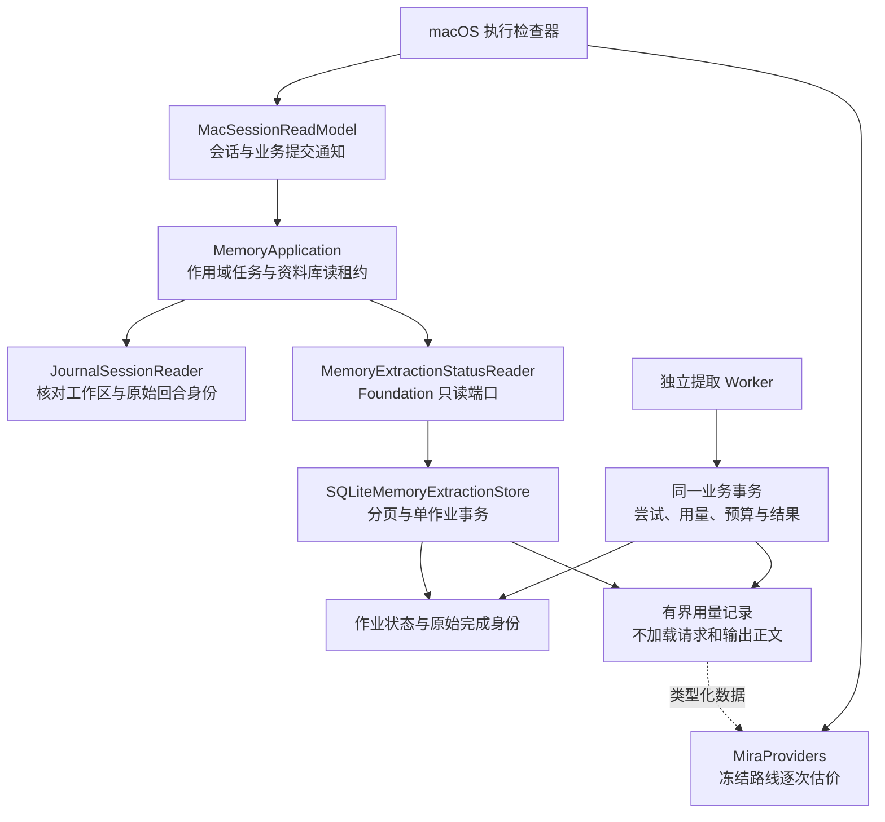
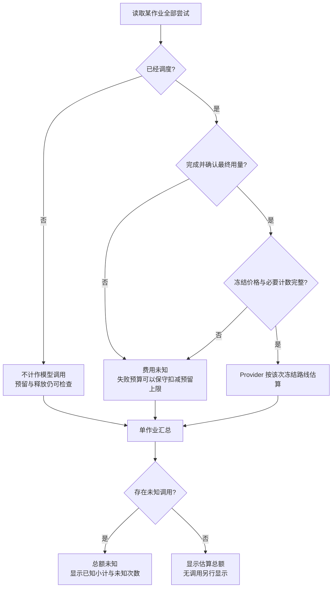

# 独立记忆提取的状态与用量查询

<!-- Simplified Chinese documentation is explicitly requested by the user on 2026-09-12. -->

本文规定后台记忆提取的只读查询与保留边界。价格算法由[用量与费用](USAGE_AND_COST.md)拥有；提取的调度、来源验证和提交规则仍由[自动记忆](AUTOMATIC_MEMORY_IMPLEMENTATION.md)拥有。

## 权威和依赖

前台回合的接纳、完成与原文证据来自会话日志。独立提取作业及其尝试属于记忆领域，保存在同库业务 SQLite；它们不伪装成前台执行，也不向默认 Agent Loop 增加特殊分支。工作线程发出的事件只唤醒观察者，查询始终读取已提交的领域事实。

MiraCore 只拥有类型、验证和端口，不解析 HTTP 价格、不访问 SQLite，也不依赖 macOS。其他宿主可调用相同服务。当前只实现 macOS 检查器，iOS 不在本次范围。

## 查询契约

`MemoryApplication.extractionStatus` 明确接收 `sessionID`、原始完成的 `executionID` 与 `workspaceID`。资料库租约内先检查日志身份，再调用领域查询。`nil` 工作区表示 Inbox，不能作为全工作区通配符。

作业按 `(createdAt, id)` 降序分页，每页 1–32 项，默认 8 项。SQL 在 LIMIT 前同时应用工作区、会话和原始完成过滤。游标携带这三个范围以及边界；其他范围的游标、非有限时间、越界页长均拒绝。各页读取当前已提交快照；多页浏览不是长期冻结事务，新作业通过回到最新页查看。

`extractionReport` 同时限定作业 ID 和上述范围。一个事务读取作业及全部尝试，最多 100 次，验证 ordinal 连续、数量和最终状态与作业一致。作业分页不截断单作业用量。不存在或越界返回不可用；作业列表没有匹配项则返回空页。

`MemoryExtractionJobSummary` 仅携带身份、状态、时间、尝试与结果数量。`MemoryExtractionAttemptUsage` 携带尝试身份、状态、时间、预算归属日、预留、扣减、可选实际 `TokenUsage`、仍保留的冻结路线和清理时间；不含原文、请求、输出、思考、候选内容或原始错误正文。

## 写入与完整性

当前格式直接增加 `execution_id` 查询索引、独立 `reportedUsage` 和有界 `accounting` 列，不添加旧格式解码或迁移。开发历史库可以删除后重建。

每次尝试转换在同一 SQL 事务中写入完整尝试与 compact accounting。后者最大 128 KiB，附 SHA-256 校验和，读取时同时核对 SQL 身份、状态、ordinal、预算标量和类型验证。正常状态转换与归档完整检查进一步核对它与完整尝试的派生结果一致。未知字段的凭空推断、根据当前模型设置恢复历史价格、将损坏行跳过后继续汇总均不允许。

状态页不加载尝试正文；单作业报告和日预算只 SELECT 用量列，不 SELECT 最大 16 MiB 的尝试请求／输出 JSON。请求正文损坏不会迫使用量查询解码它，但不代表完整尝试或归档验证通过。用量列损坏会让报告和预算查询失败。

成功输出的 `TokenUsage` 与完成、记忆决策和预算结算原子保存；缺少某个计数保持未知。终态、时间顺序与实际调度日均校验。正常完成不能使用早于调度的时间；恢复失败结算遇到时钟回拨，将结算时间至少夹到尝试已发生的调度／开始时间，隐私清理时间至少为结算时间。

## 实际用量、预算与费用

预留与扣减是预算事实：已调度失败按预留上限扣减，并不证明 Provider 实际使用了这些 Token。只有 `dispatchedAt != nil` 才计入独立提取的调用次数；完成但缺少缓存等必要计数仍不能估价。实际用量保留缓存输入基数和思考计数，计算规则不变。失败流的部分用量跨 Worker 超时边界收集仍不在当前增量内。

隐私清理删除请求、输出、思考、决策和错误正文，保留独立用量与预算事实。清理后的查询不再返回冻结路线，费用为未知；不会从内部身份校验记录或当前配置重新提供价格。该计费查询不提供证据正文的读取授权，也不会恢复已排除的模型上下文。

## 宿主所有权

执行检查器在原始回合下面显示独立作业，可分页和选择作业，并查看全部尝试。它与前台费用分别计算，没有新增统计仪表盘、金钱硬上限或对话正文中的自动记忆状态面板。

`MacSessionReadModel` 先订阅会话和业务提交通知，再读取；资料库维护、关闭或代次替换会撤销结果、取消并排空读取。作业详情按作业身份重新绑定；会话／回合切换不能把旧结果装入新页面。`MemoryApplication` 的读租约在撤权后拒绝迟到值，关闭后拒绝新查询。

准确测试、原生证据与剩余限制见[核心验证记录](../engineering/AGENT_CORE_VERIFICATION.md)。
