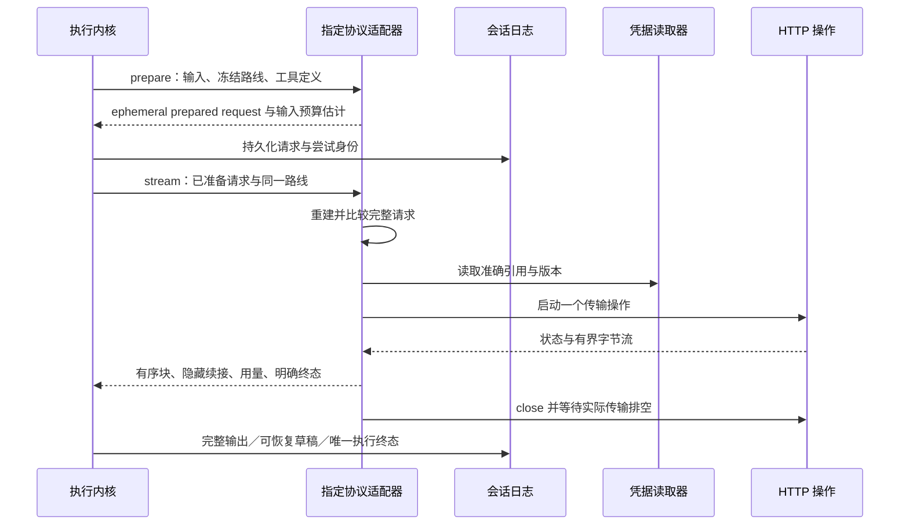

# HTTP 模型适配器契约

<!-- Chinese documentation follows the user's explicit language preference. -->

HTTP 模块直接实现 Foundation 核心的模型端口。配置领域见[模型配置](AGENT_MODEL_CONFIGURATION.md)，思考与回放见 [Thinking](THINKING.md)。

## 协议与参数分离

`ChatCompletionsAdapter`、`AnthropicMessagesAdapter`、`OpenAIResponsesAdapter` 分别注册独立协议身份。Chat 的 generic、OpenAI、DeepSeek、Kimi、OpenRouter 差异通过冻结的 `HTTPDialectProfileID` 选择；Anthropic manual／adaptive 是 thinking 参数，不是新的 HTTP 协议。

`HTTPProtocolID` 和 `HTTPDialectProfileID` 是有界开放字符串。当前模块只实现明确登记的组合，未知组合失败，不回退。新模块可以实现其他核心适配器；核心循环和归约器不增加厂商分支。

连接保存 `HTTPConnectionSettings`，调用规格保存 `HTTPInvocationSettings`，执行冻结为 `HTTPModelConfiguration`。`HTTPModelConfigurationProvider.descriptor(for:)` 根据具体调用规格给出有界 schema；用户预设只保存部分覆盖。覆盖递归合并未指定字段，不允许预设改变协议／差异规则。参数既要通过具体模型描述符，也要通过适配器硬约束，不把远程资料当作任意请求 JSON。

## 请求与资源流程

`prepare` 是同步、纯、无密钥的构造与校验。输入使用编码字节数和封装余量保守估算，并受上下文窗口减输出预留、独立最大输入的较小值限制；不是厂商 tokenizer 或账单计量。工具名称、调用 ID、角色、上下文位置和完整往返都必须合法。

`stream` 在读取密钥前核对当前尝试的 ephemeral prepared request。持久 `AgentRequestRecord` 只保存语义输入、适配器身份、token estimate 和 context-source evidence，不保存 wirePayload；适配器在派发时从这些语义字段重建 wire，并在发送前验证其与冻结路线和预算一致。每次调用只有一个指定模型／协议的传输；重试由内核依据有限错误建议、退避和重新授权决定，不跨模型、连接或协议。

`AgentModelOperation.close()` 与 `HTTPTransportOperation.close()` 都必须实际取消并排空。成功、错误、取消、大小上限和超时均保留任务所有权直到清理完成。稳定 `X-Mira-Request-ID` 用于关联，取消按具体 URLSession task 身份执行。

## 网络与流

默认 HTTPS；只有明确允许的 loopback 可以 HTTP。端点不得含用户名、密码、query、fragment 或已展开操作路径。拒绝自动重定向，关闭持久 Cookie、URL 缓存和系统凭据存储。

SSE 支持分段 UTF-8、多行 data、心跳、工具参数分片和协议终止。HTTP EOF 不代表成功。未完成工具 JSON 不进入执行；终态、用量和数据顺序按各协议严格校验。错误归一化成固定诊断，普通日志不复制服务商响应、思考或密钥。

工具逻辑名称在核心保持原样；HTTP wire 将点号转换为下划线，并在纯准备阶段拒绝转换冲突。返回 wire 名称映射回准确原定义，工具结果携带原 call ID。

## Responses

Responses 使用独立请求和 SSE 解析，固定 `store:false`，不创建依赖远端保存状态的会话。输入包含本地合格历史、有序 reasoning/message/function_call 项与配对 function_call_output；加密 reasoning 数据保存于独立 continuation。

流式摘要可以为空；加密状态不能伪装成可见思考。完整完成、工具调用、输出上限、失败事件和不完整 EOF 分别结算。用量归一化为累计快照，不重复累加。

## 历史与价格

当前工具循环要求完整冻结路线相等。跨执行隐藏重放要求准确协议、差异规则、连接、模型配置实例、调用规格及端点匹配；来源和隐私资格仍由核心先判定。不同上下文只转移可移植内容，签名／加密状态不会凭同名模型复用。

Anthropic 当前回合原始 content 按原序回传，并校验签名关联的可见内容与工具一致；新的用户回合重建上下文时剥离已完成旧回合 thinking。其余具体续接格式见 [Thinking](THINKING.md)。

可选价格快照位于非秘密冻结配置，包含准确模型、来源／修订／时间和端点适用范围，不进入模型请求正文。每次调用按自己的冻结价格与用量估算；未知计费维度或不完整用量明确显示未知，历史不随目录刷新改变。

## 完成边界

macOS 通过模块直接装配三个适配器和配置／发现／探测／资料能力。Google 原生、iOS 和任意第三方脚本不在本增量。合成契约、库集成、宿主与在线检查各自记录在[实施记录](../engineering/BYOK_MODEL_LAYER_VERIFICATION.md)；没有付费凭据的测试不能证明账号权限或所有服务商部署可用。

## 内容块与传输片段

SSE frame、HTTP 分包和 token delta 都不是内容块。Chat 在连续正文或连续 Thinking 中复用同一个块 ID，只在内容类型切换或终态结束该块；Anthropic 按服务商的 `content_block_start/stop` 保留真实块边界。单次大 delta 拆成有界追加事件，仍属于原块。核心的 64 个语义块上限保持不变。

适配器为小片段进行有界合并：首段立即发布，后续按 4 KiB 或收到片段时达到 100 ms 的条件刷新；边界、终态、EOF／异常清理先刷新待发送尾部。每次追加最多 64 KiB，不依靠放大队列或创建新块来处理长回复。所有 Thinking 文字都从可见块累计；测试不能从隐藏续接重建文字来掩盖流中的遗漏。

Anthropic 工具后的可见内容在已有有界 wire 块集合中暂存，合法终态后按原序发布；截断或异常只保留可见部分，不发布可运行的半截工具调用。签名与隐藏续接仍由协议单独维护。服务商协议依据见 [DeepSeek 流式累加示例](https://api-docs.deepseek.com/guides/thinking_mode/)和 [Anthropic 内容块事件](https://platform.claude.com/docs/en/build-with-claude/streaming)。
