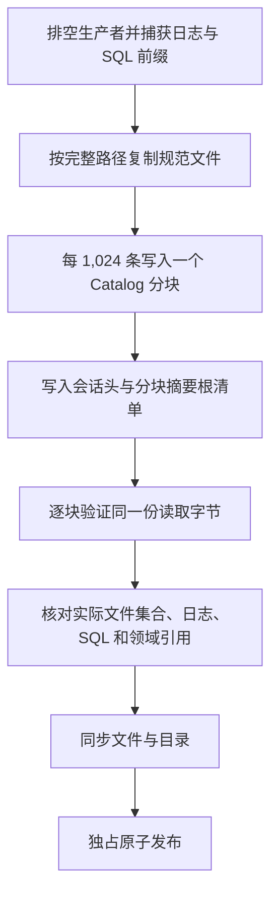

# 新核心库归档契约

<!-- Simplified Chinese documentation is explicitly requested by the user on 2026-09-12. -->

本契约实现[只读快照窗口](AGENT_LIBRARY_MAINTENANCE.md#只读快照窗口)之后的 Data 存储屏障、当前格式归档、统一清单和只读验证。它不读取旧 SQL 会话格式。当前领域模块声明各自 schema、跨引用校验与本地恢复策略；独立目录恢复器已接通本地会话结算和查询重建。[macOS 独立恢复、显式库切换和通知退役](MAC_LIBRARY_SETTINGS.md)已接通；Provider 设置已直接切换到新服务，完整原生验收仍待完成，不能把存储恢复通过等同于应用整体验收。

## 所有权与平台边界

核心只拥有 `AgentLibraryMaintenanceCoordinator.withQuiescentSnapshot` 的工作排空和授权关口。文件路径、SQLite、目录发布和安全作用域均属于外层。macOS 宿主持有目标目录授权，等待完整调用返回后才释放；共享核心不导入 Darwin、GRDB 或平台文件 API。

Data 的锁定顺序固定为 **FileSessionLibrary 串行队列 → 共享 DatabaseQueue 的只读事务 → 同步文件 I/O**。`withSnapshot` 的同步回调返回前，该会话库不能追加、暂存、删除或关闭；回调内不能再等待同一会话队列的异步方法。导出器在共享数据库队列上保持只读事务，直到 SQL 快照、实际文件复制、目标验证和独占发布全部返回。SQL Backup API 使用给定的源连接与独立目标连接，不重入源 DatabaseQueue。

这保证同一组合根拥有的数据库与会话适配器不会在捕获期间变化。它不替代核心对模型、工具、提醒、后台消费者及 GC 的实际排空，也不承诺支持绕过组合根的另一个进程任意修改库文件。所有生产者必须列在库工作组中。

导出器自行跟踪已接纳调用。调用方取消不丢弃实际复制；`close()` 停止接纳并等待复制退出，不关闭共享数据库或会话库。库关闭仍先等待维护协调器，再释放关口、模块、适配器及数据库。导出没有持久 pending，不推进授权代次。

## 归档内容

```text
<archive>/
  manifest.json
  Catalog/000000.json
  Catalog/000001.json
  ...
  Business.sqlite
  Sessions/
    sessions/<SESSION-UUID>.jsonl
  <模块声明的附件相对路径>
```

每份清单只接受当前 `formatVersion = 2`。根清单记录库身份／授权代次、模块名称及修订、每个会话的完整提交头，以及有序的文件清单分块摘要；每个分块最多包含 1,024 个规范文件的路径、字节数和 SHA-256。根清单为每块保存路径、字节数、摘要、记录数、文件总字节数和首尾路径。模块、会话和文件按确定顺序保存，拒绝重复名称／身份／路径；跨块范围必须严格递增，中间块必须完整。只实现当前格式，不保留格式 1 解码器或转换桥。应用版本不代替格式修订。

导出器按完整相对路径顺序复制规范文件，并把模块附件合并到该顺序中；清单写入器只缓存一个分块。验证器先检查根清单，再逐块对实际读取的同一份字节核对长度和摘要，检查整块记录后才逐文件消费。实际目录使用只保留当前目录栈的有序游标，验证文件类型、目录层级和总数；它与文件清单游标逐条比较实际相对路径，包含大小写，并要求两者同时耗尽。不能仅以记录数相等推断文件集合相等：大小写不敏感卷上的不同字符串可能指向同一文件。正文仍逐文件核对摘要。`Catalog` 为保留目录，附件不得占用；额外、缺失、损坏或越界的分块均拒绝。



分块约束限制清单解码和文件记录缓冲，不宣称整个归档为常量内存：固定会话快照、正文引用索引、领域校验索引及待同步目录集合仍受各自全库上限约束。

会话头包含最后已提交事务身份和事件序列。归档复制规范 JSONL（包括 inline 消息、工具交换和已提交执行事实）以及声明的业务附件；未提交物理尾部、进程内流、临时文件和完整 HTTP 请求不进入归档。每个 inline 正文随所属事件参与 JSONL 摘要和清单校验，不建立 session payload 目录。

恢复只归约归档日志并结算已知工具回执，不重新派发模型或工具。它重新检查当前来源授权与业务检查点，不能从归档内容恢复发送权限。运行锁文件、SQLite WAL／SHM、查询投影、索引／检查点及其认证材料均不导出。API Key 仍属于 Keychain；冻结配置中的凭据引用只是身份元数据。

## 可扩展的存储模块

`SQLiteArchiveModule` 由编译进宿主的 Data 适配器注册，声明名称／修订、可信建表语句、可识别的必需会话扩展版本，只读的领域校验闭包，以及显式的 `SQLiteArchiveRestoration` 策略。用可信语句在内存数据库生成精确 schema，包括 FTS 自动生成的附属表；实际归档数据库的所有非 SQLite 内部结构必须恰好由注册模块覆盖。重复表归属、重复扩展归属、缺失模块、未知表／索引／触发器或修订不匹配均拒绝。

仅拥有会话扩展的模块可以不声明 SQL 表，但仍需明确注册版本和校验行为。存储层先通过 `SessionState` 归约所有会话，检查顺序、状态转换、终态及必需扩展，再调用模块。模块校验自身规范记录和跨存储引用，返回仍需复制的附件清单；不执行业务写入、模型调用、平台操作或恢复动作。模块必须以游标读取有界元数据，先检查正文长度再读取正文。

系统自动注册 `library.authority`，核对完整授权历史的连续代次、当前最高代次和已完成状态；存在 pending 的库不能导出。`business.effects` 已提供独立注册模块：核对工具原始意图、派发、执行归属、回执、结果哈希及日志确认前缀；未确认回执保留，已清理结果必须没有正文。仍保留的工具意图正文另外核对 namespace、工具名、调用摘要和业务命令摘要。日志中已经发布的业务回执不能在 SQL 中消失。业务封锁记录必须指向捕获前缀内的真实执行。

宿主显式注册以下当前领域模块；系统仍自动增加 `library.authority`。领域建表语句与实际初始化共用，不维护第二份归档 schema。遗漏任一实际存在的模块仍会拒绝导出。

| 模块 | 归档事实与跨引用 | 本地恢复策略 |
|---|---|---|
| `workspace.store` | 类型化工作区及会话头所属工作区 | 保留 |
| `model.settings` | 配置 JSON 与索引列、调用规格、全局／工作区绑定、退休身份与发现缓存 | 停用连接、清除当前凭据引用；保留身份与修订 |
| `memory.store` | 记录、连续修订、来源证据、替代关系、操作依赖、提取语义元数据、遗忘事实与搜索内容 | 自动捕获改为手动模式，清除启用时间，保留策略修订和预算 |
| `memory.extraction` | 实际完成事件与原始用户来源、历史尝试身份、连续尝试序号、结果记忆、预算结算 | 未完成作业保持暂停；未派发尝试记失败，已派发但未结算的尝试保守计入预留费用 |
| `tasks` | 任务及历史修订、提案和回执、日志证据与原始时间／时区 | 未终结且有提醒的任务改为暂停，清除派发修订和错误 |
| `knowledge.store` | 来源／版本／片段、搜索内容、历史与失败版本的 Blob、操作回执及已完成维护范围 | 保留；附件只返回仍被版本引用的正文 |
| `session.consumer` | 消费者身份／修订、确切已提交批次、序列及摘要 | 保留业务检查点，不能用重建查询缓存重置 |
| `session.privacy` | 计划摘要、原维护授权、捕获头、实际失效批次、保留依赖及其当时的执行接纳前缀；每条 journal 失效记录必须具有原计划 | 保留 |

`SQLiteArchiveSessions` 从每个固定日志前缀提取正文之外的来源身份。领域校验不自行使用空扩展目录重新归约，不把其他模块的必需扩展误判为未知。历史用户正文已清除时仍可验证原始身份和摘要；实际保留文件的摘要与缺失规则继续由通用归档存储校验。

恢复策略没有默认值。模块必须选择 `preserve`，或提供纯本地 `prepare(apply:verify:)`。`SQLiteLibraryRestorer` 在隔离目标数据库的同一事务中调用全部 apply，再验证全部策略；这些闭包不启动工作组、不调用模型／工具、不访问 Keychain，也不安排系统提醒。保留历史配置修订意味着原冻结路线仍可审计，并不恢复发送权限；用户重新启用连接／自动捕获时继续走当前配置修订与授权流程。本地准备与会话恢复都成功后才发布目标目录。

## 验证与发布



严格日志扫描只读，拒绝任何未完成事务尾部（包括缺失最后 LF）、非法事件／提交、校验和错误、序列间隙、重复批次或冲突正文身份；它不调用普通启动扫描的尾部恢复。对每个事务的 inline event content 逐项核对精确字节、UTF-8、长度和总量上限。目录逐层检查，拒绝符号链接、FIFO、路径越界及额外文件；归档副本不容纳暂存／孤儿文件或无意义空目录。归档只复制 JSONL 与声明的业务附件。

归档上限为 262,144 个规范文件、单文件 2 GiB、规范文件总字节 64 GiB；根清单最多 2 MiB，文件清单最多 256 块，每块最多 1,024 条记录和 1 MiB。目录物理文件预算另包含根清单和分块，路径最多 512 字节、8 层、每段 128 字节。正文／普通附件最多 32 MiB。会话最多 4,096 个、每会话最多 100,000 个批次、全库正文引用最多 262,144 个；最终规范文件预算仍包含数据库、日志和附件，不能将正文上限与它们相加。业务与来源索引最多检查 1,000,000 个事件，领域常规表独立限制为最多 100,000 行，不随文件容量扩大；提取尝试最多 1,000,000 行；回执／操作／封锁与库维护历史各最多 100,000 条。配置限制为 128 个连接、4,096 个模型、8,192 个路线／绑定，绑定每作用域最多 64 个；工作区最多 1,024 个。每个 TEXT／BLOB 先检查字节长度再加载，FTS 未声明类型的内容列单独检查。这些是拒绝超限的当前边界，不是这些规模已经通过性能验收。

导出在目标同级创建独占的 0700 暂存目录，以 SQLite Backup API 创建数据库，再复制固定日志和正文、附件。每个新文件使用独占创建及同步落盘；完成后重新读取清单、核对实际文件集合／摘要、SQLite integrity／foreign key／精确 schema、会话归约和模块跨引用，再同步目录并以禁止覆盖的原子重命名发布。目标在操作开始前或发布前被创建都不能覆盖。

发布前失败只清理由本次操作拥有的暂存目录，源库与既有目标不变。原子重命名之后父目录同步失败属于发布确认不确定：目标可能已经完整存在，不能删除它或把错误解释为一定未发布；调用方可对目标重新运行只读验证。摘要提供完整性检查，不提供抵抗可重签整个包的攻击者的认证。

## 独立目录恢复



`SQLiteLibraryRestorer.restore(from:to:)` 先只读验证来源，再逐块复制清单中的规范文件、分块及根清单到目标同级的独占私有目录，并重新检查副本。目标必须是新目录；当前已打开库不被替换。接纳前可取消；接纳后由恢复器拥有独立任务，调用方取消不会丢弃实际工作。`close()` 停止接纳并等待全部已接纳操作；同时最多恢复四个独立目标。

模块准备使用同一个 SQL 事务。之后组合根通过 `SourceFactory` 只在暂存目录组装来源读取器，返回来源授权与排空关闭闭包。工厂不得启动模型、工具、消费者、提醒或后台工作组，也不得保留暂存资源。记忆、知识和任务来源权威可独立于工具模块注册；正常运行与恢复复用同一校验实现。工厂初始化失败时自行关闭已经创建的读取器，成功交付后由恢复器负责其生命周期。

核心 `AgentLibraryRestoration` 只接收 journal、`AgentBusinessReceipts` 和来源授权接口，没有业务提交、模型目录、工具目录或平台能力。它逐个打开会话，复用执行恢复器核对已有业务回执、结算未完成工具与模型尝试，并记录执行中断。恢复不会创建请求或发送目标；它只展示已结算的日志内容并重新检查来源修订、工作区和撤权检查。明确撤权抑制可见内容；来源存储不可用则使恢复失败，不伪造完成。

会话结算之后，核心逐页处理全部未确认回执，包含已经终结的执行。每条回执必须匹配 journal 中的执行、尝试、工具、派发、意图批次／序列、授权、摘要和已提交结果，才可确认。只查询和确认既有回执，绝不再次调用业务命令。分页最多 1,000 条，累计最多 100,000 条；只同时归约一个会话，回执正文不会在全库范围累积。完成时再次检查待确认集合为空。

查询缓存在 `Projections/Session.sqlite` 创建，从结算后的最终日志头逐会话追赶并核对。业务消费者检查点属于 `Business.sqlite`，不会随查询重建重置。`Projections` 是保留目录，领域附件不能占用。活动库没有归档的 `manifest.json` 或 `Catalog`：恢复器在完整验证私有副本后删除这两项，原清单只描述导入前缀，不能在本地结算后继续声称其哈希有效。

关闭核心恢复器、来源读取器、回执适配器、投影及数据库／会话句柄后，恢复器移除本次私有写入器生成的会话锁、索引／检查点和认证材料，再严格重验日志、领域跨引用、暂停策略、附件与确切文件集合。文件与目录同步落盘后，以禁止覆盖的原子重命名发布。发布前失败清理本次暂存；发布后父目录同步失败属于确认不确定，已经发布的目标必须保留。

恢复结果返回关闭的新库目录、库授权身份和最终会话头。没有平台通知调用，也不意味着原系统中的提醒已经取消；宿主启用新库前仍须排空当前库并协调其平台资源、凭据重新配置和工作组接纳。历史开发数据已获授权直接清除，不建立旧格式迁移或备份桥接。原生入口和生产启动组装继续列在 [P4／P5 实施计划](../engineering/AGENT_CORE_IMPLEMENTATION_PLAN.md) 中。

## BYOK 当前格式

模型设置归档模块使用 revision 2，覆盖连接端点、多调用规格、预设、全局／工作区绑定、退休身份和完整发现缓存。公共模型资料由独立 `model.metadata` revision 1 模块归档；会话选择随日志及当前检查点恢复。连接恢复后禁用并移除凭据引用，系统 Keychain 不随归档复制。模型和协议格式直接更新，不提供旧格式转换或迁移。
