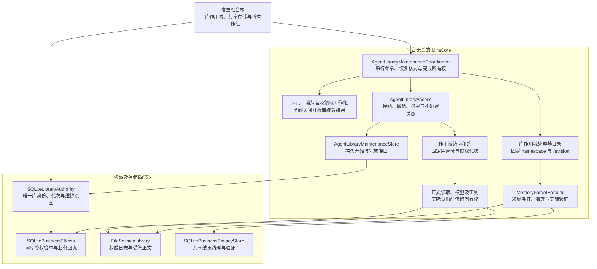
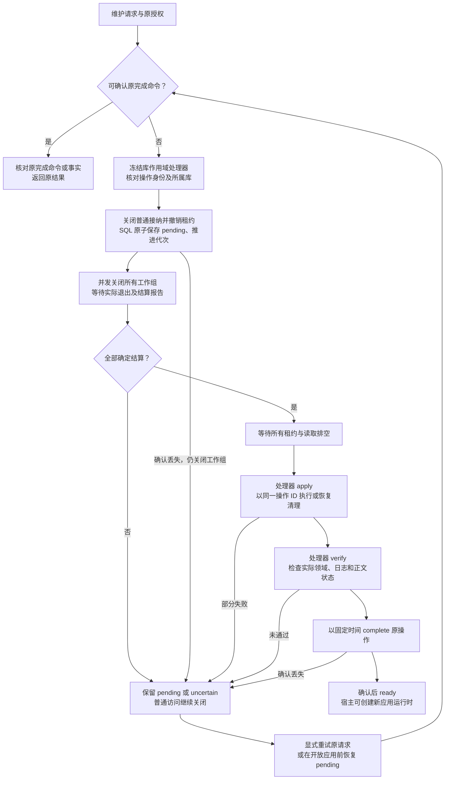

<!-- Language exception: this technical contract is written in Chinese at the user's explicit request. -->
# 库级授权与持久维护记录

本文记录新核心已实现的库级权威基础。核心端口只依赖 Foundation；SQLite 实现在 MiraData，数据库、维护协调器和独立库作用域由组合根拥有。它将库身份与授权代次从业务回执存储中拆出，为后续跨会话撤权、领域清理和备份提供共同依据。

当前实现包含持久维护意图、授权代次原子推进、作用域访问租约、正文读取与模型／工具接纳关口、应用关闭所有权、业务提交检查和受维护操作约束的结果正文清除。维护协调器已连接处理器目录、工作组关闭、排空、执行／验证和持久完成；会话传递清理和记忆遗忘处理器已实现，知识完整维护、统一备份与生产宿主组装仍待完成。会话权威仍是日志，维护记录没有引入 SQLite 会话表。

## 核心架构

查看[架构图](diagrams/agent-library-authority.png)或 [Mermaid 源文件](diagrams/agent-library-authority.mmd)。图中记忆处理器已完成无 UI 组合，生产宿主及知识处理器仍待接通。macOS 服务在组合根外提供具体能力；本契约不依赖 AppKit、文件操作或平台通知，也不要求实现 iOS。

`SQLiteLibraryAuthority` 先在调用方的 DatabaseQueue 上初始化。`SQLiteBusinessEffects` 必须显式接收同一库的 `libraryID`，验证该数据库已有完整且匹配的授权表，才建立回执表。身份不匹配、残缺格式或不足的持久性设置都拒绝；没有旧构造入口、旧格式迁移、隐式生成第二个库身份或回退路径。

## 开始与完成的语义

| 数据 | 契约 |
| --- | --- |
| 请求身份 | UUID、开放 namespace、操作修订、作用范围及请求时间；相同 UUID 必须匹配完整请求和原授权 |
| 作用范围 | 整库，或 1–8,192 个唯一、有效的类型化来源身份；不保存任意正文。来源数组顺序属于请求身份 |
| 授权 | 库 UUID 与 UInt64 代次；独立于每个会话自己的失效计数 |
| 操作事实 | 原授权、新授权及可选完成时间；同库且新代次严格等于原代次加一，不允许溢出 |
| 持久边界 | `begin` 同一 SQL 事务保存 pending 操作并推进当前代次；同库最多一个 pending 操作 |
| 完成 | 只有原请求及前后授权一致的当前操作才能第一次完成；代次保持，不回退、不再次增加 |

`state()` 和 `operation(id:)` 读取事实，不授予正文读取、模型发送或业务提交权限。便捷入口 `authorization()` 在 pending 时拒绝返回新的可用授权。取得 ready 授权也只是观察值，实际业务提交必须在自己的事务中重新检查。

`SQLiteLibraryMaintenanceValidator` 是组合根注册的同步领域接纳校验器，按完整 namespace／revision 唯一选择。在 begin 的同一 SQL 事务内先校验来源身份和当前修订，再保存 pending 并推进代次；校验器只读给定事务，不执行外部动作。来源范围缺少校验器时拒绝，库范围由对应操作契约决定。无效命令不得先推进代次再由处理器判定。

同一 `begin` 重复调用返回已持久化的原操作，包括已经完成的操作。重复 `complete` 返回原完成时间，即使后来已有新的 pending 操作，也不会清除它。不同命令不能借相同 UUID 覆盖原记录；等待中的新维护请求不能抢占或隐式完成原维护。

开始或完成的 SQL 已提交后，调用方仍可能收不到成功确认。错误不能解释为未发生：调用方应保留同一命令 ID，查询原操作或重发完全相同命令。维护协调器在结果未知期间应保持禁止新工作的状态，不能直接开放运行时。持久记录中没有“失败后自动 ready”的分支。

查看[执行流程图](diagrams/agent-library-maintenance-flow.png)或 [Mermaid 源文件](diagrams/agent-library-maintenance-flow.mmd)。协调器拥有流程与失败边界；实际跨存储清理的正确性必须由领域处理器的实现和验证证明。

## 访问关口与作用域所有权

`AgentLibraryAccess` 是同一运行资料库的唯一内存接纳关口。组合根先打开持久授权存储，再打开关口；存在 pending 操作时从 maintenance 状态启动，不能创建普通访问租约。运行期间所有维护开始／完成都经过此关口，原始存储端口只用于组合初始化和受控恢复；在关口之外直接推进 SQL 代次不是受支持的运行组合。

租约绑定库身份、代次和 RuntimeScope。获取租约期间也计入所有权：维护开始或作用域关闭发生在获取中途，获取失败并释放作用域占用。作用域关闭会撤销租约，作用域清理必须等待租约实际释放。默认最多 1,024 个租约，可配置到 16,384；单租约最多同时保留 256 个已接纳资源。

`begin` 在请求进入持久变更前关闭普通接纳、撤销已有租约并通知取消。库级维护采用保守的整库工作排空，即使最终清理只选择部分来源，也不会让当前执行中途换用新代次。SQL 确认丢失后进入 uncertain，保持关闭；同一请求和预期授权重试只核对原事实。完成确认丢失时保留原操作与完成时间，完全相同的重试确认后才重新 ready。

只读端口 `SessionPayloadReader` 与暂存／删除端口分开。`lease.reader(from:)` 产生受租约约束的正文读取器；`lease.read` 也可拥有其他异步查询。关口先接纳读取、计数，再调用实际读取器，实际返回后重新核对租约；撤销期间返回的旧正文不能向调用方发布。提前调用 `release()` 仍必须等待这些读取真正结束。返回给调用方的既有副本无法被 Swift 强制收回，后续消费及公开仍须遵守租约与领域授权。

模型流和工具正文通过 `lease.start` 接纳。资格检查、资源工厂调用和清理注册在同一个 actor 执行片段完成，维护无法插入三者之间。工厂只创建拥有生产任务的句柄，必须快速返回，不可同步网络请求或阻塞 I/O。维护先关闭关口时工厂不会调用；资源先接纳时维护取消并等待它的实际生产者。资源句柄支持单独释放，清理完成后移除注册，避免长执行积累已结束的资源。

模型清理同时关闭内部事件通道，使暂停输出的消费者直接醒来；不依赖下一条事件或下一次草稿节拍。工具正文的期限与实际工作属于同一个受控资源，超时或维护取消都要等待不配合取消的正文退出。工具授权必须与执行租约的库身份及代次完全一致；旧执行不能取得新代次继续派发下一工具。

执行内核把驱动任务绑定到租约的取消请求，工作期间使用受限正文读取器。正常终态结算后释放租约及能力目录；未核对的结算继续由内核持有，显式关闭排空后才释放。关闭后的失败内核不能再通过结算重试重新取得未受控正文。内部结算允许读取原始证据以还原真实回执，但不因此获准启动新模型或工具。

应用运行时另外持有从启动恢复到关闭的应用租约，覆盖接纳、命令核对、后备恢复和模块清理。维护所有者必须调用并等待 `shutdown()`，核对关闭报告，再等待 `waitForQuiescence()`；关口不会自行释放应用所有权。公共会话快照、日志读取及观察订阅的创建也经应用租约校验。已经建立的元数据观察流随应用关闭结束，不等于正文访问许可。

`waitForQuiescence()` 的调用方取消只退出等待，不释放别人的租约或重新开放访问。`complete` 拒绝任何尚未释放的租约或获取中的租约；`close` 撤销接纳并等待全部所有者和持久变更退出。没有强制丢弃任务的超时退出，也没有“取消请求已经发送就算排空”的分支。

开始被校验器拒绝时，关口可能已经撤销普通工作。协调器仍排空全部工作组和租约，然后同时核对持久状态的代次未变、没有 pending、该请求 ID 没有操作，才能回到 ready。任何查询失败、已提交操作或未结算工作都会保持关闭。这个受证据约束的恢复不伪造完成记录，也不复活旧租约；宿主需要重新组合已关闭的应用。

## 维护协调器与库作用域模块

`AgentLibraryMaintenanceCoordinator` 是一份运行库的唯一维护命令所有者。它接收关口、独立维护处理器注册表和不可变工作组清单，不查询平台 API。组合根必须列全应用运行时、持久消费者及领域后台工作；最多 128 个工作组，ID 有效且唯一。空清单只适用于尚未开放任何生产者的恢复组合，不表示可以忽略运行中的所有者。

`RuntimeScopeKind.library(UUID)` 提供独立于应用生命周期的库作用域。`RuntimeRegistrySnapshot` 的每个条目携带所属 scope ID 与 kind；协调器在开始维护前核对所有处理器都来自同一库的 library 作用域，最多 128 个，namespace／revision 有效且没有重复。按请求的完整 namespace 与 revision 选择唯一处理器，缺失或不匹配直接拒绝，不推进代次，不撤销已有租约。普通应用能力目录不能充当维护目录：关闭应用必须能释放其模块，而维护处理器及存储需要继续存在。注销注册项会撤回其 closing 回调；旧快照仍持有原作用域租约直到释放。

维护开始后，同时向全部工作组发出关闭调用，并等待各自实际返回。`AgentLibraryWorkOwner.application` 调用 `AgentApplicationRuntime.shutdown()` 并要求报告完全结算；消费者适配调用其 `close()`。即使某组失败，其他组也必须收到关闭并完成退出。失败报告只包含工作组 ID，不传播任意领域正文。任一组未结算就保留 pending，不能调用处理器；没有把“关闭方法返回”自动等同于业务提交已确定。随后等待关口所有租约、获取操作及正文读取排空。

`AgentLibraryMaintenanceHandler` 必须分别实现 `apply` 和 `verify`。处理器负责确定传递闭包、保存跨存储进度、写入失效事实、实际清理及验证；两个方法都必须支持对同一持久操作 ID 的重试和重启恢复，没有默认空验证。`apply` 部分完成或 `verify` 失败，操作仍 pending，下一次从同一操作重入处理器。协调器不生成兼容数据，不回滚已确认的删除，也不把失败改成完成。

进入 `perform` 前已取消的调用会被拒绝；一旦接纳，独立任务拥有整个尝试。完全相同的并发请求合并等待，其他请求在执行期间返回 busy。调用方取消不抛弃已接纳的维护；`close()` 停止新命令并等待当前尝试，不取消清理或隐式完成 pending。处理器快照在执行、验证和完成确认尝试真正返回后才释放，即使其作用域同时开始关闭，也必须等待这份占用。

开始确认丢失时，协调器仍关闭所有工作组，但不调用尚未确认开始的处理器。访问关口作为完成意图的唯一内存所有者，固定并保留同一完成时间；提交前错误或提交后的确认丢失，均重发原完成命令，不重新清理、不重新计时。协调器重建后先重试关口保留的原完成意图，也可查询已完成事实并核对关口，即使原处理器已卸载，也能确认已发生的完成。重复读取较早的完成操作不能撤销新租约或清除较新的 pending 操作。未完成操作的重启恢复仍要求对应 namespace／revision 的处理器存在。

宿主关闭顺序为：先关闭维护协调器并等待其当前尝试，再关闭访问关口，随后释放库作用域和持久适配器，最后关闭共享数据库。成功维护后关口恢复 ready，旧应用仍然 closed；组合根必须创建新应用运行时。未结算的旧应用关闭报告不能通过重复 shutdown 变成成功；需要在库恢复流程中核对原日志和回执，再组合已恢复的所有者。记忆领域处理器已接通无 UI 组合；完整生产恢复入口和知识领域清理仍是后续集成工作。

## 结算与维护的权限分离

`AgentToolRecovery` 只具有会话运行时、业务回执、审批和时钟依赖，不持有工具目录、工具政策、派发授权或工具实现。重启恢复直接使用它，删除了为了构造执行器而准备的伪政策／伪授权对象。恢复核对已经提交的效果、保留仍存在的结果正文与 purged 标记、补写审批／工具终态，并确认回执；同一执行的并发恢复合并到原任务。

关口的 `complete` 只能证明受关口管理的访问已经退出，不能独自证明领域和跨会话清理正确。协调器已经检查关闭报告并等待显式列出的工作组；真实领域处理器仍需覆盖传递失效事实、实际删除及缓存清理，再完成操作。备份还需要跨日志、SQLite 和正文的同一静止点及清单。这些集成尚未完成，当前接口不等于完整隐私或备份屏障。

## 与业务回执的衔接

业务适配器只拥有 `business_effects_metadata` 的自身格式信息；库身份和当前代次由 `agent_library_metadata` 唯一持有。准备工具授权时，先检查维护状态，再校验来源、目标和执行禁止标记。新工具业务提交在解析日志前检查一次库授权，最终 SQL 事务在执行领域处理器前再检查一次。

第二次检查封闭日志读取到 SQL 写入之间的竞争：维护先提交时，已经解析的旧凭证不能写入；业务事务先提交时，它是已发生的真实效果，后续维护必须处理这份结果。日志解析与 SQL 不共享事务，不能仅依赖开始解析时的一次允许。

`purgeResults(receiptIDs:maintenance:)` 要求完整操作与当前 pending 记录一致，在一次 SQL 事务中清除所选回执关联的共享业务结果正文。它不再推进代次，不自动完成维护，也不删除证明已经发生过的回执；多个回执关联同一操作时同时观察到正文已清除。最多选择 10,000 个回执，未知 ID 的重复清理无副作用。实际记忆遗忘使用独立库作用域的 `SQLiteBusinessPrivacyStore`，按持久会话计划和业务提交证明选择共享结果，逐行读取有界证明元数据，不依赖已关闭的应用执行器，也不通过查询投影判断权限。

原回执查询和发布核对保留用于内部结算，已经提交的同一调用仍返回原回执，不能因为进入维护而被当成未提交再次执行。此恢复入口并不等于可向用户或模型公开正文；最终维护协调器必须控制正文访问和外发权限。当前增量没有宣称旧的内存内容已经被撤回。

## 持久性、校验与关闭

数据库要求 FULL 或 EXTRA 同步等级和外键开启。授权适配器不改变共享配置；每次维护变更都在原事务中重新检查这些设置。记录以当前 Codable 格式及 SHA-256 摘要保存，先校验不超过 2 MiB 的字节上限，再加载／解码，核对操作 ID、库身份、前后代次、阶段及摘要。该摘要用于完整性检查，不是防止有数据库写权限的人重签内容的认证机制。

打开时核对精确表与索引定义、唯一元数据、当前操作及 pending 状态，并确认元数据指向最高代次；最新代次查询有对应索引，不能把指针回退到较早的已完成操作后重新授权。历史完成记录按 ID 查询时逐条验证，不声称启动时扫描验证全部历史。损坏拒绝继续使用，不自动修复为 ready。

适配器接受操作后持有串行 I/O 所有权，覆盖 SQL 提交及其确认阶段。关闭立即停止接纳，再等待已接纳操作排空；调用方取消不能丢弃一个已进入提交过程的所有者。关闭授权或回执适配器均不关闭共享数据库，组合根等待所有使用者关闭后才关闭 DatabaseQueue。

访问关口已实现阻止新工作、持久开始操作、撤销与排空工作／正文读取租约。协调流程已经串联执行与验证；会话引擎与记忆处理器已实际实现传递失效、领域和受管正文清理；其余领域与宿主组合继续完成各自责任。启动时必须在开放普通访问前处理 pending 操作。备份需要同一维护所有者建立写入静止点和跨存储清单；当前账本不替代这一屏障。

自动化证据和延期项见[核心验收记录](../engineering/AGENT_CORE_VERIFICATION.md)。

## 会话清理实现

`SessionPrivacyMaintenance` 已实现规范日志的跨会话依赖闭包、原子持久清理计划、可见／隐藏分组保留、同一批次恢复及物理删除验证，契约和流程图见[会话隐私维护](AGENT_SESSION_PRIVACY.md)。领域处理器必须先持久保存此计划，再删除领域关联及正文。`MemoryForgetHandler` 已完成记忆、业务回执、会话正文和查询投影的清理及验证；知识 Blob 和原生缓存仍由后续完整组装负责。该会话引擎不单独完成库维护，也不开放原生遗忘入口。

## 只读快照窗口

`AgentLibraryMaintenanceCoordinator.withQuiescentSnapshot` 与同一协调器的持久维护命令互斥。该方法供备份使用，但不是完整备份实现。它接收期望库授权和一个拥有实际 I/O 的异步回调；回调返回前必须等待全部读取、复制及发布任务退出。核心仍只依赖 Foundation，不接收文件路径、SQLite 连接或平台授权。

开始时，访问关口从 ready 进入 snapshotting，撤销普通租约，拒绝新接纳。协调器向每个工作组发出关闭并等待它们返回，随后等待所有读取、资源和正在获取的租约退出。完整排空后重新读取持久权威，确认库身份和授权代次不变、没有 pending，才调用快照回调。

快照是对当前库的只读操作，**不调用持久维护 begin/complete，不推进授权代次，也不创建需要重试的导出 pending**。原库不会因为导出目标失去访问权限而长期处于持久维护状态。实际备份适配器必须另外持有共享数据库写入屏障，并在同一一致窗口捕获 SQL 快照、日志前缀与正文；单独的 Core 关口不替代存储层写入屏障。[Data 归档适配器与统一清单](AGENT_LIBRARY_ARCHIVE.md)已实现该存储屏障和只读副本验证；当前领域模块已完成显式注册，独立目录恢复与查询重建已有组合验证；原生库切换和平台资源协调仍待接通。

正常导出或导出失败，都必须等回调的实际工作退出，再通过一次新的持久权威复核才能恢复 ready。排空失败、权限事实改变或复核失败时保持 uncertain，不能让回调继续读取；需要关闭并重新组装存储和运行时。恢复 ready 不复活旧租约、已关闭应用或模块作用域；宿主重新创建普通工作所有者。

协调器与访问关口分别持有自己的任务等待关系。调用方取消等待不会放弃已经接纳的快照；协调器关闭停止接纳并等待快照任务。访问关口关闭会向快照任务请求协作取消，同时等待其实际退出，之后才进入 closed。所有异步复核返回后再次检查 snapshotting 状态，失败分支不能覆盖已开始的 closing/closed。这里不承诺强制终止不协作的 I/O；不协作任务仍属于关闭等待的所有权范围。

[归档存储实现](AGENT_LIBRARY_ARCHIVE.md)已接通 SQLite Backup API、固定日志前缀与引用正文、模块附件、统一哈希清单、跨存储校验和原子发布。各领域归档模块、独立暂存目录恢复、本地回执核对、会话中断和查询重建已有实现及组合验证；恢复器返回关闭的新库，原生入口启用前仍须协调当前库的全部工作组与平台资源；恢复过程不调用模型或操作平台提醒。

## 会话全文缓存的维护边界

`SessionPrivacyProjections` 可登记独立 `SessionSearchIndex`。记忆／知识清理必须先排空工作组中的搜索服务及共享追赶任务，再失效日志和清理正文；随后删除全部搜索数据库及 sidecar，同步目录，建立新身份的空索引。清理失败不开放普通读取，重试不得因为文件已不存在而跳过目录同步。验证还要检查 FTS vocabulary，不能仅依赖 external-content 表的 `COUNT`。完整规则见[搜索契约](SEARCH.md#新核心会话搜索)。
