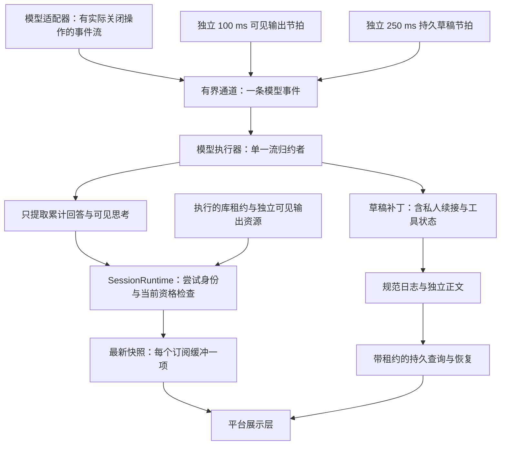
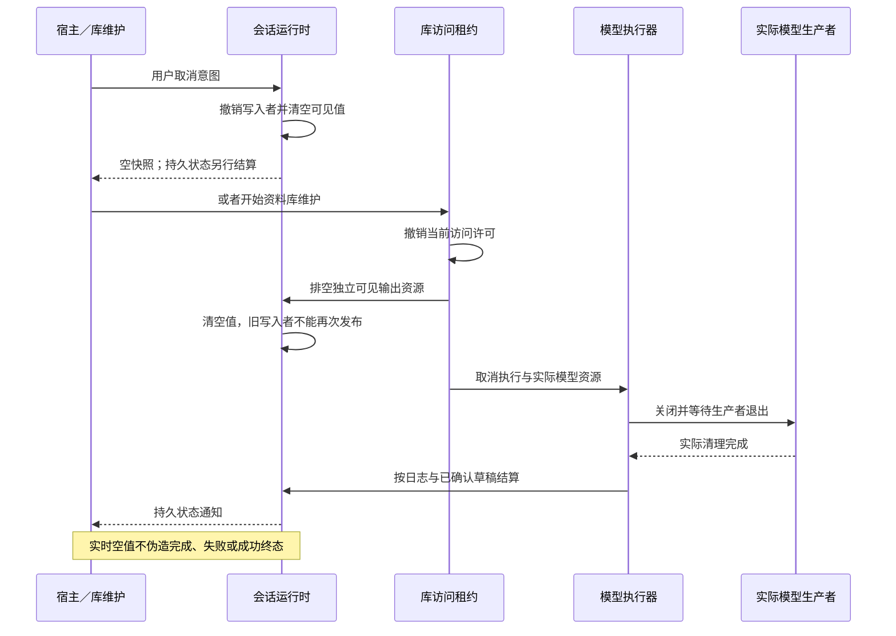

# 实时可见输出与持久状态通知

<!-- Simplified Chinese documentation is explicitly requested by the user on 2026-09-12. -->

本契约定义平台无关的回答／思考通知。MiraCore 只依赖 Foundation；宿主展示层通过 `AgentApplicationRuntime.observeSessionOutput` 订阅，不持有模型适配器或接管执行任务。iOS 不在本次实现范围。

## 三种读取路径

| 路径 | 数据与保证 | 使用方式 |
|---|---|---|
| `SessionObservation` | 已确认日志游标、活动执行、取消意图、核对与关闭状态；通知可以合并 | 根据游标读取持久批次或刷新查询；不能把一次唤醒当作全部事件 |
| `SessionOutputObservation` | 当前模型尝试的累计可见回答与思考，或空值；只存在于内存 | 流式展示；慢订阅者直接取得最新快照，不阻塞模型 |
| `SessionQueryService` | 带库租约的分页正文、执行摘要和固定前缀的持久可见草稿 | 首次加载、历史分页与持久状态刷新；不逐 token 重读日志 |

实时输出可以领先于已保存草稿。通知中的 `cursor` 只表示当时观察到的已确认日志位置，不能声称可见文本已经全部落盘。`revision` 属于本次会话运行时的内存状态，内容更新、清空或关闭时推进；它不是日志序号、Provider 续传游标或跨重启版本。模型发出结束事件也不等于助手终态已提交。成功、失败、取消及待核对结算都以日志为准。

## 核心架构

图示导出：[核心架构 SVG](diagrams/agent-live-output.svg) · [PNG](diagrams/agent-live-output.png)。

`SessionVisibleOutput` 包含执行 ID、尝试 ID、步骤 ID、累计回答／思考字符串、当前输出阶段，以及当前尝试的有序可见块。私人续接、工具结果、业务回执和凭据不属于此值。多个工具步骤的思考按既有草稿拼接规则保留；模型适配器继续拥有其协议内容及私人续接格式。

会话运行时拥有唯一的当前输出写入者。写入者绑定已接纳执行、最新未解决模型尝试、步骤、会话授权代次及库租约；输出必须仍处于可接收模型事件的阶段。它由执行器通过内部能力建立，不由插件或界面绕过日志创建尝试。迟到的写入或旧写入者释放不能更新或清空新尝试的输出。

## 节拍、合并和容量

第一次非空可见变化立即发布，此后的累计变化由独立 100 ms 节拍合并；有效结束事件补齐最后的可见快照。可见块和阶段变化（包括工具调用准备）发布可见快照；用量与私人续接不单独触发。可见通知不会直接写日志，250 ms／4 KiB 的持久检查点条件保持独立。

通道只预存一条模型事件，并分别保留一个待处理的持久节拍和可见节拍。重复信号合并；持久检查点优先，其次是可见刷新，再消费等待中的模型事件。只有同一个消费者修改归约器和草稿基线，计时任务不能直接读写这些状态。关闭唤醒所有挂起的通道读取与发送，并排空计时任务、转发任务及真实模型操作。

每个会话最多 256 个实时订阅，每个订阅缓冲最新一项；订阅取消只移除该订阅，执行继续由应用拥有。首次订阅收到当前快照；关闭后的订阅收到空值与关闭状态后结束。可见回答上限为 2 MiB，跨步骤可见思考继续遵守单个持久草稿部分的 32 MiB 上限。核心保留的是最新累计值，不保存每个 token 的历史通知。

节拍设置不等于绝对延迟承诺。正在进行的磁盘提交或繁忙执行器仍可能推迟可见刷新；当前没有声称满足完整原生帧时长或大库性能门槛。

## 撤销与排空流程

图示导出：[撤销与排空流程 SVG](diagrams/agent-live-output-revocation.svg) · [PNG](diagrams/agent-live-output-revocation.png)。

可见输出与模型传输分别登记为同一执行租约下的资源。维护可以先清空可见内容，同时继续等待不响应取消的生产者退出；不能让界面快照持有者决定何时释放模型、模块或存储。可见资源在正常尝试的最终草稿与解决记录提交后释放。流处理失败会先撤销可见写入者，再等待实际模型操作清理。

取消意图、会话失效、持久提交待核对、尝试解决及关闭都会撤销不再合格的写入者。发布和新订阅都会复核库租约；新尝试使用新的写入者身份，旧身份无法恢复。关闭会话流只表示会话运行时的观察资源已关闭；应用级关闭仍需先排空执行和模型生产者。

已经交付给宿主的 Swift 字符串不能被远程擦除。宿主必须把观察任务绑定到当前工作组及会话页面，在库维护、工作组替换或关闭时清空旧内容，并拒绝旧绑定的异步回调。正常实时空值只表示没有可用的临时输出，宿主应在当前库权限允许时从持久通知／查询更新页面，不能把空值解释为成功或无正文失败。

Successful attempt resolution can attach `handoffExecutionID` to an empty output observation after the executor commits the final draft and model output. The runtime releases the writer and retains only the execution ID and authorization epoch, not its text. This marker lets an already-bound host keep its latest delivered or pending body until a matching durable draft or terminal query at that cursor is installed. It does not authorize a new content read or represent execution success. Ordinary clears, cancellation, reconciliation fences, invalidation, closing and library-binding teardown still clear presentation immediately. A new writer replaces the marker; later invalidation of a retained marker advances the output revision and publishes a clear even when no writer remains.

## 验证范围

验收使用实际日志、应用运行时和合成模型生产者，分别控制可见节拍、持久节拍与生产者退出。需要覆盖通知合并、无额外日志写入、持久与可见思考一致、订阅取消后执行继续、撤权／取消后迟到输出拒绝，以及实际生产者退出之前不完成应用关闭。源码和测试通过不等于原生展示层已经接入；完整命令、结果和剩余 UI／规模验收见[核心验证记录](../engineering/AGENT_CORE_VERIFICATION.md)。
