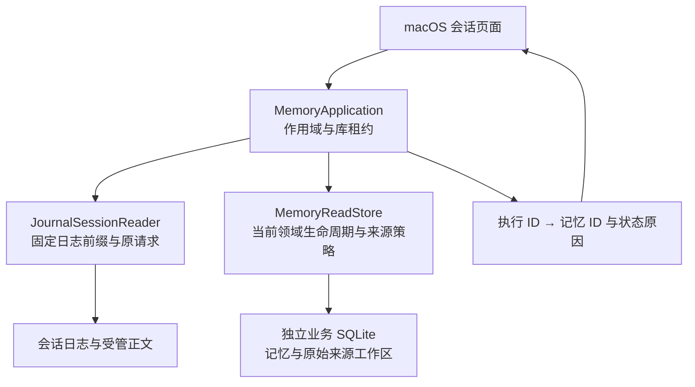
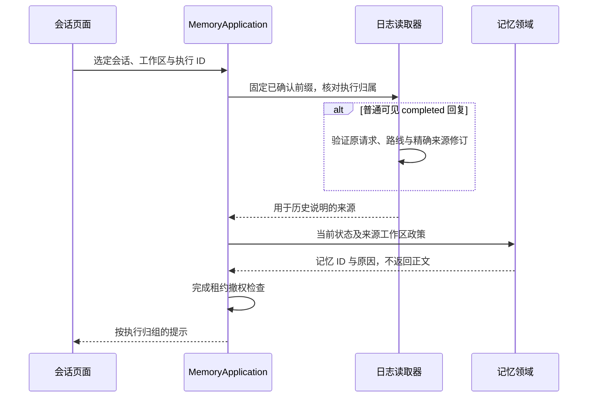

# 历史回复的记忆状态

<!-- Simplified Chinese documentation is explicitly requested by the user. -->

本契约定义历史提示的来源与读取边界。提示只包含 `MemoryID` 和 `MemoryContextNotice.Reason`；不能作为记忆正文、来源授权、模型上下文或工具提交证明。

## 所有权与事实源

`MemoryApplication.contextNotices` 接收一个会话、明确工作区以及最多 128 个执行身份。应用服务拥有作用域任务与库访问租约，关闭或工作组切换必须等待实际读取返回；旧工作组的迟到结果不可发布。执行选择从同一已确认日志前缀验证，其他会话的执行身份直接拒绝。

正常历史只读取有可见回答的 completed 执行。`JournalSessionReader` 验证回答、执行计划和成功尝试的实际请求，核对会话、执行、步骤、工作区与冻结路线，再取得精确来源修订。失败、未完成回答不生成普通状态提示；缺失或损坏正文是读取错误，不能伪装成没有关联记忆。查询不依赖 SQL 会话投影，不增加使用记录或日志事实。

Completed local-driver replies with no model route or model attempts have no recorded model-context sources. History notices validate their available answer and execution plan, then return an empty source set; the stricter citation-evidence API still requires a recorded model route. Missing bodies or inconsistent attempts remain errors.

`memoryContextNotices` 在一个领域只读事务内处理至多 8,192 个不重复的精确记忆引用。不存在或越出可见范围的对象返回 unavailable；存储损坏必须向上抛出。生命周期优先于修订差异：forgotten、removed、superseded、candidate、archived、rejected、expired、notYetValid 均有对应原因。仍 active 的对象先检查当前记忆发送限制和证据所属工作区的发送政策，再比较使用时与当前修订；不可用返回 unavailable，修订不同返回 updated，仍有效且修订相同不生成提示。

全局记忆可以来自另一工作区。查询不能因为来源工作区与当前会话不同就判定不可用；必须检查来源工作区实际政策。冻结路线中的连接身份用于这项历史政策检查，不要求当前模型配置或凭据版本仍等于旧路线。提示不证明可以重新发送。

## 历史正文边界

历史提示只使用当前日志中可读取的用户消息、回答、思考和来源记录。缺失或损坏正文明确作为读取错误处理，不从领域记录或查询投影重建会话正文。领域遗忘只更新领域记录及其业务来源，不注入会话历史读取器。

明确保存记忆可能只发送本地保存回执，没有发送新记忆正文。记忆应用服务因此只根据当前领域记录和日志来源身份生成提示，不虚构模型读取过该正文。这里的领域解释属于记忆模块，不进入通用驱动器或会话归约器。

当前生命周期查询使用本地读取语义，不能据此判断旧远程发送许可。严格引用与执行来源接口只接受日志中仍可验证的执行来源；提示不会恢复正文、重新授权引用或触发模型请求。

## 宿主刷新

`MacLibraryWorkloads` 直接注入同库的 `MemoryApplication`。会话页面单独拥有提示读取任务和工作组代次；实际消息读取不由业务提交通知重复触发。消息页加载、加载更早消息、重新选择已缓存页面和业务提交会刷新提示，超过 128 个已加载执行时按批次处理。

发布结果前检查工作组身份、页面观察身份和提示代次。维护或页面释放会取消并排空提示任务，清空提示映射；原有草稿、阅读状态与消息正文保持各自所有权。现有 `MemoryHistoryTags` 消费这些结果，查询及标签都不触发模型执行。

状态按读取时刻计算；目前没有独立定时器在页面一直静止时刷新有效期。完整原生外观与交互矩阵、规模性能属于[核心验收](../engineering/AGENT_CORE_VERIFICATION.md)，不能从服务或展示模型测试通过推导。
