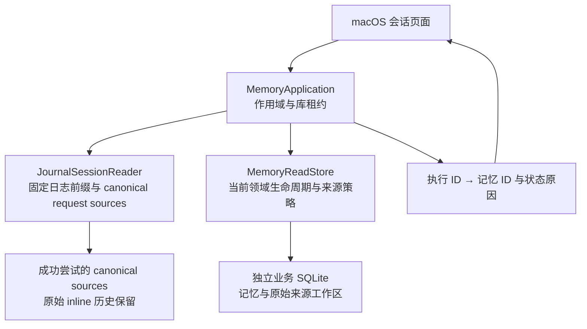
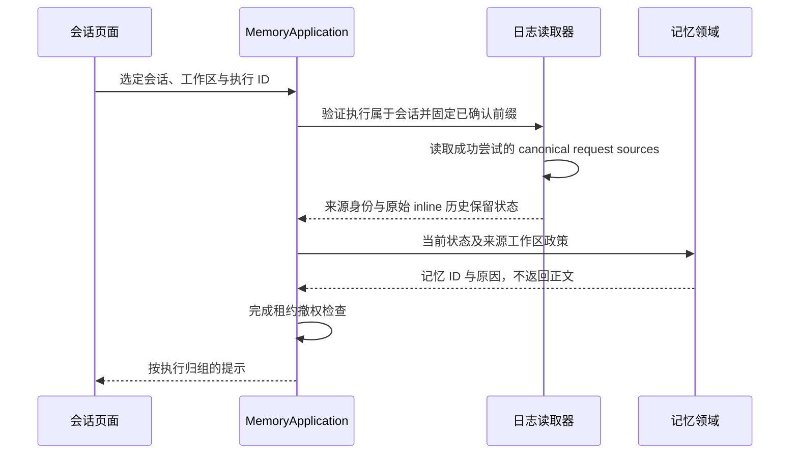

# 历史回复的记忆状态

<!-- Simplified Chinese documentation is explicitly requested by the user. -->

本契约定义历史提示的来源与读取边界。提示只包含 `MemoryID` 和 `MemoryContextNotice.Reason`；不能作为记忆正文、来源授权、模型上下文或工具提交证明。

## 所有权与事实源

`MemoryApplication.contextNotices` 接收一个会话、明确工作区以及最多 128 个执行身份。应用服务先验证每个选定执行 ID 属于该会话，再在作用域任务与库访问租约内读取；关闭、维护或撤权必须等待实际读取返回，撤权后的迟到结果不可发布。

正常历史只读取有可见回答的 completed 执行。`JournalSessionReader` 从固定已确认前缀读取成功尝试的 canonical request sources，核对回答、执行、步骤、工作区与冻结路线，再取得精确来源修订。失败、未完成及没有可见回答的执行不生成普通状态提示；缺失或损坏的 canonical source 是读取错误，不能伪装成没有关联记忆。查询不依赖 SQL 会话投影，不增加使用记录或日志事实。

Completed local-driver replies with no model route or model attempts have no recorded model-context sources. History notices validate the available answer and return an empty source set; the stricter citation-evidence API still requires a recorded model route. Inconsistent attempts remain errors.

`memoryContextNotices` 在一个领域只读事务内处理至多 8,192 个不重复的精确记忆引用。不存在或越出可见范围的对象返回 unavailable；存储损坏必须向上抛出。生命周期优先于修订差异：forgotten、removed、superseded、candidate、archived、rejected、expired、notYetValid 均有对应原因。仍 active 的对象先检查当前记忆发送限制和证据所属工作区的发送政策，再比较使用时与当前修订；不可用返回 unavailable，修订不同返回 updated，仍有效且修订相同不生成提示。

全局记忆可以来自另一工作区。查询不能因为来源工作区与当前会话不同就判定不可用；必须检查来源工作区实际政策。冻结路线中的连接身份用于这项历史政策检查，不要求当前模型配置或凭据版本仍等于旧路线。提示不证明可以重新发送。

## 清理后的保留历史

记忆遗忘更新记忆领域的状态、修订、证据和受影响作业正文，并提高来源抑制；它不创建或读取 session privacy plan，也不重写会话日志。原始 inline 历史 journal 保留，历史提示只根据已提交执行的 canonical request sources 和当前记忆领域状态说明原因。

`contextNotices` 对选定执行重新验证会话归属，读取成功尝试的 canonical sources，并在当前 `MemoryReadStore` 中解析每个 MemoryID 的生命周期。forgotten、removed、superseded、candidate、archived、rejected、expired、notYetValid 均返回对应原因；缺失或损坏的 canonical source 仍是读取错误。返回的提示不包含记忆正文、来源授权或工具提交证明，也不会恢复正文、重新授权引用或触发模型请求。

明确保存记忆可能只发送本地保存回执，没有发送新记忆正文；没有 canonical memory source 的回复不推断使用了该记忆。全局记忆仍按来源工作区政策检查，冻结路线只提供历史策略证据，不恢复当前远程发送许可。

原始 inline 历史在领域记忆遗忘后仍可被本地历史读取；这不代表其中内容仍可作为当前模型上下文或业务写入授权。当前来源授权、工作区策略和记忆状态始终在新的模型准备与领域提交前重新检查。

## 宿主刷新

`MacLibraryWorkloads` 直接注入同库的 canonical history reader。会话页面单独拥有提示读取任务、代次与无正文结果；实际消息读取不由业务提交通知重复触发。消息页加载、加载更早消息、重新选择已缓存页面和业务提交会刷新提示，超过 128 个已加载执行时按批次处理。

发布结果前检查工作组身份、页面观察身份和提示代次。维护或页面释放会取消并排空提示任务，清空提示映射；原有草稿、阅读状态与消息正文保持各自所有权。普通回复不再渲染 `MemoryHistoryTags` 或记忆引用标签。内部无正文查询保留，但不触发模型执行，也不改变记忆管理和主动打开的执行详情读取。

状态按读取时刻计算；目前没有独立定时器在页面一直静止时刷新有效期。完整原生外观与交互矩阵、规模性能属于[核心验收](../engineering/AGENT_CORE_VERIFICATION.md)，不能从服务或展示模型测试通过推导。
