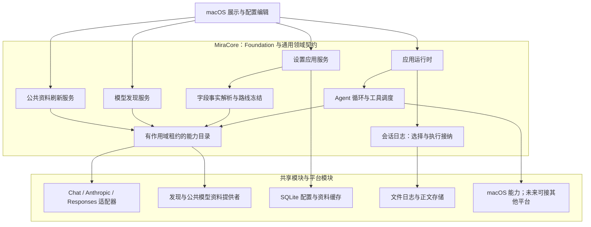
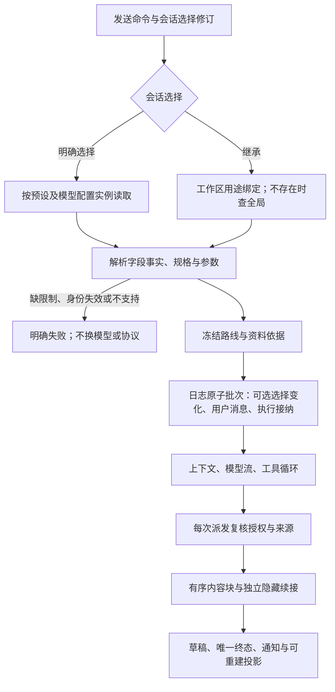

# Agent 模型配置与路线选择

<!-- Chinese documentation follows the user's explicit language preference. -->

本契约对应 BYOK 重设计后的当前实现。总体决策见[设计方案](BYOK_MODEL_LAYER_PROPOSAL.md)，协议见 [HTTP 模块](AGENT_HTTP_ADAPTER.md)，验收见[实施记录](../engineering/BYOK_MODEL_LAYER_VERIFICATION.md)。不读取旧配置或迁移旧会话。

## 核心架构

核心不解释 URL、HTTP 参数、厂商名或平台。`MiraData` 实现配置、缓存和日志端口；`MiraProviders` 实现协议、差异规则及模型目录；`MiraMac` 装配工作组并拥有 Keychain 与原生界面。iOS 暂不实现，共享模块不依赖 macOS。

`model`、`modelConfiguration`、`modelDiscovery`、`modelMetadata` 是独立的注册能力。配置提供者与执行适配器必须使用相同的适配器 ID／revision；缺失或冲突明确失败。目录冻结和模块卸载仍受作用域租约、撤权、排空及失败回滚约束。

## 配置身份

| 类型 | 职责 |
|---|---|
| `AgentConfiguredConnection` | 名称、启用状态、服务商定义 ID、多个端点、独立发现规格和可选默认调用模板 |
| `AgentModelEndpoint` | 端点 ID、模块拥有的非秘密配置、凭据引用与版本 |
| `AgentModelReference` | `connectionID + modelID`；同名模型在不同连接中独立存在 |
| `AgentConfiguredModel` | 某个模型引用的本地配置、启用偏好、多调用规格和有来源的资料事实 |
| `AgentModelInvocationSpec` | 准确适配器／端点、上下文与输入／输出上限、能力声明、配置、参数描述 |
| `AgentRoutePreset` | 模型配置 ID、调用规格 ID、输出预留及用户参数覆盖 |
| `AgentRouteBinding` | 全局或工作区内，开放用途 ID 对应的预设选择 |
| `AgentSessionModelSelection` | 会话日志中的 `.inherit` 或 `.selected`，保存明确用户意图 |

不增加强制的 Offering 实体。模型配置的 UUID 只区分保存实例：删除后重新创建同一个逻辑模型，不会让旧选择重新指向新配置。删除后的连接／模型／预设 UUID 进入有界退休集合，不能再次使用。绑定不随预设级联消失，失效选择不会被误读成继承。

一个模型最多 16 个调用规格；规格明确选择协议和端点，失败不会自动改用另一个规格。新增协议只需模块实现核心端口；模型资料本身不能安装协议。

## 修订与冻结

所有编辑使用 CAS：创建 revision 为 1，更新匹配 expected revision 后精确加一。连接 `configurationRevision` 在端点、凭据或启用状态变化时递增；显示名称、发现选择或默认调用模板的编辑不授权替换已冻结请求。

模型 `authorizationRevision` 在启用状态变化、删除旧调用规格或替换其适配器／端点时递增。只增加规格、修改显示信息、资料或未来参数不撤销当前执行。删除后再添加同名规格不能恢复已经撤销的授权。

`AgentModelRoute` 冻结模型配置实例、调用规格、适配器、端点、连接／模型授权修订、凭据引用、解析后的能力与限制、资料依据、参数和价格。执行中资料更新影响下一次冻结；当前工具循环继续使用原快照。派发和提交复核当前授权身份、启用状态、规格存在性、凭据和库代次；不重新计算参数覆盖当前请求。

模型池规范预设的 RouteID 对应模型配置 UUID。`savePoolModel` 将模型和该预设在一个事务内保存，关系或任一 CAS 失败时整体回滚。其他模块可创建独立预设。

## 字段事实

`AgentModelMetadataFact` 保存 field、value、source、sourceID、sourceRevision、observedAt、可选 invocationID；探测另带准确配置 fingerprint。

当前解析优先级：用户覆盖 > 服务商明确资料 > 目录资料 > 模块默认资料。同来源取较新观测；同级来源冲突明确失败，不依赖数组顺序。调用规格专属事实优先于同来源的通用事实。低优先级来源之间的矛盾不会阻止明确的高优先级覆盖。

核心解析上下文／输入／输出限制和开放能力声明；它不从模型名称猜窗口、协议、端点或请求参数。探测是诊断证据，不能覆盖声明或数字上限。`verified` 不再是使用官方新 ID 的前置要求。未知字段保留来源，不成为可执行配置。

未知 ID 可以保存并启用，缺少上下文上限也可以保存。调用前仍要求明确的上下文限制、合法输出预留、已安装协议和本次所需能力。服务商返回 thinking 时保留内容和续接，即使目录没有声明 thinking；工具调用仍需要工具能力和独立授权。

## 选择与执行流程

会话选择由日志归约，包含独立 selectionRevision。选择命令使用稳定 commandID 和预期修订；首次选择可以与首次消息及执行一起接纳。忙碌／归档会话拒绝不合法选择变化；接纳再次比较选择修订和冻结路线身份，防止界面基于旧状态发送。

用途绑定只存在于全局和工作区。会话选择不写 SQL 绑定表。明确选择、已存在的工作区绑定或全局绑定失效时，均保留失效意图并返回错误；只有用户明确恢复继承才允许重新使用默认项。

## 存储、应用与宿主边界

配置、发现快照和资料缓存属于共享业务 SQLite，执行历史及会话选择属于日志。SQLite 查询投影从不成为会话选择或执行接纳的权威。配置表要求当前 schema v2，日志／检查点使用当前格式；未知结构拒绝打开，不做兼容读取。

设置应用服务属于资料库工作组，拥有任务和库访问租约。读取返回前复核撤权；已接纳写入由服务等待真实提交。所有写事务比较准确库 ID、代次和维护状态，界面取消不能伪造回滚结果。配置记录最多 128 KiB，单配置及参数 schema 最多 64 KiB；上限为 128 个连接、4096 个模型、8192 个预设。

macOS 原生设置直接消费配置服务和调用描述符。已知服务商先建立连接，再从实时列表／缓存／目录或手动 ID 创建模型；自定义连接明确选择默认协议。模型编辑器展示具体规格的参数，用户限制／能力覆盖写入 `.user` 事实。保存启用不调用探测；网络发现、公共资料刷新、文本／工具／JSON 探测均是独立操作。

归档包括当前配置、失效身份、发现缓存和公共资料缓存。恢复时禁用连接并移除凭据引用，不触碰系统 Keychain；用户重新配置后才允许执行。资料库替换先停止并排空工作组，旧结果不能写入新库。

## macOS new-conversation model policy

`savePoolModel` atomically initializes an absent global conversation binding after saving the model and canonical preset, only when both model and connection are enabled. The first eligible pool save wins. Activating a connection admits its previously enabled canonical models in saved insertion order. Existing bindings, including unavailable references, are never replaced; memory-extraction bindings are not initialized. An authorized, idempotent `ensureConversationDefault` handles an already configured pool when the macOS workgroup is first observed. It is not called in the settings-change reload loop.

The fixed route remains an `AgentRouteBinding`. The macOS `ConversationModelPreferences` owns only the local new-conversation policy and recent explicit route identity in UserDefaults, namespaced by library identity. Global/workspace policy overrides are separate from the library's latest explicit model choice. A workspace fixed binding overrides global policy unless its own follow-last mode is explicitly selected. Clearing a workspace override restores global behavior. These local UX preferences are not library archive content, model configuration authority, or permission to execute; the current settings are validated and the concrete selection is journaled atomically with first-message admission. A committed conversation's selection remains in the journal. A validated unsent-draft picker choice updates the local recent preference; an existing session updates it only after its selection commit succeeds. Loading sessions and automatic defaults never rewrite that preference.

The composer uses a provider-grouped list of active canonical model-pool entries and displays the resolved model name. Model changes are serialized against sending, and stale initial selection reads cannot overwrite a newer picker action. Fixed defaults apply on opening new empty conversations; recoverable nonempty drafts retain their selection. Missing or disabled remembered models remain unavailable until the user chooses another model; they do not silently fall back. No schema or continuation format changed.

## Model information presentation

Saved-model capability badges use the invocation selected by the preset and the same field precedence as execution. Input modality facts are resolved separately for the Vision badge; explicit text-only declarations suppress catalog image hints. Fact conflicts fail closed in presentation, and negative tool/thinking declarations cannot be overridden by catalog booleans.

Provider discovery supplies account model IDs and any explicit returned facts. Bundled models.dev metadata and an explicitly refreshed public cache supply advisory model information; neither a model name nor successful text probe implies vision. As checked on 2026-09-14, DeepSeek's official API serves the legacy Flash IDs through V4.1 Flash with vision, whereas V4 Pro remains text-only.

`ModelPublishedPricing` is a display-only curated official tariff reference, keyed by exact provider endpoint and model ID. DeepSeek ranges show off-peak and peak input/output rates, source URL, and check date; custom gateways and unknown IDs do not receive these prices. The ordinary public catalog cannot currently express DeepSeek's schedule, and its Pro prices lag the official tariff. A public refresh therefore cannot replace this dated official display reference. This does not change persisted pricing schemas or turn time-varying prices into a flat frozen cost estimate; such estimates remain unknown until the billing dimensions are supported. Future tariff updates must recheck the official source and update the reference and focused tests together.
