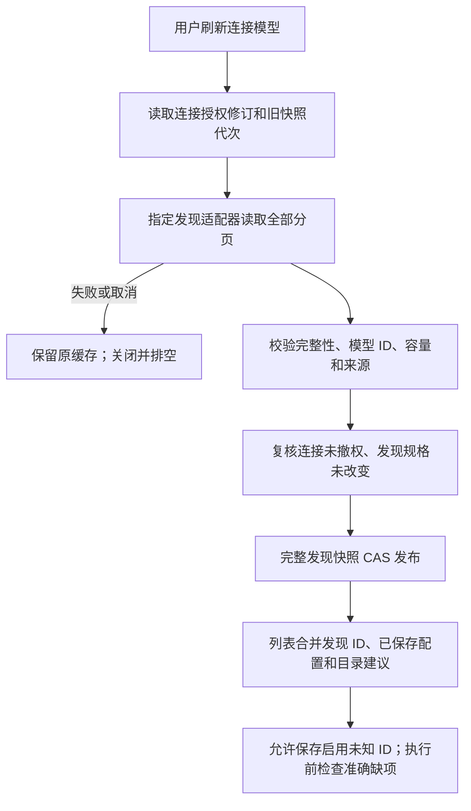

# 模型发现与公共资料刷新

<!-- Chinese documentation follows the user's explicit language preference. -->

发现回答“这个连接列出了哪些模型”；资料目录回答“已知模型有哪些限制、能力及参数资料”。二者与是否已启用、是否可执行、探测结果分别保存。相关契约：[模型配置](AGENT_MODEL_CONFIGURATION.md)、[资料目录](MODEL_CATALOG.md)。

## 实际连接发现

`modelDiscovery` 是独立注册能力。`AgentConnectionDiscovery` 指定发现适配器和端点；发现不根据模型名称选择执行协议。描述符校验端点配置与凭据要求后，`AgentModelDiscoveryService` 在库租约中创建有所有者的操作，冻结目录，完成请求并关闭传输。

结果 `AgentDiscoveredModel` 包含 ID、可选名称及有来源的可选字段事实。当前 HTTP 列表适配器只提取 ID／名称，不伪造接口没有返回的能力。快照记录连接 ID、配置修订、适配器、观测时间和快照 revision，最多 2000 个唯一模型、2 MiB。第二页失败时不发布第一页面，也不删除既有模型。

服务默认最多 8 个并发请求、远程期限 30 秒。超时先取消和关闭拥有的资源，再等待真实任务排空；不能强制杀死不合作的模块。连接改名不丢弃结果，端点／凭据／启用或发现选择改变则拒绝迟到结果。缓存保存与授权复核处于事务边界。

## HTTP 列表实现

- OpenAI 风格：`GET /models`，Bearer 认证。
- Anthropic：`GET /v1/models`，`x-api-key` 和版本头，按 `has_more`／`last_id` 读取全部分页。

单页最多 2 MiB，总响应最多 8 MiB、10 页、2000 个唯一 ID。重复 ID 规范合并；无效游标、超限、EOF 或状态失败不变成“模型已下架”。传输禁止重定向，不把原始错误正文写普通日志。

官方列表中的 ID 可以立即创建配置并启用，不要求内置目录命中或额外付费探测。调用仍可能因为权限、额度、协议、用途或缺少输入限制失败，这些应按实际原因诊断。

## 公共资料服务

`modelMetadata` 是独立能力。`AgentModelMetadataProvider.fetch()` 没有连接、凭据、私有模型 ID 或对话参数。生产提供者 `ModelsDevMetadataSource` 仅请求固定的公共 `https://models.dev/api.json`；启动、打开设置和发送消息不自动请求它。

`AgentModelMetadataService` 拥有显式刷新，默认远程期限 45 秒、最多 8 个操作。来源文档经过大小、schema、模型资料及协议规则白名单规范化。`updates` 在本地按准确端点和 model ID 关联现有配置；不同调用规格分别关联各自端点。

`SQLiteAgentModelMetadataStore.publish` 在同一事务中比较缓存代次和全部捕获的连接／模型配置，发布完整缓存与模型资料更新。任一配置 CAS、资料校验或写入失败时整体回滚，继续使用旧缓存。更新不修改用户覆盖事实、显示名称、启用偏好、已选适配器／端点和当前执行快照。

公共缓存是离线可用的来源快照，不是运行时依赖；提供者正常装配、服务关闭、库替换及归档恢复均已接入 macOS 工作组。来源事实解析细节和下载边界见[目录契约](MODEL_CATALOG.md)。

## 验证边界

合成测试覆盖发现分页、取消／关闭、迟到授权、原子缓存和未知 ID。公共资料下载失败继续保留旧状态。真实服务商和付费调用不进入 CI；具体执行证据与尚未做的在线检查记录在[实施记录](../engineering/BYOK_MODEL_LAYER_VERIFICATION.md)。
