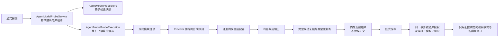
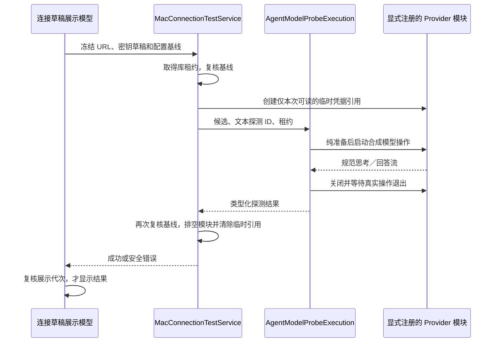

# 模型能力探测

<!-- Simplified Chinese documentation is explicitly requested by the user on 2026-09-12. -->

能力探测是独立的显式操作。模型目录发现只提供建议，不自动形成已验证能力；探测执行与保存结果也分为两次调用。核心只认识注册的探测身份、修订、能力标识、候选配置和类型化结果，不枚举 HTTP 服务商。

`AgentCapability.modelProbe` 允许模块提供 `AgentModelProbeProvider`。每项定义包含英文标题、允许写入结果的能力集合、请求所需的临时能力集合、纯候选准备函数、合成输入构造函数及输出判断函数。准备阶段仅能将明示的未知／失败／缺失能力临时声明为可尝试，不得修改连接、预设、模型身份、修订、上下文限制或已有验证；临时声明不写入设置。

服务拥有实际模型操作、超时任务及保存任务。超时先关闭真实模型操作，再等待消费者和生产者退出；关闭先取消全部已接纳工作，再排空，不能逐项等待后才取消下一项。库撤权同样等待登记资源释放。并发工作和未保存观察结果均有上限。

连接、模型及预设作为一个原子候选快照读取。探测结束后再次读取并比较完整候选；任一组件变化都会拒绝迟到结果。保存必须来自当前服务的观察结果，在 SQLite 同一事务中重新校验授权代次、完整候选 JSON 与索引镜像，再执行模型修订 CAS。只写 source=probe、field=observation.<capability>、configurationFingerprint、来源修订与观测时间等事实，不覆盖能力声明，不保存请求正文、模型输出或密钥。

HTTP 模块提供文本、工具和 JSON 输出探测：文本需要非空回答，工具需要准确的一次合成调用及空对象参数，JSON 需要约定的 `result: "OK"` 对象。JSON 探测验证合成请求下的输出行为，不声称证明所有后续回复或特定 API 的强制结构化模式。工具只产生合成调用记录，不执行真实业务工具。

传输、配置、取消和授权错误直接返回错误，不被写成“不支持”。只有已完成输出经探测判断后才产生 verified／unsupported 结论；结果保存为准确候选配置的观察事实，保留未来显式重测的可能；不会把一个成功请求升级成整个模型的通用能力证明。Thinking 沿用已冻结的 Provider 配置，不通过关闭思考掩盖适配问题。

`AgentModelProbeExecution` 接受已经冻结的候选与库访问租约，只拥有模块目录和模型操作生命周期；它不读取或写入设置。`AgentModelProbeService` 使用同一执行器，继续负责原子读取、执行前后完整候选比较和结果保存。这个分离使尚未保存的宿主草稿也可执行合成检查，不需要伪造已保存路线或增加旧配置适配器。

macOS 的 `MacConnectionTestService` 由工作组拥有，最多接纳 4 项连接检查。草稿 URL 和替换密钥在调用时冻结；已有连接与已保存模型／预设必须仍与基线相等。临时凭据读取器只接受该次随机引用与版本，实际操作、模块和作用域全部排空后清除引用；不写 Keychain、SQLite 或会话日志。草稿端点或密钥不继承已有 verified 证明，Thinking 配置保持原值。连接检查仅返回成功或安全错误，不把测试结果自动写成能力声明。

Provider 页面列出当前模块注册的探测项目，完成后需要显式保存观察结果；保存前仍执行核心的候选 CAS。完整原生交互验收与真实模型检查单独记录，不以合成服务测试通过替代。
