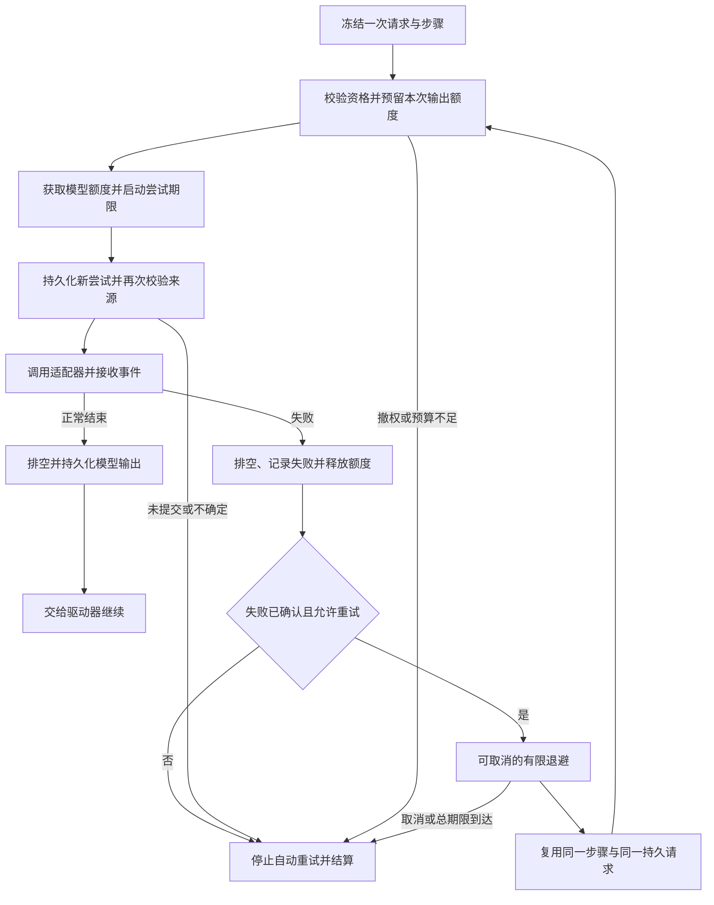

# 模型尝试与有限重试

<!-- Simplified Chinese documentation is explicitly requested by the user on 2026-09-12. -->

本文定义[执行内核](AGENT_EXECUTION_KERNEL.md)的模型重试边界。适配器只报告失败分类；是否再次派发由内核决定。这里的自动重试属于同一执行、同一模型步骤，与用户重新回答原问题及仅保存结果的结算重试分开。

## 身份、请求与失败记录

一个步骤只有一个 `stepID` 和一份内存中的 `AgentContextBuild`。上下文、来源、工具 schema、完整消息／思考续接、准备后的 wire 请求及路线均已冻结。持久日志只保存 `AgentRequestRecord` 的语义输入及授权证据，不重复保存 wire JSON；自动重试复用同一内存 prepared request，派发适配器在发送前重新构造并验证 wire 一致性，磁盘恢复不会重新派发模型。每次实际尝试使用独立 `attemptID`，同一步骤的 `attemptIndex` 从 1 递增；重试引用第一次尝试的同一个持久请求引用，不重新运行贡献器，也不重新执行已经完成的工具。

失败操作先关闭并排空生产者，保存必要的部分草稿，再提交 `attemptResolved(.failed)`。它的错误正文保存 `AgentModelAttemptFailureRecord`，包含安全诊断、显式重试建议，以及是否接收过任何模型事件。有效用量随失败记录保留。只有确认该批次提交后，执行器才向内核返回重试资格；返回之前已经释放模型调度额度。

重新派发前核对最后一次尝试、步骤与序号、失败记录、完整冻结请求相等及没有该尝试的工具提案。获得新额度后，在持久化尝试前和调用适配器前分别检查当前来源／会话授权。曾经有效的请求不代表现在仍有发送权限。

## 决策与预算

`AgentModelFailure` 将固定诊断和 `AgentModelRetryAdvice.transient` 分开。建议延迟为 0～86,400,000 毫秒，且仅允许对应 network、rateLimited 或 timeout 分类。未分类错误、非法建议、协议错误及取消均不自动重试。核心没有 HTTP 状态码或厂商名称分支。

即使适配器建议重试，只要接收过文本、空文本、思考、工具调用、用量或终止事件中的任何一种，内核就结束自动重试。这个边界比“尚未显示输出”严格；不会因为正文尚未形成检查点就重复已开始的生成。

计划持久化 `AgentModelRetryPolicy`，默认最多 3 次尝试，首次退避 500 毫秒，随后指数增长，上限 5,000 毫秒。配置最多允许 5 次尝试，退避上限最多 60,000 毫秒；设置一次尝试即关闭自动重试。实际延迟取指数退避和服务商最小等待时间的较大值。服务商最小时间超过冻结上限时停止，不缩短其要求后提前派发。当前没有随机抖动。

每次尝试都消耗路线最大输出量的预留，失败不会释放未知计费的预留。新尝试同时受执行输出总预算与总期限限制。退避不占用模型额度；单次模型期限只在取得额度后开始，总执行期限包含排队及退避。取消会打断等待并封锁下一次派发。

没有模型事件并不能证明服务端未接收或未计费；自动重试不承诺网络请求恰好执行一次。稳定步骤标识只用于关联，不能视为服务商幂等保证。核心保留所有尝试与未知用量，并限制最多派发次数；工具执行不会被这个模型重试循环重复。

## 执行流程

可独立查看[流程图](diagrams/agent-model-retry.png)和 [Mermaid 源文件](diagrams/agent-model-retry.mmd)。

## HTTP 适配器的分类

[HTTP 适配器](AGENT_HTTP_ADAPTER.md)仅将 408、429、500、502、503、504，以及明确列出的连接失败／丢失／DNS／离线／网络超时，标记为瞬时失败。401／403、TLS、未列出的状态、协议损坏和不完整 EOF 没有建议。HTTP 200 后零模型事件的网络断开仍可提供建议；收到部分模型事件后是否重试由核心统一拒绝。

`Retry-After` 接受非负整秒或严格 IMF-fixdate（英文日期、GMT），先检查 128 字节上限，最多接受 24 小时。日期使用注入的时钟，合法过去时间按零等待；不存在该 Header 使用零最小等待，存在但无效、超界或不支持的值则不提供建议。原始 Header 和响应正文不进入诊断。适配器自身仍只进行一次实际传输。

## 存储不确定、恢复与产品边界

请求、失败记录或输出提交未确认时，停止自动模型重试并交给持久化核对。核对和终态结算只处理原批次；即使后来确认瞬时失败记录存在，也不会从恢复入口重新运行驱动器。重新打开的应用只恢复已有结果并中断未完成执行。

上述模型契约已用于无 UI 新核心；它不为旧模型接口提供包装或兼容解码。准确测试证据及原生宿主、领域整合、隐私和性能的剩余范围见[验证记录](../engineering/AGENT_CORE_VERIFICATION.md)。
