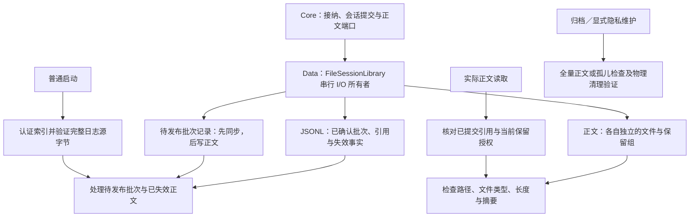
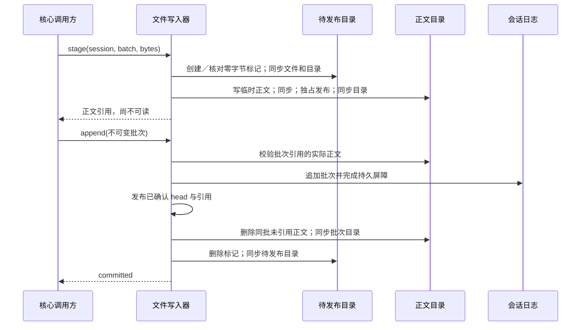

# 正文发布与启动恢复

<!-- Simplified Chinese documentation is explicitly requested by the user. -->

本契约定义 `FileSessionLibrary` 的待发布正文恢复与校验时机，承接[会话读取](AGENT_SESSION_READS.md)、[隐私维护](AGENT_SESSION_PRIVACY.md)和[库归档](AGENT_LIBRARY_ARCHIVE.md)。核心的 `SessionJournal`、`SessionPayloadStore` 与模块接口不依赖文件路径；此实现属于 MiraData，不向 MiraCore 引入平台能力。

## 权威与职责

已提交的 JSONL 批次和正文引用决定哪些内容存在、属于哪个保留组、是否已经失效。`pending-payloads/<SESSION-UUID>.<BATCH-UUID>` 是零字节、单硬链接的普通文件，仅表示该批次可能留下尚未完成清理的文件。它不发布消息、不授权正文读取，也不能把未提交批次变成已提交。目录和名称只接受规范 UUID；符号链接、硬链接、非空标记及非法名称明确失败。

普通启动不打开全部仍保留的正文，也不遍历全部正文批次目录。所有完整日志源字节、源身份、跨会话批次去重和失效事实仍在初始化时验证；后续日志分页也复核所读取的记录。历史正文损坏可能到首次实际读取或全量归档时才发现，不能把打开文件库解释为全库正文健康检查。正文不可用时返回明确错误，不以空文字代替，也不改变日志事实。

## 发布顺序

标记在任何正文文件或其批次目录创建之前同步。标记之后的阶段失败可以留下恢复工作，但不能留下无法定位的当前写入器暂存文件。同一批次多次 stage 会重新核对标记；不能仅凭内存集合假设它仍在磁盘上。

批次确认后，写入器保留该批次实际发布的引用，删除同批未引用的暂存／正文文件，完成批次目录同步之后才移除标记。清理失败不会撤销已提交批次或把它改报为未提交；恢复记录继续承担后续清理。若标记已 unlink 但目录同步失败，之前的正文删除屏障已经完成，重启时标记可能重新出现，重复处理仍安全。重复 append／reconcile 可以再次完成同一已确认批次的清理，不产生新事实。

追加尚不确定时，写入器继续封锁新的 stage 与追加，保留原批次及标记；不能为清理孤儿而删除可能已经提交的正文。只有原批次核对或重开后的完整日志恢复确定提交前缀，才能决定保留集合。

## 启动和元数据重建

初始化首先恢复并验证完整日志前缀。随后按已提交失效事实执行可重试的正文删除；这些事实是删除授权，待发布标记不是。文件已经不存在时仍重试目录同步，直到删除屏障完成。

待发布目录存在时，只枚举其中的标记，依据当前已验证日志引用清理对应批次。没有提交引用的正文不能因为文件仍存在而变得可读；已提交正文不会被当作孤儿删除。标记已同步而正文目录尚未创建是合法中断状态，恢复可以清除空工作项。

待发布目录缺失时，不能推断没有暂存文件：先依据完整日志引用遍历全部实际正文目录、删除无主文件并同步，成功后才创建和同步新的待发布目录。扫描中断则下次重新扫描。该路径用于当前派生恢复元数据丢失或从纯规范归档建立活动库，不读取旧正文格式，也不引入迁移或兼容运行时。

## 隐私与归档边界

定向启动恢复不是完整隐私维护。所有生产者排空且没有不确定追加之后，`purgeUnpublished` 仍遍历全库实际目录，回收全部暂存／无主文件并清除待发布记录；`verifyNoUnpublished` 独立全量扫描并要求待发布记录为空。`verifyPurged` 继续检查已失效保留组的实际文件不存在。任何失败都不能解除外层持久 pending。

`withSnapshot` 仍验证全部保留正文的文件身份、长度和摘要，并拒绝已失效但仍存在的文件。归档仅复制规范日志和保留正文，不复制待发布目录；目标严格验证仍拒绝额外文件。独立恢复器关闭私有写入器后移除其派生元数据，再从规范文件重新验证，不能用元数据清理冒充正文验证。

应用级 `recoverStartup` 当前仍逐会话恢复执行状态；本契约只调整文件库的正文 I/O 责任，未宣称已解决全部应用启动成本或通过十万消息的原生启动门槛。
