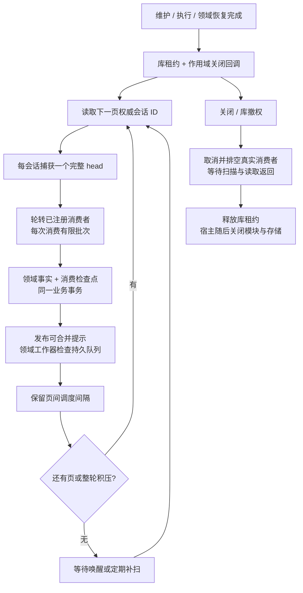
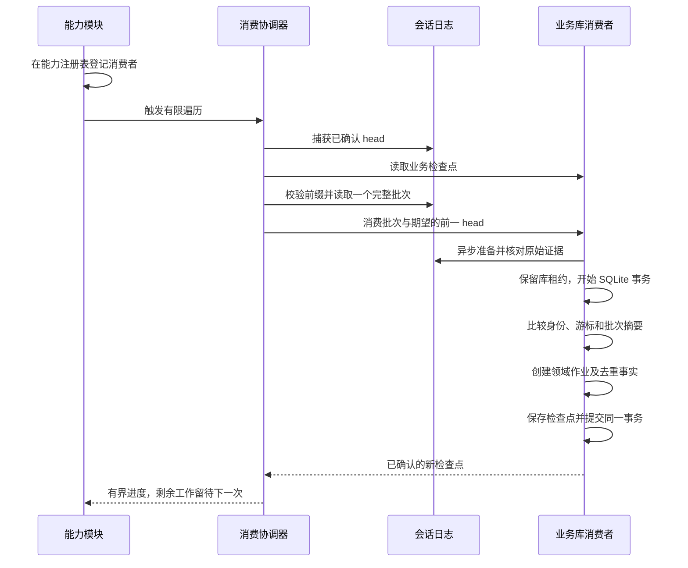

# 持久会话消费者

<!-- Simplified Chinese documentation is explicitly requested by the user on 2026-09-12. -->

本文定义模块如何可靠地消费已提交会话批次。它与[查询投影](AGENT_SESSION_READS.md)共享日志来源，但消费检查点属于业务事实。模块可以据此创建本地领域作业；模型循环和会话提交不承担领域处理逻辑。

## 注册与所有权

`AgentCapability.consumer` 注册 `AgentSessionConsumer`，身份包含稳定 ID 和正数修订。一次目录最多 64 个消费者，重复 ID 即使修订不同也拒绝。目录冻结身份，并持有注册作用域的租约；正在消费的批次不会因模块被撤回而丢失资源。

`AgentSessionConsumerCoordinator` 拥有有界消费任务。同一消费者／会话组合串行执行，不同组合可以并发；默认最多 32 个进行中的遍历，可配置到 128。每次遍历捕获一个完整日志前缀，默认最多处理 32 个批次，可配置 1～128。每次只读取一个完整批次，遵守日志的 2 MiB 批次上限，不加载消息正文。

返回值包括实际检查点、捕获目标、已处理批次数和是否仍有待处理内容。调用方应轮转会话，避免一个长会话持续占用消费机会。唤醒通知只用于触发遍历；游标来自持久业务库，不能根据通知次数推算。当前协调器提供显式有界入口，没有在内部创建无限轮询任务。

调用方取消不会取消共享消费所有者；当前任务退出后调用方收到取消。关闭协调器会停止新遍历、取消并排空已有任务，之后才释放目录租约。宿主必须先关闭协调器，再释放模块和关闭底层存储。同步业务事务一旦开始，关闭必须等待它返回，不宣称能强制终止不协作的领域代码。

## 库级扫描服务

`AgentSessionConsumerService` 是协调器之上的通用库级服务。它只枚举已注册的消费者，不识别 Memory／Task／Knowledge，也不执行模型。组合根先恢复未完成维护、前台执行和领域作业，再打开服务；消费者通知连接到领域工作器的 `wake`，连接任务由作用域拥有。

服务启动即扫描权威 `SessionJournal.sessions`，之后默认每 30 秒补扫，避免把通知是否送达当成业务事实。日志分页按 UUID 字符串严格递增、排除游标、最多返回请求数量；空页结束扫描。新增于游标之前的会话由下一轮发现，不能使用查询投影替代权威清单。重复、逆序、不前进的分页以及与请求会话不符的 head 会明确报错。

每页默认 32 个会话，每个消费者／会话默认最多 8 个完整批次；两项均可配置 1～128。每个会话只捕获一次目标前缀，遍历后让出执行机会。整轮存在积压时继续下一轮；通知只合并为补扫请求，不能重置正在推进的页游标。每页至少保留一次调度间隔，默认 100 毫秒、可配 1～1,000 毫秒；唤醒只中断空闲等待，不能取消这个间隔形成热点忙循环。定期补扫可配置 1～3,600 秒。

一个消费者或一个会话 head 的失败不推进其检查点，也不阻挡其他正常组合。全局枚举／配置失败保留扫描位置并等待后续唤醒或补扫，不伪造缺失数据。时钟本身出现非取消故障会停止调度并保持可读取的 failed 状态，新订阅者也能看到原因；宿主必须关闭后重新打开，`wake` 不隐式重启失效服务。

服务持有库租约和作用域关闭回调。库撤权自动触发同一个关闭所有者：先取消并排空协调器的真实消费者任务，再等待扫描和读操作返回，最后释放库租约。取消等待者、业务代码忽略取消或流观察结束均不能提前报告排空。关闭不处置调用方拥有的 journal、消费者适配器或业务库；宿主在服务关闭后再释放它们。

事件 `advanced`、`reconciled` 和 `failure` 都是有界、可合并的通知。新订阅得到初始提示，即使没有新批次，也能让领域工作器检查此前已入队的作业。每页后的提示与定期补扫还能补偿丢失的作业唤醒；具体资格、费用和重试仍由领域自己的持久记录决定。

可独立查看[服务流程图](diagrams/agent-session-consumer-service.svg)（[PNG](diagrams/agent-session-consumer-service.png)）。

## 传递内容与检查点

`AgentSessionConsumerDelivery` 包含消费者身份、期望的前一个完整 head 和一个会话批次。协调器检查目标与已有业务检查点均属于当前已确认日志，校验批次序号、大小、会话及目标身份，拒绝不支持的必需扩展。超过捕获目标的新批次留待后续遍历；已有合格检查点更新时不回退。

消费者的 `consume` 必须将本地领域写入与新检查点一起提交；返回值必须精确等于该批次 head。失败或确认丢失不会在同一遍历中盲目再次调用处理器。下次遍历先读取持久检查点，已提交批次自然被跳过，未提交批次从原游标重新读取。

日志引用只能证明出处。批次级读取不是一次新的领域授权，也不替代完整会话归约。处理器不能从旧完成事件推断来源今天仍可使用。需要正文、原始用户时间／时区或完整执行状态时，应使用权威读取器；任务认领及最终领域提交都必须再次验证当前资格、抑制规则和授权代次。元数据型消费只安排本地工作，不在消费回调中运行网络请求或外部副作用。

## 业务事务

可独立查看[消费流程图](diagrams/agent-session-consumer-flow.png)及其 [Mermaid 源文件](diagrams/agent-session-consumer-flow.mmd)。

`SQLiteSessionConsumer` 使用调用方拥有的业务 `DatabaseQueue`，不创建会话权威 SQL 表，也不持有独立的影子业务库。同步等级必须已为 FULL 或 EXTRA；消费适配器不替共享库更改配置。业务回执适配器也由组合根注入同一 DatabaseQueue，关闭适配器各自只排空其拥有的工作；数据库由组合根最后关闭。模块提供 `SQLiteSessionConsumerHandler.prepare`，在 SQL 事务之外异步解析证据，并返回 `SQLiteSessionConsumerTransaction`。其同步 `apply(in:)` 与检查点更新共用一笔写事务，事务内部不能挂起。返回事务的 `close()` 在实际提交、回滚、重复批次或确认丢失处理结束后释放准备资源；准备失败由处理器释放自己已取得的资源。

检查点保存消费者修订、会话、完整序号、批次 ID 和规范编码的 SHA-256。重复传入最后一个已提交批次时，只有摘要精确相等才返回原检查点，不再调用领域处理器；不同摘要、旧批次或序号缺口拒绝处理。消费者 ID 已登记的修订不匹配时明确失败，即使当前会话尚无检查点也不能把新修订当成新消费者悄悄重放。

处理器创建的业务记录仍需领域自己的唯一性约束。例如提取作业需要原始消息、提取器和策略修订的唯一键，不能只靠“完成通知来过一次”。通用适配器不推断记忆、任务或知识领域的去重规则。

适配器关闭先停止接纳，取消已接纳的准备任务，再等待准备、实际 SQL 操作、提交确认钩子和事务资源关闭全部退出。调用方取消不会遗弃已经接纳的领域事务；不协作的准备代码也必须实际返回后才能报告排空。关闭与准备注册之间的竞争会向晚注册任务补发取消。业务数据库仍归调用方所有。消费元数据使用当前格式，不提供迁移、兼容读取或重置接口。查询投影重建不能删除这些表；资料库恢复必须验证消费检查点不超过备份日志前缀。

## 失败边界和当前范围

| 边界 | 结果 |
|---|---|
| 领域处理器写入后抛错 | 领域行和检查点一起回滚 |
| 事务已提交但调用方没有得到确认 | 下次先读业务检查点，不重复已提交领域写入 |
| 正文后来被撤销或清除 | 消费游标不倒退，待执行作业按当前资格停止或转入明确状态 |
| 查询投影被清空或重建 | 业务作业与消费检查点保持不变 |
| 模块修订、检查点或日志前缀冲突 | 明确失败，不自动重置或跳过不一致数据 |
| 关闭期间有事务进行 | 等待原所有者排空，再释放模块／数据库资源 |

当前 Memory 完成消费者使用这一路径核对真实批次和原始证据、同事务入队。后台作业的路线、预算、来源与结算契约见[自动记忆执行](AUTOMATIC_MEMORY_IMPLEMENTATION.md)。通用服务已提供遗漏唤醒补扫和跨会话公平扫描，并与真实提取工作流组合验证；隐私维护先行的生产宿主启动顺序仍属于 P4／P5 整合。消费者本身不会调用模型。准确测试及未完成验收见[核心重建验证记录](../engineering/AGENT_CORE_VERIFICATION.md)。
