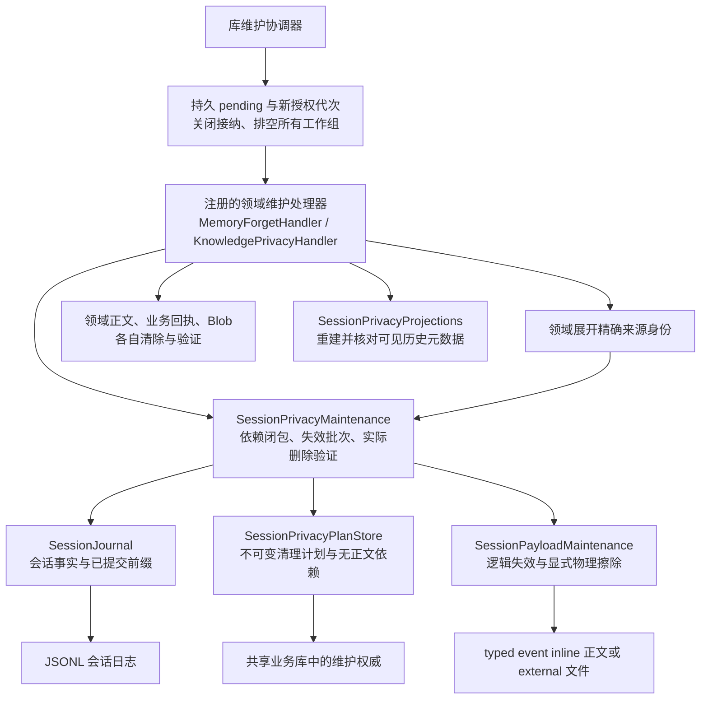
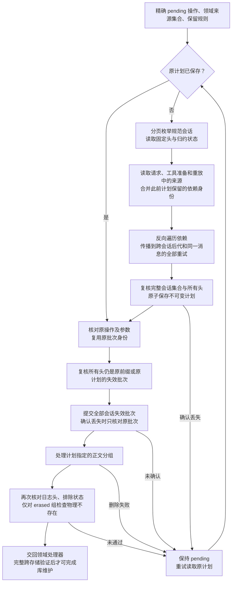

# 会话隐私维护

本契约属于[库级维护](AGENT_LIBRARY_MAINTENANCE.md)，实现 `SessionPrivacyMaintenance` 的会话部分。领域处理器负责业务对象、业务回执、知识 Blob 和派生缓存；`MemoryForgetHandler` 与 `KnowledgePrivacyHandler` 已连接各自领域、业务结果和查询投影，会话引擎自身仍不能单独报告完整遗忘完成。产品保留规则见[数据与隐私](../product/DATA_AND_PRIVACY.md)。

## 权威与扩展边界

核心仅依赖 Foundation、`SessionJournal`、`SessionPayloadMaintenance` 和 `SessionPrivacyPlanStore`。它不识别 Memory、Knowledge 或平台工具；领域模块负责把已审阅的对象展开为精确来源身份，例如全部历史记忆修订、知识元数据修订和不可变片段。展开必须发生在领域正文及身份关联删除之前。

会话正文现在由 v5 语义 JSONL 事件引用和独立活动草稿 sidecar 共同承载。请求 manifest 保存直接组件引用，结算后的助手尝试保存有序内容块和必要的 replay manifest 引用；隐私计划必须沿这些引用闭包传播。sidecar 通过发布后同步和原子替换保证崩溃恢复，不能作为日志事实或维护计划的替代品。

查看 [Mermaid 源文件](diagrams/agent-session-privacy-architecture.mmd)。

维护计划不是可以丢弃的查询投影。请求／重放被删除后，计划中的来源身份仍是后续维护判断历史依赖的必要事实，必须随资料库备份。计划只包含操作身份、来源身份、日志前缀、失效批次及依赖；不复制用户文字、提示词、工具参数或模型输出。

## 固定计划与执行顺序

调用方必须先通过库维护协调器关闭生产者并完成结算。引擎发现活动执行会拒绝生成计划，不把未结算工作默认为已取消。

查看 [Mermaid 源文件](diagrams/agent-session-privacy-flow.mmd)。

所有会话的失效记录提交后才开始主动维护。`SessionState.invalidatedRetentionGroups` 包含所有当前不可读组，包括 retryCleared 的逻辑退休组；`erasedRetentionGroups` 仅包含显式隐私物理擦除授权。重试清理只追加逻辑事实，保留原始 JSONL 和 external 字节；普通 `SessionPayloadReader.read` 对 invalidated 组抛出 `notFound`，归档内部校验仍可读取未物理擦除的历史证明，UI／上下文隐藏该正文。只有显式隐私维护在 durable invalidation 之后，才可将受影响（包括此前退休的）inline 正文以临时 JSONL 文件写入、同步、原子 rename 和目录同步移除，并按 external 删除屏障物理清理文件；重写必须重新计算受影响 `transaction_commit` checksum、事务偏移和前缀摘要，只保留逻辑批次／事件 ID、head 及仍保留的正文，不改写逻辑事实。普通启动使用[待发布批次记录](AGENT_PAYLOAD_RECOVERY.md)定向清理遗留 external 暂存内容；该启动优化不能代替本契约最后的全库孤儿扫描和物理验证。

普通调用方取消不能让库关口自动恢复 ready；外层维护协调器拥有实际工作。引擎单实例拒绝重入。出现不属于原计划的新会话、额外追加或错误批次时拒绝继续。不能把新头当作成功、现场缩小清理范围，或重新生成同一操作的批次身份。

## 依赖与保留

来源来自全部已记录模型请求（包括未成功的尝试）、工具准备的来源与目标，以及最终重放。同一用户消息的原始执行和所有重试形成一个失效组；反向依赖遍历支持跨会话和循环，并只处理每个已发现节点一次。重试关系采用线性连接，不生成全部两两关系。

以前被清理的执行按日志记录的完整失效操作 ID 集合，从对应持久计划取得来源身份；不会通过可缺失的查询索引猜测所需计划。已有失效却缺少对应维护依赖时，拒绝猜测或把空来源当作事实。普通来源身份匹配包含 namespace、UUID 和 revision；不会由核心猜测领域历史版本。

| 规则 | 原始用户消息 | 已提交助手正文／可见思考 | 请求、计划、工具、重放、草稿、错误、执行内模块正文 |
|---|---|---|---|
| `preserveVisibleHistory` | 保留 | 保留 | 清除 |
| `purgeGeneratedHistory` | 保留 | 清除 | 清除 |

两种规则均永久排除所选执行及其传递后代的模型上下文资格。保留历史不授予重放或自动提取权限。具体领域选择哪种规则由其产品契约决定；第二种不是删除整个 Conversation 的接口。会话标题和不属于执行的模块数据需由拥有其业务含义的处理器另行处理。

分组所有权来自 `SessionState` 归约器，不能由工具名称或查询投影推测。`invalidatedRetentionGroups` 是读取资格集合，`erasedRetentionGroups` 才是物理擦除集合；可见历史、逻辑退休历史与隐藏正文具有不同保留周期，即使字节相同也不能共用分组。普通正文读取对 invalidated 组抛出 `notFound`，归档内部校验仍可读取未物理擦除的历史证明，但归档仍保留尚未 erased 的物理历史。`verifyPurged` 只检查 erased 组的 external 路径实际不存在，并检查其 inline 正文不再出现在有效 JSONL 记录中；`purged` 读取状态本身不能证明字节已经删除。全部工作排空后，还要回收整个会话库中没有已提交事实拥有的 external 暂存／孤儿文件，并扫描实际目录验证没有未发布正文。inline 重写的临时文件、旧文件和索引／缓存必须在恢复路径中清理或重建。待核对批次存在时拒绝该回收；不靠删除临时内容来绕过不确定提交。

## 记忆遗忘处理器

`MemoryForgetHandler` 注册于独立 library 作用域，身份为 `memory.forget`、修订 1。它依赖 `MemoryPrivacyStore`、会话隐私引擎／计划存储、`AgentBusinessPrivacyStore` 和 `SessionPrivacyProjections`，不依赖 AppKit、平台通知、UI 或旧 SQL 会话表。领域以外的会话引擎与库协调器不新增 Memory 分支。

请求只包含一个 `memories` 对象身份和预期修订。`SQLiteMemoryStore.maintenanceValidator` 在 `SQLiteLibraryAuthority.begin` 的同一事务中校验当前对象；过期修订或错误来源在写入 pending／推进代次之前拒绝。来源维护必须注册精确 namespace／revision 的接纳校验器；没有默认放行。确认已存在的原操作时不重做尚未清理前的前置条件。

处理器按以下顺序工作：

1. 排空前台运行时、记忆应用、提取工作器、持久消费者、普通查询协调器和展示缓存。生产宿主负责列全这些工作所有者。
2. 展开目标记忆的全部连续历史修订和原始用户来源执行，保存完整会话隐私计划。
3. 在业务库事务中清除计划所选执行关联的共享业务结果正文；保留回执 ID、提交证明、已发布／待发布状态和结果摘要。同一业务操作被多个回执引用时，所有引用看到同一个已清除结果。
4. 清除目标记忆及全部修订正文、证据摘录／哈希、搜索索引、断言／提取方面元数据和关联操作的结果副本；来源写入遗忘抑制，清除该来源提取作业的请求、输出、决定和错误。已发生用量及必要作业身份保留。同来源的其他独立确认记忆保留。
5. 提交该隐私计划的显式 invalidation 批次；对计划覆盖的全部正文（包括此前 retryCleared 的逻辑退休正文）执行 durable invalidation 和 physical erase，按 external 屏障清理文件，并按 inline 重写协议从 JSONL 记录移除正文；清除无提交所有者的 external 暂存内容。MemoryForgetHandler 不在此步骤执行 retryCleared。
6. 重建受影响会话的查询元数据；按原日志前缀核对执行、用户／助手消息身份、引用和失效标记，检测漏行。允许保留的历史仍存在，但不再取得模型上下文资格。
7. 分别验证领域、业务结果、实际文件和投影，全部通过才由库协调器写入完成事实。

提取输入遵循[记忆与知识契约](MEMORY_AND_KNOWLEDGE.md#1.11-提取输入与提交条件)：它可以包含有界用户消息窗口及必要的批量对话前缀，所有来源身份和版本必须随作业保存并参与清理闭包。来源级提取清理必须覆盖该持久来源集合；保留其他独立确认记忆不等于解除原来源的自动提取抑制。

领域清理后发生中断时，原始来源身份、连续修订身份及无正文 purge 回执仍能重新构造相同来源根，处理器加载原计划及原批次继续。业务清理适配器和投影适配器由库拥有，关闭普通应用不能提前关闭它们。不能通过捕获异常、略过验证或重新创建操作 ID 来解除 pending。

投影时间以 SQL 保存的 Unix 秒数做精确比较；不直接比较 Foundation Date 的内部参考纪元表示。失效事实的集合以 UUID 排序编码，解码拒绝重复身份，因此同一批次在重开后仍有稳定的编码摘要和幂等身份。

会话隐私、macOS 生产组合、展示缓存清理及启动恢复已接通；知识撤权／删除、Blob GC 和独立归档恢复也已有各自处理器与组合测试。当前仍须完成剩余失败矩阵、完整原生操作及规模验收，不能把这些组合证据当作全部 P4／P5 门槛已通过。

## 边界

当前单次计划上限为 4,096 个会话、65,536 个执行、524,288 条来源关系，领域根来源及单执行来源各最多 8,192 个。单会话变更最多 2 MiB，完整计划最多 32 MiB。越界会在发布计划及删除前明确失败，不截断闭包。此为维护操作的资源边界，尚不构成大库延迟与内存验收。

知识领域处理器负责物理 Blob GC，宿主工作组列明后台所有者和展示缓存，归档纳入维护计划并核对其引用前缀；各自契约与证据必须同时成立。会话引擎不能代替这些领域／宿主责任，任何处理器或物理验证失败都不能被当作完整清理成功。

## 知识撤权与删除处理器

`KnowledgePrivacyHandler` 使用同一通用引擎，但在删除版本／片段关系之前先持久保存无正文领域范围。撤权保留可见历史，删除来源清除生成历史；两者均排除所有依赖执行并清理隐藏重放。处理器另外负责全版本 Blob 引用扫描和物理回收验证。完整顺序、边界与独立 `knowledge.collect` 处理器见[知识实现契约](KNOWLEDGE_IMPLEMENTATION.md#5-库作用域隐私维护)。
