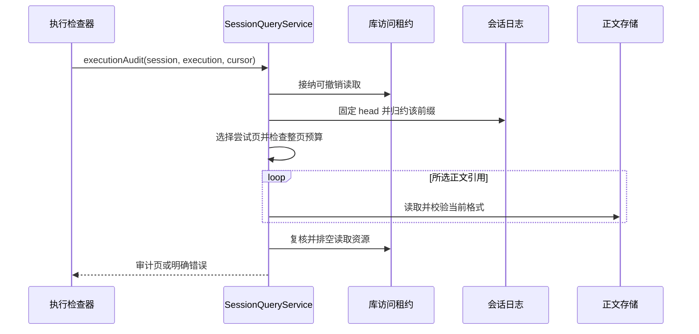
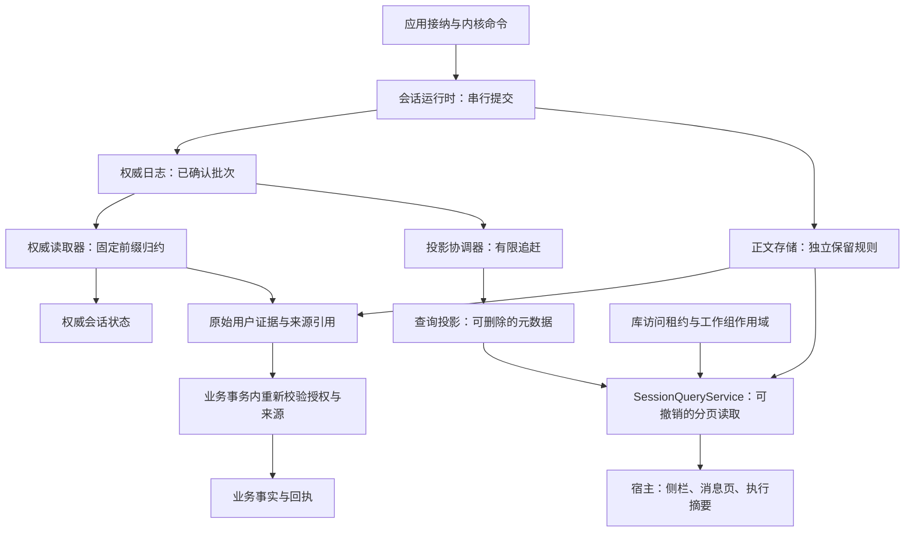
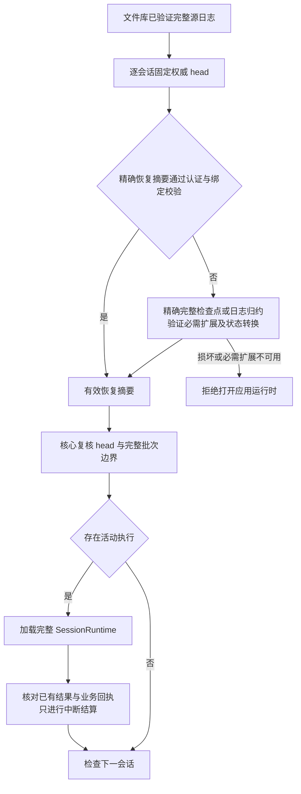
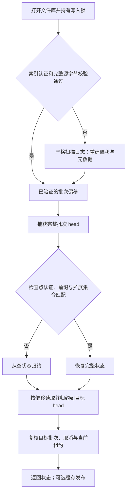
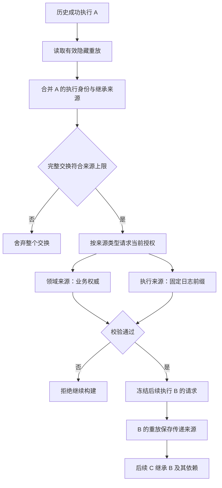
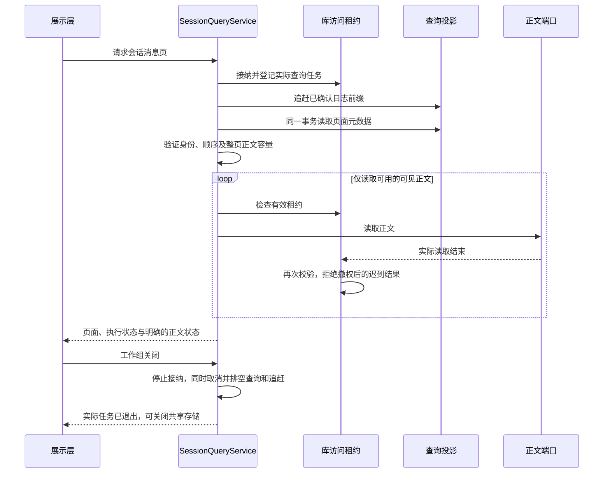
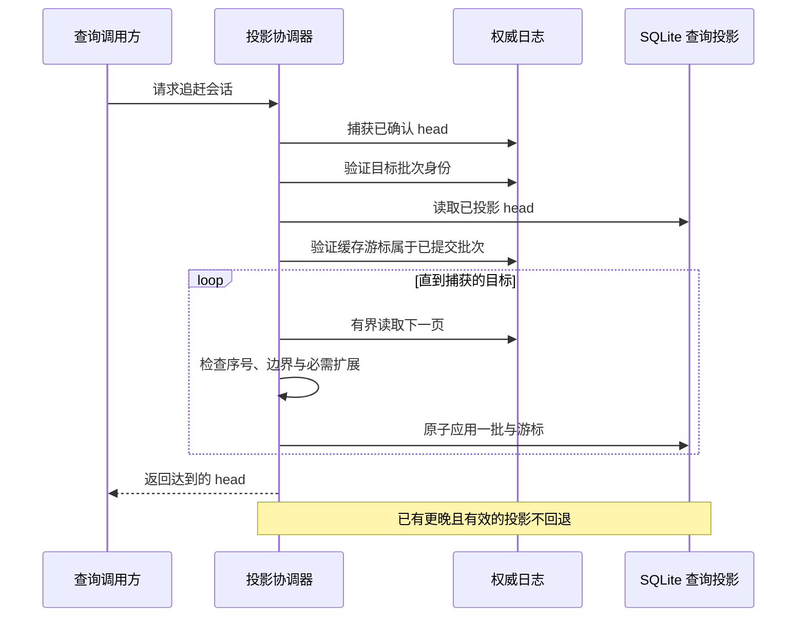

# 会话权威读取与查询投影

<!-- Simplified Chinese documentation is explicitly requested by the user on 2026-09-12. -->

全文检索使用独立的正文派生缓存和来源复核服务，契约与架构／流程图见[会话全文搜索](SEARCH.md#新核心会话搜索)。本文中的 `SessionProjectionStore` 继续只保存元数据；全文缓存可随时从权威日志重建。

新核心区分权威状态重建、用户证据与历史执行来源解析，以及界面查询。契约适用于所有宿主，MiraCore 只依赖 Foundation；文件日志和 SQLite 投影属于 MiraData。iOS 宿主不在本次实现范围。

## 执行审计读取

`SessionQueryService.executionAudit` 在工作组作用域和库访问租约内固定日志 head，归约该前缀，并读取所选执行的实际审计正文。执行身份与终态来自日志，不由 SQLite 查询投影提供。返回冻结执行计划、终态错误和按开始事件倒序排列的模型尝试；每页最多 32 次尝试，下一页使用最旧尝试的事件序号。

审计页的 `modelUsage` 返回该执行在同一固定 head 下的**全部**模型尝试用量元数据，不受正文分页游标影响。每条以实际尝试 ID 标识，并保留开始时间、用量和是否具有已完成的模型结果；失败、取消、中断及尚未完成的尝试不会被丢弃。手工重试形成新 execution 时分别统计；同一 execution 内自动重试仍全部计入。归约验证拒绝重复尝试身份。读取这些元数据不额外加载页外请求／输出正文。

价格属于 Provider：`ModelCostSummary` 逐次使用执行计划冻结的路线计算金额，未知调用数量与已知小计独立保留，只有所有调用都能估价才提供完整总额。冻结路线不可读取时，所有已记录调用的费用保持未知；不会从当前设置补价格。无模型尝试的本地执行显示无调用。宿主按可读取的计划优先级区分前台／后台；计划不可读取则只显示通用费用标题。

每次尝试保留日志中的开始时间、步骤／尝试身份、准备好的请求、模型输出或失败记录，以及该次尝试已登记的工具调用、提案和结果。请求消息按照持久记录顺序返回，保留可见思考与协议续接数据；宿主的本地审计面板可以展示这些显式读取内容，普通日志不得写入它们。不存在模型尝试的本地执行仍可返回执行摘要和计划。

正文分为 `available` 和 `absent`。读取前根据元数据检查整页正文预算；缺失、损坏、类型或身份不匹配应明确失败，不能伪装成空记录或采用旧格式解码。读取结束仍需通过租约复核；取消、撤权或工作组关闭必须等待实际读取排空。

## 核心架构

图示导出：[架构图 SVG](diagrams/agent-session-reads.svg) · [PNG](diagrams/agent-session-reads.png)。

业务关口、领域来源验证和领域维护已分别接通，保证范围由各自契约及组合测试限定。查询缓存不能提供写入许可、活动执行唯一性、模型上下文或业务消费者的去重事实。业务表不能引用投影行作为权威来源，也不能因投影重建发生级联删除。

## 应用启动恢复摘要

`JournalSessionReader.recoverySummary` 固定权威 head，返回 `SessionRecoverySummary`：仅含该 head 与可选的活动执行 ID。`AgentApplicationRuntime` 只为活动会话创建完整 `SessionRuntime`，然后依照原恢复契约核对和结算；摘要本身不能执行工具、调用模型、授权业务写入或读取正文。没有检查点端口的日志实现仍使用完整归约。

文件适配器的 `checkpoints/<session>.recovery` 是当前架构的可删除缓存，与完整状态检查点使用同一库私有 HMAC 认证，绑定归约版本、精确 head、完整日志前缀摘要和精确 schema 集合。它只从已成功归约或经认证的完整检查点提取；不直接扫描 admitted／finished 标记猜测状态。打开文件库仍校验全部日志源字节，读取摘要仍核对源身份；核心读取器再次验证返回 head 和目标完整批次；适配器若返回不属于请求 head 的摘要，核心明确报错，不能将违约返回当作有效恢复结果。缓存文件不能替代权威日志。

摘要缺失、损坏、认证失败或绑定不符时，先尝试已验证的精确完整检查点，否则由普通读取器归约全部缺失前缀。过期的已结束摘要不能遮蔽后续接纳事实；必需 schema 不可用时仍拒绝应用启动。无法安全读取目录、链接或源文件时明确报错。历史读取不能将较早摘要覆盖到最新恢复摘要。

摘要跟随完整检查点的倍增发布、热状态切换和显式 flush／关闭写入，不增加逐事件同步；缺失摘要可由精确完整检查点重新生成。摘要临时写入、同步或替换失败不改变日志提交结果，下一次按正常恢复路径处理。归档不包含这些缓存；恢复继续按整个 checkpoints 目录处理。

宿主通过 `AgentApplicationRuntime.open(extensionSchemas:)` 提供本次运行支持的扩展集合，启动恢复及之后创建的所有会话使用同一集合。默认空集合表示当前宿主没有必需会话扩展。宿主应向查询、消费者、维护、业务来源验证及归档模块提供一致的集合；运行时模块生命周期注册不自动声明持久 schema，安装一个模块不能默默宣称支持未知事件版本。

## 固定前缀

`SessionJournalHead` 包含会话、最后事件序号和最后批次 ID。序号为零时批次 ID 必须为空；非零序号必须对应完整批次。`head` 只返回已完成持久性屏障并向读取方发布的记录。不确定追加在核对完成前不进入 head。

`JournalSessionReader.snapshot` 先捕获 head，再按页读取并由 `SessionState` 归约到该批次，期间的新追加不扩大读取目标。读取会验证序号连续性、会话归属、事件身份、状态转换和必需扩展 schema。空页、重复页、目标落在批次中间、目标批次身份不匹配均失败。这里的“固定”指日志前缀，不表示正文保留或业务授权被冻结。

会话打开和业务回执发布校验共用该读取器。后者必须提交整个批次的游标，不能使用批次内部事件的序号冒充已完整发布的前缀。

## 持久偏移索引与状态检查点

`FileSessionLibrary` 不再常驻全部 `SessionBatch`。每个会话保存批次身份、连续序号、文件偏移、记录长度、原始记录摘要和前缀摘要链；正文引用属于日志存储层的派生元数据。分页通过序号二分定位，再用 `pread` 读取指定记录，重新检查原始字节摘要、批次封装和身份。普通页只解码所请求的批次，归档校验与缺失缓存后的严格扫描是独立路径。

`indexes/<session>.index` 可删除、可重建。启动时先验证库写入器签发的 HMAC、当前格式及结构，再流式计算**整个源日志**的 SHA-256，与该索引绑定的字节数和摘要比较。不能只用文件时间、最后序号或批次 ID 判断缓存有效。缓存缺失、损坏、格式不符、来自别库或源字节不匹配时，从日志逐记录扫描并重新建立索引；完整日志记录损坏仍明确失败，不会因为有缓存而跳过。符号链接、硬链接及不安全目录直接拒绝，不作为缓存丢失处理。

`SessionCheckpointJournal` 是可选的核心读取加速能力；没有实现它的日志仍由同一个 `JournalSessionReader` 完整归约，不存在旧格式或旧运行时适配。检查点使用完整的 `SessionState`，包括执行／尝试／工具状态、全部身份集合、正文所有权和授权代次；没有消息正文、模型请求正文或 Provider 凭据。`SessionStateCheckpointFormat.version` 在归约规则或状态编码发生不兼容变更时必须更新。

`checkpoints/<session>.state` 同时绑定完整批次 head、原始记录摘要的前缀链、归约格式版本和**精确相等**的扩展 schema 集合。读取器还验证会话身份、状态序号、检查点批次以及目标批次，随后只归约到已捕获 head 的后缀。扩展集合变化会绕过旧检查点并重新归约，缺失的必需扩展继续报错。目标早于最新检查点时，仍读取目标前缀，不能把更新状态当作历史快照。

缓存认证使用库私有的 `.cache-authentication` 随机材料，文件权限为 `0600`，目录为 `0700`。它是可重建的存储元数据，不是 API 凭据；不进入归档。丢失或损坏会使缓存认证失败并触发重建，不会使日志或正文无法恢复。认证防止只改写缓存及普通校验和的内容被当作写入器生成的状态；它不承诺防御能同时读取或替换认证材料、日志及整个库的本地身份。源日志仍经过完整字节校验，不能拿 HMAC 代替源一致性检查。

文件库持有一个热检查点，避免为所有会话同时保留完整状态。状态读取器缓存已完成归约的快照；`SessionRuntime` 只在收到正确的已提交游标、采用新状态后提交缓存，并在同一命令通道内等待它排空。未确定的追加不能生成检查点。索引按批次数、检查点按事件序号采用至少 64 且随后倍增的发布间隔；显式 flush、关闭及热检查点替换会刷新未保存状态。固定间隔全量重写没有进入逐 token 路径。源身份在同一写入器持有期发生非预期变化时，拒绝检查点复用与新追加。

缓存文件先写临时文件，再同步和原子替换。发布失败不改变已确认的日志结果；后续可重新生成。读取缓存前检查 64 MiB 文件上限，不解码超限文件；超限状态可继续从日志归约。此上限不是整个状态内存占用的上限：身份集合和历史元数据仍随会话增长，编码与全量重建仍需要单独进行规模测量。

库初始化验证完整日志源字节；日志批次中的有界内容与事件一起恢复，不再维护独立正文发布目录。普通启动不遍历正文批次目录。每次实际内容读取仍检查日志记录身份、类型、长度及摘要；归档流式验证全部日志内容。因而未访问历史内容的损坏可能在首次实际读取或归档时才报告，不能继续宣称启动已完成全库内容健康检查。日志恢复边界见[会话日志契约](AGENT_SESSION_LOG.md)。索引、检查点和定向恢复仍须通过完整参考规模与原生启动验收。

摘要与缓存认证的十六进制文本采用固定小写 ASCII 编码，避免逐字节调用通用格式化；SHA-256／HMAC 及其持久文本格式相同。真实消息语料、独立进程重开和当前初始化瓶颈的证据见[规模验证](../engineering/AGENT_CORE_SCALE_VERIFICATION.md)，不沿用只有少量正文的元数据基准作启动结论。

归档只保存日志和有效正文，不包含两种缓存及其认证材料。恢复阶段的私有写入器排空后删除所生成的缓存，再按纯来源内容进行严格独立校验；恢复成功的资料库首次打开会建立自己的缓存。

## 原始用户证据

`SessionEvidenceReference` 记录会话、原始执行、用户消息、接纳事件 ID／序号。它用于重新定位不可变接纳事实，不携带可复制的正文，也不是权限凭证。

重试沿相同用户消息找到最初接纳，不把重试计划中的时间或时区当作用户说话时刻。解析结果保留原始时间、时区、Workspace、观察到的日志 head 和会话授权代次。引用再次使用时，必须与原始接纳逐项相等，再从权威日志内容读取。正文缺失、损坏或 UTF-8 无效不能变成空字符串。

业务提交仍须验证当前库级授权代次、领域来源和目标条件。会话读取与 SQLite 写入之间存在并发窗口；读取结果自身不能消除该窗口。旧证据对象以及查询投影都不能代替提交关口。

## 历史执行来源

历史上下文读取还可选择取消或中断执行的可见回答；thinking 阶段中断且没有可见回答时，仍保留原始用户消息和一个中性的中断提示。此交换只由原始用户消息、可选的标记为 `isIncomplete` 的 assistant text 和中性的中断提示组成；持久正文保持原文。成功 replay、思考正文、协议续接和未配对工具交换均不从失败执行推导。读取器从该执行已提交的请求证据重建来源集合，按当前目的地重新授权。提示属于交换消息，因此计入历史消息和字节预算。

`AgentSourceReference` 直接采用两种类型，不把不同权威来源拼接成字符串，也不解码旧的无类型对象：

| 类型 | 身份 | 解析权威 |
|---|---|---|
| `domain` | namespace、对象 UUID、正整数 revision | 对应领域的当前业务事实与发送策略 |
| `sessionExecution` | 会话 ID、执行 ID | 该会话的已确认日志与保留状态 |

会话 ID 是身份的一部分；不同会话可以包含相同的执行 UUID。执行是不可变来源，不以查询行修订代替身份。引用集合先去重，再以类型、命名空间／会话及对象身份排序，稳定进入上下文、准备请求、工具计划和最终重放记录。

每个被选入历史的完整交换都会增加自己的 `sessionExecution`，包括没有模型路线的本地回答，以及没有领域来源的普通聊天。它同时继承该执行原有的传递来源。每个交换和总上下文共用 8,192 个来源上限；加上自身身份后超限时，历史读取器舍弃整个交换。来源授权先于适配器重放；不能因领域来源为空就跳过检查。

例如，B 的请求使用了 A，C 的请求使用了 B；即使 A 的消息因预算从 C 的直接历史中裁掉，只要 B 的重放继承了 A，C 仍包含 A 与 B 的执行引用。裁剪只移除不再被任何保留交换依赖的来源，保证每个保留交换仍能追溯其来源。

`JournalSessionReader.executionSources` 只接受去重后的执行引用，每次最多 8,192 个。它按会话分组，对每个会话捕获一次已确认前缀并完整归约，同一时间只保留一个会话快照，输出仍保持调用方顺序。执行必须成功且仍有有效重放引用；原始用户接纳也必须存在。重试解析到首次接纳，不把重试当作新用户来源。

返回的 `SessionExecutionSourceEvidence` 包含执行来源、完整原始用户引用、Workspace、重放引用、观察 head 和会话授权代次。该入口只核对日志元数据，不读取正文；它不是永久授权、正文读取租约或全库一致快照。实际读取和对外发送仍必须经过当前领域策略、库级维护关口与效果边界的复核。不得用查询投影补充这些权限判断。

### 来源传播流程

图示导出：[来源传播 SVG](diagrams/agent-session-sources.svg) · [PNG](diagrams/agent-session-sources.png)。图中的领域授权与库级维护已有独立实现；来源读取器不替代它们。

## 查询缓存契约

`SessionProjectionStore` 的实现只保存元数据和正文引用，当前没有正文副本或全文检索索引。查询包括：

- 会话摘要：Workspace、标题引用、修订、归档、时间、活动执行、最近接纳执行和已投影 head。没有执行的会话的最近接纳执行为空；否则它是投影中最大接纳序号的执行。
- 消息页：原始用户消息与已结算助手消息，分别保留正文和思考引用。
- 执行摘要：接纳、阶段和终态。

重试新增执行，不重复创建用户消息。终态以 `completion` 表达；`phase` 保留最后执行阶段，不能单独判断终态。正文是否可读由正文存储返回的可用性决定，查询投影不改变日志事实。

SQLite 适配器使用独立、可丢弃的查询数据库。每批在同一事务中更新派生行、批次身份摘要和 head。相同批次重复应用不产生第二份消息；身份冲突或序号缺口拒绝应用，事务回滚。缓存版本只接受当前格式，不提供旧格式解码或迁移桥接。它不访问业务存储或调用领域处理器。

会话页按更新时间降序、UUID 升序排列，更新时间不因时钟回拨而倒退。消息和执行按序号倒序分页，单页最多 128 行。会话分页是实时视图：并发更新可能把条目移动到已读页；它不承诺跨多次查询的完整快照。普通查询不读取日志或正文，返回的 head 明确显示它反映到哪里。

`messagePage` 在同一次投影读取事务中返回会话摘要、消息页、分页标记、消息关联的执行、最近接纳执行，以及当前活动执行。最近接纳执行按 `projection_executions` 的最大接纳序号计算，因此没有回答或思考正文的失败／取消重试也不会从页面执行摘要中消失；较旧消息页同样携带它。它通过多取一行确定是否还有下一页；重试仍只增加执行。界面不能分别查询这些元数据再把不同时间的结果当作一个页面。该事务只固定查询元数据，不冻结整个库的授权或正文保留状态。

## 宿主读取服务与正文租约

`SessionQueryService` 属于可替换工作组，拥有查询任务及唯一的投影追赶协调器。物理日志、正文和查询数据库由库所有者持有；关闭服务不会关闭共享存储。`WorkspaceApplication` 同样属于工作组，提供工作区列表、读取和带修订比较的保存。工作区写入使用当前库授权进入业务事务，不能通过查询元数据取得写入权。

图示导出：[读取流程 SVG](diagrams/agent-session-query-flow.svg) · [PNG](diagrams/agent-session-query-flow.png)。

`messagePage` 自动追赶所选会话，再读取页面。侧栏 `sessions` 只读取已有投影；宿主在收到持久状态唤醒后显式同步受影响会话，或主动调用 `synchronizeLibrary` 刷新全库。全库刷新以每批 128 个会话枚举，当前最多 4,096 个，并验证身份唯一及排序；它不是每次侧栏翻页或草稿更新的前置操作。分页参数最多 128 行，服务最多同时接纳 16 个查询。页面读取先累计全部将读取的正文引用字节数，再开始任何正文 I/O，默认上限 64 MiB，可配置范围为 1 字节至 128 MiB。

`SessionTextContent` 区分两种展示事实：`available` 为可见原文，`absent` 为该部分本来不存在。正文缺失、损坏、长度不符或 UTF-8 无效均抛出错误，不能伪装为空消息。重试执行通过 supersession 选择当前答案，不改变已提交日志中的正文。

`settledOutput` captures an authoritative journal prefix and reads completed attempt output. It selects the latest settled answer and accumulates thinking across settled attempts, without reading provider continuation into presentation. Unresolved output is only available through the process-local [live output stream](AGENT_LIVE_OUTPUT.md). There is no persistent draft or patch reconstruction API.

调用方取消读取会取消该查询，但等待其实际 I/O 和资源清理。关闭先停止接纳，再同时关闭共享追赶所有者并排空查询，避免查询等待追赶、追赶又等待关闭的循环。库访问租约撤销后，已经开始且不响应取消的读取仍被计入排空，迟到的正文不会发布，工作组不能提前完成关闭。已经交付给宿主的 Swift 值无法被远程撤回；宿主仍须响应工作组代次变化，清空旧工作组的展示内容。

## 追赶与重建流程

图示导出：[追赶流程 SVG](diagrams/agent-projection-flow.svg) · [PNG](diagrams/agent-projection-flow.png)。

协调器拥有追赶任务。同会话操作串行，调用方取消不取消正在共享的追赶，当前等待者在原任务排空后收到取消结果；关闭则停止接纳、取消任务并等待排空，之后宿主才能关闭存储适配器。追赶失败保留最后成功提交的批次，下一次请求从其后继续。一个库由一个协调器管理，不能同时绕过协调器重置正在追赶的缓存。

目标和缓存游标均须能在权威日志找到匹配的完整批次。缓存游标超前或身份错误时明确失败，不静默重置。显式 `rebuild` 只删除所选会话的派生行和游标，再追赶到捕获目标；重建中途失败可以留下空缓存或已完成的部分前缀，调用方必须处理失败，后续追赶可以继续。它也不能重置业务消费者游标。删除整个关闭后的查询数据库再创建，可从日志重建全部会话。两条路径都没有模型、工具或业务回调。

当前投影协调器检查批次封装及读取连续性，不重复执行完整的执行状态归约，因此投影仍然不适合授权。权威使用方必须经过 `JournalSessionReader` 或持有内核权威状态。

## 当前边界

持久偏移索引、带源前缀认证的完整状态检查点和按需批次解码已实现；缓存全部丢弃仍可从日志重建。首次打开仍流式校验全库日志与有效正文，完整状态的元数据规模仍随历史增长。小型机制测试和元数据读取基准不能据此认定 P2／P6 大库性能验收通过。

[可注册持久消费者](AGENT_SESSION_CONSUMERS.md)、实际领域处理器、维护屏障、正文读取租约和统一归档／独立恢复已有实现。执行审计分页读取已有实现；全文搜索、规模性能和完整原生展示层接入继续实施。缓存的可重建性不等于上述能力已验收。确切测试和未验证项目统一记录在[核心重建验证记录](../engineering/AGENT_CORE_VERIFICATION.md)。

## Ordered execution activity reads

`executionActivities` reads each selected execution's attempts in step/attempt order and projects only visible model-output blocks and tool argument/result content. It does not expose request snapshots or provider continuation. The previous latest-eight summary cap is removed; the shared page byte budget still bounds content reads, including all selected attempt outputs. Missing content has explicit presentation states. Pending model tool blocks can appear before invocation registration; once registered, their durable arguments/results are correlated by model order and validated against the canonical call. No presentation identity is randomly generated while reading.

Unresolved model blocks are delivered only through live observations. Durable activity reads only committed attempt resolutions; earlier steps cannot be overwritten by a later live prefix. Orderly cancellation settles available output once. A hard crash discards the unresolved prefix; previously settled steps remain readable.
