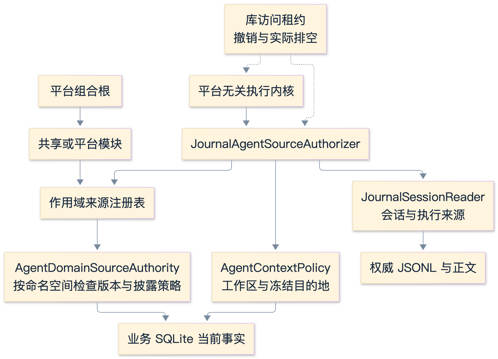
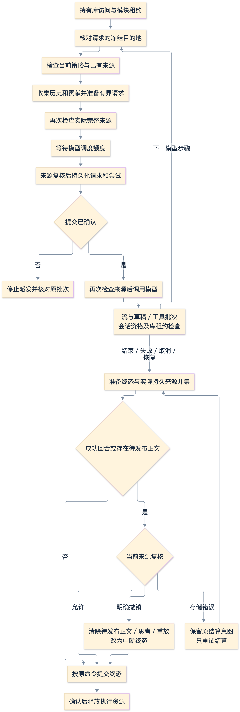

# Agent 来源授权契约

<!-- Simplified Chinese documentation is explicitly requested by the user on 2026-09-12. -->

当前代码已实现平台无关的来源授权组合，并在任务领域与真实新运行时中验证。Memory／Knowledge 和原生宿主仍待直接接入；本契约不代表完整隐私清理已经完成。相关边界见[会话读取](AGENT_SESSION_READS.md)、[执行内核](AGENT_EXECUTION_KERNEL.md)和[库维护](AGENT_LIBRARY_MAINTENANCE.md)。

## 架构与职责

图源：[Mermaid](diagrams/agent-source-architecture.mmd) · [SVG](diagrams/agent-source-architecture.svg)

`AgentContextRequest.destination` 是必填的持久值：`.local` 明确表示本地访问，`.model(AgentModelRoute)` 携带完整冻结路线。模型准备、历史读取、派发、工具上下文和业务意图解析要求它与执行计划的路线一致。不能用另一连接的权限验证即将发送的内容。缺少字段的旧请求直接拒绝解码，没有默认目的地或格式兼容。`.local` 不授予模型发送权限；当前本地驱动器只发布无辅助来源的确定性文本。

`AgentContextPolicy` 负责当前工作区和目的地政策，即使没有辅助来源也必须检查。生产 `SQLiteAgentContextPolicy` 在共享业务库的同一读快照中检查工作区、连接和冻结模型身份。远程发送开关或连接白名单拒绝时失败；被删除、禁用或已改变的路线不能被另一条当前路线替换。纯文本路线不要求工具能力。局部本地访问仍检查工作区存在性，但不要求启用模型连接。

来源采用强类型身份：

| 来源 | 当前事实的权威 | 检查内容 |
|---|---|---|
| `sessionExecution(sessionID, executionID)` | `JournalSessionReader` 与权威 JSONL | 已完成的合格执行、原始用户证据、隐藏重放、工作区、排除状态和失效保留组 |
| `domain(namespace, id, revision)` | 该命名空间的 `AgentDomainSourceAuthority` | 当前对象版本、作用范围及领域自己的发送规则 |

会话来源不能通过 SQL 会话投影授权；业务 SQLite 仍是当前业务对象和策略的事实源。模型请求记录其实际继承与贡献来源，完整历史交换的传递依赖继续进入后续请求。查询缓存不会成为第二份权限事实。

`JournalAgentSourceAuthorizer` 只解释这两类身份。领域名通过注册表分派，内核没有任务、记忆、知识或平台分支。模块可以提供新的领域授权器，并由 macOS 或未来其他宿主装配同一个共享模块。本次没有实现 iOS、动态二进制加载或插件市场。

会话执行来源可以是成功且可重放的执行，也可以是已通过正文保留与隐私检查的取消／中断执行。后者没有 replay 引用，但仍解析原始用户证据并检查工作区、排除执行和可见正文保留组；来源授权不能因为缺少成功 replay 就拒绝一个合法的 incomplete continuation。

## 作用域与单次检查

领域授权器注册在 `RuntimeRegistry<any AgentDomainSourceAuthority>`。一次检查先冻结目录并捕获命名空间，在整个异步读取期间持有作用域租约。最多接受 128 个授权器；无效或重复命名空间属于配置错误，不能任意选择一个实现。请求的某个领域没有授权器时明确拒绝，不存在隐式放行。

检查依次执行：验证取消与有界唯一来源集合、验证路线、冻结领域目录、检查当前策略、解析会话来源并比较工作区、按命名空间确定顺序检查领域来源、再次检查当前策略与取消，最后释放快照。来源上限为 8,192，与持久上下文的上限一致。即使来源为空，前后两次当前策略检查仍执行。

模块关闭撤回未来注册；没有被撤回的其他模块仍可独立提供授权。已取得的快照保留实现直到实际读取返回，随后释放租约才允许清理。发送取消信号不等于不可协作读取已经结束。注册快照解决实现生命周期，库访问租约解决正文／业务读取与维护的所有权，两者不能互相替代。

## 执行与结算流程

图源：[Mermaid](diagrams/agent-source-flow.mmd) · [SVG](diagrams/agent-source-flow.svg)

准备时先检查目的地一致性和已有来源，再读取历史和贡献。贡献内容是数据，不能自己授予权限。上下文组装器在纯请求准备前以及最终返回前检查实际来源集合。预算裁剪仍使用同一次收集的内容。

模型执行器在获得调度额度后重新检查来源，持久化请求和尝试；只有提交已确认，才再次检查来源并调用适配器。排队与磁盘 I/O 都不能让旧的授权结果持续有效。模型流消费期间的会话资格和库租约检查继续生效；当前没有在每个文本事件上重新查询所有领域记录。

工具执行器从持久请求构造完整上下文，核对冻结目的地与原始用户证据。读取工具自己的 prepare／execute 和业务事务校验仍负责其新选择的来源。任务列表只声明实际返回的任务版本，执行前重新检查；任务变更由共享业务事务核对当前路线、工作区、原始证据和目标版本。来源授权器不替代业务写权限或原子回执。

Tool-owned reads and inherited model context are stored separately in the proposal. The executor authorizes their complete union at the tool dispatch and publication boundaries; domain validators receive only the tool-owned plan. See [tool source ownership](AGENT_TOOL_EXECUTION.md#tool-owned-and-inherited-sources). Task context references identify retained immutable revisions, subject to current task/workspace access; they do not authorize mutation of an obsolete revision. Task list freshness and mutation compare-and-swap checks still require the current revision.

终态结算对成功回合，以及任何将发布非空回答或思考的失败、取消、恢复回合，重新读取实际尝试的持久上下文，核对目的地、执行与工作区，取全部来源的去重并集再次授权。成功重放的来源还必须与持久请求一致。明确撤销时结算为无正文、无思考、无重放的中断状态；进程内未结算流不会绕过撤权继续发布。没有模型尝试的本地文本遵守本地驱动器的独立限制。

只有明确 `unauthorized` 才能转换为上述撤销终态。存储读取失败保留原结算意图，后续只重试原结算，不重新运行模型、工具或驱动器。已提交但确认丢失的结算依旧按原批次核对。

## 错误分类

当前来源被删除、版本改变、范围不符或发送权限撤销，返回 `unauthorized`。无效来源参数属于输入错误；重复领域目录或不一致的模型准备路线属于配置错误。持久请求自身与原计划不一致属于存储证据错误。

合法 JSON 内的非法领域值仍是损坏记录。SQLite 的读取解码边界把非法持久配置／工作区值归为 `storage`；外部调用方提交的非法新值保留输入或配置错误。损坏 JSON、镜像列不符、日志或正文读取失败不能被当作权限撤销，也不能通过空内容掩盖。

## 任务模块与后续范围

`TaskModule` 的模块 ID 为 `mira.tasks`，在模块作用域注册命名空间为 `tasks` 的来源权威及 `task.list`、`task.change` 工具。任务来源权威只依赖 `TaskReadStore`，重读精确工作区中的当前任务并检查 revision；SQL 和平台通知都不进入核心授权分派器。领域政策以[任务契约](TASKS_AND_REMINDERS.md)为准。

当前自动化证据见[重建验证记录](../engineering/AGENT_CORE_VERIFICATION.md)。模型和系统通知仍用合成适配器，用户工具策略也使用明确的测试实现；这不是凭据或真实模型验收。

来源检查只是操作关口，并非跨日志、SQL 与外部系统的原子事务。库维护必须先持久化维护操作并推进代次、拒绝新工作、等待旧读取与实际生产者排空，才能执行领域清理和验证。完整传递依赖删除、历史正文清理、Memory／Knowledge 权威及工具、备份与原生宿主切换仍未完成；不能把本次终态抑制当成完整遗忘流程。
