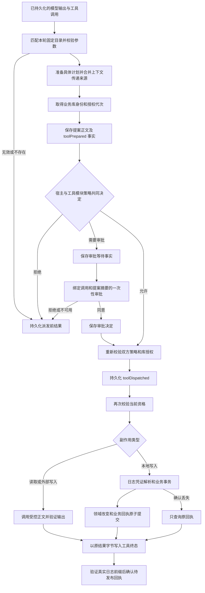
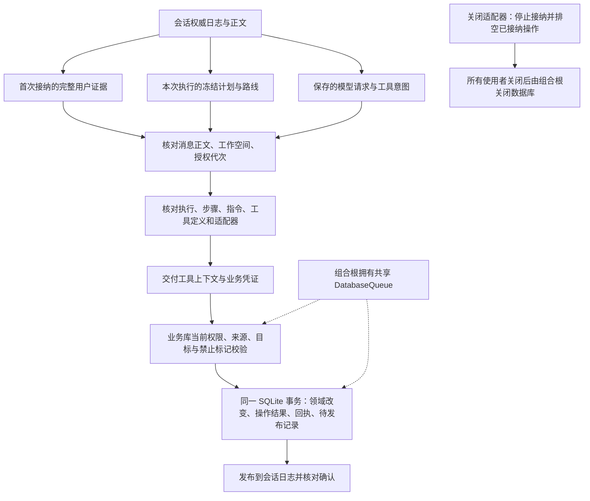
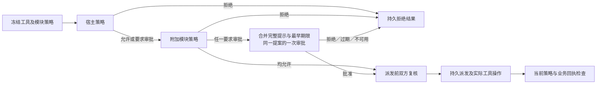

<!-- Language exception: this technical contract is written in Chinese at the user's explicit request. -->
# 新核心的工具执行与业务回执

本文记录 `codex/agent-core` 新路径已经实现的契约。内核不依赖平台；`AgentReadTool`、`AgentLocalWriteTool` 和 `AgentExternalWriteTool` 是能力端口。macOS、将来的 iOS 或共享模块提供具体实现。这里没有接入旧 `MiraApplication`，没有兼容转换或双写路径；默认驱动器、领域模块和宿主切换继续按[实施计划](../engineering/AGENT_CORE_IMPLEMENTATION_PLAN.md)推进。

## 所有权与边界

| 层 | 负责内容 | 不能代替的责任 |
| --- | --- | --- |
| `AgentToolCatalog` | 固定本轮的工具实例、模块策略、定义、修订、输入输出约束、副作用和执行模式；拒绝名称及 wire name 冲突 | 冻结目录的模块租约仍由组装者持有 |
| `AgentToolExecutor` | 校验调用、准备提案、审批、派发、结果验证、持久结算与中断恢复 | 不包含记忆、任务、文件系统或平台实现 |
| `SessionRuntime` / `SessionState` | 工具事实顺序、调用身份、唯一终态、取消和正文所有权 | 日志中的“允许派发”不能授权后续任意业务事务 |
| `AgentEffectAuthority` / `AgentToolPolicy` | 业务库授权代次、来源和目标修订、宿主当前限制及一次性审批要求 | 先前的允许不能覆盖后来发生的撤权 |
| `SQLiteLibraryAuthority` | 库身份、授权代次与持久维护意图；维护开始原子推进代次并阻止新授权 | 不替代正文读取租约、跨存储清理或备份屏障 |
| `SQLiteBusinessEffects` | 在一个事务内提交领域改变、操作结果、业务回执和待发布记录 | 查询投影和会话消息表不能作为写入资格依据 |
| `JournalAgentEffectResolver` | 从真实日志还原已派发意图，核对来源和发布确认 | 不通过旧 SQLite 会话状态或 UI 状态反推事实 |

本地写工具只提供准备逻辑和业务命名空间，没有可以直接调用的写入正文。实际业务处理器接收已解析的提案与上下文，在 Data 持有的同步 SQLite 事务中执行。来源和目标校验器是必需依赖，没有默认全部允许的生产实现。当前集成测试中的允许校验器和计数器仅用于合成测试，不能计作实际领域权限已完成。

## 执行流程

`AgentToolPlan` 保存规范化输入、来源修订和目标修订。提案再固定工具定义、输出约束、副作用类型、命名空间及原调用正文摘要。`toolPrepared` 把提案引用与库级授权身份写入日志；`AgentEffectProof` 同时指向该事实的批次、序号、会话、执行和调用。业务层必须检查这些身份一致，不能接受仅凭调用 ID 自述的“已授权”。

### Tool-owned and inherited sources

`AgentToolPlan.sources` contains only the sources selected by the tool's preparation. `AgentToolProposal.inheritedSources` separately stores the exact ordered source set of the model request that produced the call. The proposal's `sources` property is their deduplicated union. A read tool receives its own prepared plan; a local write validator can require an empty tool-owned source list without rejecting prior conversation history or another domain's recall.

The executor validates the union through `AgentSourceAuthorizer` before obtaining business authorization, after policy approval, immediately before the tool body, and before publishing successful read/external results. Domain validators still enforce their own prepared reads and exact mutation targets. Library fencing and transactional authorization remain the write gate. The effect resolver requires inherited sources to equal the durable request's sources, rejecting both missing and injected dependencies. Model continuation and privacy maintenance consume the union; neither can drop inherited evidence to make a tool succeed.

`inheritedSources` is a required field in the current proposal encoding. There is no old-format decoder or migration bridge. Development libraries containing obsolete proposals are recreated under the contributor cleanup policy. Verification is recorded in [production tool verification](../engineering/TOOL_VERIFICATION.md).

`AgentToolContext` 只携带执行／调用身份、完整 `SessionUserEvidence` 和本次接纳的 `AgentModelRoute`。原始证据包括会话、首次执行、消息、接纳事件／序号、正文引用与摘要、首次接纳时间／时区、工作空间、所观察到的日志 head 和会话授权代次。工具不再只拿到一组无法独立定位原始事实的标量。

`SessionRuntime.userEvidence` 使用运行时自己的日志、正文存储和必需扩展修订表，经过同一个权威读取器解析证据。工具执行器核对证据与保存的请求正文、工作空间和授权代次一致；准备后的语义请求还必须匹配执行、步骤、系统指令、最后用户消息及本次冻结路线的适配器和能力。被调用的工具必须包含在保存的请求定义中。业务凭证解析器执行相同的证据／路线核对，再交给事务校验器。

重试可以接纳新的执行计划及路线，但证据仍指向用户消息的首次接纳；工具语义中的“今天”不会变成重试时刻。上下文传递来源包括模型请求继承的全部来源及工具准备时新增的来源，以[领域对象／会话执行两种类型](AGENT_SESSION_READS.md#历史执行来源)表达。任何工具或领域模块保存出处时应使用完整证据引用，不能只保存消息 ID 后再查询会话投影。

这些字段证明所执行请求的出处，不构成永久授权。业务校验器仍须在提交事务内检查当前工作空间／路线限制、来源及目标修订、抑制记录和业务授权代次。日志读取与 SQL 提交不共享事务；跨存储隐私撤销必须先通过业务写入关口推进代次／设置执行禁止标记，再修改日志和清理正文。该完整维护顺序仍属于 P4，不能把本增量的证据核对称为已完成的遗忘协议。

可独立查看[证据与业务提交流程图](diagrams/agent-tool-evidence-flow.png)及其 [Mermaid 源文件](diagrams/agent-tool-evidence-flow.mmd)。

## 审批、并行与取消

每个 `AgentToolPreparation` 必须显式声明 `policy`，没有协议默认实现。`.hostOnly` 表示该工具依靠宿主策略及自身领域验证；`.constrained(policy)` 表示模块另外提供 `AgentToolPolicy`。工具模块可以封装明确记忆意图、文件范围或平台授权条件，执行内核不解释这些业务规则。当前 Task 工具显式采用 hostOnly，其来源／时间／目标和写入约束仍由工具准备与领域事务验证；Memory 模块尚未切换，不能把这项接口视为记忆审批已经接入。

`AgentToolCatalog` 与描述符一起捕获策略实例，目录租约覆盖它的整个调用生命周期。不能在工具已冻结后通过撤回另一份策略注册把调用降为 hostOnly。动态权限应由策略的当前校验查询；工具实现与规则语义改变需使用新的工具修订。

组合先评估宿主，再评估模块。宿主拒绝时不调用模块；模块拒绝时也不会弹出宿主原本要求的审批。双方允许才可继续。仅一方要求审批时保持原提示；双方要求审批时按宿主、模块顺序用两个换行连接原文，采用更早的到期时间，仍只生成一个绑定同一持久提案的审批。提示为空、日期非有限数值、单条或合计超过 4,096 UTF-8 字节时拒绝，不截断条件，也不拆成可部分通过的审批。当前时刻、最长有效期、观察界面是否可用仍由 RuntimeApprovalService 校验。

审批完成后、派发事实已确认而正文尚未开始时，以及读取／外部工具成功返回而结果尚未发布时，都执行双方的 `validate`。每个异步策略前后检查取消；不可协作策略迟到返回允许也不能恢复已取消的调用。本地业务提交继续在 SQL 事务中验证当前授权和原子回执；模块策略不替代这个事务关口，也不撤销已经发生的外部效果。

图示导出：[Mermaid](diagrams/agent-tool-policy.mmd) · [SVG](diagrams/agent-tool-policy.svg) · [PNG](diagrams/agent-tool-policy.png)。

审批绑定调用 ID、提案正文摘要、执行 ID、库级授权代次和期限。来源、目标修订及库身份包含在已保存的提案和意图中。审批请求和决定也是日志事实：没有提案不能申请，待决或拒绝的审批不能派发，过期后不能新增批准。无界面、界面断开、重启和取消都不会变成批准。中断结算先拒绝未决审批，再结束调用。

连续的 `parallelSafe` 工具组成一个有界并行段；`ordered` 和 `exclusive` 在本执行批次内形成屏障。结果始终按模型顺序写入 `tool/result` 并返回。后序调用不阻塞工具正文并发，但等待前序调用完成持久结算后才能发布结果；读取和外部工具等待后重新校验来源与策略。取消或结算失败会释放等待者，并由既有恢复流程处理未结算调用。当前没有宣称跨会话的通用资源互斥；数据库事务或平台资源所有者负责其资源的排他语义。

每个调用保留独立审批和派发状态。只有剩余调用全部等待审批时，会话阶段才进入 `waitingForUser`；仍有运行中的工具时保留 `waitingForTools`，避免把并行状态压成错误的全局等待。

正文超时使用协作取消。执行器会等待正文退出，不会释放仍被正文使用的资源，也不会声称强制杀死了不配合的 Swift 任务。准备阶段不独立计时，由执行内核的整体执行期限覆盖。外部写入在派发后异常或取消时保留副作用未知状态，禁止当作未写入而自动重跑。

取消同时阻止新日志工作，并在业务数据库写入执行禁止标记。事务可能在禁止标记之前提交成功；这时必须发布真实回执。禁止标记确认后才到达的事务不能再提交。超时后的本地写入会先设置该标记，再查询原回执。此标记属于整个执行，后续本地写入也会被拒绝。

## 跨存储恢复

会话日志与业务 SQLite 不共享事务。业务库维护两个不同身份：调用 ID 用于同一派发的去重；处理器给出的业务操作键用于多个调用对同一领域操作的去重。同一业务键还核对规范化命令摘要，不能把不同参数错误地当成重放。

`SQLiteBusinessEffects` 接收调用方拥有的 `DatabaseQueue`，不再从路径另开数据库。必须显式接收已由 `SQLiteLibraryAuthority` 初始化的同库身份。与 `SQLiteSessionConsumer`、领域数据共用这一业务库，领域写入／回执／消费检查点各自遵守同一 SQL 事务所有权。构造前要求 FULL 或 EXTRA 同步等级，以及外键开启；适配器不更改共享库配置。只建立并验证自己的当前格式表，可以与其他领域表共存，拒绝残缺的自身表组和不支持的格式，不提供迁移或旧构造入口。

业务层持有从异步日志解析到 SQLite 提交结束的完整任务所有权。同一调用的并发提交等待同一任务；关闭会等待它排空。回执查询也等待原任务，因此日志解析尚未完成、数据库队列暂时为空时，不会过早报告“没有提交”。关闭停止接纳，等待已经接纳的日志解析、回执发布校验、SQL 操作和提交后确认全部排空；关闭业务适配器不会关闭共享数据库。宿主在关闭所有使用者后才关闭 DatabaseQueue。资料库的共同写锁仍需由最终组装者统一持有；注入数据库本身不授权多个独立进程同时操作同一资料库。

| 观察到的结果 | 后续动作 |
| --- | --- |
| 业务事务已提交，工具终态尚未写入 | 读取原回执及原 JSON 结果字节，补写终态；不执行处理器 |
| 工具终态已写入，待发布确认丢失 | 验证日志中的匹配终态，再幂等确认 |
| 原业务所有者已排空，且不存在回执 | 记录已知未提交的中断或失败结果 |
| 回执查询不可用 | 保留未结算写入，拒绝伪造失败或成功终态 |
| 日志提交结果不确定 | 先核对原批次，不能用新的错误批次覆盖它 |
| 外部写入结果未知 | 保留明确未知状态，重启不重新调用工具正文 |

业务回执保存库身份、代次、调用 ID、提案摘要和结果摘要。正文存放在共享业务操作记录，回执不复制正文。清除操作正文后，关联回执仍证明原写入发生过，返回 `result == nil`；会话以 `resultWasPurged` 明确记录这一状态。清除正文不会让操作重新执行。

库身份与授权代次现由独立的 `SQLiteLibraryAuthority` 持有。维护开始时原子保存 pending 操作并推进代次，业务提交在同一 SQL 事务检查当前状态；`purgeResults` 必须引用准确的当前维护操作，只清除正文。原 `invalidateResults` 接口已删除，全部测试组合直接更新。完整契约和图示见[库级授权与持久维护记录](AGENT_LIBRARY_MAINTENANCE.md)。跨会话来源撤销、正文读取租约、领域清理、备份屏障及完整隐私维护仍待 P4。

## 历史重放

`JournalAgentHistoryReader` 从会话快照选择已完成、未排除且仍有有效重放正文的完整交换，不以可见回答作为重放后备。每个用户消息只选最新合格执行，当前用户消息不会重复进入历史。来源先校验，再调用适配器的重放规则；适配器可以删除思考或续接内容，不能替换用户可见文字、工具身份，或注入新的思考正文。

读取器优先保留较新的完整交换，再按时间顺序返回；最多保留 254 条历史消息及 6 MiB 的消息与来源编码，给当前输入预留空间。模型上下文窗口和当前回合工具轨迹仍须由后续驱动器组装处理；这里的字节上限不是 token 预算验收。

自动化证据和未完成项见[核心验收记录](../engineering/AGENT_CORE_VERIFICATION.md)。

## 库访问与维护

工具执行必须显式接收当前执行的库访问租约，提案授权与租约的库身份、代次必须一致。正文与期限通过同一关口原子接纳，撤销后排空实际任务，不能在当前执行中换用新代次。恢复直接使用不具备派发依赖的 `AgentToolRecovery`。详见[访问与结算边界](AGENT_LIBRARY_MAINTENANCE.md)。
