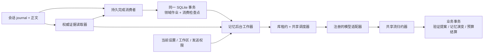
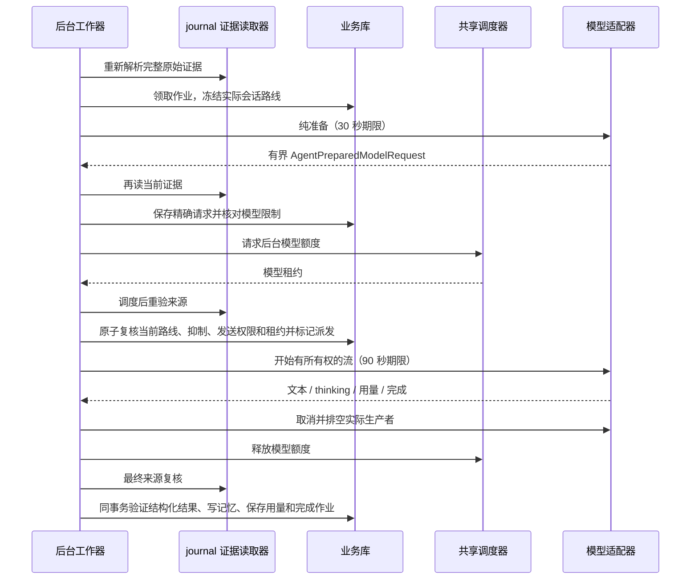

# 自动记忆执行契约

<!-- Simplified Chinese documentation is explicitly requested by the user on 2026-09-12. -->

本文定义新 Agent 架构下的后台提取。旧 SQL 会话和旧 Provider 提取循环已经直接删除，当前宿主已接通消费者、周期唤醒和工作器；历史质量验收不自动适用于新版提取。记忆的保存、召回、引用和遗忘边界见[记忆实现](MEMORY_IMPLEMENTATION.md)。

## 责任与事实源

会话 journal 决定用户原文、原始时间／时区、完成事件和会话授权代次。`SessionEvidenceReference` 保存完整出处，消息 UUID 本身不能充当来源身份。自动提取按完成的用户回合建立持久 dirty 队列；消费者保存 journal 顺序、完成时间和检查点，并在同一事务中推进它们。达到四个回合、约 2,000 个输入 token、最近完成后空闲 120 秒或最早回合达到 600 秒时，才合并成一个提取作业。每个作业最多取 16 个回合、8,192 个输入 token。任务保存完成事件 ID、批次 head 和原始证据引用；消费处理器必须先对照真实日志验证这些值。

记忆领域拥有提取作业、尝试租约、冻结会话模型路线、精确准备请求、模型输出、用量和记忆决定。它是独立业务作业，不创建隐藏会话，也不复制前台执行状态。每次尝试使用独立 ID，共享新 `AgentModelAdapter`、`AgentModelAccumulator`、`RuntimeScheduler` 和库访问生命周期。正文和 thinking 只保存在受管业务记录中，不进入普通诊断日志；遗忘清除对应请求、输出和隐藏续接内容。

## 从完成事件到模型调用

消费者逐批核对完整 journal 记录。成功且有可见回复的完成事实才进入 dirty 队列；助手内容和思考不能作为用户证据。后续已被排除、正文已清理或超过单回合边界的来源不会入队。消费者不发网络请求，也不为每个回合发起模型请求。

`flushDirtyMemoryExtraction` 根据业务库中的有界 dirty 行合并批次，按 admission sequence 排序，在同一业务事务中创建作业并删除已消费 dirty 行；该周期转换不推进 journal 检查点。真实 journal、工作区、授权代次和抑制状态在工作器派发前与提交前重新验证。作业来源表阻止消费者检查点重建后重复处理已归属作业的来源。

工作器每轮选择有界的待处理批次，按会话 UUID 轮转，同一会话按作业创建时间选择最早批次，轮次之间主动让出执行机会。每次周期唤醒先 flush dirty 队列，再选择下一份作业；因此单个回合不会绕过批量阈值单独触发模型。部分索引支持下一会话查找和末尾回绕，不加载全部作业后排序；轮转游标只用于调度，领取与结算仍由业务库授权。来源永久失效的作业暂停；存储故障不冒充来源失效。唤醒合并，是否存在工作以业务库为准。

记忆始终自动。没有 `mira.memoryExtraction` 用途绑定、模式开关、启用时间或每日提取额度。工作器从批次末轮的已完成 journal execution 读取实际模型路线，不重新查询全局默认模型，也不把后来改变的会话选择套到旧批次上。JSON 通过提示和严格输出验证实现，不要求另一个已声明 JSON 能力的模型。每次派发和提交重验原请求可用性及冻结配置身份；配置失效时暂停，不隐式换模型。

请求由整批有界的用户回合、原始时间／时区、必要时的有界 assistant 回复和当前有效记忆摘要组成。只有在没有辅助来源时，才把有界 assistant 回复作为解释上下文；它们不能成为用户证据。每个用户回合带 host 分配的 `inputIndex`，模型用它标识证据来源；模型不生成 quote 或可见引用，host 在提交前把索引映射回 journal 来源。保留前台工具定义以稳定缓存前缀，但以 `allowsToolCalls = false` 禁止调用；模型仍返回工具调用时失败且不执行。适配器不能替换已审计语义输入；初次 wire 表示由适配器负责，之后同一尝试只能重用已冻结的精确准备请求。所有工具调用、用量倒退、缺失结束事件、不完整 thinking 或超限结果均不能提交为成功提取。

## 会话前缀与缓存

提取指令、输出 schema、待处理回合和现有记忆摘要追加到最后一个 user 消息。原系统提示词和工具定义保持与前台请求一致；不向前缀插入时间、任务 ID 或重新生成的系统提取提示。模型、连接和 thinking 设置沿用原路线。单次输出预算优先限制到 2,048 token；适配器保证不低于合法的显式 thinking 预算要求，不能通过关闭 thinking 获得低开销。

当原消息前缀不超过 16 KiB，且它的全部来源均属于当前批次或已重验、已记录隐私依赖的 existingMemories 时，原消息数组逐项保持不变，再追加提取任务。`prefixMessageCount` 只允许在禁用工具时追加一条 user 消息，普通聊天的 context 位置规则不变。超限或包含未跟踪来源时只复用系统提示词和工具定义，避免为追求缓存重发无界历史或保留未纳入遗忘清理的正文。来源在准备、调度后和提交前复核；复用前缀不能绕过失效检查。

DeepSeek 根据相同前缀复用缓存，属于 best-effort；Mira 保证请求构造和来源边界，不保证命中或固定节省比例。已解析的 `prompt_cache_hit_tokens` 进入用量和费用记录。不设置每日 token 或费用门槛；缓存输入与实际计费仍按服务商返回的用量记录。参考 [DeepSeek Context Caching](https://api-docs.deepseek.com/guides/kv_cache/)。

## 事务状态与用量

业务库最多一个活跃提取尝试，唯一索引覆盖 claimed、prepared、dispatched。租约为 300 秒；它是迟到结果的校验期限，不能用过期为理由越过仍在执行的生产者并启动第二次调用。

| 状态 | 已有事实 | 失败／恢复 |
|---|---|---|
| queued | 完成出处和策略修订 | 合格后才能领取 |
| claimed | 独立尝试、冻结路线、租约 | 未发送，恢复可重新排队 |
| prepared | 精确请求和单次输入／输出估算 | 未发送，取消终结尝试；恢复使用新尝试 |
| dispatched | 网络派发意图已持久化 | 不确定结果保留估算并暂停，禁止自动重发 |
| completed | 输出、思考、验证决定、用量和记忆结果已一起提交 | 重复结算只返回原结果 |
| paused / failed | 持久原因和终态结算 | 显式重试重新核验来源、抑制与当前策略 |

没有每日预算配置、余额查询或按日累计的派发阻断。准备仍保存 `max(wire payload 字节数, 适配器估算输入 token) + 本次输出 token 上限` 的保守单次估算，并核对模型上下文窗口。该估算仅用于尝试完整性与缺失用量记录，不能冒充模型实际 token 数或费用，也不会耗尽一个共享额度。

成功结果的输入与输出用量全部已知时记录实际计数；排除缓存的输入协议还必须给出缓存读写计数。缺失必要计数或已派发结果不确定时保留保守估算，但费用仍标为未知。重复失败不能重复结算，也不能覆盖已经成功提交的结果。

来源、库或模型配置撤权仍阻止派发与最终提交。关闭和维护等待实际准备、模型流和传输清理完成；调用方取消不会提前释放资源或使晚到结果恢复写入权限。

## 决定、演变与清理

提取器使用 v3 JSON。每项必须包含有效的批次 `inputIndex`、模型改写后的 `content`、kind/subject/sensitivity；scope 由宿主确定，另包含、`confidence`、`stable` 和 assertion 分类；多个事实可以支持同一回合，host 按输出数组位置记录 proposalIndex。模型不提供 quote。host 依据 inputIndex 绑定整条对应 journal 来源，验证来源、workspace、权限和隐私后才提交。每批最多六个 item，输出最多 32 KiB。

自动保存只接受高置信度、直接、稳定的标准用户事实、偏好和约束，并允许 user 或 workspace 范围。推断、含糊、临时、假设、第三方、引用内容及敏感断言直接跳过，不创建 review candidate backlog，也不把任意模型输出标为 active。助手文本只能在没有辅助来源时作为有界上下文，不能成为用户事实来源。重复断言可复用已有记忆；含糊冲突跳过。每条新断言保守关联整个输入批次，以涵盖跨轮指代。

断言去重独立于尝试 ID。同一来源和同一规范化断言可复用已有记忆，不重复制造证据。语义 aspect 只用于冲突分组，不能授予授权；匹配时校验索引字段、规范元数据、来源和原证据的一致性。请求会带最多 32 条有界的现有有效记忆，模型可对同一 subject/aspect 的明确修订设置 `replacesIndex`。host 只在索引、旧记忆 revision、来源和发送策略仍匹配时以 CAS 自动 supersede；含糊或竞争变化跳过。用户修订后，旧提取元数据不能继续授权自动替换。

遗忘的领域事务清除记忆正文、修订、摘录、提取 aspect 和受影响作业尝试中的请求／输出／thinking／错误正文，保留无正文出处、状态和计费事实，提升来源抑制强度。晚到工作器不能重建正文。完整遗忘还需要库维护协调器完成 journal 依赖传递失效和其他域清理；仅完成这里的事务不能报告完整遗忘已完成。

每条创建或复用的 item 与成功尝试同事务保存 `MemoryExtractionDecision`：输出 proposalIndex、创建／复用、结果记忆及当时修订／状态，以及替代目标 ID。跳过的项目不写决定行，因此决定索引可以不连续；输出数组仍保存在受管尝试正文中。创建记忆、决定、费用、尝试及作业成功状态要么一起提交，要么全部回滚。决定是历史事实，不能授权当前召回或写入。

独立 `MemoryExtractionInspectionStore` 按作业、尝试序号和精确工作区读取已完成尝试的审核报告。未完成返回 nil；成功无提案返回空决定数组；已清理返回带清理时间且决定为 nil 的报告。不存在或其他工作区的尝试拒绝读取。它不暴露准备请求或 thinking，也不增加工作器的读取职责。遗忘将提案级明细连同模型正文一并清除，保留尝试身份和计费事实。

自动提取不建立待审候选关系。显式人工修订仍可使用独立的确认和替代事务；它必须指定当前目标、候选修订和目标修订，并以 CAS 检查两者。自动提取的 `replacesIndex` 只允许批次中 bounded existingMemories 的明确直接修订，不能绕过当前状态、workspace、抑制或权限检查。

## 当前验收范围

实现按新接口直接替换；不维护旧 SQL Message、旧 Provider 或旧提取作业解码路径。自动测试使用合成 journal、临时业务库和模型替身，覆盖消费者事务、来源、请求冻结、预算、演变和取消所有权。完整宿主启动恢复／唤醒、跨域维护、备份和真实模型质量仍需各自验收，详见[核心重建验证记录](../engineering/AGENT_CORE_VERIFICATION.md)。
