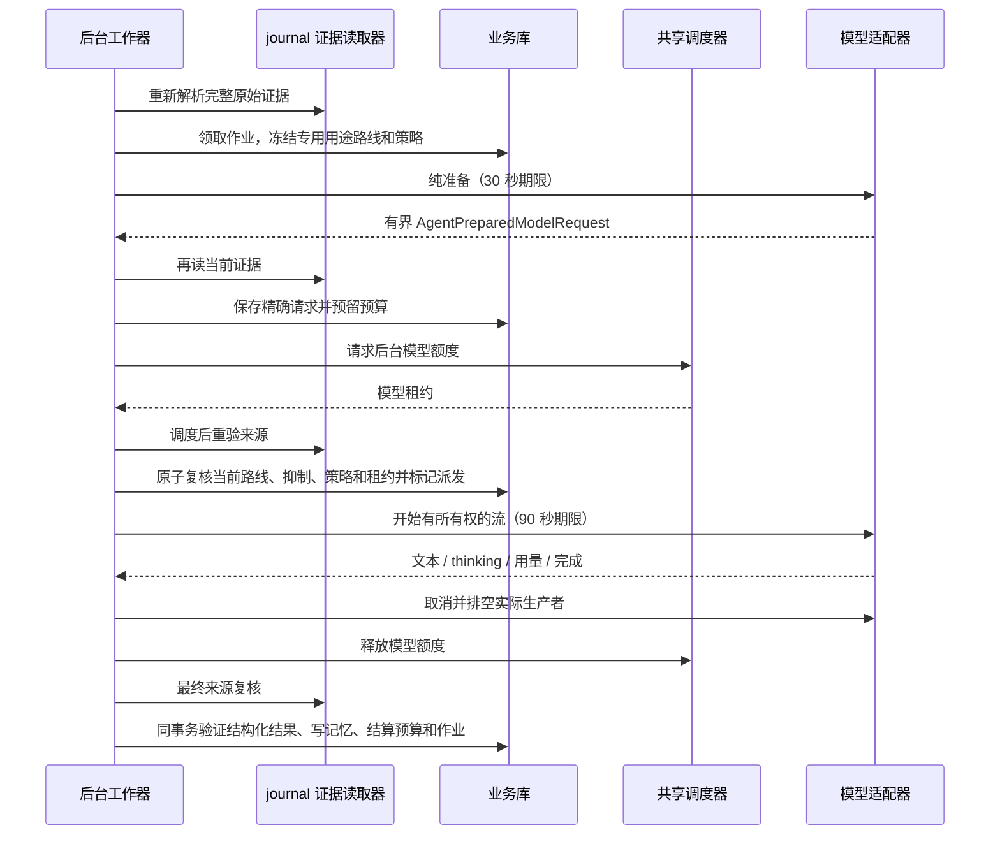

# 自动记忆执行契约

<!-- Simplified Chinese documentation is explicitly requested by the user on 2026-09-12. -->

本文定义新 Agent 架构下的后台提取。旧 SQL 会话和旧 Provider 提取循环已经直接删除，历史验收不代表新路径已完成宿主接入。记忆的保存、召回、引用和遗忘边界见[记忆实现](MEMORY_IMPLEMENTATION.md)。

## 责任与事实源

会话 journal 决定用户原文、原始时间／时区、完成事件和会话授权代次。`SessionEvidenceReference` 保存完整出处，消息 UUID 本身不能充当来源身份。任务保存完成事件 ID、完成批次 head 和原始证据引用；消费处理器必须先对照真实日志验证这些值。

记忆领域拥有提取作业、尝试租约、冻结用途绑定／模型路线、精确准备请求、模型输出、预算和记忆决定。它是独立业务作业，不创建隐藏会话，也不复制前台执行状态。每次尝试使用独立 ID，共享新 `AgentModelAdapter`、`AgentModelAccumulator`、`RuntimeScheduler` 和库访问生命周期。正文和 thinking 只保存在受管业务记录中，不进入普通诊断日志；遗忘清除对应请求、输出和隐藏续接内容。

可独立查看[架构图](diagrams/agent-memory-extraction-architecture.svg)（[PNG](diagrams/agent-memory-extraction-architecture.png)）和[执行流程图](diagrams/agent-memory-extraction-flow.svg)（[PNG](diagrams/agent-memory-extraction-flow.png)）。

## 从完成事件到模型调用

消费者逐批核对完整 journal 记录。成功且有可见回复的完成事实才产生待提取来源；助手内容和思考不能作为用户证据。后续已被排除、正文已清理或超过 16 KiB 的来源不会入队。消费者不发网络请求。

`prepare` 异步解析来源后持有库租约；同步 `apply` 再检查当前库授权、捕获开关、启用时间和抑制决定，在写入领域作业的同一事务里推进检查点。来源、策略修订和提取器修订构成唯一键。重复通知、重放或会话重试不会为同一策略下的同一原始消息重复入队。

工作器每轮最多选择 32 个待处理作业，按会话 UUID 轮转，同一会话选择最早入队作业，轮次之间主动让出执行机会。部分索引支持下一会话查找和末尾回绕，不加载全部作业后排序；轮转游标只用于调度，领取与结算仍由业务库授权。来源永久失效的作业暂停；存储故障不冒充来源失效。唤醒合并，是否存在工作以业务库为准。通用消费者服务的有限扫描、定期补扫和作用域拥有的事件连接已与工作器组合验证。生产宿主仍需按维护先行顺序恢复并打开整个工作组。

路线只从 `mira.memoryExtraction` 用途绑定选择，需要已声明／验证的流式文本和 JSON 输出能力。现有绑定无效时明确停止；不能改用聊天路线。每次派发和提交重验专用绑定以及所有冻结配置身份，设置修改不能悄悄替换一次已经准备的请求。

请求由原始文本、原始时间／时区和固定提取规范组成。没有工具或隐式历史。适配器不能替换已审计语义输入；初次 wire 表示由适配器负责，之后同一尝试只能重用已冻结的精确准备请求。所有工具调用、用量倒退、缺失结束事件、不完整 thinking 或超限结果均不能提交为成功提取。

## 事务状态与预算

业务库最多一个活跃提取尝试，唯一索引覆盖 claimed、prepared、dispatched。租约为 300 秒；它是迟到结果的校验期限，不能用过期为理由越过仍在执行的生产者并启动第二次调用。

| 状态 | 已有事实 | 失败／恢复 |
|---|---|---|
| queued | 完成出处和策略修订 | 合格后才能领取 |
| claimed | 独立尝试、冻结路线、租约 | 未发送，恢复可重新排队 |
| prepared | 精确请求和预算预留 | 未发送，取消释放预留；恢复使用新尝试 |
| dispatched | 网络派发意图已持久化 | 不确定结果收取预留上限并暂停，禁止自动重发 |
| completed | 输出、思考、验证决定和记忆结果已一起提交 | 重复结算只返回原结果 |
| paused / failed | 持久原因和终态结算 | 显式重试重新核验来源、抑制与当前策略 |

预算按 UTC 日统计，直接来自尝试记录，避免另一套累计计数与尝试终态分离。准备预留 `max(准备请求字节数, 适配器估算输入 token) + 最大输出 token`，同时受模型上下文窗口和每日余额限制。跨 UTC 日派发时，重新检查新一天余额并原子转移预留。

成功结果的输入与输出用量全部已知时按实际计数结算；排除缓存的输入协议还必须给出缓存读写计数。缺失任何必要计数时收取预留上限。失败、取消或崩溃后的派发结果不确定时同样收取上限。重复失败不能再次计费，也不能覆盖已经成功提交的结果。

关闭捕获／修改策略的事务暂停旧作业、释放未发送预留并保守结算已派发尝试。工作器最终提交会拒绝旧策略。关闭和维护等待实际准备、模型流和传输清理完成；调用方取消不会提前释放资源或使晚到结果恢复写入权限。

## 决定、演变与清理

每次最多六个提案，整个文本输出最多 32 KiB。纯验证器保留原始 item 顺序和重复项；断言去重由业务提交处理，不通过丢弃提案消除审核轨迹。纯验证器保留精确摘录、主体与范围、敏感内容、推断、时效、否定／引用／假设及保守候选规则。完整直接陈述可以自动成为有效记忆；普通候选不进入默认召回。

断言去重独立于尝试 ID。同一来源和同一规范化断言可复用已有记忆，不重复制造证据。语义 aspect 只用于冲突分组，不能授予授权；匹配时校验索引字段、规范元数据、来源和原证据的一致性。只有明确替换、当前修订仍匹配、来源和发送策略相容的直接观察才自动替代；含糊或竞争变化保留为候选。用户修订后，旧提取元数据不能继续授权自动替换。

遗忘的领域事务清除记忆正文、修订、摘录、提取 aspect 和受影响作业尝试中的请求／输出／thinking／错误正文，保留无正文出处、状态和计费事实，提升来源抑制强度。晚到工作器不能重建正文。完整遗忘还需要库维护协调器完成 journal 依赖传递失效和其他域清理；仅完成这里的事务不能报告完整遗忘已完成。

每条提案与成功尝试同事务保存 `MemoryExtractionDecision`：原始位置、创建／复用、结果记忆及当时修订／状态、纯验证器的确切审核原因、冲突原因与目标 ID，以及自动替代的目标 ID。六条相同提案可以指向同一记忆，但仍保留六条决定；输出 item 数、决定数和顺序在重新读取时共同校验。创建记忆、全部决定、费用、尝试及作业成功状态要么一起提交，要么全部回滚。决定是历史事实，不能授权当前召回或写入。

独立 `MemoryExtractionInspectionStore` 按作业、尝试序号和精确工作区读取已完成尝试的审核报告。未完成返回 nil；成功无提案返回空决定数组；已清理返回带清理时间且决定为 nil 的报告。不存在或其他工作区的尝试拒绝读取。它不暴露准备请求或 thinking，也不增加工作器的读取职责。遗忘将提案级明细连同模型正文一并清除，保留尝试身份和计费事实。

同一 aspect 最多检查 100 个有效目标，超过上限明确失败。多个冲突全部保存 proposed 关系，唯一键是候选与目标的组合，不能随意取第一条。用户确认必须指定一个当前目标、候选修订和目标修订；目标必须是某条提议的原目标或未被遗忘／删除的替代链后继，每条链最多 100 次后继跳转且拒绝环。确认只替代所选目标，关闭其余待审提议，保留其他有效记忆。直接激活含待审关系的候选会失败；不相关目标、过期修订和策略不相容均不写入。确认关系、记忆修订和操作回执共用事务，重复同一操作返回原结果。详情读取保留有界 1,000 条关系上限。

## 当前验收范围

实现按新接口直接替换；不维护旧 SQL Message、旧 Provider 或旧提取作业解码路径。自动测试使用合成 journal、临时业务库和模型替身，覆盖消费者事务、来源、请求冻结、预算、演变和取消所有权。完整宿主启动恢复／唤醒、跨域维护、备份和真实模型质量仍需各自验收，详见[核心重建验证记录](../engineering/AGENT_CORE_VERIFICATION.md)。
