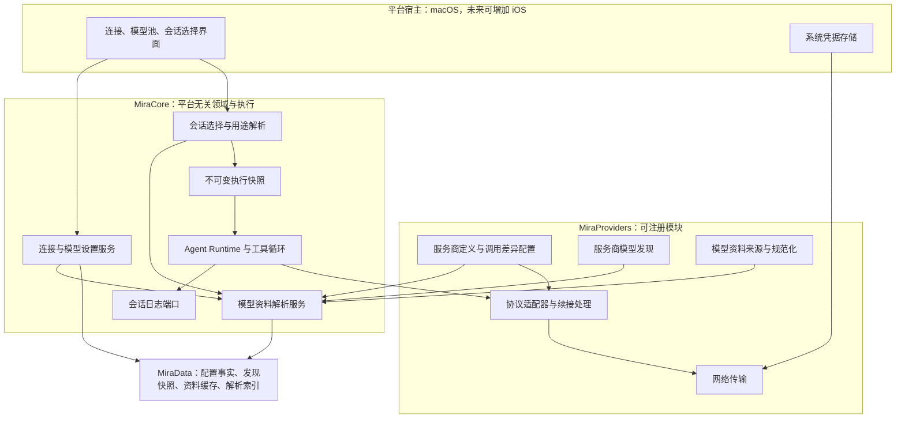
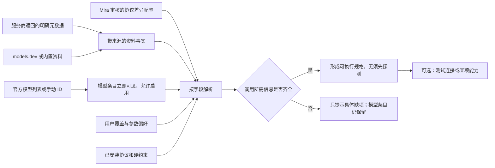
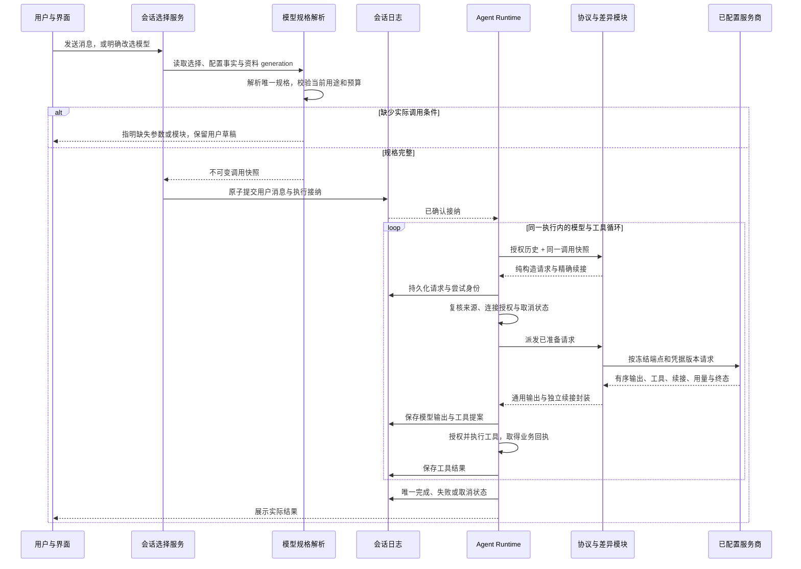

# BYOK 服务商与模型层重设计提案

<!-- Simplified Chinese design documentation follows the user's explicit language preference. -->

日期：2026-09-14。状态：**批准范围已实现，本机验收完成**。依据用户提供的「BYOK模型支持机制」讨论、后续对官方 `/models` 的澄清，以及 `codex/agent-core` 调整前源码（`aff00eb`）。本文不把引用讨论中的示例型号、接口行为或第三方项目结论直接视为规范。

实施顺序见[实施计划](../engineering/BYOK_MODEL_LAYER_PLAN.md)，实际测试、原生检查及未验证范围见[验收记录](../engineering/BYOK_MODEL_LAYER_VERIFICATION.md)。当前契约见[模型配置](AGENT_MODEL_CONFIGURATION.md)、[模型发现](AGENT_MODEL_DISCOVERY.md)、[HTTP 适配器](AGENT_HTTP_ADAPTER.md)和 [Thinking](THINKING.md)。本文保留调整前的问题分析，后文架构图与执行流程图对应批准的设计。

## 1. 结论

直接重写模型接入领域，采用：**服务商定义 + 用户连接 + 连接中的模型引用 + 调用规格 + 模型资料解析 + 会话选择 + 执行快照**。协议适配和服务商差异由模块实现，平台宿主负责凭据和界面。Agent Runtime 只消费已解析的调用计划和统一输出。

官方 `/models` 是当前连接的模型列表来源。返回的新 ID 应立即出现并允许加入模型池，不能要求内置目录先认识它，也不能要求通过一次付费探测才允许启用。模型资料补充调用所需的格式、能力与限制；已有协议可以表达的新模型无需等待 App 发版。未知信息应显示具体缺项，不能统一解释成“模型不可用”。OpenAI 官方列表文档也将接口定义为当前可用模型及基本资料，而不是完整能力描述。[官方模型列表](https://developers.openai.com/api/reference/resources/models/methods/list)

“加入模型池”是用户偏好；“执行某项任务”还要求该任务所需的协议和输入条件成立。例如图片模型可以被发现，但不能作为当前文字 Agent 的执行模型；没有上下文上限的条目可以先保存，发送前再补充这个具体限制。能力探测是可选诊断，不是正常启用的前置门槛。

无旧接口、旧表或旧数据兼容要求。核心已有正确的所有权、授权和日志语义继续作为正确性要求；若统一消息或配置契约不足，就直接修改核心契约及所有调用方。

## 2. 调整前的问题与保留的正确性原则

| 调整前实现（`aff00eb`） | 问题或价值 | 本次调整 |
|---|---|---|
| `HTTPModelFamily` 含 standard、厂商名及 Anthropic manual/adaptive | 把 API 格式、服务商差异、思考模式混为一类 | 拆为协议模块、调用差异配置和模型控制描述 |
| `PoolModelEditor` 直接枚举所有 family | 每启用模型都暴露内部选择，新增适配仍需改界面 | 普通路径自动解析；高级设置只展示当前连接可用选项 |
| `AgentConfiguredModel` 持有唯一 adapter | 同一服务端模型与某一种调用方式绑定 | 一个模型条目可以有多个明确的调用规格，预设选择其中之一 |
| `ProviderModelCatalog` 是应用内只读资源，发现结果在展示层合并 | 缺少有来源、有修订、可持久读取的统一解析结果 | 分离发现快照、元数据事实、用户选择和可重建解析索引 |
| `HTTPThinkingCapabilities` 和目录生成器依赖具体型号列表 | 新型号的 effort、预算和协议推荐可能必须改代码 | 已有行为的数据化；真正新行为才增加协议实现 |
| `AgentModelMessage` 是 text、单个 thinking、toolCalls 并列字段 | 不足以通用表达有序内容块及与可见思考无关的续接状态 | 有序输出块与独立续接封装，显示文本只是投影 |
| 配置表 connection → model → preset → binding 级联删除 | 删除被选模型会清除绑定；下一次按作用域解析时可能落到其他默认模型 | 保留选择意图和失效引用；只有用户明确改选才替换 |
| 冻结路线、原子候选读取、租约、取消排空、无隐式回退 | 是应保留的正确性约束 | 更新数据结构后重新验证，不保留旧包装层 |

当前源码入口：[协议与 Thinking 规则](../../Packages/MiraKit/Sources/MiraProviders/HTTPModelConfiguration.swift)、[模型编辑界面](../../Apps/MiraMac/Features/Settings/Configuration/PoolModelEditor.swift)、[配置领域](../../Packages/MiraKit/Sources/MiraCore/Runtime/Configuration/AgentModelConfiguration.swift)、[SQLite 配置关系](../../Packages/MiraKit/Sources/MiraData/Configuration/SQLiteAgentModelSettings.swift)、[统一消息](../../Packages/MiraKit/Sources/MiraCore/Runtime/Model/AgentModel.swift)。表中的旧删除回退来自调整前的静态分析；新实现的失效选择、不回退和删除后重建身份已加入回归，不把旧版本的推导写成运行时复现。

## 3. 对引用讨论的修正

1. **采用解耦方向，不能把服务商差异只放在基础模型上。** 官方 DeepSeek 与某网关提供的 DeepSeek 可能使用不同 reasoning 表达、认证、工具限制和价格。执行规则绑定“具体连接的模型条目 + API 格式 + 差异配置”，基础模型身份只用于资料关联。
2. **官方列表正常可用，不等于每项 Agent 能力已实测。** 保留这一区分用于诊断和证据，不能据此增加一套必须测试的启用流程。余额、限流、网络及凭据错误不是模型下架。
3. **元数据按字段和作用范围合并。** 不能对整个对象套用“override > discovery > models.dev > 猜测”。用户设置不能越过适配器硬限制；网关价格不能继承模型原厂价格；一次探测只证明它实际覆盖的行为。
4. **会话选择与执行快照必须分开。** 会话引用当前选择，但每次实际执行仍保存非秘密配置、限制、参数、价格依据和模块修订。否则目录更新后无法解释历史、重放或核对费用。
5. **同模型名称不能单独授权续接。** 还需要连接与端点、协议及续接格式、配置指纹、内容顺序、工具配对、来源授权和保留状态都满足条件。缺失隐藏状态不能靠填空字符串伪造。
6. **协议是开放注册项。** 新协议通常只需更新适配模块；若带来新的通用输出语义，再修改核心。不能声称所有新协议永远不改核心，也不能把协议类型永远封闭为四种。

## 4. 核心架构

图中为职责边界，不要求每个方框成为独立 Swift package 或后台进程。先使用现有四个 target。模型资料索引与 `RuntimeRegistry` 不同：前者描述可选择的模型，后者管理已安装、可执行的模块及作用域租约。

## 5. 领域对象与身份

| 对象 | 职责 | 关键关系 |
|---|---|---|
| `ProviderDefinition` | 服务商的内置或用户创建模板；描述连接字段、发现方式和可选协议 | 不包含用户密钥，不把整个服务商标记为支持某项模型能力 |
| `ProviderConnection` | 用户的一次实际配置，包括区域、项目或部署信息、启用状态、凭据引用 | 独立本地 UUID；同服务商可以配置多个账号和区域 |
| `ProviderEndpointBinding` | 该连接中某一协议的请求地址与认证方案 | 多协议可以共享或使用不同地址；跨目的地使用凭据必须来自用户配置 |
| `AgentModelReference` | `connectionID + modelID`，标识通过哪个连接调用哪个原始模型 ID | 不额外引入 Offering 层；基础模型资料为可选关联 |
| `ModelInvocationSpec` | 某模型条目的协议、差异配置、续接规则、参数描述和能力约束 | 一个模型引用可以有多个规格；每个规格独立有修订 |
| `ModelMetadataFact` | 来源明确的字段值与观察时间、作用范围、来源修订 | 可描述限制、能力、价格和生命周期；未知保留为未知 |
| `ModelPreference` / `ModelPreset` | 用户是否加入模型池、参数偏好和显式覆盖 | 与“官方是否列出”“是否曾测试”分开 |
| `SessionModelSelection` | 会话选择意图：继承某作用域，或明确选中某预设 | 选中项失效仍保留选择；失效不是继承 |
| `ResolvedInvocationSnapshot` | 本次调用确定的模型、协议、端点绑定、参数、限制、来源依据和模块版本 | 接纳时冻结并写日志；其中只有凭据引用和版本 |

本地模型配置记录可以具有独立 UUID，用于保存用户偏好与识别删除后重建的配置实例；这个 UUID 不代表额外的模型产品层。业务模型引用仍是 `connectionID + modelID`。

基础模型的可选关联可用于展示“由哪个模型家族提供”，但不参与自动替换、跨连接授权或续接。网关里的别名、微调模型、私有部署 ID 都是一等条目。

`ProtocolID`、`DialectProfileID` 采用有界开放标识。协议模块拥有结构化 schema 和类型化实现；未知必需协议或差异规则明确报告缺失模块，不能退回通用 Chat 请求。

参数控件由调用规格的描述符提供。新增已有参数的可选值，应能通过受约束的数据更新表达，不再由全局 `ThinkingEffort` 枚举和型号字符串决定所有选项；未知执行语义仍需模块实现，不能仅凭一个新字符串宣称支持。

## 6. 发现、资料与用户配置的合并

发现、资料补充、加入模型池和执行资格分别处理，界面仍只提供简单的连接与选择流程。

| 信息 | 合并规则 |
|---|---|
| 模型 ID、当前列出状态 | 使用当前连接完成的发现结果；内置目录缺少该 ID 不否定它 |
| 上下文、输入、输出上限 | 优先使用作用范围准确、语义明确的服务商资料；其次精确目录匹配；用户可填写实际部署值，适配器结构上限仍生效 |
| 工具、结构化输出、输入输出类型 | 分别记录声明和观察；用途资格采用声明与已实现客户端能力的交集，不强制探测 |
| 协议与续接 | 已安装模块及审核规则提供执行语义；服务商明确声明或资料提示可以选择已支持方案，不能创造不存在的实现 |
| 参数偏好 | 用户显式值优先于建议；不支持的值在保存或准备时给出准确错误 |
| 价格 | 只使用匹配实际 serving endpoint/计划的费率；未知不能显示为免费；每次执行冻结估算依据 |
| 上次调用结果 | 精确绑定连接配置、模型、协议与参数；不能覆盖其他端点、模式或能力 |

每个解析值保留采用的事实、作用范围及来源修订；被覆盖的事实仍可解释。模块硬约束先限定合法范围，再应用用户明确覆盖和作用范围准确的资料。相同优先级、相同适用范围却互相矛盾的关键字段必须形成冲突诊断，不能依赖输入顺序选一个值。时间只决定同一来源观察的新旧，不使一次普通文本成功升级成工具或 Thinking 已验证。

官方列表只返回 ID 的新模型，如果连接已经有明确通用调用规格、所需限制也能补齐，就直接可用。没有型号知识时，不根据 `gpt-*`、`reasoner` 等名字猜测强制 thinking、特定 API 或不存在的窗口大小。现有通用配置可由用户明确选择；错误信息应说明“缺少上下文上限”或“此接口尚未实现”，避免笼统的“不支持此模型”。

models.dev 当前 schema 已包含 reasoning controls、输入/输出限制、provider shape 等信息，但这些字段不是完整的可执行协议实现。Mira 应规范化所需字段，保留来源并忽略无关新增资料；不把远程 `body`、`headers`、`api`、`npm` 当作任意请求修改或代码加载指令。[models.dev schema](https://github.com/anomalyco/models.dev/blob/dev/packages/core/src/schema.ts)

资料更新建议采用本地内置快照 + 显式远程刷新，后续可在用户开启自动更新时后台刷新。启动和每次发消息不依赖网络目录可用。一次更新完整校验后原子发布新 generation；失败保留当前可用快照。发现快照保存分页完整性、连接配置指纹及时间；中途失败不把未读到的模型标记为删除。第三方资料刷新不发送用户模型密钥、私有 ID 或对话正文。

元数据可以为未来执行自动提供新建议；用户覆盖不被刷新覆盖。已配置连接的地址、认证目的地及明确选择的协议不能被远程资料静默改写；需要变更调用方式时形成可审阅的建议。元数据更新本身不取消已接纳执行。

## 7. 协议与服务商差异

删除 `HTTPModelFamily` 作为公共选择轴。当前七项应拆为通用 Chat Completions、Anthropic Messages 两个协议实现，加上 DeepSeek、Kimi、OpenRouter 等精确作用范围的差异配置。Anthropic manual/adaptive 属于同一协议的参数和能力描述。

差异实现采用受约束的输入策略、编码策略、流解析策略和续接策略；不是对最终 JSON 任意打补丁的脚本。多个策略冲突时在注册或规格解析阶段拒绝，不能依赖激活顺序决定谁覆盖谁。协议与差异参数都由冻结规格提供，运行中不重新查最新目录。

例如 DeepSeek 直连的 Chat 请求使用其 `reasoning_content` 规则；OpenRouter 的 Chat 接口使用网关定义的 reasoning controls 和 `reasoning_details`。即使后端模型同名，也不能直接套用直连编码。[DeepSeek Thinking](https://api-docs.deepseek.com/guides/thinking_mode/) · [OpenRouter reasoning](https://openrouter.ai/docs/guides/best-practices/reasoning-tokens)

**Responses 应是本次模型层重写的优先实现项。** 当前 OpenAI 路径仍是 Chat Completions。官方迁移说明明确区分 message 与 item 结构，并说明较新模型在 Chat 中的 thinking/tool 组合有限制；更换 family 名称无法获得 Responses 能力。新增适配必须覆盖有序 items、函数往返、流终态、usage 和隐藏续接。[OpenAI 迁移说明](https://developers.openai.com/api/docs/guides/migrate-to-responses)

Responses 默认采用 Mira 本地管理历史、显式 `store: false` 的方案；需要的 reasoning items 随本地受保护正文保留并在授权后回放，不把远端 response ID 当作会话唯一事实源。具体返回和回传字段以适配时的官方协议为准。[OpenAI reasoning](https://developers.openai.com/api/docs/guides/reasoning)

Google 原生协议也应独立注册，但不为凑固定数量提前创建空模块。当前官方文档已把 Interactions 列为新项目推荐接口，generateContent 仍支持；它们具有不同续接结构，不能都塞进模糊的 `google-genai` 身份。计划将 Google 接入列为后续独立增量，届时选定具体 API 并验收。[Google Interactions](https://ai.google.dev/gemini-api/docs/interactions-overview)

## 8. 统一输出与续接契约

核心应表达有序的通用内容块，例如文本、可见思考、工具调用及工具结果；流事件使用稳定 block ID 和追加/完成语义。界面展示和普通检索可以派生累计文本，但不能把扁平化显示值反向作为完整协议历史。

续接应从“可见 thinking 的可选附属字段”提升为独立、适配器拥有的封装：

- 它可以存在而没有任何可见 thinking。
- 记录来源调用快照指纹、协议与格式修订、原始有序 items/blocks、完整性，以及与规范内容的对应关系。
- 协议只解析自己的封装；核心负责大小、持久化、保留组、授权和生命周期，不理解厂商签名。
- 当前工具循环必须保留完整前缀、原始块和配对关系。公开文本相同不代表签名可以移到另一条消息上。
- 缺失了必需续接就停止该续接或排除不合格历史；不能关闭 thinking、补造签名或用空字符串冒充丢失的推理内容。

Anthropic 要求工具往返中的 assistant 内容和 thinking 保持完整；Gemini generateContent 的签名还可能附着在特定 functionCall part 上。这说明独立续接封装及块顺序是跨协议能力需要，而不是为已有字段做兼容包装。[Anthropic 工具与 Thinking](https://platform.claude.com/docs/en/build-with-claude/thinking-tool-workflows) · [Gemini 签名](https://ai.google.dev/gemini-api/docs/generate-content/thought-signatures)

跨模型或跨协议切换在执行边界发生。保留本地历史显示，并根据新适配器规则构造可移植上下文；隐藏状态不默认跨连接发送。规则还需覆盖检索前缀变化、来源撤销、压缩、分支和导入后的资格；“相同 model ID”只是其中一个条件。

新增通用内容块会影响输出累积、草稿、正文保留、日志归约、历史读取和 UI 投影，必须成组修改。这是核心契约升级，不应为了维持旧 `text + thinking` API 而塞入更多隐藏补丁。

## 9. 会话选择、下架与删除

会话内容不依赖实时模型目录。用户选择模型的事件写入会话日志，表示选择意图；全局和工作区的默认选择仍是配置领域事实。会话选择的 SQL 展示缓存从日志重建，不能成为第二份写入权威。

选择有两种语义：`inherit` 和 `selected(reference)`。解析结果可以是就绪或带明确原因的失效；失效的 selected 不能被当作 inherit。用户明确选择“使用默认模型”时才进入继承路径。一次接纳还记录实际继承来源及最终冻结规格，后续默认值变化不改旧执行。

移出模型池只改变用户偏好；移除连接或模型配置会使关联选择失效，但保留不含密钥的身份记录或历史名称快照。删除不能级联删除会话选择，不能使它自动转用工作区或全局模型。首次建立选择的事件与首条消息/执行接纳应通过同一日志批次提交；独立改选也通过串行会话命令写入，重试使用稳定命令 ID。

正常发现刷新继续更新同一个条目身份。用户明确移除后再创建同名远程 ID，则产生新的配置身份；不能因字符串相同就复活之前已失效的会话选择。

官方列表明确列出时按可选模型处理；完整刷新后缺失只表示“当前列表未列出”，并不自动证明全球下架。明确生命周期资料、当前端点的结构化错误和最后成功记录分别保留。请求错误至少区分认证、额度、限流、网络、模型/部署不存在、协议不支持和参数错误；含糊的 404 不能直接解释为模型下架。

用户在模型失效后可选择新模型继续。换模型是新的选择事件和新执行，不能恢复执行已经产生副作用的旧工具步骤；程序不得偷偷重试另一模型。历史回复仍显示当时的模型名称、协议和费用依据。

## 10. 发送执行流程

每个模型尝试、发现和资料刷新都由应用工作组拥有任务、期限和取消排空。禁止模型适配器直接创建未登记后台任务。模块在库作用域激活；执行持有准确目录快照及租约，直到实际网络与工具操作排空。

模型资料刷新、显示改名和价格资料更新不应使当前请求改道。凭据撤销、连接禁用、端点安全配置变更及来源权限撤销仍可停止后续派发；不能以“已经冻结”为由绕过授权。执行语义修订、显示修订与授权修订应分开，而不是比较整个配置对象的所有字段。

## 11. 包边界与直接替换范围

| 位置 | 目标职责 |
|---|---|
| MiraCore | 通用模型条目、事实来源、参数描述、选择与解析服务、冻结计划、有序输出、续接保留及端口 |
| MiraProviders | 服务商模板、models.dev 规范化、发现实现、协议编解码、差异策略、价格归一化、合成能力探测 |
| MiraData | 配置事实和选择偏好存储、完整发现快照、资料缓存、可重建解析索引、失效身份、相关归档与隐私契约 |
| MiraMac | Keychain、网络模块组装、设置与会话展示、原生生命周期；不硬编码型号与协议 family |

应直接替换 `HTTPModelFamily`、型号分支、`AgentConfiguredModel` 的单适配器关系、当前目录合并方式、模型表单和级联选择关系；统一输出契约按第 8 节升级。旧模型配置与旧会话格式不保留解码器。删除开发数据只在实际实施格式切换时按项目授权执行，格式切换会按已授权范围重建开发运行库，保留 Keychain 凭据。

可继续满足的核心原则是 Foundation-only、显式模块注册、日志权威、原子接纳、冻结执行、工具权限、取消排空、无隐式模型回退；保留的是这些语义，不是现有类名和表结构。

## 12. 对用户操作的最终影响

正常流程应是：**添加服务商/地址和密钥 → 获取模型 → 勾选启用 → 对话**。资料自动补齐，已知模型无须逐个选择 HTTP family、声明工具能力或手动应用目录建议。模型测试作为单独可选操作。

自定义连接在无法确定时选择一次 API 格式；一个连接确实提供多协议时，每个模型可在高级设置明确覆盖。普通思考设置按模型显示模式、强度或预算。缺少配置时展示可操作的具体字段，保存与启用不等于已经完成所有用途的调用条件。

新增模型只需要数据的前提是：现有协议、差异规则和内容语义已经能表达它。新的 API 编码或续接规则需要模块更新；真正新的通用内容语义需要核心契约升级。这个边界比“永远不用发版”更准确，也不会让当前实现限制未来架构。
