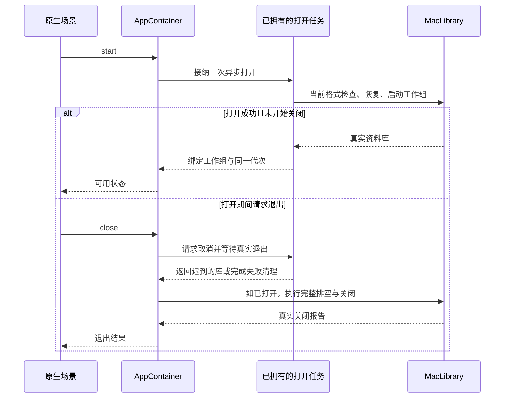

# macOS 应用启动与展示层接入

<!-- Simplified Chinese documentation is explicitly requested by the user on 2026-09-12. -->

新的 `AppContainer` 只拥有应用级资料库生命周期。它已直接替换旧 `MiraApplication` 聚合门面，能够在独立组合测试中打开、观察和关闭真实 `MacLibrary`；原生 `MiraApp` 场景、会话、记忆与 Data 设置已直接改写，Provider 设置调用方继续切换，当前整应用构建尚未通过。本契约不把独立组合验收当作原生界面验收。

## 启动与退出所有权

`MacLibraryLaunchConfiguration` 在创建存储和平台适配器之前解析启动模式与路径。显式数据路径必须为绝对路径且只能指定一次，无效参数直接形成启动错误，不回退到默认库。普通启动先读取宿主选择；尚无选择时使用 Application Support 下的 Mira 目录。已选库及 pending 切换的行为见[资料库设置与切换](MAC_LIBRARY_SETTINGS.md)；Debug 演示默认使用新建的随机临时目录，也允许明确的数据目录。Release 构建拒绝演示和渲染基准入口。性能构建要求明确演示模式，渲染基准还要求全新的数据目录、尚不存在的报告和可写的报告父目录。

启动由容器接纳一次并拥有实际任务，多窗口的等待合并到同一任务；某个窗口取消等待不能丢弃已开始的库打开。关闭立即撤下可用工作组，拒绝再次启动，请求取消打开任务，并等待其真实退出。如果不响应取消的打开器迟到返回一个库，关闭仍负责排空该库，不能因开始退出时 `library` 为空而直接报告完成。重复关闭共享同一结果。明确切换库的任务同样由容器拥有，关闭等待切换返回后才捕获最终库并排空；此前任何未结算关闭结果继续进入最终退出报告。

`MacLibrary.binding()` 在一个 actor 执行片段中同时捕获资料库状态和对应工作组，防止先读取代次、再等待工作组时发生维护切换而混用两个代次。容器观察合并状态流，在维护时撤下旧工作组，在恢复 ready 后安装新的绑定。容器关闭之后不能被迟到观察重新置为 ready。展示层不得把旧工作组永久保存为整个应用的运行时，也不得通过容器恢复旧命令、旧查询或 Provider 聚合接口。

`MiraAppDelegate` 在原生场景启动前持有容器，以一个拥有的任务响应 AppKit 终止请求；重复退出不会创建第二次关闭。它等待迟到打开、执行排空和物理库关闭后才回复 AppKit。完整关闭成功时直接退出；未能完成结算或存储关闭报错时显示实际关闭结果，让用户决定退出并重新打开，或暂时保留已关闭的窗口。不能把已关闭的库重新标记为可用，也不能因缓存的失败报告永远阻止用户退出。

会话窗口已直接使用新库绑定、会话查询和实时输出；其任务、命令身份及页面缓存规则见[会话展示层契约](MAC_CONVERSATION_PRESENTATION.md)。完整原生场景与剩余调用方继续切换。

## 显式本地演示模块

`MacDemoModule` 只在 Debug 编译。它注册独立的模型适配器与配置描述符，通过同一个默认驱动器、日志、来源授权和模型操作接口执行；生产 HTTP 模块不会在演示模式自动装入，网络失败也不会触发演示回退。演示宿主注入独立的拒绝凭据实现和无系统副作用的通知实现。

演示配置采用固定身份，仅对准确的当前演示记录补齐尚未完成的连接、模型池预设及用途绑定；其他配置不会被覆盖。这是当前格式下未完成初始化的恢复，不是旧格式迁移。种子配置必须完成后才能发布可交互工作组，失败则关闭实际库并报告启动错误。演示流提供 Markdown 和独立可见思考，模型操作的关闭会取消并等待真实生产者；准备阶段按编码字节和协议余量执行保守输入预算校验，压力样本使用明确的本地输出额度。

## 工作区编辑与费用显示

`WorkspaceEditor` 使用 `WorkspaceApplication` 和宿主窄设置接口；`@State` 只拥有一次初始化的 `@MainActor @Observable` 编辑模型。连接读取上限为 128，旧请求或已离开的展示不能安装迟到值。当前编辑器只读取打开时的有界连接快照；跨窗口配置变更通知仍待统一接入，不能把一次加载当作完整设置订阅。创建草稿使用稳定 ID，保存按准确基线递增修订；成功提交即更新本地基线，即使此时界面已取消，也不能把下一次保存当作另一次创建。服务保留已接纳写入的所有权，界面失效只抑制错误和关闭回调。

费用组件直接接收新 `AgentModelRoute`，估算与未知原因来自 Provider 模块；没有把 HTTP 价格规则放回核心。相关宿主费用格式化断言随实际模块归属更新。工作区编辑及费用组件的编译、模型测试与原生视觉检查必须分别记录；本轮没有运行未完成的 App。

验证命令和剩余缺口见[核心重建验证记录](../engineering/AGENT_CORE_VERIFICATION.md)。

## 本地扩展夹具

`MacBenchmarkModule` 仅在 Debug 且通过显式 demo／全新目录／报告路径校验后注册。它通过公开 `AgentDriver` 返回确定性本地回答，使用真实应用接纳、结算和查询服务生成会话历史。新增 Driver 没有修改内核或恢复旧数据库写入接口；它不使用凭据、网络或系统通知。

原生性能入口保留挂载列表、输入区域、滚动、布局及会话切换检查。固定等待时间只记录观察区间，不冒充输入延迟或帧率；当前本地 Driver 一次返回完整回答，不能据此宣称测量了流式性能。正式规模、分布和原生运行结果仍单独验收。
