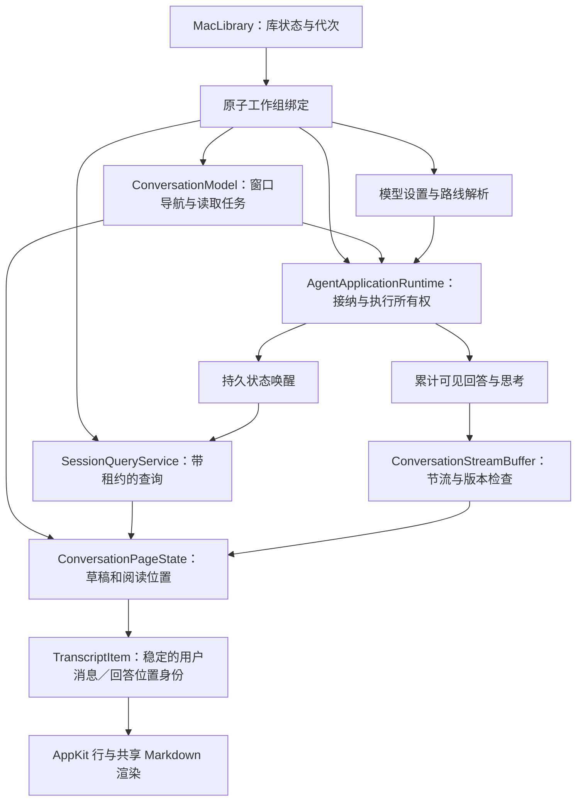
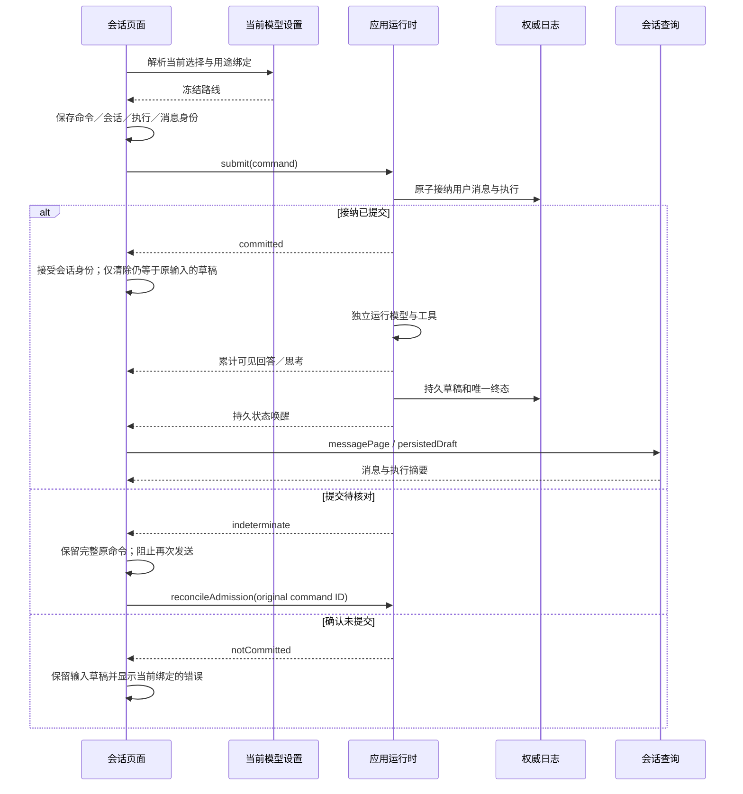

# macOS 会话展示层

<!-- Simplified Chinese documentation is explicitly requested by the user on 2026-09-12. -->

窗口通过 `MacLibrary.binding()` 获得当前工作组。`ConversationModel` 拥有导航、页面缓存和读取任务；`AgentApplicationRuntime` 拥有已接纳的发送与执行。会话消息直接采用 `SessionQueryMessage`，执行状态直接采用 `SessionExecutionSummary`，不恢复旧的 `MiraApplication`、SQL 会话模型或 Provider 私人重放对象。

本层已经从旧接口改写，并纳入独立组合测试。执行检查器和引用面板正在接通带租约的新读取接口；完整原生场景与设置尚未统一切换，因此本契约不能作为 App 已经可用的证据。验收结果与缺口见[核心验证记录](../engineering/AGENT_CORE_VERIFICATION.md)。

## 核心架构

页面中的字符串是已经交付给宿主的副本。库进入维护、关闭或发生工作组更替时，窗口立即撤销绑定，取消读取与订阅，清空消息、持久草稿、实时文本、思考展开缓存和测量缓存。旧任务携带绑定及页面观察身份，迟到的结果不能安装到新工作组。取消后的实际读取任务由展示层拥有并排空；排空不阻塞库状态通知的继续处理。

窗口观察结束不会调用运行时取消或关闭资料库。关闭资料库仍由应用容器负责。只有用户的停止操作调用 `application.cancel(sessionID:)`。

## 接纳与执行流程

`committed` 表示接纳批次已持久化，不表示模型已完成。界面从终态摘要判断完成、失败、取消或中断。用户重试使用新的执行身份，引用原用户消息，清除旧回答、思考与续接数据后从头生成；清理未确认时仍保持待核对状态。保存重试只调用 `retrySettlement`，不能再次运行模型。接纳、删除与恢复的边界见[应用运行时](AGENT_APPLICATION_RUNTIME.md)。

页面保留待核对命令所属的运行时身份。工作组更替后，新的运行时已经完成恢复；页面先读取权威会话状态，核对执行及接纳批次身份。已提交的原命令只接收结果，不重新提交；确认未接纳时保留用户草稿。不能依据侧栏是否出现标题判断提交结果。调用方取消或页面切换后返回的已提交结果仍保留命令身份，正文读取则重新使用当前绑定。

## 页面、分页与实时输出

- 默认保留三个已打开会话的正文页面。淘汰只释放可重读内容，保留页面身份、输入草稿、模型选择及阅读几何；活动页面、正在发送和待核对页面不能淘汰。
- 侧栏按工作区分页，每次最多 128 个会话；消息每次最多 128 条。加载更早消息会按身份去重，普通最新页刷新保留已加载的更早内容。更早页的会话 head 与当前页面不同则重新刷新，避免把不同前缀的状态混装。
- 工作区与归档筛选变化触发新的查询代次。外部引用跳转到侧栏之外的会话后，实际会话摘要决定当前工作区和归档筛选。
- 应用观察是合并的唤醒提示，当前侧栏刷新调用 `synchronizeLibrary()` 后查询当前工作区。它不是逐 token 通知，但大库的全库追赶成本仍需规模测试；尚未宣称通过性能门槛。
- 最新执行即使没有产生助手正文，也必须出现在查询页的执行摘要中。失败重试不能因缺少助手消息而消失，页面据此保留正确的失败状态和再次重试目标。
- 助手回答行的展示身份属于原始用户消息的回合：重试接纳使用同一个 `userMessageID`，因此运行中、成功、失败和重新打开页面时都复用同一个回答行。查询页和执行审计保留必要的执行、尝试和终态元数据，旧生成正文已经删除；页面只选择该问题最新执行的可见正文或无输出终态占位。分页外尚未加载的真实正文不显示为空回答。分页合并按消息身份去重，独立用户消息拥有独立回答行。
- 实时缓冲包含可见字符串、当前输出阶段、待完成工具调用摘要与尝试身份。它在接收时检查会话、日志序号和内存修订；拒绝倒退、跨会话和关闭后的数据。已接受的空值立即取消待发布内容，`clear()` 是显式重新绑定边界。
- 草稿与结算回答使用同一个用户回合回答行身份；行内仍保留当前可见内容所属的 `executionID`。成功尝试的持久交接标记允许页面保留最新已交付正文，直到对应游标的草稿或终态查询原位接替，避免先清空再恢复。普通撤销仍立即清空。只有正文、思考、角色或清理状态变化才使 Markdown 内容缓存失效；完成状态本身不重建正文，末尾文字已有的淡入自然结束。被清理的正文显示清理状态，不能回退到缓存中的回答或私人思考数据。
- macOS 26 的会话标题属于 detail pane 的本地坐标，侧栏展开时标题栏 safe-area bar 的 leading inset 为 16 pt；侧栏收起时仅额外避让原生窗口按钮。右侧 inset 仍按原生 toolbar 控件测量，检查器显示和窄窗口保持 pane 内的左对齐，原生窗口按钮和 toolbar 行为保持不变。
- 助手行不使用 Mira 头像作为重复身份标记。行首状态行显示当前阶段及最新可见摘要：实时阶段从 `thinking` 切换到 `answering`，工具调用显示工具名和有界参数摘要；状态行可展开查看可见 thinking 与工具活动。历史活动只使用已持久化的可展示字段。
- 取消或中断没有完成正文时，保留已产生的可见回答／thinking 作为同一回答行的未完成内容，供用户继续或重试；不回放未完成的工具调用，不把 opaque、签名或不可读的续接数据渲染为正文。完成、取消和中断的状态由终态摘要区分。

## 原生入口与剩余接入

The shared `MiraMarkdownView` prepares formula images before handing content to MarkdownView. Formula images must have finite, positive dimensions and yield a `CGImage`; successful images become bitmap-backed template images before any native line drawing. Failed images keep their original LaTeX text and use the renderer's text fallback. The prepared content retains blocks, highlight maps, locale, and all replacement identifiers, including across native table and syntax-highlighting rebuilds. This presentation boundary applies to answers and expanded thinking without changing stored model output. See [formula rendering verification](../engineering/MATH_RENDERING_VERIFICATION.md).

`ConversationRoot`、消息列表、原生行、执行检查器及引用直接采用新会话和领域服务。原生场景已改为由 `AppContainer` 异步打开库；审批面板显示模块提供的完整原始提示，允许／拒绝提交给绑定提案摘要、授权代次和到期时间的一次性服务。旧记忆专用审批视图已经删除。[记忆编辑与捕获设置](MAC_MEMORY_PRESENTATION.md)也已直接接入。Provider／Data 设置已直接接入；当前 BYOK 重设计的原生与构建证据见[实施记录](../engineering/BYOK_MODEL_LAYER_VERIFICATION.md)。

失败条显示终态摘要、执行详情入口和可用的重试操作；详细错误和冻结请求由执行检查器读取。模型菜单显示当前模型标识与连接名称，无效候选不会进入选择列表，发送仍重新解析实际用途绑定与冻结路线。侧栏支持加载更早会话。

历史记忆变化原因与引用授权需要各自的领域读取契约，不能根据旧 SQL 行或仅凭模型输出中的引用标记推断。当前页面未伪造这些历史原因。跨窗口业务变更通知已有接入，大库追赶与分页性能，以及完整原生的浅色／深色、最小窗口、中英文、取消、阅读位置和引用交互仍是验收项。

## 可撤销的执行审计与引用

`MacSessionReadModel` 同时观察实际库生命周期、会话持久状态和[业务提交通知](AGENT_BUSINESS_CHANGES.md)。每次重新读取前清空旧值；读取结果只有在观察身份、库代次、工作组绑定和读取身份都仍有效时才可安装。取消的实际查询继续由模型拥有并排空，不阻塞库生命周期循环，不取消运行时执行。

知识与记忆引用按钮、已打开的引用面板均使用该读取模型。工作区由当前权威会话快照解析，再交给领域服务证明引用确实属于该执行并复核当前授权；模型输出中的引用标记本身不构成可读许可。业务编辑会触发重新读取，库维护或关闭先清空正文。

执行检查器展示实际冻结路线、尝试开始时间、记录的请求顺序、思考／模型输出及工具参数和结果。每页最多 32 次尝试，按事件序号读取更早页；逐次调用费用使用该执行的冻结路线。当前没有把分页中的部分调用费用合计冒充整个执行的费用，完整执行费用汇总仍待接通。完整原生窗口的布局、阅读位置、浅色／深色与中英文交互尚未因读取测试通过而完成验收。

## 会话选择

模型选择来自当前应用运行时的日志归约快照及其独立修订。明确选择保留预设、连接、原始 model ID 和配置实例；配置失效时展示不可用，不能选取列表第一项替代。恢复继承是显式命令。首次发送携带可选选择变化，在一个接纳批次中保存选择、用户消息和执行。页面缓存和设置刷新不能覆盖未保存的用户选择。

## Ordered multiround process presentation

An assistant turn retains ordered `SessionActivityStep` values keyed by model-attempt identity, with thinking, text, and correlated tool blocks in provider order. Each tool keeps independent full argument and result content plus its journal lifecycle status. A live attempt overlays only its own block identities; it never replaces preceding rounds. The current live observation contains that attempt's visible blocks, without opaque continuation or request data.

Running turns show reasoning, intermediate text and tool rows chronologically, without a duplicate turn-level process header. Each reasoning/tool block has its own disclosure; reasoning uses the latest line while thinking and the first line after that block settles. Reasoning summaries disappear while their full text is expanded. Generic tool rows retain their inline summary when expanded and expose one Input/Output card with a divider, selectable monospaced content, and independently scrollable sections capped at 150 pt. Disclosure arrows follow the label and appear on hover or keyboard focus. Overflow uses a trailing arrow over a transparent-to-canvas gradient without shifting text. Disclosures use native-proportion SF Symbols `chevron.right` when collapsed and `chevron.down` when expanded. Tool triggers use `wrench.fill`, with `xmark.circle.fill` for failure and a shared failure tint on the failed trigger text and leading symbol; the disclosure chevron remains neutral. JSON input/output removes only whitespace outside strings for display, preserving number and escape spellings; each JSON section is a single horizontally scrollable line. Non-JSON sections retain their line breaks and vertical scrolling. Wheel routing follows the overflowing axis so vertical transcript scrolling remains available over a single-line JSON section. Stored content is unchanged. Once the turn settles, the process collapses into a count summary, including reasoning from the final model round. Only trailing answer text from the last non-tool step remains outside the process. Opening the process restores the ordered rows. Block disclosure state belongs to the page reading state and is cleared at the library/page content boundary.

Native block views and prepared Markdown are reused by attempt/block identity and actual content. Persisted `AgentModelBlockContent` uses explicit native JSON block objects with `type` equal to `text`, `thinking`, `tool_call`, or `tool_result`, plus the corresponding text/call/callID fields; readers can inspect these native JSON blocks without depending on Swift synthesized enum payload keys. Ordered block and provider-continuation semantics remain unchanged. Completing a turn does not remount its final answer. Hidden process views release their rendered content; purged fields do not reuse old prepared content. A failed optional activity read can report its storage error while still displaying the available ordinary message snapshot; authorization and cancellation failures remain binding boundaries.

## Model picker and new-conversation defaults

The app requires explicit `oneTimeCode` content types for macOS Security Code AutoFill (`NSAutoFillRequiresTextContentTypeForOneTimeCodeOnMac = true`). General conversation text must not initialize the system OTP suggestion panel on first focus. This does not disable input methods or ordinary text editing.

The composer opens a compact provider-grouped native menu and shows the selected model's display name. `ConversationModel` initializes a new draft from its fixed purpose binding or the host's follow-last preference, then submits a concrete journal selection with the opening message. Explicit picker actions own selection changes; observation-driven property updates do not issue selection commands. A failed or uncertain existing-session selection does not update the remembered model. See [model configuration](AGENT_MODEL_CONFIGURATION.md#macos-new-conversation-model-policy) for scope, persistence and unavailable-reference behavior.

## Code viewport geometry

The local MarkdownView source dependency reserves the same capped intrinsic height that its code view occupies. The code text retains its full natural size inside a two-axis native scroll view, and a separate clipped gutter tracks vertical offset. `MiraMarkdownStyle` supplies the shared maximum-height token. The transcript event monitor yields the dominant scrolling axis to an overflowing `conversation.codeBlock`; short blocks retain outer transcript scrolling. See [code viewport verification](../engineering/CODE_BLOCK_SCROLLING_VERIFICATION.md).
