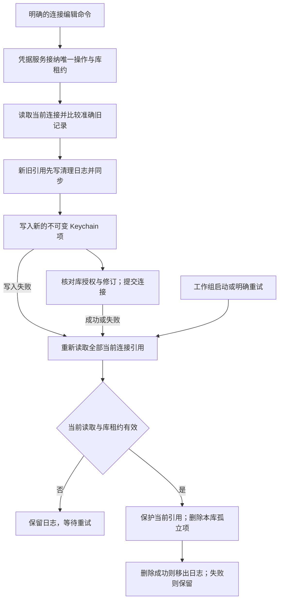

# macOS 凭据设置与跨存储清理

<!-- Simplified Chinese documentation is explicitly requested by the user on 2026-09-12. -->

本契约定义新工作组的 `MacCredentialSettings`。核心配置只保存 `AgentCredentialReference`，不认识 Keychain；`MacCredentialStore`、Keychain 读写和本地清理日志都属于 macOS 模块。宿主必须显式注入凭据存储，测试使用合成实现。连接展示模型直接持有当前资料库，通过此服务异步读取凭据并保存准确旧记录；显式草稿检查走独立的[合成探测执行器](AGENT_MODEL_PROBES.md)。

## 所有权与接口

`MacLibraryWorkloads` 创建凭据服务，并在模型设置服务关闭前排空它。每次只接纳一个凭据命令或读取，后续竞争请求明确返回 busy；没有无界等待队列。连接名称、启用状态、非秘密配置和凭据变化通过同一次保存提交。读取和更换密钥必须明确 endpointID；一个端点的密钥不会复制到其他端点。未编辑端点保留自身引用，删除端点的旧引用进入清理日志。服务从准确的旧记录推导新修订，存储事务再次执行修订比较和库授权检查。只有端点／凭据或启用变化推进连接授权修订，名称、资料与默认模板编辑只推进配置记录 revision。

宿主涉及凭据引用的创建、保留、替换和删除必须经过这个服务。工作组对外仅提供 `MacModelSettings` 窄接口，不包含连接保存／删除和服务关闭；完整应用服务只由组合根和凭据服务持有。接口收窄防止普通调用方绕过唯一写入者，并非对恶意进程内向下转型的安全沙箱。只修改模型、预设及用途绑定不需要 Keychain。

已接纳写入不随界面等待者取消而丢失所有权。关闭或维护可以取消尚未提交的工作，但必须等待真实 Keychain 调用和数据库操作退出；不响应取消的系统调用仍由工作组持有。已成功提交的配置按真实结果返回，清理失败通过独立的 pending 状态表示。读取密钥前后都核对准确的当前连接记录，并在返回前复核库租约；取消或撤权后的迟到密钥不得返回。

## 保存与恢复流程

图示导出：[SVG](diagrams/mac-credential-settings.svg) · [PNG](diagrams/mac-credential-settings.png)。

Keychain 和 SQLite 不构成一个事务。先将新旧引用落盘，再写新密钥，最后保存配置，可以使重启区分已提交引用与孤立密钥。配置提交返回错误本身不能证明没有提交，因此异常路径也必须重新读取当前权威记录；禁止直接按“保存抛错”删除新密钥。当前连接集合上限为 128，单次有界读取可得到完整保护集合。删除连接也先记录其旧引用，再执行配置删除和清理。

清理启动失败不阻止无关会话恢复或资料库打开；状态保留固定安全诊断，宿主可显示并重试。没有可用当前配置快照时不删除任何 Keychain 项。日志本身写入失败则不能开始创建新密钥。

## 本地日志与目录隔离

`credential-cleanup.json` 只包含格式版本、规范库 ID、目录命名空间及引用／版本，最多 1,024 个去重条目、1 MiB；不保存密钥或连接正文。命名空间由规范库 ID 与解析后的物理目录路径生成，凭据引用另包含随机 UUID。复制目录不能获得原目录的清理所有权，其他命名空间的输入引用不会入队。日志头或条目不匹配、内容损坏或超过容量时，清理在任何密钥删除之前失败。

写入使用固定临时文件 `credential-cleanup.json.next`、0600 权限、文件同步、原子替换和目录同步。只允许普通且没有其他硬链接的日志文件；不跟随符号链接。启动丢弃替换前遗留的临时文件，继续读取已发布日志。只有已完成日志发布的保存操作才允许继续 Keychain 写入，所以不需要从半写临时文件猜测提交。全部清理完成后删除空日志，并同步目录。同步使用 `fsync`，未声称任意物理断电或恶意同用户进程竞争下的隔离保证。

正式归档不导出本机清理日志或 Keychain 内容；独立目录恢复会停用连接并移除凭据引用。重新激活由新的目录所有者创建新引用。历史开发数据按用户授权直接删除，不增加旧日志解码或数据迁移路径。

## 验证边界

组合验收使用真实新资料库和合成凭据存储，覆盖保存、冲突、取消、关闭及重开。平台适配器测试使用 Keychain API 替身，不访问真实 Keychain。具体结果见[验证记录](../engineering/AGENT_CORE_VERIFICATION.md)。原生设置交互、真实锁屏下 Keychain 行为和恢复副本激活尚未验收。
