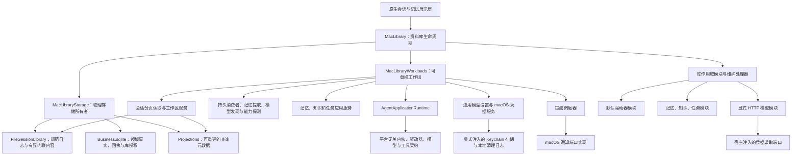
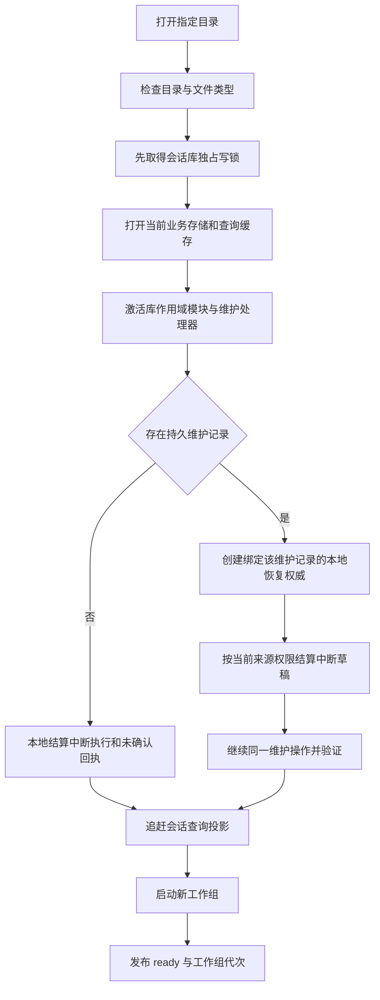
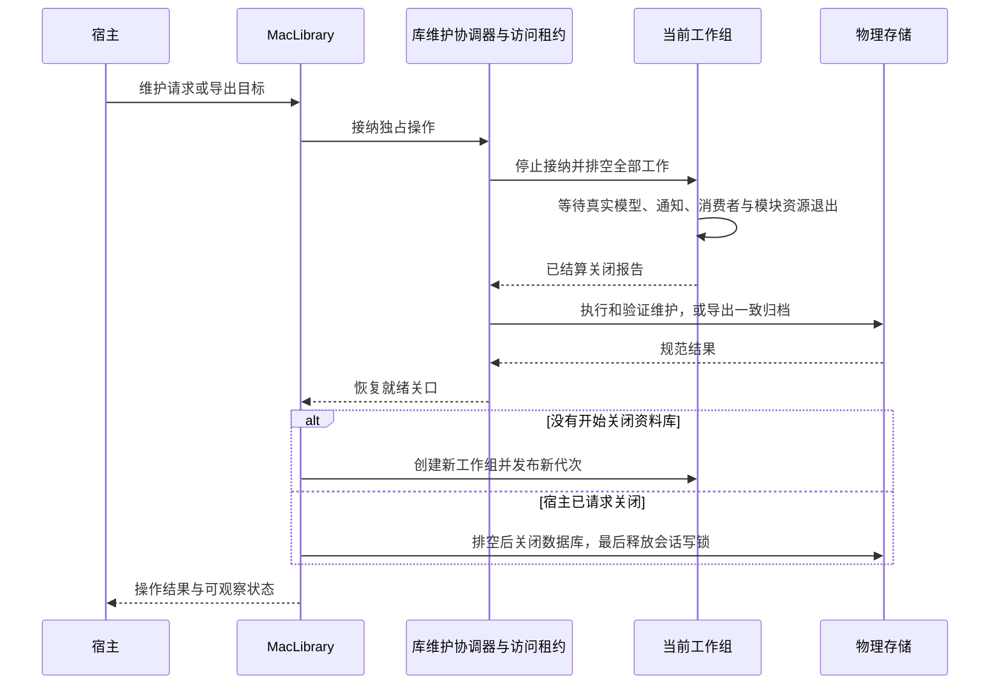

# macOS 资料库与工作组组装

<!-- Simplified Chinese documentation is explicitly requested by the user on 2026-09-12. -->

本契约描述新宿主的资源所有权与启动、维护、导出和关闭流程。`MacLibrary`、`MacLibraryStorage`、`MacLibraryWorkloads` 已实现并有独立的 `MiraCompositionTests` 组合验收；新的 [AppContainer](MAC_APP_LIFECYCLE.md) 已直接拥有库生命周期，原生会话与记忆入口已改写，[Data 设置与库切换](MAC_LIBRARY_SETTINGS.md)已接通，[能力探测](AGENT_MODEL_PROBES.md)由工作组拥有，Provider 设置及完整原生验收仍在进行，不能据此宣称原生应用已可用。iOS 本轮不实现。

## 核心与宿主的边界

内核仍只导入 Foundation，不认识 macOS、HTTP 家族、Keychain、通知或文件路径。`MacHTTPModule` 是明确选择的宿主模块，注册模型、配置 schema 和发现适配器；激活时不读取凭据、不发送请求。测试模型只能由调用方显式提供模块，没有生产自动回退。

领域源权威和维护处理器属于库作用域，生命周期覆盖多个工作组。工作组的应用运行时、会话查询、工作区与模型设置服务、消费者、后台提取、模型发现、提醒、审批和调度器在维护或导出时整体排空，之后按新的访问代次重新创建。业务存储不会因工作组更换而关闭或复制。

`MacLibrary` 不复制会话命令、领域 CRUD 或模型请求 API。展示层应取得当前工作组的应用服务和查询服务；维护之后需要重新绑定新工作组。`generation` 标识工作组更换，状态观察流合并到最新状态。已关闭工作组不能继续接受领域操作。

`queries` 提供带正文租约的会话分页、明确同步与持久可见草稿读取；`workspaces` 提供工作区列表、读取和修订比较保存。`modelSettings` 提供有界配置读取、修订比较写入及当前模块描述符／路线解析，见[模型设置应用边界](AGENT_MODEL_CONFIGURATION.md#存储应用与宿主边界)。工作组的 `modelSettings` 仅暴露查询及模型／预设／绑定写入；连接写入统一由 `credentialSettings` 拥有，见[凭据设置与跨存储清理](MAC_CREDENTIAL_SETTINGS.md)。这些服务在工作组打开中途失败及正常关闭时均排空，旧工作组引用在维护／导出后拒绝新操作。[会话读取契约](AGENT_SESSION_READS.md)定义原子页面和容量边界。当前消息页自动追赶所选会话，侧栏刷新需要宿主显式同步；实时 token 展示通过应用运行时独立的[可见输出流](AGENT_LIVE_OUTPUT.md)取得。

## 打开与恢复流程

会话写锁必须先于业务数据库初始化取得，持续持有到业务数据库和查询数据库关闭之后。打开中途失败按逆序排空已建立的资源，不能留下阻止后续重开的写锁。新目录只接受当前布局，不读取、转换或迁移旧会话格式。自动删除任意传入目录不属于打开语义；用户授权的旧开发库清理与新库打开分别处理。

恢复不持有模型、工具或平台执行能力，只消费日志、正文和业务回执端口。已提交业务操作不会在重启时再次执行。应用运行时在恢复与维护完成之前不对外发布。

### 维护期间的本地来源验证

普通 SQL 读取在存在持久维护记录时被阻止。这种库级阻止不能被解释为每个具体来源都已撤销，否则会使无关会话的回答和思考草稿被错误清除。

`SQLiteDomainDatabase.recoveryRead` 在只读事务内核对**完整、准确且仍未完成的维护记录**。独立的恢复权威只允许 `.local`，依然检查工作区、领域命名空间、对象修订、生命周期和知识文件完整性。它们复用原有领域验证，不开放普通读取、业务写入、工具或模型调用。

记录不匹配、维护已完成或存储已关闭时，恢复权威失败，且不得返回表示确定撤销的 `.unauthorized`。真正的来源撤销继续按内核结算规则抑制答案与思考。来源目录和策略只在本次恢复作用域中存活，排空后即释放，不成为常驻绕过权限的入口。

## 维护、导出和关闭

调用方取消不能丢弃已经接纳的维护／导出。关闭等待该操作及真实资源排空，不在关闭过程中重新启动工作组。若执行结算仍不确定，维护拒绝进入清理步骤；状态保留失败，不能把未排空的工作当作成功。导出失败不覆盖既有目标，并在库关口已经恢复时重新启动工作组。

提醒在宿主组合中使用“规范资料库 ID + 物理目录”生成平台命名空间。恢复或复制到另一目录可以保留规范库 ID，但不能删除或覆盖原目录仍拥有的系统通知。此处只定义通知身份隔离；正式恢复后的停用配置、提醒暂停与激活流程继续由归档恢复和原生设置入口处理。

## 当前验证与剩余工作

独立组合测试使用真实文件日志、正文、SQLite 领域存储和默认驱动器，模型与通知端口使用合成实现。覆盖库重开、业务工具回执、重启不重复派发、HTTP 全家族注册、工作组替换、失败导出、实际通知调用排空、取消维护等待者与关闭交错、文件类型／写锁失败，以及维护重启下的回答／思考保留。

原生 `MiraApp`、会话／设置、实时输出、Inspector／搜索、历史状态、能力探测和恢复激活已直接接入工作组。BYOK 重设计另注册独立的公共模型资料服务 `modelMetadata`，与发现／探测共同参与打开失败回滚和关闭排空。当前缓存打开或追赶失败会拒绝启动，不会把查询缓存当作权威或静默改写规范日志。准确测试命令、结果与未执行验收见[验证记录](../engineering/AGENT_CORE_VERIFICATION.md)。

会话窗口的新绑定、读取排空及待核对命令处理见[macOS 会话展示层](MAC_CONVERSATION_PRESENTATION.md)。独立模型／渲染行测试不能替代原生视觉与真实服务商验收。

## 会话全文检索的工作组所有权

`MacLibraryStorage` 拥有 `Projections/Search.sqlite` 的 `SQLiteSessionSearchIndex`，`MacLibraryWorkloads` 直接公开作用域内的 `SessionSearchService`。工作组关闭先排空查询与索引追赶，再允许物理索引关闭。全文索引是可删除、可重建的日志派生缓存；新工作组首次搜索从当前日志前缀重建。正文派生缓存不进入归档。能力与执行流程见[搜索契约](SEARCH.md#新核心会话搜索)。本次没有新增搜索界面。
