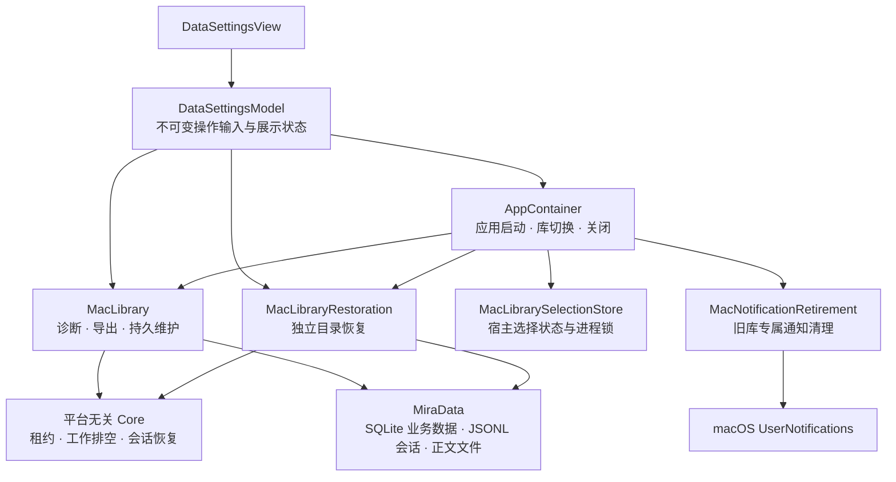
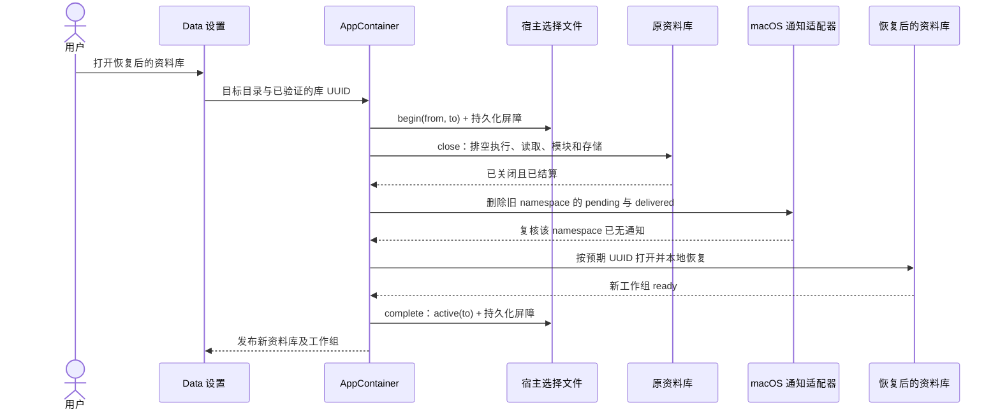

# macOS 资料库设置、恢复与切换

<!-- Simplified Chinese documentation is explicitly requested by the user on 2026-09-12. -->

Data 设置直接调用当前 `MacLibrary` 的诊断、导出与维护服务；独立恢复由应用拥有的 `MacLibraryRestoration` 完成。不存在旧 `application` 聚合对象、旧资料库解码器或历史迁移桥。

## 依赖与所有权

`DataSettingsModel` 在按钮操作的同一个 MainActor 回合冻结资料库／路径，设置重复操作门禁并创建拥有的任务。关闭设置窗口清空展示结果，但不取消已经接纳的导出、恢复或维护；结果使用展示代次核对，旧窗口的迟到结果不能填回新窗口。观察任务在页面停用时取消并排空；诊断结果还核对真实库绑定与工作组代次。

`MacLibraryRestoration` 最多接纳四项恢复。接纳点是 actor 内登记任务；任务拥有源目录及目标父目录的安全作用域访问，直到真实恢复结束才释放。`close()` 先拒绝新工作，等待全部已接纳任务，再关闭底层恢复器。取消调用者不会使文件复制失去所有者。

应用关闭等待启动与库切换结束，随后排空当前库和恢复服务，最后释放宿主选择锁。普通关闭不删除提醒；只有明确切换资料库时才退役旧 namespace 的平台通知。

## 设置行为

- 诊断从当前资料库读取真实 SQLite 版本，在相同引擎的隔离内存库探测 FTS5／trigram，不向规范资料库增加诊断表；完整读取由库租约拥有。
- 导出通过只读快照窗口，排空执行、工具、后台任务和读取，并使用当前归档模块校验规范记录、会话、正文及附件。安全作用域由实际导出任务拥有。
- 恢复先生成独立且关闭的资料库；验证失败不会发布目标目录。原资料库保持打开。恢复结果保留目录和库 UUID，供后续显式切换核对。
- 清理使用 `knowledge.collect` 持久维护请求。若同一清理已经 pending，重用原请求身份；其他维护 pending 时拒绝混入新清理。只在维护操作有完成时间后显示完成，不虚构文件计数，也不显示旧实现的七天等待规则。
- 凭据清理通过当前工作组的 `MacCredentialSettings` 重试，继续使用持久清理日志和当前引用复核；Data 设置不读取或保存密钥正文。

## 显式切换与启动恢复

正常启动在 `Application Support/MiraHost/library-selection.json` 读取宿主选择。该文件位于规范资料库之外，保存当前格式的 `active` 或 `switching(from,to)`；它不属于会话历史或库归档。独立进程锁、有限文件大小、普通文件／单链接校验、临时写入、文件同步、原子重命名与目录同步保护其更新。格式不明、损坏或锁被占用时直接报错，不打开默认库作为隐式回退。

若启动读到 pending 切换，先幂等清理 `from` 的专属通知，再按已记录 UUID 打开 `to`，成功后完成选择记录。不会重新启动旧库生产者。目标缺失或身份不符时拒绝创建替代空库。持久化或清理失败保留可检查状态；需要恢复文件／权限后重开应用重试。

显式 `--data-directory` 和演示模式不读取或改写正常用户的库选择，避免测试资料库污染正式宿主选择。演示不提供系统通知切换。测试通过隔离的 `selectionFile`、通知适配器及真实库 opener 覆盖完整流程。

通知身份格式沿用提醒调度器的 `mira.<namespace>.`，namespace 由规范目录和库 UUID 共同生成。因此恢复库虽然保留 UUID，仍与原目录拥有不同通知身份。适配器只删除准确前缀的 pending／delivered 项，保留相似 namespace 和其他资料库的通知；删除后复核，残留作为可重试错误。

窗口按当前 `MacLibrary` 对象身份重建会话页面；不能仅按库 UUID 区分恢复库。设置窗口在库对象变化时排空旧展示观察、清除旧草稿，同时保留正在执行的维护门禁。

## 验收边界

自动化使用隔离目录、真实当前格式归档和合成通知／凭据端口，覆盖关闭、取消、重复请求、恢复往返、切换持久状态和重启恢复。文件同步调用与 pending 重开测试不等于硬件断电试验。全 App 的 Provider 设置改写、原生文件面板与完整窗口视觉／交互验证仍须在对应验收记录中单独关闭。
