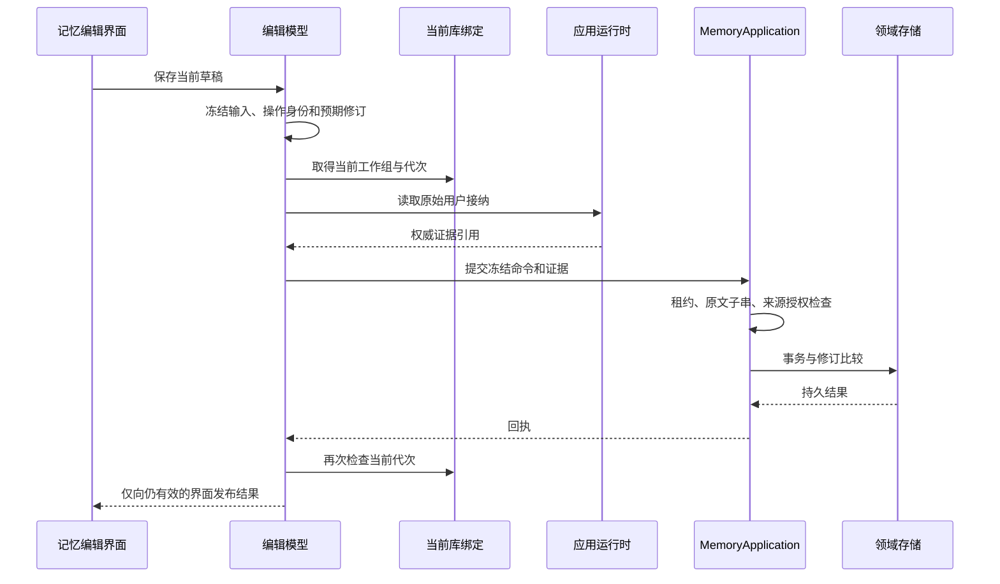

# macOS 记忆编辑与捕获设置

<!-- Simplified Chinese documentation is explicitly requested by the user. -->

记忆编辑和捕获设置直接使用当前 `MacLibrary` 工作组。界面不读取数据库，不持有旧应用聚合接口，也不拥有提取工作者。平台无关的 `MemoryApplication` 通过只读 `MemoryExtractionBudgetReader` 提供预算，预算读取与其他领域读取一样拥有库租约、撤权检查和关闭排空。

## 编辑命令与来源

`MemoryEditorModel` 在首次等待前冻结正文、有效期、发送策略、来源摘录、替代目标、预期修订和操作身份。相同内容的重试使用原命令身份；明确编辑后形成新操作。修订及替代必须遵守领域 CAS，旧界面不能覆盖另一窗口已经提交的版本。

界面接收的消息仅是展示提示。保存用户消息来源时，从权威会话状态重新取得原始接纳事件、批次及正文引用；`MemoryApplication` 再读取日志证据、验证原文子串和当前授权。默认范围由实际来源会话的工作区决定，用户已修改的范围不会被迟到读取覆盖。来源正文缓存和已提交回执在维护、关闭或观察结束时清空；正在编辑的草稿属于用户尚未提交的输入。

手工创建使用明确的手工来源；修订已有记忆使用原对象身份和修订，不需要伪造用户消息。界面消失不会撤销已经交给领域服务的写入；迟到结果不能关闭新的界面。库关闭仍等待实际领域操作返回。

## 捕获设置

`MemorySettingsModel` 分开保存编辑草稿、已保存基线和可撤销的预算／工作区／用途绑定。业务提交通知会刷新元数据，即使草稿尚未保存；刷新不会覆盖等待期间发生的编辑。保存按钮同步捕获完整策略，以已加载修订进行 CAS；新编辑保留为未保存草稿。实际绑定由 `MacLibrary.binding()` 校验，不依赖另一个展示观察器恰好先收到通知。

页面暂停或窗口关闭先撤下可见元数据并使旧观察身份失效，再排空已分离的读取、观察和保存任务。后续观察不会被先前任务的结束清理覆盖。用途检查读取 `mira.memoryExtraction` 的全局与工作区绑定；存在绑定不等于已经通过真实模型能力验证。

自动捕获策略、预算和记忆写入的领域规则仍属于核心模块。界面不会根据显示语言改写模型提示，不会把目录资料当作已验证能力。实际原生界面的中英文、浅深色、最小窗口和交互验收记录在[核心验证记录](../engineering/AGENT_CORE_VERIFICATION.md)，不能以编译或展示模型测试替代。

## 历史状态提示

历史回复使用 [MemoryApplication 的无正文状态查询](AGENT_MEMORY_HISTORY.md)。会话页面拥有独立提示任务，在业务提交后刷新记忆状态而不重复加载消息；页释放或库代次改变会撤下提示并排空任务。现有历史标签直接消费按执行归组的结果，记忆状态不能授予正文引用或模型重放权限。

## 独立提取检查

执行检查器通过 [MemoryExtractionStatusReader](AGENT_EXTRACTION_QUERIES.md) 的 `MemoryApplication` 入口分页读取原始回合的后台作业，单作业读取全部尝试。前台和独立提取分别计算费用，预算预留／扣减不充当模型用量。查询、业务通知和资料库代次更替由现有 `MacSessionReadModel` 管理；检查器不拥有 Worker，也不恢复已移除的对话正文状态面板。完整有数据视觉矩阵继续按核心验证记录验收。
