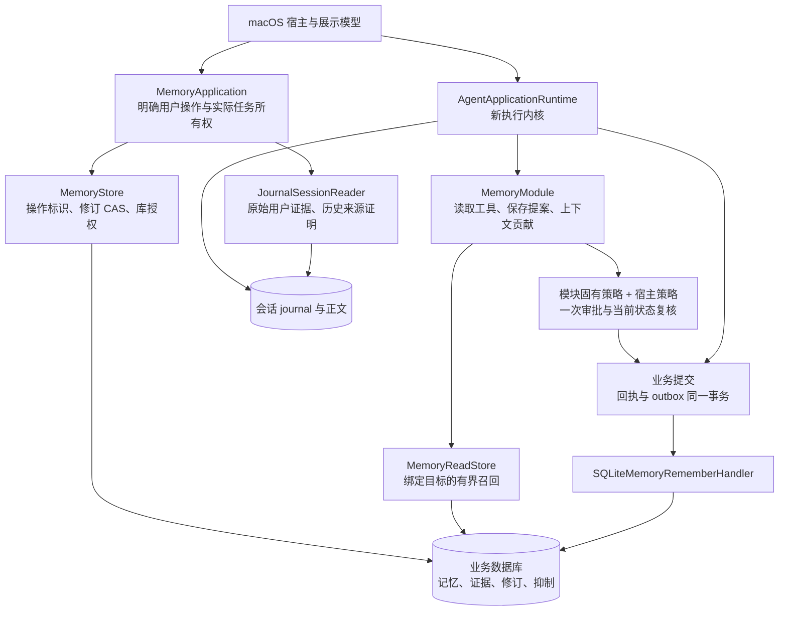
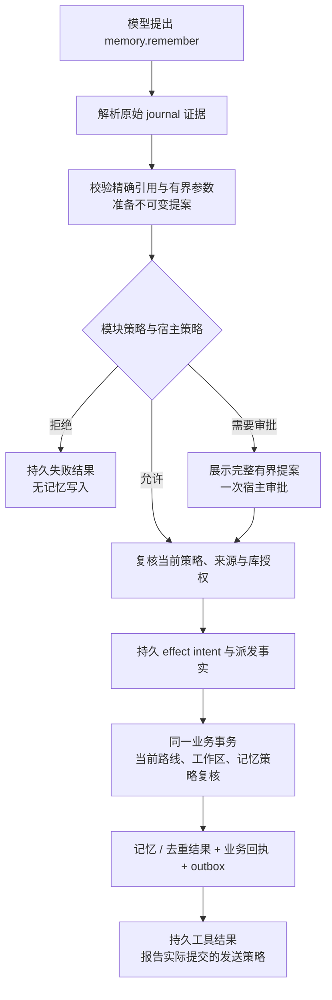

# 记忆领域的新核心实现契约

**状态：正在直接重写，尚未验收。** 本文定义新架构，不要求保留旧 SQL 会话接口。旧包测试的通过记录只代表对应提交；当前接口切换造成的编译缺口，必须在完成调用方和测试替换后重新验收。产品语义见[记忆与知识](MEMORY_AND_KNOWLEDGE.md)。

## 边界与所有权

`MiraCore` 只依赖 Foundation。`MemoryApplication` 承接明确的用户操作；`MemoryModule` 注册工具、上下文贡献与来源权威；`MemoryReadStore`、`MemoryStore`、`MemoryCapturePolicyStore` 分别提供领域读取、领域修改与捕获设置。模块不访问 UI、平台文件、SQL 会话表或服务商网络。

`SQLiteMemoryStore` 是独立业务适配器，与库授权、业务回执和其他领域共享业务数据库。会话 journal 是消息和执行事实源，业务数据库不创建 `messages`、`conversations` 或 `executions` 的副本来证明用户授权。查询投影仅用于展示和搜索，不能授予写入权。

`MemoryApplication` 接纳后的操作拥有自己的实际 Swift Task、作用域资源及库访问租约。界面消失或等待者取消不能遗弃已经开始的业务提交。关闭时停止接纳并等待实际任务结束。读取前后均经过租约检查，写入在同一业务事务中核对当前库代次。维护另走持久维护操作，不借用普通写入授权。

架构图导出：[SVG](diagrams/agent-memory-architecture.svg) / [PNG](diagrams/agent-memory-architecture.png)。工具执行图导出：[SVG](diagrams/agent-memory-tool-flow.svg) / [PNG](diagrams/agent-memory-tool-flow.png)。

## 原始证据

`MemorySourceInput.userMessage` 必须携带完整 `SessionEvidenceReference`：会话、原始执行、用户消息、接纳事件、接纳序列以及不可变正文引用。只提供消息 UUID 或摘录不足以证明来源。重试仍指向最初接纳，不把重试生成的新执行误当成新陈述。

应用入口在租约内读取最新 journal 前缀，取得只能由 `JournalSessionReader` 构造的 `SessionUserEvidence`，然后传递 `MemoryWriteSource`。业务事务验证完整引用、精确摘录、来源工作区和写入规则。工具来源由执行核心的 effect resolver 同样解析，模型不能提供或替换这些字段。

人工输入使用独立 `manualEntry(UUID)`，不是伪造的会话消息。同一人工来源标识只绑定一个陈述。遗忘清除其正文和散列后，新的人工输入必须使用新来源标识。

持久 `MemoryEvidence` 保存类型化来源及 `sourceWorkspaceID`。即使记忆提升到全局范围，也保留原工作区的来源限制；禁止通过后续 SQL 会话关联推测来源工作区。

## 人工修改与保存工具

人工保存、修订、状态变更和替代确认都有明确的操作标识；已有对象还要求已展示的修订号。操作重试与断言去重是两种不同身份：前者绑定整个请求，后者绑定完整来源、主体、范围与规范化断言。同一操作换参数必须失败，已遗忘的旧操作不能使内容复活。

`memory.remember` 是 `AgentLocalWriteTool`，只准备提案，不自行执行 SQL 写入。其固有策略使用 `.constrained` 与宿主限制共同执行，不能被宿主的允许策略绕过。完整、锚定的记住前缀，当前范围，非敏感内容及精确摘录可以直接允许；模糊的明确保存意图需要审批。自动捕获开启时，普通陈述的错误保存工具调用直接拒绝，不能弹人工审批来替代后台捕获。

审批必须让用户审阅完整提案；超过当前审批正文上限时明确拒绝该提案，不截断后冒充完整审阅。新工具保存始终是本地使用。断言去重复用已有记忆时保留已经审阅的发送策略，工具结果必须报告实际提交结果，不能将远程可用的既有记忆误报成本地专用。

修订只改措辞和元数据，不变更记忆身份、主体和范围。语义替代产生新记忆及持久关系；同一事务更新当前投影。竞争替代保留为候选，并持久记录全部有界冲突目标。确认时同时检查候选修订和所选当前目标的修订；所选目标须属于至少一条提议的替代链。只有指定目标被替代，其余待审提议关闭、其他有效记忆保留。含待审关系的候选不能绕过目标选择直接激活。遗忘新记忆不会自动恢复旧记忆。

## 召回与引用

所有召回显式携带 `AgentContextRequest.destination`。适配器在一个业务读取快照内检查冻结路线当前身份、目标工作区策略、记忆范围、状态、修订、有效期、远程发送许可、连接限制，以及原来源工作区的当前发送许可。全局记忆不能绕过来源工作区限制。

普通召回只返回当前有效 Active 记忆，排除候选、归档、拒绝、移除、替代、删除、遗忘、未生效和过期内容。中文和英文采用有界词法召回；保持短词处理、确定性顺序和截断标记，不能因无关键词匹配注入无关记忆。平台分词实现属于 Data，核心只接收业务结果。

读取工具在准备时冻结返回内容及精确 `.domain(namespace: "memories", id, revision)` 来源，执行和发布前重新核验。上下文贡献有条数和字节上限，实际进入请求的来源随 `AgentContextBuild` 持久化；读取工具不另写一套 SQL execution usage 表。

引用格式保持 `[memory:<UUID>@<revision>]`。语法有效不代表有权打开。应用必须从指定会话与已完成执行的 journal 请求证明实际使用了该精确版本，再读取对应本地历史修订。`JournalSessionReader.recordedContextEvidence` 提供冻结路线、工作区与来源，是跨领域的历史来源证明，不含 Memory 类型，也不授予当前领域或发送权限。失败执行、不存在的会话、被排除的执行、已清理正文及未记录来源均不能建立引用权限。后续措辞修订不能悄悄把旧引用重定向到新版本。

## 遗忘与后台捕获

遗忘必须经过库维护协调器：持久撤销旧库授权，停止并排空生产者，执行领域正文清理、会话依赖传递失效、工具与请求正文清理，并验证实际结果后完成维护。`MemoryStore.purgeMemory` 只承担领域事务，不是可直接暴露给用户的完整遗忘操作。完整维护处理器接通前，不能把领域 purge 误报为已完成遗忘。

抑制保留完整无正文来源身份，强度只增不减：遗忘高于拒绝，高于移除。清除记忆、修订、摘录、散列、搜索及操作回执中的正文；保留必要身份、关系、状态和清理标记。已提交的用户消息、助手回复及可见思考保留为带状态标签的本地历史，隐含工具内容和受影响的后续重放必须清除。晚到的任务不得在维护后重新写回正文。

后台捕获使用持久会话消费者将完成事件转成领域作业，与消费者检查点同事务提交。消费者内不能调用模型。独立作业领取、冻结模型路线、预算预留、派发、结算和失败恢复都必须重验来源、当前捕获策略与库授权。提取尝试标识与候选断言标识分离。关闭捕获时不运行模型，不把候选当成普通事实。原有保守判定、冲突候选及撤销语义仍是需求，新工作器与独立业务存储已替换旧提取循环，详细状态、预算及执行图见[自动记忆执行契约](AUTOMATIC_MEMORY_IMPLEMENTATION.md)；宿主唤醒和完整维护仍须独立接通。

## 验收边界

本次切换必须补齐：原始证据串换、跨工作区限制、修订 CAS、操作重试与断言去重、替代冲突、审批拒绝及撤权、事务回滚、正文清理与晚写阻止、应用关闭排空、真实新内核工具往返，以及消费者恢复和后台预算边界。旧测试按业务行为移到新架构，不添加旧接口解码器来维持通过数。

当前仍需完成旧领域调用方及测试替换、自动捕获的宿主恢复／唤醒、传递隐私维护、备份和 macOS 直接组装。真实模型质量、人工标注数据、原生交互及平台接受度另行记录；合成测试不能关闭这些验收项。
