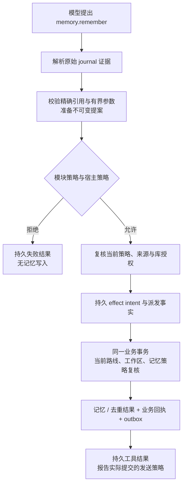

# 记忆领域的新核心实现契约

**状态：已接入当前核心，正在完成原生与质量验收。** 本文描述生产路径。验证证据与剩余范围见[本地向量记忆实施记录](../engineering/LOCAL_MEMORY_IMPLEMENTATION.md)。产品语义见[记忆产品规范](../product/MEMORY_AND_KNOWLEDGE.md)。

## 边界与所有权

`MiraCore` 只依赖 Foundation。`MemoryApplication` 承接明确的用户操作；`MemoryModule` 注册工具、上下文贡献与来源权威；`MemoryReadStore`、`MemoryStore` 分别提供领域读取与领域修改。模块不访问 UI、平台文件、SQL 会话表或服务商网络。

`SQLiteMemoryStore` 是独立业务适配器，与库授权、业务回执和其他领域共享业务数据库。会话 journal 是消息和执行事实源，业务数据库不创建 `messages`、`conversations` 或 `executions` 的副本来证明用户授权。查询投影仅用于展示和搜索，不能授予写入权。

`MemoryApplication` 接纳后的操作拥有自己的实际 Swift Task、作用域资源及库访问租约。界面消失或等待者取消不能遗弃已经开始的业务提交。关闭时停止接纳并等待实际任务结束。读取前后均经过租约检查，写入在同一业务事务中核对当前库代次。维护另走持久维护操作，不借用普通写入授权。

架构图导出：[SVG](diagrams/agent-memory-architecture.svg) / [PNG](diagrams/agent-memory-architecture.png)。工具执行图导出：[SVG](diagrams/agent-memory-tool-flow.svg) / [PNG](diagrams/agent-memory-tool-flow.png)。

## 原始证据

`MemorySourceInput.userMessage` 必须携带完整 `SessionEvidenceReference`：会话、原始执行、用户消息、接纳事件、接纳序列以及不可变正文引用。只提供消息 UUID 或摘录不足以证明来源。重试仍指向最初接纳，不把重试生成的新执行误当成新陈述。

自动提取使用完成的用户回合作为来源单位。持久 dirty 队列按 journal admission sequence 保存来源；达到四个完成回合、约 2,000 个输入 token、最近完成后空闲 120 秒或最早回合达到 600 秒时合并。每个批次最多 16 个回合和 8,192 个输入 token。消费者写 dirty 行或生成批次作业时与 journal checkpoint 同事务提交；周期空闲 flush 则在独立业务事务中将已有 dirty 行转换为作业，回滚必须保留 dirty 行并阻止 checkpoint 前进。消费者只读 journal 和领域状态，不调用模型；工作器在每次调度前和派发／提交前重新校验全批次来源、workspace、抑制和隐私状态。

批次请求使用 v3 JSON。每个用户回合有 host 分配的 `inputIndex`，模型只用它标识支撑回合；模型输出的是简洁改写后的 `content`，不要求或接受 quote、可见 citation。bounded assistant reply 只在没有辅助来源时作为上下文出现，永远不能作为用户事实来源。请求同时携带最多 32 条 bounded current active memories，供明确同主题修订使用；`replacesIndex` 必须指向该列表并在提交时以旧 revision 做 CAS。

应用入口在租约内读取最新 journal 前缀，取得只能由 `JournalSessionReader` 构造的 `SessionUserEvidence`，然后传递 `MemoryWriteSource`。业务事务验证完整引用、精确摘录、来源工作区和写入规则。工具来源由执行核心的 effect resolver 同样解析，模型不能提供或替换这些字段。

人工输入使用独立 `manualEntry(UUID)`，不是伪造的会话消息。同一人工来源标识只绑定一个陈述。遗忘清除其正文和散列后，新的人工输入必须使用新来源标识。

持久 `MemoryEvidence` 保存类型化来源及 `sourceWorkspaceID`。即使记忆提升到全局范围，也保留原工作区的来源限制；禁止通过后续 SQL 会话关联推测来源工作区。

## 人工修改与保存工具

人工保存、修订、状态变更和替代确认都有明确的操作标识；已有对象还要求已展示的修订号。操作重试与断言去重是两种不同身份：前者绑定整个请求，后者绑定完整来源、主体、范围与规范化断言。同一操作换参数必须失败，已遗忘的旧操作不能使内容复活。

`memory.remember` 是 `AgentLocalWriteTool`，只准备提案，不自行执行 SQL 写入。标准非敏感记忆允许按 standard remote 发送策略执行，不增加一次性的额外审批；敏感记忆保持本地处理并遵守本地权限。其固有策略与宿主限制共同执行，不能被宿主允许策略绕过。自动捕获不通过该工具，也不把模型提案送入人工候选收件箱。

The foreground `memory.remember` descriptor is revision 4. Its required `enriches` array is empty for an independent save, or contains up to six unique exact `{memory_id, revision}` targets for non-conflicting enrichment. The model selects the same entity and supplies one complete assertion preserving the supported prior facts; similarity alone is insufficient. The recall payload exposes structured `memory_id` and `revision` fields, and `memory.search` / `memory.get` can resolve additional concrete targets.

An optional `replaces` object identifies one exact current memory and revision for a clear user correction. It cannot be combined with enrichment targets. The model must resolve the user's replacement intent and object from the conversation and authorized recall; uncertain intent or an ambiguous object requires clarification. Semantic intent remains a model judgment, not a keyword or similarity authorization rule. Preparation and policy bind and revalidate the target through the same authorized recall boundary. The handler checks current revision, scope, subject, kind, disclosure and source suppression, then creates the corrected memory, confirms the replacement relation, supersedes the predecessor and writes the receipt in one transaction. The replacement uses only the current statement's evidence; it does not inherit contradicted evidence. The exact target and revision are part of operation identity, and any stale target or failed write rolls back the operation.

`memory.retract` is a separate revision-1 local-write tool with exactly `memory_id`, positive `revision` and an exact current-user `quote`. Preparation and policy authorize one current target; plan sources and targets bind the same ID/revision. Its business handler revalidates the frozen route, source and target workspaces, current disclosure and evidence suppression. In one transaction it archives the same record, increments its revision, adds a body-free `MemoryRetraction` marker and a separately tagged withdrawal evidence row, and saves the idempotent receipt. It creates no successor or replacement relation. Its result contains only the retired identity, committed revision/state/disposition and an acknowledgment instruction; it does not advertise a new citation or current assertion. A stale target or any failed write rolls back the operation.

Supporting evidence has no `retractionRevision`; withdrawal evidence names its retired revision and retains its own excerpt/hash until forgotten. It cannot share the original supporting source identity or be inherited as assertion evidence. The marker survives later explicit lifecycle changes, and its revision never exceeds the current record revision. Retraction does not set global privacy suppression. Capture suppression is derived from all evidence sources attached to a memory with a retraction marker, so both the original and withdrawal source are barred from new capture while unrelated existing assertions from those sources remain authorized. All new-capture admission, dispatch and commit paths apply this barrier; existing-source authorization continues to use privacy suppression. Fresh later sources remain eligible.

For non-conflicting enrichment, preparation and policy load the targets through authorized current recall. Both plan sources and targets contain the exact references. The business handler repeats scope, subject, kind, sensitivity, disclosure, source-suppression and revision checks in the receipt transaction. All targets must have identical validity bounds, which the host preserves. The transaction creates one current memory, copies the deduplicated evidence from every target and the current source within the 100-source bound, supersedes all selected targets, and records operation dependencies and the business receipt atomically. A stale target, failed relation write or failed receipt insertion rolls back the whole operation. Target IDs/revisions are part of operation identity. Independent saves and local-only sensitive saves retain their existing behavior.

新工具保存的标准记忆允许在所属范围内用于后续模型请求，敏感记忆仅本地保存。断言去重复用已有记忆时保留实际发送策略，回执必须反映真实结果。不得在提交前承诺已保存，也不得把本地专用结果描述为后续模型可召回。

修订只改措辞和元数据，不变更记忆身份、主体和范围。自动提取只保存高置信度、直接、稳定的标准用户事实、偏好和约束，范围可以是 user 或 workspace。推断、含糊、临时、假设、第三方、引用及敏感断言跳过，不创建候选 backlog，也不把任意模型输出标为 active。明确直接修订可通过 `replacesIndex` 创建新记忆并以 CAS supersede 旧记忆；冲突、过期或权限不相容时跳过。

Clear non-conflicting enrichment uses `changeIntent = enrichment` with one exact existing-memory or earlier-proposal target. It creates a complete current representation, retains the old representation in history, and inherits its evidence. The same CAS, scope and disclosure checks apply; enrichment also preserves validity bounds. Aspect equality and similarity cannot select or authorize an enrichment target.

显式人工替代继续使用独立确认事务。

## Conversational deletion

`memory.delete` is a revision-1 local-write tool with one exact `memory_id`, positive `revision`, and verbatim current-user `quote`. It shares current-memory disclosure, workspace, source, and revision authorization with the other foreground tools. Its business transaction inserts a body-free `MemoryDeletionRequest` and the ordinary durable business receipt atomically. The result is always a pending submission acknowledgment, never deletion completion. Replacement and retraction receipts explicitly state that their retained history has not been erased.

The deletion queue is a separate current schema family included in the memory archive module. A request stores its invocation ID, memory/revision, original user evidence identity, actual execution, workspace, timestamp, and state; it copies no source text or memory body. Pending targets are unique, indexed reads are bounded, and row identities are validated against encoded values. Committed requests suppress background capture from the deletion instruction. Archive validation binds each request to its original authorized tool invocation and validates completion against durable maintenance evidence.

`MacLibrary` observes business changes and processes pending requests outside its replaceable workgroup. It releases ordinary access leases, waits for the source execution to settle, and calls the existing `memory.forget` library maintenance operation. The executing tool never calls maintenance or waits for the library to drain itself. Close drains admitted maintenance, closes executions, then drains this independent processor before storage. Reopening first restores journals and admitted maintenance, then resumes queued requests without model dispatch. An exact request with a durable completed maintenance operation can reconcile its status without another purge. Failed status requires an unadmitted request whose target has become invalid; an uncertain admitted operation stays pending for recovery. Completion cannot be written without a matching completed operation.

## 召回与引用

所有召回显式携带 `AgentContextRequest.destination`。适配器在一个业务读取快照内检查冻结路线当前身份、目标工作区策略、记忆范围、状态、修订、有效期、远程发送许可、连接限制，以及原来源工作区的当前发送许可。全局记忆不能绕过来源工作区限制。

普通召回只返回当前有效 Active 记忆，排除候选、归档、拒绝、移除、替代、删除、遗忘、未生效和过期内容。中文和英文保留有界词法召回，支持短词处理、确定性顺序和截断标记。语义路径允许无字面重合的候选；近似相关不能证明用户未陈述的事实。平台分词实现属于 Data，核心只接收业务结果。

语义索引由本地 Qwen 4-bit 模型和 macOS adapter 提供；向量身份包含模型 fingerprint、预处理版本和 1,024 维 Float32 空间。索引写入走 durable vector outbox，不能成为记忆提交的权限来源。召回以 semantic 结果为主，保留小的 lexical reserve 和 small-profile 结果以覆盖字面命中及未索引事实。derived index 属于可重建投影，归档时省略，不能改变原始记忆、证据或修订事实。

读取工具在准备时冻结返回内容及精确 `.domain(namespace: "memories", id, revision)` 来源，执行和发布前重新核验。上下文贡献有条数和字节上限，实际进入请求的来源随 `AgentContextBuild` 持久化；读取工具不另写一套 SQL execution usage 表。

Current recall, read-tool execution and mutation CAS remain current-only. In contrast, `MemorySourceAuthority` and pending recovery use `validateMemoryContextSources` for already-recorded context: the exact retained revision must still have its body, and the current record must remain active, undeleted and unforgotten, or be archived at exactly its recorded retraction revision with the requested historical revision no later than the marker's prior revision. Supersession alone may preserve historical context authorization; it does not make the old memory current or redirect its reference. Current and historical validity/disclosure restrictions, source suppression, source-workspace policies and the frozen destination still apply. This lets a foreground enrichment finish its following model step without revoking the context it just read.

Semantic top-K is an upper bound, not a minimum result count. Low-relevance vectors are filtered before selection under the [search admission contract](SEARCH.md); an unrelated query may return an empty result. `memory.search` does not append the automatic contributor's communication/language profile. Literal keyword recall remains available when vectors are absent or below the semantic floor.

普通回答不要求显示引用，内部仍保留真实会话/批次谱系。需要显式历史查看时，引用格式保持 `[memory:<UUID>@<revision>]`。语法有效不代表有权打开。应用必须从指定会话与已完成执行的 journal 请求证明实际使用了该精确版本，再读取对应本地历史修订。`JournalSessionReader.recordedContextEvidence` 提供冻结路线、工作区与来源，是跨领域的历史来源证明，不含 Memory 类型，也不授予当前领域或发送权限。失败执行、不存在的会话、被排除的执行、已清理正文及未记录来源均不能建立引用权限。后续措辞修订不能悄悄把旧引用重定向到新版本。

Shared conversation instructions require square-bracket syntax whenever the assistant chooses to show a memory citation or the user requests sources. The exact reference must come from recall context or a successful memory read in that execution. A `memory.remember` receipt proves a committed save, but does not alone establish recorded source authority for that new memory; save acknowledgments omit the receipt's identifiers. These instructions do not rewrite historical model output or relax citation parsing and authorization.

## 遗忘与后台捕获

遗忘必须经过库维护协调器：持久撤销旧库授权，停止并排空生产者，执行记忆领域正文清理，并验证实际结果后完成维护。`MemoryStore.purgeMemory` 只承担领域事务，不是可直接暴露给用户的完整遗忘操作。完整维护处理器已接通；不能把单独的领域 purge 误报为已完成遗忘。

抑制保留完整无正文来源身份，强度只增不减：遗忘高于拒绝，高于移除。清除记忆、修订、摘录、散列、搜索及操作回执中的正文；保留必要身份、关系、状态和清理标记。DSH v3 已提交的内联会话日志保持不变；用户消息、助手回复、思考和工具历史继续作为本地历史保留。当前来源授权排除已遗忘记忆及其受影响的历史上下文，不能重新发送给模型；不创建会话正文 sidecar、擦除计划或日志重写流程。晚到的任务不得在维护后重新写回正文。

后台捕获使用持久会话消费者将完成事件写入 dirty 队列，并按阈值合并为有界领域作业，与消费者检查点同事务提交。消费者内不能调用模型。独立作业领取、从 journal 冻结批次末轮实际使用的会话路线、请求准备、revocation、uncertain-dispatch 处理、派发、结算和失败恢复都必须重验全批次来源、当前发送权限与库授权。提取尝试标识与断言 inputIndex 分离。不提供捕获模式开关或每日提取额度；模型上下文与单次输出限制仍需满足；不合格输出跳过且不进入候选收件箱。详细状态、用量及执行图见[自动记忆执行契约](AUTOMATIC_MEMORY_IMPLEMENTATION.md)。

## 验收边界

本次切换必须补齐：原始证据串换、跨工作区限制、修订 CAS、操作重试与断言去重、替代冲突、审批拒绝及撤权、事务回滚、正文清理与晚写阻止、应用关闭排空、真实新内核工具往返，以及消费者恢复、无每日额度阻断和模型上下文边界。旧测试按业务行为移到新架构，不添加旧接口解码器来维持通过数。

当前已接通宿主恢复／唤醒、维护与备份路径。大规模质量、人工标注数据、内存压力下原生交互和 macOS 15 实机验收仍需独立记录；合成测试不代替这些验收项。
