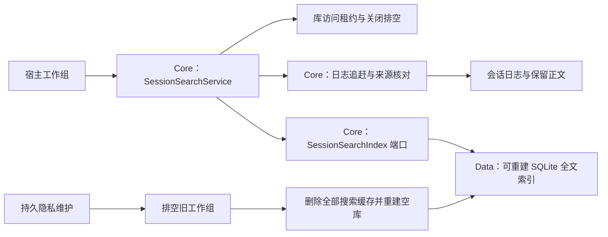
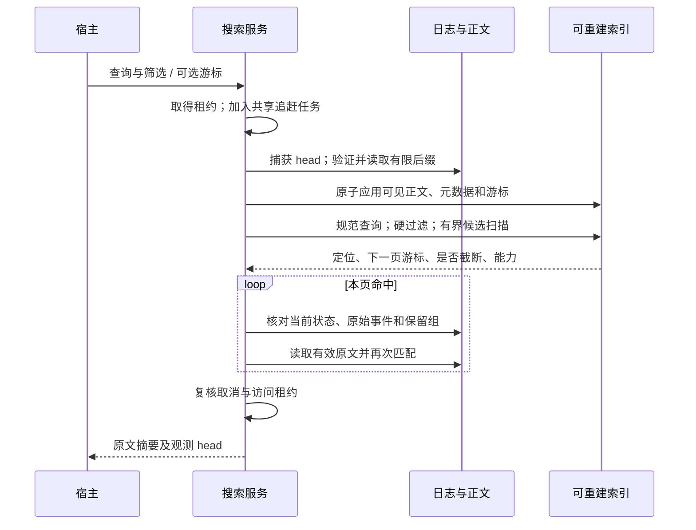

# 本地搜索与中文检索

**文档版本：** v1.2  
**更新日期：** 2026-09-05  
**状态：** 设计基线；当前实现与验收范围见 [实施记录](../engineering/IMPLEMENTATION_STATUS.md)。

定义检索管线、FTS 能力探测、短查询回退、规范化、结果与向量扩展；量化验收门槛在质量标准中。

返回 [ARCHITECTURE.md](../ARCHITECTURE.md) · 版本范围：[MVP](../MVP.md)

## 新核心会话搜索

<!-- Simplified Chinese documentation is explicitly requested by the user. -->

`SessionSearchService` 提供本地历史全文查询，`SessionSearchIndex` 是可替换的核心端口。macOS 在工作组中直接组装服务，并把 `SQLiteSessionSearchIndex` 放在独立的 `Projections/Search.sqlite`；它不占用会话权威日志或业务 SQLite 的职责。iOS 尚未实现，未来宿主可以复用核心服务与适用的数据适配器。



只有当前标题、首次接纳的用户原文、已结算的可见回答及可见思考进入索引。重试不重复索引用户消息；隐藏的请求、Provider continuation、工具正文、计划和草稿不进入全文索引。索引保存规范文本及原始定位，摘要必须重新读取正文；命中不是模型重放或远程发送的授权。

每次搜索先执行有限库目录追赶，最多 4,096 个会话、每页 128 个 ID；每个会话捕获一个已确认 head，验证索引游标对应完整源批次，只应用到该目标。新建索引时先归约目标状态，跳过已失效保留组，避免读取早期批次中已被后续隐私操作清理的正文。单批索引正文上限为 64 MiB，不是全库大小限制。索引文档、标题变更、保留组失效及完整批次游标在同一事务中提交；重复批次只有输入一致才幂等。重命名与失效同步移除全文索引条目。



查询按 NFKC、大小写、变音符号和字符宽度规范化，空白分词，各词项都必须作为字面子串命中。SQLite 适配器使用实际链接库建立临时 `unicode61`／`trigram` 表并执行查询探测。词项全部至少三个 Unicode scalar 且 trigram 可用时走全文候选；短词或 trigram 不可用时走有界子串回退。FTS 表的操作和能力依据 [SQLite FTS5 官方契约](https://www.sqlite.org/fts5.html)，不以系统命令行 SQLite 代替 App 链接库测试。

Workspace／Inbox、归档、开始时间（含）和结束时间（不含）先成为 SQL 硬过滤条件，最多扫描 20,000 个候选。查询使用 200 ms 截止时间与 SQLite progress handler，并在行间检查取消和时间；这是协作式预算，不能据此声称所有阻塞 I/O 或单行文本处理具有严格的墙钟抢占上限。超出预算或候选上限明确返回 `isTruncated`；取消抛出取消错误。普通分页本身不表示截断。结果按索引行 ID 倒序分页，游标绑定索引身份、查询与全部筛选；清理重建后旧游标失效。

返回前按会话重新读取权威快照，核对当前 Scope、归档、标题、引用、失效组与原始事件身份和时间。整页先检查默认 64 MiB 正文字节预算，再生成最多 1,200 UTF-8 字节的原文摘要。已过时的候选被省略并标记不完整；未失效正文缺失或编码损坏明确失败。查询是实时视图，不冻结全库：追赶后并发追加的新消息可能要到下一次查询才出现，每个结果带自己的观测 head。

服务最多接纳 16 个查询。并发查询共享一个有独立访问租约的追赶任务，某个等待者取消不取消其他查询的追赶。服务关闭和库维护会取消并排空所有查询及追赶中的实际 I/O，迟到正文不会返回。宿主关闭物理索引之前必须先关闭服务。

隐私维护在工作组排空、日志失效与正文清理之后，删除整个搜索数据库及 WAL／SHM／journal，再同步目录并建立空缓存；失败后保持不可读并允许重试。验证同时检查会话、批次、文档和 FTS vocabulary，不能仅查询 external-content FTS 的行数。缓存不进入业务归档，恢复后从日志重新追赶。保留的历史回答即使被排除出模型上下文，仍可供本地搜索；已清理正文不能因重建而恢复。

当前没有针对任意人为篡改数据库内部行的自动完整性重建；损坏可能要求在工作组关闭后清除缓存，再从来源重建。索引不能提供正文或权限权威，但这一限制可能造成漏项。冷索引重建、十万消息库延迟与峰值内存尚待规模验收；当前实现不等于搜索界面或整套核心验收完成。

---

<a id="s25"></a>

## 1. Search Index Architecture

中文搜索是基础可用性，不是后续增强。

<a id="s25-01"></a>

### 1.1 Search Pipeline

```text
Query Normalize
        ↓
Language / Character Pattern Detect
        ↓
FTS Candidate Search
        ↓
Metadata / Scope / Time Filter
        ↓
Entity / Alias Expansion
        ↓
Optional Vector Candidate Merge
        ↓
Rank / Deduplicate
        ↓
Typed SearchResult
```

Memory semantic recall applies a cosine admission floor before top-K selection. The current pinned Qwen 4-bit memory-query space uses 0.50; low-scoring neighbors are discarded even when fewer than six eligible memories exist. This is a relevance heuristic, not an answerability or truth guarantee, and must be reevaluated when the embedding space or query instruction changes. Keyword retrieval remains independent and can return a literal match below the semantic floor. Empty recall queries return no memories; the separate management-list operation may still list records with an empty query. Truncation means eligible matching candidates were actually omitted, not merely that the result count equals the requested limit. Focused evidence and calibration limits are in [memory search relevance](../engineering/MEMORY_SEARCH_RELEVANCE.md).

<a id="s25-02"></a>

### 1.2 FTS 双路径基线

#### Word-oriented Index

FTS5 `unicode61` 用于：

- 英文；
- 数字；
- Swift 类型名；
- 文件名；
- 大部分代码 Token；
- 拉丁语前缀和短语。

#### CJK / Substring Index

FTS5 `trigram` 用于：

- 中文和混合文本子串；
- 无空格语言；
- 文件路径片段；
- 用户不精确的局部查询。

#### 少于三个 Unicode 字符的中文查询

`trigram` 对短查询能力有限。采用：

```text
先应用 Scope / 类型 / 时间硬过滤
+
规范文本列上的有界 LIKE / 前缀查询
+
严格 Result Limit
```

避免全库无限扫描。SQL `LIMIT` 只限制返回行数，不能限制为找到这些行所做的扫描；实现必须另设候选扫描上限与可取消的查询时间预算。MVP 初始最多扫描 20,000 个已按 Scope 过滤的候选、最多 200 ms，超限显示结果不完整并提示增加关键词 / 筛选条件，不能把截断结果称为全量。

知识检索的 SQL 候选阶段只排序和限制行 ID，不能携带片段全文、规范化全文及 JSON 参与大规模临时排序。在同一数据库操作中，逐个读取实际消费的候选正文，再核对当前来源／版本、规范化文本、片段身份和不可变源文件。Scope 与发送政策在候选上限之前过滤；轻量候选不是跳过正文或权限验证的授权。[规模记录](../engineering/AGENT_CORE_SCALE_VERIFICATION.md)保留首个候选前超时的失败基线及后续验证。

启动时用实际链接的 SQLite 创建临时 FTS5 unicode61 / trigram 表进行能力探测；不能把开发机 sqlite3 CLI 的能力当成发行 App 在最低系统上的能力。若 trigram 缺失，使用已测试的受限文本回退并明确性能边界，禁止静默显示中文搜索无结果。正式选择系统 SQLite 或自带 SQLite 的依据是最低支持系统的探测与性能门槛。

<a id="s25-03"></a>

### 1.3 Normalization

- Unicode 规范化；
- 大小写折叠；
- 全角 / 半角规范化；
- 可配置标点处理；
- 保留代码中的 `_`、`.`、`/` 等有意义边界；
- Entity Alias 单独索引。

规范化后的检索列与原文分开保存，原文和引用定位不被大小写或 Unicode 转换改写。FTS 查询使用字面词构造器，SQL 参数绑定；用户输入的引号、MATCH 运算符、`%` 和 `_` 不直接当作查询语言执行。

普通 Memory 预取可以在 FTS 词项之外使用一个随 MiraKit 发布的、确定性的双语主题词表。词表只包含高信号短语（例如 breakfast / morning meal / 早餐），并仅在直接命中主题词或同时命中受限的场景词与动作词时展开；`morning`、`早上` 等通用词不能单独触发展开。展开最多产生 8 个别名词，仍受现有 24 词上限、Scope / 状态 / 时间 / Provider 发送策略和结果上限约束。别名是召回信号，不是用户文本改写，也不改变原文或引用。

中文短词与 FTS 词项合并召回时，保留 OR 候选，并将包含完整字面查询的记忆排在只匹配部分词项的记忆之前；`%`、`_`、反斜杠和引号不能成为查询操作符。精确匹配也必须先通过 Scope、有效期、当前版本与发送政策过滤，不能凭相关性进入结果。相同优先级仍使用稳定 ID 排序，不引入模型重排或额外网络调用。

<a id="s25-04"></a>

### 1.4 SearchResult

```text
SearchResult
├── kind                  memory / note / sourceChunk / message / task / event / transaction / artifact
├── id
├── title
├── snippet
├── score
├── sourceReference
├── workspaceId?
├── occurredAt / updatedAt
└── matchReasons[]
```

<a id="s25-05"></a>

### 1.5 Vector Index

记忆使用本地 Qwen3-Embedding-0.6B 4-bit DWQ（固定修订 `6c3ae70858513f1a78e9cdca3cae330d9075cd2a`），通过 macOS MLX 生成 1,024 维、Float32 归一化向量。量化的是模型权重，存储的向量不量化。无需远程 embedding API key，未准备好或推理失败时保留词法召回。

- SQLite 规范记忆与修订是事实源；向量及 outbox 是可重建派生数据。
- 每次规范写入同事务失效旧向量，任务携带记忆修订、正文散列及索引代次；晚到结果重新检查后才提交。
- 指纹包括权重修订、量化、tokenizer/右侧 padding/最后有效 token pooling、维数、归一化及查询模板。指纹变化重建整个索引，禁止混合空间。
- Scope、来源工作区、状态、时效、发送许可和连接过滤在向量 top-K 之前执行。准确点积扫描当前合格的向量；模型相关性不授予发送权限。
- 语义结果优先，容量大于一时为独有词法结果保留一个位置；不使用原型中效果较差的等权排名融合。
- 上下文最多六条，最多两条沟通/语言偏好档案占用该总额度。查询工具仍用于进一步检索。返回主体与权威性，并保留内容中的时间限定。
- 归档不携带派生向量，恢复后按规范记录重新排队；模型文件存储在库目录外的 Application Support/MiraModels。

生产大规模检索质量与端到端 p95 延迟仍需单独验收，不能用原型点积耗时替代完整 SQL、权限检查、推理与上下文构建耗时。

<a id="s25-06"></a>

### 1.6 Search Eval Dataset

初始数据集必须包含：

- 两字中文；
- 三字及长中文词；
- 中文同义改写；
- 中英混合；
- 英文缩写；
- Swift 类型名和函数名；
- 文件路径；
- 数字、金额和日期；
- Workspace Scope；
- 已被替代 Memory；
- 不应返回任何结果的负样本。

指标：Hit@K、MRR、Scope Leak、Short-query Latency、Irrelevant Result Rate。

The reviewed UTF-8 resources `MemoryRecallLexicon.json` and `KnowledgePrefetchLexicon.json` contain English/Chinese matching data for user text. Non-English terms are intentional language-recognition data, not translated prompts or UI copy. They are bounded local hints; they do not authorize disclosure or establish general semantic retrieval.
