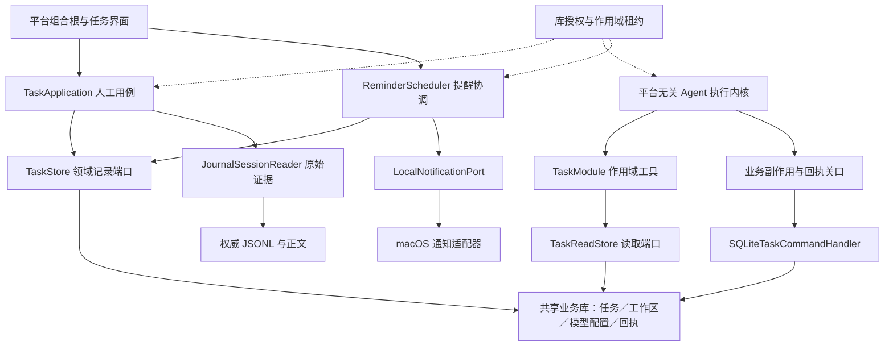
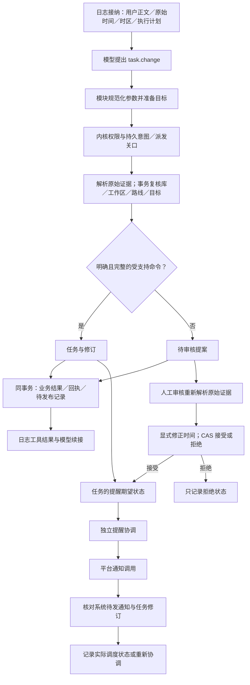

# 任务与本地提醒

本文拥有任务领域的技术契约，产品含义见 [Records](../product/RECORDS.md)。任务模块直接使用新的 Agent 核心，不再关联旧 SQL 会话表。当前为 P4 无 UI 集成；原生宿主、完整遗忘与整库备份仍待后续切换。

任务模块同时在自己的作用域注册 `tasks` 来源权威，通过 `TaskReadStore` 检查当前工作区与修订。上下文携带真实冻结目的地，工作区／模型配置政策由生产 `SQLiteAgentContextPolicy` 复核；来源版本和调用生命周期遵守[来源授权契约](AGENT_SOURCE_AUTHORIZATION.md)。

## 领域边界

`MiraTask` 保存工作区、标题、备注、可选截止时间、状态、修订号及一次性提醒。Inbox 与每个工作区分别查询；完成和取消保留修订历史，重新打开是显式操作。截止时间本身不会启用通知。

`TaskModule` 在所属运行时作用域注册 `task.list` 与 `task.change`。它只依赖 Foundation 和领域读取端口；不认识 SQLite、通知中心或平台。`TaskApplication` 提供人工保存、提案审核与恢复提醒的用例，不拥有 Agent loop，也不模拟模型工具调用。

`SQLiteTaskStore` 实现领域记录端口，`SQLiteTaskCommandHandler` 在共享业务事务中处理模型变更。工作区由 `SQLiteWorkspaceStore` 拥有，当前模型身份由 `SQLiteAgentModelSettings` 校验。平台只需实现 `LocalNotificationPort`；macOS 使用系统通知服务，iOS 当前不实现。

[架构图 SVG](diagrams/agent-task-architecture.svg) · [PNG](diagrams/agent-task-architecture.png) · [Mermaid 源码](diagrams/agent-task-architecture.mmd)

## 原始证据与授权

`TaskEvidence` 必须包含完整 `SessionEvidenceReference`：会话、原始执行、用户消息、接纳事件与序列、正文引用；同时保留完整引文、原始时间和 IANA 时区。没有只有 message ID 的构造器、旧格式解码器或 SQL 消息外键。证据由 `JournalSessionReader` 读取已确认日志前缀取得；重试仍引用最初接纳的消息和时钟。

原始证据是来源定位，不是当前权限。库访问租约保护读取和实际工作生命周期；业务事务再次检查库身份、授权代次及待执行维护记录。工具事务同时复核当前工作区出站策略、连接白名单、冻结路线各层身份与版本，以及任务目标修订号。模型参数不能授予权限。

`task.change` 的 quote 必须与完整接纳消息一致。只有明确、来源中可定位标题／备注及时间的受支持命令才直接提交；模糊意图或需要澄清的时间保存独立提案。现有任务必须提供当前工作区内的 ID 和修订号；工具说明要求先通过 `task.list` 查询。过期目标不会覆盖新修订。

人工接受提案时，`TaskApplication` 根据提案中保存的完整引用重新读取 journal，领域事务核对完整证据、工作区和当前库授权。失效或已删除的原始证据不能通过复制的 quote 恢复授权。拒绝提案无需再次披露原文。接受／拒绝是一次状态转换，重复审核返回冲突。

## 提交与回执

模型写入由 `SQLiteBusinessEffects` 在同一事务提交任务或提案、修订、业务操作结果、调用回执和待发布记录。处理器不能另起事务、访问会话投影、调用模型或安排系统通知。跨存储发布失败由通用回执结算处理，不再次执行领域写入。

业务键包含完整原始证据引用和规范化命令参数。相同来源的重复创建调用共享原业务结果，每个调用仍有自己的回执；不同会话即使使用同一 message UUID 也不会误去重。已完成调用可查询原持久回执用于结算。现有目标的每次新准备仍要求当前修订；不能以去重为由放宽目标 CAS。

人工保存使用单独的显式 operation ID，并将完整请求、任务修订和结果原子保存。相同 ID／相同请求返回原结果；相同 ID／不同请求冲突。

工具输入与输出都使用内核支持的明确 schema 和大小限制。`task.list` 最多返回 50 个任务，结果在 24,000 字节内截取完整条目，附上真正返回的领域来源；到达条目或字节界限时标记 truncated。摘要备注最多 512 个 Unicode scalar。未设置的 due_at／reminder_at 省略，不能用无界对象声明绕过输出验证。

[执行图 SVG](diagrams/agent-task-flow.svg) · [PNG](diagrams/agent-task-flow.png) · [Mermaid 源码](diagrams/agent-task-flow.mmd)

## 时间解释

相对日期与时区来自 journal 的最初接纳，不取工具运行时间或审核时机器的当前时区。`task.list` 返回这个 reference_time 与 time_zone；`task.change` 接受本地 HH:mm，以及 YYYY-MM-DD 或相对 day_offset 之一。

`TaskTimeResolver` 使用严格 Gregorian 匹配，比较夏令时重叠的两种可能值。无效日期、DST 空隙或重叠要求审核，不静默选择一次发生。直接提交还要将原文时间表达式与模型参数核对。现有英文／中文规则覆盖常见今天、明天、数字时刻和整点上下午；其他表述保留待审核提案。循环与条件提醒明确不支持，不降级为一次性通知。

未确定提醒时间的提案，必须由用户选择确切未来时间后才可接受。编辑过去的提醒也需要新的未来时间。`TaskIntentPatterns.json` 中的中文是有意保留的用户语言识别数据，不是本地化提示词；代码标识、工具说明和诊断保持英文。

## 系统调度与工作所有权

`ReminderScheduler` 接收必需的库访问关口和运行时作用域，合并并发 reconcile，请求重跑后继续串行收敛。系统授权只经显式 requestPermission 操作申请，调用本身也由调度器拥有。测试仅注入合成通知端口。

每个实际操作都在租约的 resource factory 内创建任务。取消和撤权会发出取消信号，资源清理等待真正的通知调用返回；不会用外层 Task 已取消假装平台工作已经退出。close 拒绝新增工作并排空已接纳操作。维护协调器必须先关闭所属工作组再清理通知；普通 close 不删除已经存在的通知。

通知标识由精确库 namespace 与稳定 task ID 组成。孤儿清理必须匹配整个 namespace 前缀并单独确认任务不存在；没有出现在有限工作页不等于已删除。任务修订更新使旧系统观察失效；安装后核对 pending 列表，再以修订 CAS 写入观察结果。竞争修改时移除旧请求并重跑。取消／撤权不是伪造的系统调度失败。

记录状态与系统观察分离：

| 状态 | 含义 |
|---|---|
| pending | 已保存，尚未确认系统调度 |
| scheduled | 系统接受了这一任务修订 |
| permissionRequired | 已保存，但通知权限不可用 |
| failed | 调度失败，可重试 |
| elapsed | 触发时刻已过，不能证明用户看到通知 |
| paused | 恢复的提醒，等待显式启用 |
| cancelled / none | 不应继续保留已安排提醒 |

最多接纳 60 个未来活动提醒。无后台 helper、循环引擎、EventKit、同步或日历发布。原生退出后送达、专注模式及系统权限提示仍需平台验收；mock 成功不证明这些行为。

## 存储与待完成集成

任务使用独立 task_schema 版本 1，拥有 mira_tasks、task_revisions、task_proposals、task_operations；工作区使用独立 workspace_schema 和 business_workspaces。数据库必须启用外键与 FULL 或 EXTRA 同步，结构不符明确拒绝。任务数据没有 messages、conversations、executions、message_time_context 表依赖。

领域端口的已接纳 SQL 由适配器持有，close 排空实际队列而不关闭共享数据库。新工作区和任务存储不接受旧 MiraStore。剩余旧领域存储当前版本改为 13，已移除任务表；没有旧库升级或迁移桥。

当前恢复领域原语可以把提醒改为 paused，显式恢复后再调度。**完整 JSONL／正文／业务库备份、跨领域来源校验与清除、提醒维护处理器、生产组合根仍未完成**。旧 SQL 库备份不包含新任务域，不能作为新架构的备份入口。后续 P4／P5 必须完成统一维护和一次性宿主切换，不能增加双写或回退路径。
