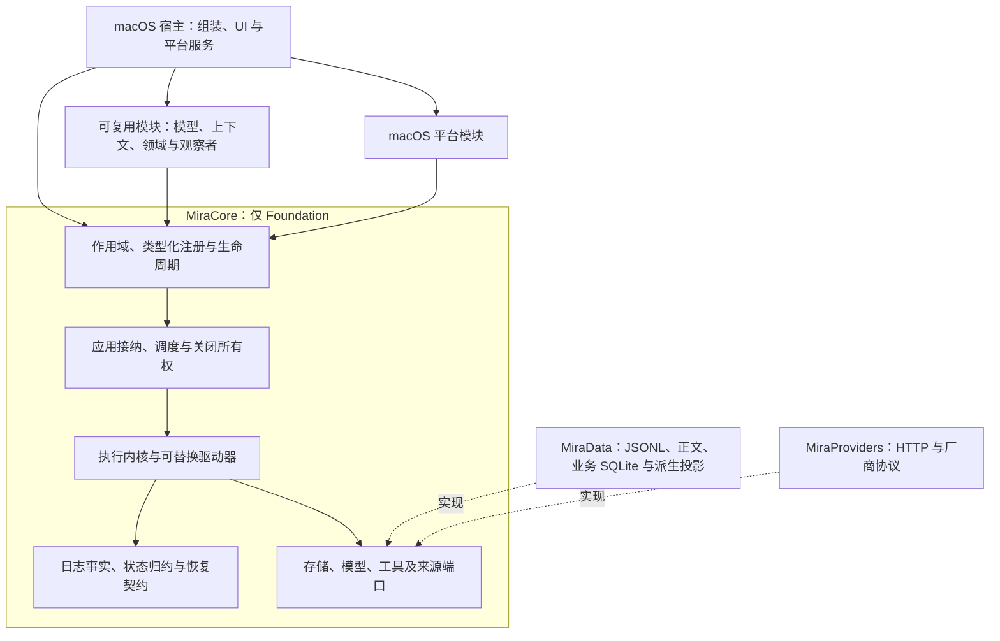
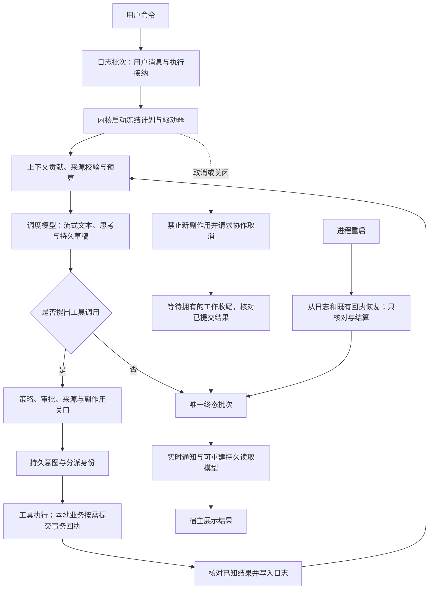

# Agent 核心重建收尾

<!-- Simplified Chinese documentation is explicitly requested by the user on 2026-09-12. -->

日期：2026-09-14。实施分支：`codex/agent-core`。

**核心重建按用户确认的收缩范围完成。** 本次交付是新核心、直接宿主接入、已确认正确性问题修复及关键链路回归，不代表产品发布质量全部通过。

用户于 2026-09-14 确认以三项收尾：修复已确认的正确性问题；通过现有核心关键链路和集成回归；整理中文契约、架构／执行流程及准确证据并提交。联合大库、新一轮规模压测、严格 P95、完整原生矩阵、Instruments 和穷举故障窗口移至后续验收，不再阻塞本次 Goal，也不自动延长任务。历史开发数据直接清理，不做迁移、兼容或备份桥；iOS 不实现。

## 交付的核心边界

[完整核心架构图](../architecture/diagrams/agent-core-architecture.png)与下方简图共同说明当前边界。

`MiraCore` 只导入 Foundation，拥有会话事实、归约、执行内核、可替换驱动器、作用域模块、策略和端口。`MiraData` 实现文件日志、可清除正文、业务 SQLite、投影与恢复；`MiraProviders` 实现 HTTP、模型配置与厂商续接；macOS 宿主组装模块并持有 UI、文件授权、Keychain、通知等平台服务。可共享的领域、模型及上下文模块可以由其他宿主复用，平台能力通过宿主模块注册。

会话日志是权威事实源，用户消息与排队执行以单个提交批次接纳。业务变更与回执在领域 SQLite 事务内完成，再由日志确认。SQLite 会话查询、全文索引和检查点都是可重建读取模型；它们不授予业务权限，也不触发重复副作用。旧会话 SQL 仓库、旧循环、旧 Provider 接口和兼容路径已退役。

## 执行流程

[完整执行流程图](../architecture/diagrams/agent-execution-flow.png)保留详细阶段，下方给出关键路径。

实时通知、可按游标恢复的持久事件读取，以及需要等待的策略阶段分别定义，不用一个事件总线承担全部责任。取消先阻止新副作用；不配合取消的工具仍由原所有者排空。恢复只结算已经发生的操作；外部结果未知时保持未知，不能重做写入来伪造成功。详细契约见[应用运行时](../architecture/AGENT_APPLICATION_RUNTIME.md)、[执行内核](../architecture/AGENT_EXECUTION_KERNEL.md)、[工具回执](../architecture/AGENT_TOOL_EXECUTION.md)和[核心方案](../architecture/AGENT_CORE_PROPOSAL.md)。

## 验收依据

| 核心链路 | 已有并在最终包回归中通过的证据 |
|---|---|
| 接纳、循环、单活动执行与终态 | `AgentApplicationRuntimeIntegrationTests`、`AgentExecutionKernelIntegrationTests`、会话批次／通道测试 |
| 工具策略、审批、副作用与回执 | `AgentToolExecutorIntegrationTests`、`AgentToolPolicyCompositionTests`、业务回执与工具证据测试 |
| 取消、迟到结果、中断与恢复 | `AgentExecutionRecoveryIntegrationTests`、持久草稿与恢复测试、16 个真实 SIGKILL 场景 |
| 模块依赖、激活回滚、注册与释放 | `RuntimeModuleTests`、作用域／所有权测试、六类公开扩展挑战 |
| 领域、维护与宿主直接接入 | Memory／Knowledge／Task 组合、隐私／归档恢复、HTTP 应用组合，以及 macOS Host／Composition 测试 |
| 平台依赖边界 | 104 个 Core Swift 文件仅导入 Foundation；App Debug 构建通过 |

最终完整包 **997 个注册测试／141 个套件，995 个通过、2 个按需规模基准跳过，9.435 秒**。完整宿主测试 **264 项通过、1 项在线评估跳过**。语言检查 **1886 条双语资源通过**，工程重生成无差异，App Debug 构建成功。已通过且代码未变的核心链路没有为收尾额外重跑。精确命令、日志、阶段结果及限制见[核心验证记录](AGENT_CORE_VERIFICATION.md)。

本次归档修复包括：格式 2 的有界文件清单分块、独立的文件／业务行数预算、精确的实际路径比对，以及恢复后规范目录验证。大小写别名掩盖未声明文件的问题已用实际篡改归档复现，修复后通过。中间一次既有会话搜索用例失败，隔离及后续完整回归通过；日志不足以确定是否与 200 ms 预算有关，未放宽断言或隐藏该记录。

十万消息初轮实际归档往返完成，全部会话头与 100,000 条可见正文匹配；该轮随后发现路径别名问题，所以不当作最终代码的完整规模验收。最终代码复测已完成导出、独立验证、恢复副本校验、模块准备和会话结算；用户收缩范围后停止，不能记作最终大规模恢复通过。原始证据和停止状态见[规模记录](AGENT_CORE_SCALE_VERIFICATION.md)。

## 后续验收

以下保留为明确的产品验收任务，**不属于本次已完成 Goal 的前置条件，也不自动继续执行**：

- 十万消息／一千会话与一万记忆／五万知识片段联合运行，以及最终代码的完整规模归档复测。
- 原生可操作页面、完整上下文与会话搜索的严格 P95；OS 冷缓存及主线程／取消延迟的 Instruments 证据。
- 全套原生浅深色、中英文、最小窗口、思考／引用／审批／取消／恢复／切换与阅读位置矩阵，以及验收承接清单中的未关闭项。
- 实际磁盘满、物理断电、更多业务提交与结算取消窗口、归档／恢复所有阶段的真实进程终止和清理重试。
- macOS 15 实际运行时、真实 Provider 与提取质量、签名和分发相关发布验证。

这些延期不改变[质量门槛](QUALITY.md)或既有隐私／副作用保证。iOS 宿主明确不在本次实现范围。后续工作由新的明确任务接纳，不因本报告列出待验收项而持续扩大当前 Goal。
