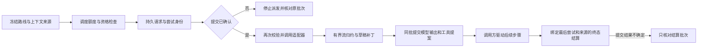

# Agent 核心重建验证记录

<!-- Simplified Chinese documentation is explicitly requested by the user on 2026-09-12. -->

日期：2026-09-14。分支：`codex/agent-core`。目标契约见[核心方案](../architecture/AGENT_CORE_PROPOSAL.md)，阶段依赖见[实施计划](AGENT_CORE_IMPLEMENTATION_PLAN.md)。

## 当前状态

2026-09-14 按用户确认的收缩范围完成核心重建，详见[收尾说明与架构／执行图](AGENT_CORE_COMPLETION.md)。P5 原生宿主已直接接通；联合规模、严格性能指标、完整原生矩阵及穷举故障窗口列为后续产品验收，不再阻塞或自动扩张本次 Goal。组合已具备会话归约、命令通道、文件日志、作用域／注册表、模型额度调度、一次性审批、模型适配器／上下文契约、持久模型执行、工具管线、业务回执，以及单次执行内核、终态结算、应用级接纳／持久计划／任务所有权与中断恢复。生产 HTTP 适配器已直接改用新接口，旧 HTTPModelProvider 已删除；原生会话与记忆入口已切换；Data 设置与显式库切换已接通；Provider 设置已直接切换到新服务，完整 App 已构建成功；HostTests 已直接改写并通过，完整原生交互与规模验收另行接纳。没有新旧核心并行写入或兼容适配层。

已增加独立的[库级授权与持久维护记录](../architecture/AGENT_LIBRARY_MAINTENANCE.md)，工具业务提交检查与结果清除直接依赖同库授权；作用域访问租约、模型／工具接纳关口与应用关闭排空已经实现，维护协调器已连接独立库作用域处理器、工作组关闭及执行／验证，记忆与知识领域清理及文件回收已通过真实新内核组合，归档／独立目录恢复已通过存储组合验证；生产宿主已接通，完整原生验收仍未完成。

[新 macOS 库与工作组组装](../architecture/MAC_LIBRARY_COMPOSITION.md)已实现并通过独立组合测试，已接通后台启动、排空和受限本地恢复。持久索引／检查点已接入权威读取；独立后台提取状态、用量与费用已接通。后续产品验收：完整原生场景、搜索规模性能，以及尚未逐项关闭的原生行为边界。iOS 实现继续排除在本次范围外。新增技术契约见[应用运行时与持久计划](../architecture/AGENT_APPLICATION_RUNTIME.md)、[执行内核与驱动器](../architecture/AGENT_EXECUTION_KERNEL.md)和[工具执行与业务回执](../architecture/AGENT_TOOL_EXECUTION.md)。

## 当前格式分块归档

在 `fbd21b4` 基础上，归档改为只接受 `formatVersion = 2`：根清单保存会话头和分块摘要，每个文件清单分块最多 1,024 条／1 MiB。导出、只读验证与独立恢复逐块处理文件记录，实际目录验证不再建立全库文件清单数组；会话快照与领域索引仍有明确全库容量上限，不能称为整个归档常量内存。文件／正文引用容量上限为 262,144，业务常规行数独立保持 100,000。只实现新格式，不增加旧解码器或转换桥。契约与中文执行流程图见[库归档](../architecture/AGENT_LIBRARY_ARCHIVE.md)。

初轮完整包 `swift test --package-path Packages/MiraKit` 退出 0：**994 个注册测试／141 个套件，992 个通过、2 个可选规模基准跳过，8.404 秒**（`/tmp/mira-archive-chunks-package.log`）。覆盖多块顺序、缺失／额外／损坏／越界分块、重复与倒序、负数与整数溢出输入、解码数量上限、最大路径及根元数据预算、跨块范围重叠。分块写入后的真实导出故障验证关闭等待、数据库写入屏障、暂存清理及迟到目标不可覆盖；既有 16 个真实 SIGKILL 场景继续通过，但它们不等于新增归档阶段的进程终止覆盖。

父级审查修正了初版边界测试的假通过风险：中间块不足 1,024 条会先触发其他拒绝，最长路径原来不足 512 字节；最终测试明确满足前置条件。独立只读审查最初未报告问题；随后父级审查找到并实际复现大小写别名绕过。篡改用例在原校验下未抛错而失败（`/tmp/mira-archive-case-alias-before.log`，1 项／1 套件，0.045 秒）：额外根文件被新增的 `Sessions/PAYLOADS/...` 正文别名抵消数量。最终改为实际目录与清单两个游标逐条比较原始路径。目录游标只保持当前目录栈；新增延迟遍历用例防止回到全库路径数组。

最终完整包退出 0：**997 个注册测试／141 个套件，995 个通过、2 个可选规模基准跳过，9.435 秒**（`/tmp/mira-archive-chunks-package-acceptance.log`）。中间一次完整回归的既有 `negativeScopeAndArchiveFilters` 命中数量断言失败（`/tmp/mira-archive-chunks-final-package.log`）；该查询有 200 ms 预算，但日志未记录截断状态，不能确定归因。保留失败且没有放宽断言或修改搜索实现；隔离的该用例、路径别名及清单测试共 15 项／3 套件通过，0.102 秒，随后完整验收通过。[路径别名失败与修复证据](evidence/agent-archive-case-alias-20260914.json)保留实际结果。

完整 `MiraHostTests` 退出 0（`/tmp/mira-archive-chunks-host.log`）：Host 的 87 项 Swift Testing 通过，11.438 秒；24 项 XCTest 中 23 项通过、1 项在线评估跳过。Composition 的 149 项 Swift Testing 通过，54.560 秒，另 5 项 XCTest 通过；合计 **264 项通过、1 项跳过**。App Debug 构建退出 0（`/tmp/mira-archive-chunks-app.log`），工程重生成无差异，语言检查 1886 条双语资源通过，Core 104 个 Swift 文件仍只导入 Foundation。没有 UI 修改或本轮原生视觉矩阵验证。

用户收缩范围后，停止在途最终大规模复测：已完成真实导出及独立验证、私有副本校验、模块准备与会话结算，未发布恢复目标，不能计作完整最终规模往返通过。[停止证据](evidence/agent-session-archive-stopped-20260914.json)记录 SIGTERM 与检查点。测试输出和此前保留的参考合成语料按授权清理，无备份；[规模记录](AGENT_CORE_SCALE_VERIFICATION.md)保留首轮完整往返及实际限制。以下各增量中的“Goal 继续”等语句描述当时状态，当前完成范围以本文开头及收尾说明为准。

## 应用启动恢复摘要与必需扩展

在 `29d2db4` 基础上补齐 `AgentApplicationRuntime.open(extensionSchemas:)` 到启动读取器和之后创建的全部 `SessionRuntime` 的传递。必需扩展已注册的宿主能够正常重开；缺失或错误版本仍拒绝启动，不从模块生命周期注册猜测持久事件支持。当前 macOS 组合没有额外必需会话 schema，继续使用明确的空集合语义。

应用启动通过[精确恢复摘要](../architecture/AGENT_SESSION_READS.md#应用启动恢复摘要)筛选活动会话。文件摘要只从完整、已验证的状态生成，绑定库 HMAC、完整日志前缀、归约版本、精确 head 和 schema 集合；核心仍复核目标批次，活动执行仍加载完整状态并只进行中断结算。摘要跟随完整检查点的 flush 发布，没有在逐事件提交增加同步写入。没有改日志、正文或归约状态格式，也没有旧数据桥接。

定向验证 **43 项／4 套件**通过，0.451 秒（`/tmp/mira-recovery-summary-focused.log`）。完整包退出 0：**983 个注册测试／140 个套件，981 个通过、2 个可选规模基准跳过，7.831 秒**（`/tmp/mira-recovery-summary-package.log`），包括全部 16 个真实 SIGKILL 场景。新增测试验证实际摘要命中时不加载完整检查点、只解码一个目标批次；有效完整检查点重建缺失摘要；损坏、非密钥伪造、正确签名但错误版本／前缀／schema／head 均不能命中；未知必需扩展拒绝；后续活动接纳不能被旧已结束摘要隐藏；历史读取不能覆盖最新摘要；四个摘要写入／发布故障点不改变提交。应用组合验证实际中断终态、启动后首次加载／释放重载的 schema 传递和零驱动器分派。

完整 `MiraHostTests` 退出 0（`/tmp/mira-recovery-summary-host.log`）：Host 的 87 项／15 套件通过，11.417 秒；24 项 XCTest 中 23 项通过、1 项在线评估跳过。Composition 的 149 项／30 套件通过，54.484 秒，另 5 项 XCTest 通过；合计 **264 项通过、1 项跳过**。App Debug 构建退出 0（`/tmp/mira-recovery-summary-app.log`）。工程重生成无差异，语言检查 1886 条双语资源通过，Core 104 个 Swift 文件仍只导入 Foundation。本轮未改 UI，也未启动原生 App 或重跑视觉矩阵；新增测试及规模探针使用隔离合成资料，不请求外部 Provider 或操作真实凭据。

同一十万消息库的核心启动前后各 5 次预热、30 次独立进程样本全部通过：就绪 P95 从 **6,996.55 ms** 降至 **2,451.11 ms**，应用打开阶段从 4,805.99 ms 降至 213.36 ms；完整源日志校验保持。首次缺失摘要重建合计 8,927.29 ms 单列，不混入常态 P95。配对测量、原始样本及边界记录在[规模验收](AGENT_CORE_SCALE_VERIFICATION.md#十万消息核心应用启动配对测量)。此项不代表原生可操作页面、联合领域库、完整上下文、会话全文搜索、归档或剩余故障矩阵已经验收；Goal 继续进行，iOS 排除。

## 正文定向恢复与十万消息读取

在 `104ef86` 基础上将普通启动的全库正文检查拆为明确职责：先验证完整日志源字节和失效事实，只处理持久待发布记录指向的批次；实际正文读取继续验证权限、路径、类型、长度与摘要。归档验证全部保留正文，显式隐私维护仍全库回收和验证孤儿文件。待发布目录缺失时先全量重建，不能把元数据丢失当作没有遗留文件。接口及中文架构／执行流程图见[正文恢复契约](../architecture/AGENT_SESSION_LOG.md)。

stage 在正文创建前同步零字节批次标记；已确认日志之后清除同批未引用正文，先同步正文目录再删除并同步标记。后续清理失败不撤销已提交批次，也不把 committed 改成未提交。不确定追加仍保留原批次与 fence。独立恢复器在资源排空后移除私有写入器的派生目录，再执行纯来源验证。

完整包 `swift test --package-path Packages/MiraKit` 退出 0：**972 个注册测试／139 个套件，970 个通过、2 个可选规模基准跳过，7.732 秒**（`/tmp/mira-payload-recovery-package.log`）。新增实际文件测试覆盖 dormant 正文损坏在读取／归档时拒绝、已提交正文保留、同批孤儿清理、marker 前后失败、恢复元数据缺失、非法名称、符号链接与硬链接。计数诊断确认正常重开不遍历正文批次目录，未完成批次被定向处理，日志源字节仍被验证。新增 4 个真实 SIGKILL 窗口后，全部 **16 个**进程终止场景通过；范围见[进程恢复记录](AGENT_PROCESS_CRASH_VERIFICATION.md)。独立只读审查未发现正文丢失或提交判断错误的反例。

Release 探针经真实 API 生成并精确重放 **100,000 条消息／1,000 个会话**，5 次预热和 30 次新进程读取全部完成。OS 热缓存的文件库到可见正文页 P95 为 **2,536.37 ms**；峰值 RSS 的 P95 约 284 MiB。完整投影重建单次 158,037.53 ms，其文件库打开单次 3,488.77 ms，另列而不并入常态 P95。完整原始样本和文件分项见[规模证据](AGENT_CORE_SCALE_VERIFICATION.md#十万消息定向正文恢复)。没有把文件读取路径称为原生 App 启动。

App Debug 构建退出 0（`/tmp/mira-payload-recovery-app.log`）；工程重生成无差异，1886 条双语资源通过语言检查，Core 104 个 Swift 文件仍只导入 Foundation。未改 UI，未重跑 HostTests 或原生视觉矩阵。所有用例使用临时合成资料，不调用 Provider 或 Keychain；本轮没有运行中的 Mira App。十万消息语料暂时保留用于接下来应用恢复／启动的配对测量，路径仅在本机未提交的测量报告中，验证完成后清除。

该轮结束时，应用级恢复仍逐会话加载完整状态；后续恢复摘要增量见上文。联合领域库、完整上下文、原生可操作页面、会话全文搜索、归档限额与往返，以及剩余故障矩阵继续实施。iOS 排除，Goal 保持进行。

## 真实规模测量与检索修复

在 `b85a19d` 上增加独立 Release 会话探针和默认跳过的领域基准，通过实际 API 生成合成资料，不读取历史用户数据。基线、失败证据、前后完整分布、测量边界和复现命令统一保存在[规模验证记录](AGENT_CORE_SCALE_VERIFICATION.md)。

一万真实消息的相同物理语料经 5 次预热／30 次新进程复测，读取路径 P95 从 3,503.61 ms 降至 2,521.52 ms。修改只把 SHA-256／HMAC 的逐字节通用格式化改为固定 ASCII 十六进制，保留源字节及正文完整校验。该路径不是原生可操作页面，OS 文件缓存已预热；完整重建的单次观察并未改善，没有宣称十万消息或原生启动通过。

一万记忆／20 文件／五万知识片段基线实际出现 150 项断言失败。Knowledge 改为先排序候选行 ID，再读取实际消费的正文；Memory 的短中文 OR 分支优先完整字面短语，保留原候选和授权过滤。最终原始八类查询的 240 个样本全部符合语义断言，Knowledge P95 最高 249.39 ms。规模与短语回归使用实际领域 API；不放宽候选上限、截止时间、来源验证或过滤条件。

最终 `swift test --package-path Packages/MiraKit` 退出 0：**965 个注册测试／138 个套件，963 个通过、2 个 opt-in 规模基准跳过，7.572 秒**（`/tmp/mira-scale-package-final.log`）。运行前删除生成的 Debug 崩溃探针，SwiftPM 自动重建；12 个真实 SIGKILL 场景通过。Release 聚焦运行另包含两个排名回归、12 个 SIGKILL 场景和完整领域基准：4 个测试／3 个套件通过，271.220 秒（`/tmp/mira-scale-release-final.log`）。两个配置的测试链接清单都不含探针对象文件，消除先前 Release 入口冲突。

App Debug 构建退出 0（`/tmp/mira-scale-app-final.log`）；`xcodegen generate` 无工程差异，语言检查 1886 条双语字符串通过，Core 104 个 Swift 文件仍只导入 Foundation。脚本语法检查与 diff 空白检查通过。本轮没有更改 UI，也未重跑原生视觉矩阵或 HostTests；包和构建不代替这些证据。两份保留用于配对复测的合成会话库已删除，领域基准自行关闭并删除其临时库；没有备份、旧格式适配、真实凭据或模型调用。

启动全库扫描、十万消息／一千会话联合领域库、完整上下文、归档限额和往返、剩余失败矩阵及原生行为验收仍需完成。Goal 保持进行，iOS 排除。

## 独立后台提取状态、用量与费用

在 `b738155` 基础上增加 Foundation 的 `MemoryExtractionStatusReader` 与 `MemoryApplication` 租约入口，按工作区、会话与原始完成回合查询作业；分页使用时间／ID 边界，单作业事务返回全部最多 100 次尝试。当前 SQLite 格式直接增加完成 ID 索引和带校验和的有界 accounting 列，不兼容旧开发库。成功输出的实际 `TokenUsage` 独立保存，正文清理后仍可查询，且不再向费用查询提供冻结路线。结构与流程图见[提取查询契约](../architecture/AGENT_EXTRACTION_QUERIES.md)。默认驱动器、归约器及会话格式没有改变。

实际覆盖范围：

- 真实日志完成与领域存储依次产生未发送失败、已发送失败、显式重试和成功尝试；查询保留独立 ID、ordinal、状态及可选计数。独立数据库连接重开读取完全相同。实际领域清理保留用量与扣减、移除查询路线；原有完整遗忘流程继续回归。
- 多策略作业跨三个来源、两个工作区验证 LIMIT 前过滤、相同创建时间的无重复分页、范围不匹配游标与详情拒绝。查询不包含用户原文、响应、思考或错误正文。报告与日预算不加载请求／输出 JSON；用量校验和损坏拒绝读取，归档拒绝被篡改的 accounting。
- 业务提交失败回滚到 dispatched、用量仍为 nil、扣减仍为零。清理保留实际用量的断言加入原有遗忘测试。终态顺序、actual dispatch 日及费用冻结继续由持久类型验证。
- Provider 逐次冻结价格只计算实际调度；未发送预留不是调用，已发送失败或尚未完成计未知，已知小计不能冒充总额。缺少必要计数时不使用预算扣减推算价格；每次路线可以不同。
- macOS 检查器复用 `MacSessionReadModel`，独立显示作业与尝试。真实应用组合验证无提取路线时 Worker 将作业暂停且没有模型调用，观察器收到业务提交后读取它，导出重建后重新绑定，旧工作组拒绝读取，关闭撤销显示值。状态查询的非协作读在撤权后拒绝迟到结果，关闭等待实际返回。

最终包命令 `swift test --package-path Packages/MiraKit` 退出 0：**961 个注册测试／136 个套件，960 个通过、1 个可选规模基准跳过，8.254 秒**，日志 `/tmp/mira-extraction-query-serial-final.log`；包含 12 个真实 SIGKILL 场景。先前与 Xcode 工作同时进行的一次包回归，既有 `invalidUTF8RetainsFailedVersionWithoutReplacingCurrent` 的搜索命中断言失败（`/tmp/mira-extraction-query-final.log`）。该查询有 200 ms 截止时间；负载导致截断是当前推测，未作确定性诊断。该用例独立复测 0.034 秒通过，随后停止并行构建后的完整包通过；没有修改知识检索算法或放宽断言。

App Debug 构建退出 0（`/tmp/mira-extraction-query-app.log`）。新的组合读取测试连同既有生命周期测试聚焦 **7 项／1 套件通过，1.511 秒**（`/tmp/mira-extraction-observer-test.log`）。最终完整 `MiraHostTests` scheme 退出 0（`/tmp/mira-extraction-final-host.log`）：Host 的 87 项 Swift Testing／15 套件通过，11.212 秒；24 项 XCTest 中 23 项通过、1 项 opt-in 在线评估跳过，7.848 秒。Composition 的 149 项 Swift Testing／30 套件通过，50.367 秒；另 5 项 XCTest 通过，0.017 秒。合计 **264 项通过、1 项跳过**。语言检查 **1886 条双语字符串通过**；Core **104 个 Swift 文件只导入 Foundation**。

原生检查使用最终 Debug App、`--demo --data-directory /tmp/mira-extraction-native-20260914`：本机合成回合完成后打开执行检查器，在 1100×760 窗口分别核对中文深色和英文浅色的自动记忆空状态、前台未知费用与文字换行，未观察到覆盖。试选自动捕获时，设置正确要求先配置提取模型，未保存该更改；随后恢复简体中文／跟随系统，正常退出状态 0，删除合成目录，默认开发目录仍为空。证据为本任务 CUA 原生 AX 与截图；不把测试资料库提交到源码。

本轮没有在原生 App 中验证含完成／失败／清理后尝试的完整视觉矩阵、最小窗口、全部分页操作或真实模型费用；这些状态的领域、价格及所有权覆盖不冒充原生视觉验收。尚需继续规模性能、剩余失败矩阵与原生边界。iOS、付费模型端点及 macOS 15 运行时未加入本轮验证；Goal 保持进行。

## 历史记忆状态查询与宿主刷新

在 `6801cc7` 基础上补齐 `MemoryApplication.contextNotices`、记忆领域只读事务与持久隐私历史读取接口。普通 completed 回复使用实际日志请求和精确来源修订；保留历史核对已完成维护的原计划与原失效批次。明确保存的本地回执由记忆模块解释 `memory.forget` 目标，不虚构正文曾发送给模型。核心架构及执行流程图见[历史状态契约](../architecture/AGENT_MEMORY_HISTORY.md)。驱动器、归约器和存储格式没有因这项查询改变。

父级审查修正了来源工作区判断：全局记忆的来源工作区可以不同于当前会话，必须检查实际发送政策。新增领域覆盖全部生命周期、发送限制、来源工作区撤权、缺失／越界对象、精确修订、去重、坏输入、存储损坏和关闭后拒绝；真实对话验证会话隔离、失败回复不冒充 completed、缺失请求不能静默成功、查询不追加日志。既有遗忘重开组合增加保留标签、重复查询、篡改计划拒绝，以及引用和重放仍不可访问的断言。跨三会话依赖链验证新历史入口返回同一原始领域来源；pending 维护、其他会话与伪造失效批次均拒绝。

最终完整包 `swift test --package-path Packages/MiraKit` 退出 0：953 个注册测试／135 个套件，952 个通过、1 个可选规模基准跳过，7.068 秒（`/tmp/mira-history-final-tests.log`）。其中 12 个真实进程终止场景继续通过。此前聚焦领域及所有权验证 18 项／5 个套件通过，2.103 秒；会话模型聚焦运行 9 项／1 套件通过，23.688 秒（`/tmp/mira-history-host-focused.log`）。

完整 `MiraHostTests` scheme 退出 0（`/tmp/mira-history-host-tests.log`）：Host 的 87 项 Swift Testing／15 套件通过，11.392 秒；24 项 XCTest 中 23 项通过、1 项 opt-in 在线评估跳过，7.760 秒。Composition 的 148 项 Swift Testing／30 套件通过，52.866 秒；另 5 项 XCTest 通过，0.014 秒。合计 263 项通过、1 项跳过。App Debug 构建退出 0（`/tmp/mira-history-app-build.log`）。工程重新生成无差异；1872 条双语字符串检查通过，Core 103 个 Swift 文件仍只导入 Foundation。

宿主测试验证业务提交后已缓存非活动页面的 updated／archived 提示刷新、目标页面隔离、消息读取计数不增加、草稿与阅读位置保留、观察结束清空并排空提示任务。复用既有标签，没有新增界面或修改设计令牌。完整原生浅深色／中英文／最小窗口视觉矩阵仍待验收；当前查询在读取时判断有效期，没有在静止页面上单独按时刷新到期状态。后台独立费用查询、规模性能及剩余失败矩阵继续推进，iOS 排除。

## 真实进程终止后的恢复

在 `bc7305d` 基础上增加测试专用可执行目标 `MiraCrashProbe` 和 `AgentProcessCrashTests`。通过明确持久化边界发出的就绪标记触发 SIGKILL，确认子进程实际被该信号终止，再先后用两个新进程恢复和核对幂等性。12 个场景覆盖正文暂存、日志写入／同步／半条尾记录、接纳与终态提交、仅思考草稿、业务提交与待发布回执，以及隐私失效和正文 unlink。具体边界、执行流程图与限制见[进程终止验收](AGENT_PROCESS_CRASH_VERIFICATION.md)。

实际 `AgentApplicationRuntime` 在恢复中保留原始用户／回答／思考，核对同一回执身份，并维持一个终态；真实数据库的模型／业务计数证明没有重新分派。隐私场景使用已持久化的原操作和完整计划，在 pending 阻止普通访问的状态下恢复；验证隐藏文件和业务结果正文实际消失，允许保留的正文逐字不变，执行排除状态保留。

聚焦测试通过 1 个参数化测试／1 个套件中的 12 个场景，2.173 秒（`/tmp/mira-process-crash-expanded.log`）。整理格式后完整包回归退出 0：949 个注册测试／133 个套件，其中 948 个通过、1 个可选规模基准跳过，7.034 秒（`/tmp/mira-process-crash-final-tests.log`）；完整负载中的 12 个场景均通过。`xcodegen generate` 没有产生工程差异；App Debug 构建退出 0（`/tmp/mira-process-crash-app-build.log`），构建图中没有测试探针目标。语言检查含 App／Host 提取目录仍通过 1868 条双语字符串；Core 103 个 Swift 文件只导入 Foundation。没有改生产实现或恢复旧接口。

此结果补齐选定的真实写入进程终止证据，仍不代表真实磁盘耗尽、物理断电、备份安装时中断、所有并行取消／领域组合或完整 P6 已完成。当前原生行为、规模与领域查询缺口保持原范围。本轮没有 UI 变更，未重复上一生产增量的 HostTests／CompositionTests，也未把构建当作原生运行验收。

## 六类公开扩展挑战

在 `789811a` 基础上新增三个测试文件，实现独立工具／事务回执、带来源权威的上下文贡献器、独立配置与 opaque 续接策略的提供方、持久游标观察者、替代驱动器以及可回滚／重激活的作用域模块。详细实现边界和真实断言见[扩展挑战验收](AGENT_CORE_EXTENSION_CHALLENGE.md)。扩展文件普通导入公开模块；生产源文件、默认循环、会话归约器、平台及 `Package.swift` 均没有变更。

聚焦验证通过 13 个测试／3 个套件，驱动器测试含两个参数场景，耗时 0.219 秒（`/tmp/mira-extension-challenge-focused.log`）。随后进一步收紧慢观察者测试的屏障：仅由真实 scope disposal 取消拥有的任务，其排空证明释放已经开始，再断言目录租约仍阻塞释放。

完整正式包 `swift test --package-path Packages/MiraKit` 退出 0：948 个注册测试／132 个套件，其中 947 个通过、1 个可选大库基准按条件跳过，耗时 6.620 秒（`/tmp/mira-extension-full-tests.log`）。新增测试只使用隔离合成资料库，没有网络或真实凭据。`xcodegen generate` 后 App Debug 构建退出 0（`/tmp/mira-extension-app-build.log`），生成工程没有差异。语言检查含 App 和 Host 提取目录，通过 1868 条双语字符串；Core 103 个 Swift 文件仍只导入 Foundation。本轮未改生产或宿主源码，因此不重复运行上一增量已通过的 HostTests／CompositionTests，也不将 App 构建作为原生交互验收。

这组结果关闭六类选定扩展挑战，尚不关闭完整 P6 失败矩阵、规模性能、历史状态提示、独立后台提取费用查询及完整原生验收。既有故障注入和重开测试不能被当作真实写入进程终止／断电实验。

## 会话全文检索、隐私清理与宿主服务

在 `9795ac5` 基础上新增平台无关的 `SessionSearchService`、搜索端口及日志追赶／来源核对。SQLite 索引位于独立的 `Projections/Search.sqlite`，只保存明确可见文本的派生内容和定位；结果摘要从当前仍保留的正文重新生成。默认驱动器、Provider、工具循环及原始会话格式没有为搜索建立兼容接口。中文契约、核心架构图与执行流程图见[会话搜索](../architecture/SEARCH.md#新核心会话搜索)。

已覆盖实际链接 SQLite 的临时 FTS 探测、英文／中文两字和三字／混合路径／字面符号、trigram 禁用回退、Scope／时间／归档过滤、真实多页游标与候选上限、零时间预算截断、取消错误、批次幂等／冲突／缺口、重复或错误文档拒绝、保留组失效、完整缓存清理和旧游标失效。清理失败保留不可读状态，排除不安全链接后能重试；验证能检测“正文及元数据行已空、FTS postings 仍残留”的状态。测试使用缩小的候选上限验证控制逻辑，不将其记作生产规模测量。

核心组合覆盖可见思考、增量追赶不重复读取正文、索引不能代替缺失／损坏原文、整页正文预算在读取前拒绝、重建跳过已清理历史、来源 Scope 和原始事件时间复核、共享任务的关闭排空及库维护撤权。真实隐私维护先失效与清理正文，再丢弃整个全文缓存；新搜索服务保留可见历史且不能恢复已清理回答。宿主组合覆盖模型／工具对话后的本地搜索、关闭后拒绝新查询、重新打开后查询成功且没有额外模型调用。

父级完整包命令 `swift test --package-path Packages/MiraKit` **退出 0**，日志 `/tmp/mira-search-full-tests.log`：**935 项注册测试、129 个套件，7.692 秒；934 项通过，1 项可选读取基准跳过**。相对上一检查点新增 22 项。随后补强时间边界验证，索引保留完整定位编码，SQL 时间使用 Foundation 的原始参考时间数值，避免先转换 Unix 秒再转换回来的精度损失；最终检索聚焦运行 **22 项、2 个套件通过，0.193 秒，退出 0**，日志 `/tmp/mira-search-final-focused.log`。

完整 App 最终构建 **退出 0**，日志 `/tmp/mira-search-final-app-build.log`。工程已重新生成；核心 **103 个 Swift 文件，仍仅导入 Foundation**。新增 12 条错误均有英文与中文资源，语言检查 **1,868 条通过**，包括 App 与 Host 编译器提取结果。默认开发目录仍存在且为空；遗留的 13 个独立搜索测试目录已在测试关闭后清理，没有新增真实会话、凭据或模型请求。

最终完整 `MiraHostTests` scheme **退出 0**，日志 `/tmp/mira-search-final-host-tests.log`。Host：**87 项 Swift Testing／15 套件通过，11.456 秒；24 项 XCTest 中 23 项通过、1 项 opt-in 在线评估跳过，7.816 秒**。Composition：**147 项 Swift Testing／30 套件通过，52.428 秒；另 5 项 XCTest 通过，0.014 秒**。合计 **262 项通过、1 项跳过**。

这个增量不增加搜索界面，也不替代十万消息／千会话规模、冷重建与峰值内存、完整原生矩阵、扩展挑战、后台费用／历史状态查询及 macOS 15 实际运行验收。索引任意内部篡改的自动重建仍未实现，当前清理重建边界已在所属契约中说明。Goal 保持进行中。

## 持久偏移索引、状态检查点与读取基准

在 `4986d38` 基础上实现日志偏移分页、逐记录扫描、完整状态检查点和缓存写入器认证。源日志仍是权威；查询 SQLite 不提供状态或权限。读取缓存前验证 HMAC、格式、完整源日志字节摘要，检查点另验证完整批次前缀和精确扩展 schema 集合。缓存及认证材料全部可删除重建，归档不包含它们。完整契约及执行流程图见[会话读取](../architecture/AGENT_SESSION_READS.md#持久偏移索引与状态检查点)。

存储故障与不变量覆盖：索引缺失／损坏／过期／跨目录不安全链接、恢复完整但缺少换行的尾部、已提交日志损坏、打开后源文件变化、每个索引／检查点写入和发布故障、缓存元数据连同普通校验和被改写、缓存认证材料丢失／截断／权限过宽、完整缓存删除后等价重建、失效后缀重放和正文不可复活、扩展 schema 变化、历史前缀不采用较新检查点，以及核心关闭对缓存发布的实际排空。未确定追加不能发布新状态检查点；缓存错误不改变已确认提交结果。

首次完整回归发现并修正两个调用边界：原测试日志的 `batch(id:)` 必须真正返回其持有的批次，不能永远返回 nil；独立恢复暂存目录必须在私有写入器关闭后清除其缓存，再执行纯来源内容验证。保留删除的目录同步屏障：前次 unlink 成功但 fsync 失败时，重试仍需同步目录，不能根据文件已经不存在跳过。

父级完整包 `swift test --package-path Packages/MiraKit` **退出 0**，日志 `/tmp/mira-journal-checkpoints-full-tests.log`：**913 项注册测试、127 个套件，7.070 秒；912 项通过，1 项读取基准按默认配置跳过**。该基准随后单独显式运行并通过，见下表；没有把跳过算作性能通过。最后补强“历史读取不得替换较新的热检查点”后，文件检查点及命令通道聚焦回归 **19 项、2 个套件通过，0.122 秒，退出 0**，日志 `/tmp/mira-checkpoint-final-focused.log`。

最终完整 App 构建 **退出 0**，日志 `/tmp/mira-checkpoint-app-build.log`；`xcodegen generate` 已执行且生成项目无差异。MiraCore 为 **100 个 Swift 文件，仍只导入 Foundation**。新增 3 条应用错误均有英文与中文资源，语言检查 **1,856 条通过**，包括 App 编译器提取结果。默认开发资料库保持在原路径且为空；所有新增存储与性能测试使用独立合成目录，结束后清理，没有真实会话、Provider 凭据或付费请求。

最终完整 `MiraHostTests` scheme **退出 0**，日志 `/tmp/mira-checkpoint-host-tests.log`。Host：**87 项 Swift Testing／15 套件通过，11.430 秒；24 项 XCTest 中 23 项通过、1 项 opt-in 在线评估跳过，7.875 秒**。Composition：**147 项 Swift Testing／30 套件通过，52.266 秒；另 5 项 XCTest 通过，0.015 秒**。合计 **262 项通过、1 项跳过**。包括 Host 编译器提取结果的语言检查同样通过。这些自动测试不替代完整原生外观／交互矩阵、macOS 15 实机运行及真实模型质量验收。

### 元数据读取基准

命令：`MIRA_MEASURE_SESSION_READS=1 swift test --package-path Packages/MiraKit --filter SessionReadMeasurements`。日志 `/tmp/mira-session-read-measurements.log`，**1 项基准通过，27.292 秒，退出 0**。环境为 Apple Silicon arm64、macOS 26.6.2（25G83）、Swift 6.3.3；Debug 测试进程。每个规模单会话，5 次预热、30 次采样，P95 为排序后的第 29 个值；运行时没有并行 Xcode 构建。

| 合成日志批次数 | 日志字节 | 索引字节 | 检查点字节 | 首次完整归约 ms | 文件库重开 P95 ms | 检查点恢复 P95 ms | 末尾 10 批分页 P95 ms |
|---|---:|---:|---:|---:|---:|---:|---:|
| 1,000 | 751,228 | 274,600 | 80,268 | 171.63 | 46.83 | 2.60 | 1.76 |
| 10,000 | 7,528,231 | 2,767,273 | 782,270 | 1,986.68 | 450.29 | 14.98 | 1.83 |

计数断言确认每次重开从认证索引读取、扫描解码批次数为零；恢复使用检查点，恢复加末尾分页一共只解码 12 批记录。源日志字节依然完整校验，尚不是按文件时间跳过读取。合成记录重复引用两个很小的正文，用于隔离日志与状态读取；它们**不是 1,000／10,000 条消息**，也不是 1,000 会话、十万消息、10,000 记忆、50,000 知识分块或指定 Markdown 正文分布的验收。首次归约只有一次测量，不能当作其 P95；尚未测峰值内存、进程启动或主线程停顿。

索引和检查点可用减少了重复解码及归约。全库正文完整性校验、目录清扫、长历史元数据的内存增长、无缓存全量归约和完整搜索性能仍须在 P2／P6 的产品规模测试中测量。本轮没有缩小这些后续目标。

## Host 测试直接切换与离线评估入口

在 `d6a08e2` 基础上，旧会话选择、Provider 连接设置、32 场景记忆基线及手工评估文件已直接改用新接口；没有恢复 `SQLiteMiraStore`／`MiraApplication`／旧 Provider、添加兼容夹具或排除旧文件。行为映射与精确未覆盖项见[验收承接清单](AGENT_CORE_ACCEPTANCE_TRANSFER.md)。

父级完整 `MiraHostTests` scheme **退出 0**，日志 `/tmp/mira-new-host-tests.log`：Host 目标 **87 项 Swift Testing、15 个套件通过，10.917 秒；24 项 XCTest 中 23 项通过、1 项 opt-in live 评估跳过，7.734 秒**。同一 scheme 的 Composition 目标 **147 项 Swift Testing、30 个套件通过，46.100 秒；另 5 项 XCTest 通过，0.016 秒**。合计 **262 项通过、1 项跳过**，没有把跳过的在线质量评估算作通过。

本轮实际修复并验证了测试假设：规范模型池预设使用模型对应的 ID；用途绑定按当前修订 CAS；空会话的输出通知可有 cursor 而无正文；缓存重读不保证内部恰好一次调度。目录测试验证用于 UI 选择的逻辑模型 ID 稳定，不比较每次临时候选新建的内部 UUID。连接关闭会刷新可用路线，并保留已挂载消息页、草稿和阅读位置；此处页面计数不等于底层日志扫描量。

32 场景双语基线保留原 corpus 和 JSON 附件，实际结果 **16/16 authored positives accepted；0 unsafe activations**。它以乐观、整段原文的合成提取结果隔离宿主 triage，不能用于宣称真实模型提取、跨会话召回或 Q04 质量通过。

手工评估仅在 `MIRA_RUN_LIVE_MEMORY_EVAL=1` 后启用，并显式要求 corpus、全新报告路径、HTTP family、endpoint、model ID、API key 与上下文限制；每轮使用独立临时库、内存凭据、实际审批拒绝／排空和当前执行完成状态。相同模型的对话与提取可使用一个模型记录和两个预设。报告保留记忆期望、来源召回、引用验证及关键词启发式；无可见提取结果且无法确定作业状态时记录 `unavailable` 和未完成 mismatch。request authorization 计数是保守凭据读取接纳次数，不冒充准确 HTTP 派发数。

新增离线设置测试验证缺失上下文／零输出上限被拒绝、同模型双预设可解析、配置不读取模型凭据。没有运行任何真实模型或访问系统 Keychain。原生选择夹具的 First／Second 标签改为明确的 verbatim 测试数据，避免进入生产 UI 翻译目录；最后聚焦选择测试 **6 项、1 个套件通过，0.801 秒，退出 0**，日志 `/tmp/mira-host-selection-localization-tests.log`；包含 Host 编译器提取结果的语言检查 **1,853 条通过**。这些复核不重复计入以上全量用例。

## 完整执行用量与费用汇总

在 `31e2379` 基础上，审计页增加同一日志 head 下的全部尝试用量元数据；正文页只显示一条时，汇总仍包含全部步骤和自动重试。核心只返回事实，Provider 用已冻结路线逐次估价；失败／中断／缺用量／缺价格均保留为未知次数，不用已知小计冒充总额。计划被清理后不会从当前设置补价格，独立手动重试不会合并旧执行。契约见[审计读取](../architecture/AGENT_SESSION_READS.md)及[用量费用](../architecture/USAGE_AND_COST.md)。独立后台提取作业的跨尝试费用查询仍待补齐。

父级完整包 **887 项、123 个套件通过，5.725 秒，退出 0**，日志 `/tmp/mira-execution-usage-package-tests.log`。覆盖正文分页与汇总一致性、自动重试的成功／失败各自保留、手动重试隔离、纯本地执行、隐私清理后的元数据，以及部分已知／全部未知估价。前一轮与 Xcode 编译并行时，已有来源授权夹具的 5 秒条件等待超时，清理释放生产者又触发附带的预期终态失败；本轮只将夹具的可取消等待期限调整到 15 秒，保留 1 ms sleep 与全部授权断言，没有生产逻辑变更。后续串行全包通过，聚焦来源授权 5 项也通过。

完整 App 最终构建退出 **0**，日志 `/tmp/mira-execution-usage-app-build.log`。原生本地演示显示费用“未知”、已知小计 `$0.00` 和 1 次费用未知调用；没有报告虚假的零费用总额。执行详情使用 `ViewThatFits`，当前 180 pt 窄栏中的长标签／UUID／未提供的用量改为上下排列，拉宽到约 340 pt 后短字段恢复横向；保留原生 180–480 pt 分栏边界。中文深色 1100×760 实际截图／AX 已检查，无重叠或单字挤压。完整浅色／英文／最小窗口矩阵仍待验收，不据此关闭全部原生门槛。

所有合成目录在正常退出 0 后删除；没有调用网络或 Keychain。语言检查仍为 **1,853 条双语资源通过**，没有新增 UI 文案；MiraCore 仍为 **99 个 Swift 文件且只导入 Foundation**。旧 Host 测试直接改写另行验收，不能以包和 App 通过替代它。

## Provider 设置直接切换与首轮完整 App 验证

在 `dd4746f` 基础上，连接表单、模型池编辑和用途路由已直接改为新记录与工作组服务。生产 Swift 源码不再引用 `ProviderConnection`、`ModelConfiguration`、旧 `ModelDescriptor`／`ModelRoute` 或旧应用聚合接口；没有新增兼容桥。`AgentModelProbeExecution` 从持久设置服务分离，只接收冻结候选与租约；macOS 草稿测试使用独立模块和临时凭据读取器，不写配置、Keychain 或会话日志。配置契约与流程图见[模型配置](../architecture/AGENT_MODEL_CONFIGURATION.md)、[能力探测](../architecture/AGENT_MODEL_PROBES.md)。

已验证的失败边界包括：真实模型 operation 关闭前不释放临时凭据；连接基线过期时不启动模型；关闭清除展示密钥而继续排空已接纳保存；较旧配置快照不能覆盖较新连接；模型编辑按修订拒绝过期写入；用途绑定按 scope／purpose 隔离且记忆提取要求 JSON 能力。探测观察结果需要显式保存，普通设置刷新和资料库代次变化会使过期结果失效。

本轮曾发现并修复观察任务未传递取消、观察刷新清除保存结果、模型测试未初始化合成路线，以及分页刷新丢失已加载会话。随后发现用途页面收到会话通知后未同步日志投影，导致新会话不可见；现在先同步投影再按已加载窗口分页读取。第 129 个会话用例覆盖初次发布后新增、显式加载第二页和业务配置刷新，129 个 ID 保持唯一。这个显式全库同步仍受当前 4,096 会话边界约束，不是增量持久索引或大库性能验收。

父级完整包 **886 项、123 个套件通过，6.150 秒**，日志 `/tmp/mira-provider-cutover-package-tests.log`。最终完整组合 **147 项 Swift Testing、30 个套件通过，50.565 秒；另 5 项 XCTest 通过，0.014 秒**，合计 **152 项**，日志 `/tmp/mira-provider-cutover-composition-tests.log`。两个命令均退出 0。聚焦模型编辑 5 项、Provider 列表 4 项通过不重复计数。完整 App 最终构建退出 **0**，日志 `/tmp/mira-provider-cutover-app-build.log`；连同 App 编译器提取字符串的语言检查 **1,853 个双语条目通过**。Core **99 个 Swift 文件仅导入 Foundation**。

原生检查使用独立目录 `/tmp/mira-provider-native-20260914` 和明确的 `--demo`，不访问真实 Keychain 或网络：

- 新资料库启动，中文合成输入发送后形成侧栏会话和完整本地 Markdown 回答；固定演示回答保持英文，不代表真实模型中文能力验证。
- 独立设置窗口可打开 Provider 页面；中文深色与英文浅色下，目录连接、模型资料列表和用途卡片布局可读，无可见覆盖。
- 用途范围菜单显示全局和合成会话；选择会话后显示独立的未配置绑定，没有把全局绑定写成会话绑定。
- 显示语言即时切换，测试后恢复简体中文／随系统；原生退出后进程退出 0。使用最终重建 App 和同一目录再次启动，可恢复准确会话 ID、标题、原始中文输入、本地回答与完成的执行审计；再次正常退出 0 后删除该合成目录。默认开发库仍为空，没有迁移或备份。
- 此检查点发现 1100×760 窗口的执行详情栏约 180 pt，路线 UUID 和用量字段换行过多；该问题已在后续“完整执行用量与费用汇总”增量以自适应字段布局修正。
- 证据是本任务 CUA 原生截图和 AX 观察；未把机器日志或合成资料库提交到源码。此次没有宣称最小尺寸、完整交互矩阵、真实模型、文件面板、macOS 15 运行时或规模性能通过。

`MiraHostTests` 已实际运行构建命令，因旧 `Tests/MiraSettingsTests/ProviderConnectionSettingsModelTests.swift` 的旧接口而退出 65，测试未执行。盘点还发现旧会话选择、32 场景记忆基线和手动在线记忆评估依赖旧库；这些文件须按[验收承接清单](AGENT_CORE_ACCEPTANCE_TRANSFER.md)逐项重写或退役。保留此缺口，不恢复旧接口以通过构建。

## Data 设置、库切换与注册式能力探测

在 `dd3a390` 上直接改写 Data 设置，接通真实诊断、当前格式导出／独立恢复、`knowledge.collect` 持久清理和凭据清理服务。AppContainer 现拥有恢复器、宿主选择日志及显式库切换；旧库排空后按准确 namespace 清理 pending／delivered 通知，再打开预期身份的目标库。正常启动恢复 active／switching 选择；显式开发目录和演示不改写正常用户选择。架构及执行图见[Data 与库切换](../architecture/MAC_LIBRARY_SETTINGS.md)。

新增[模型能力探测](../architecture/AGENT_MODEL_PROBES.md)：模块注册开放探测身份，服务冻结目录并拥有合成模型操作，Provider 只临时声明请求所需能力；Data 同一事务读取完整候选和保存修订 CAS。服务与存储不持久化探测输出／密钥，传输错误不转为能力失败。旧 `ProviderConnectionTestModel` 已直接改为新模型／预设值，目录建议保持未验证，未知上下文不猜测。

父级最终完整包运行 **885 项、123 个套件通过，5.512 秒**，日志 `/tmp/mira-data-cutover-package-tests.log`。完整组合运行 **124 项 Swift Testing、25 个套件通过，42.882 秒；另 5 项 XCTest 通过，0.017 秒**，合计 **129 项**，日志 `/tmp/mira-data-cutover-composition-tests.log`。两个命令均退出 0；聚焦阶段的中间失败已修复，不将其计作额外新增用例。

本轮实际证据：

- 真实库导出／恢复往返保留会话标题，源库继续 ready，恢复目录可打开；Malformed 归档和已存在目标拒绝发布。恢复 actor 的取消、重复 close 与挂起实际操作使用 gate 验证。
- Data 展示层在 clearResults 后保留接纳门禁，重复恢复不再调用 backend，AppContainer 关闭等待实际恢复退出；清理完成后替换工作组，诊断重新绑定当前代次，不显示伪造计数。
- 库选择记录 active／pending 重开、严格 CAS、并发进程锁、未知字段／版本、硬链接与关闭后拒绝均通过。集成测试覆盖初次创建 Host 目录、真实切换与重开、通知退役挂起时关闭、失败后 pending 重启继续且不重开源库、目标 UUID 不符时拒绝回退。
- 通知端口测试验证只删除准确 namespace 的 pending／delivered 项、相似 namespace 保留、重复幂等，以及删除失败／残留可重试。未调用系统通知中心或申请权限。
- 探测服务测试覆盖未知／失败能力重测且不自动保存、完整候选各组件变化、超时关闭实际 operation 后等待生产者、取消与服务关闭、有界并发、独立库撤权等待保存、非法临时准备和传输错误。原子存储测试覆盖真实能力写入及过期候选拒绝；使用合成传输与隔离 SQLite。

完整 App 构建退出 **65**，首批错误已推进到旧 `PoolModelEditor` 的 `ModelProtocolMode`／`ModelDescriptor`／`ProviderConnection` 及 Provider 配置页面，日志 `/tmp/mira-data-cutover-app-build.log`。`MiraHostTests` 退出 **65**，首批错误为尚未重写的 `ConversationSelectionTests` 中 `Message`／`Execution`／`SQLiteMiraStore`／`MiraApplication`；日志 `/tmp/mira-data-cutover-host-tests.log`，完整 HostTests **未执行**。语言检查连同组合目标提取字符串 **1808 项通过**；Core **98 个 Swift 文件仅导入 Foundation**。`xcodegen generate` 与 `git diff --check` 通过。当前组合目标编译 Data 页面但不等于原生文件面板、设置切换及全窗口交互验收；Provider 页面仍待改写，未运行部分集成的正式宿主。没有读取真实 Keychain、付费请求、修改系统通知，也没有真实断电或 macOS 15 运行时验收。默认旧开发库继续保持空目录，无备份或迁移。

## 原生会话入口、通用审批与记忆设置

在 `4b7cc03` 上直接接通 `ConversationRoot`、原生场景初始化和退出委托、通用审批、记忆编辑／捕获设置以及本地性能夹具。组合测试目标现包含完整会话窗口及其原生消息列表、检查器、引用和编辑依赖；没有通过恢复旧 `MiraApplication`、SQL 会话接口或模型聚合类型换取编译成功。中文契约与图示见[记忆展示层](../architecture/MAC_MEMORY_PRESENTATION.md)、[会话展示层](../architecture/MAC_CONVERSATION_PRESENTATION.md)、[应用生命周期](../architecture/MAC_APP_LIFECYCLE.md)和[库组装架构图](../architecture/MAC_LIBRARY_COMPOSITION.md)。

父级最终完整包运行 **868 项、119 个套件通过，8.388 秒**，退出码 0，日志 `/tmp/mira-native-cutover-package-tests.log`。最终完整组合运行 **97 项 Swift Testing、18 个套件通过，46.008 秒；另 5 项 XCTest 通过，0.129 秒**，共 102 项，退出码 0，日志 `/tmp/mira-native-cutover-composition-tests.log`。最后补入基准种子逐次终态检查及来源观察结束的清理断言，重新编译组合目标后聚焦 **6 项、2 个套件通过，1.436 秒**，退出码 0，日志 `/tmp/mira-native-cutover-final-focused.log`；不计作额外新增用例。

实际验证范围：

- AppKit 终止入口等待被 gate 阻塞的迟到启动，只发出一次终止回复；返回的真实库已经关闭，同一路径可重新打开。测试注入回复和确认闭包，没有退出实际应用或弹出系统对话框。
- 真实窗口展示模型观察通用审批请求；变化的提案摘要不能批准原请求，有效拒绝返回一次，重复决定不再生效。审批视图同时编译，但没有把构造视图算成原生按钮交互验收。
- 手工记忆相同命令重试保留身份，编辑后创建新操作；旧修订写入被 CAS 拒绝；来源在导出后的新代次重新读取并保存。缺失来源不会保持加载状态，观察结束撤销正文及回执，空输入失败不会沿用先前成功状态。记忆来源在写入前由日志重新解析；本轮没有为界面保存等待中的每一种交错单独建立 gate。
- 捕获设置读取全局／工作区用途绑定和真实预算；CAS 保存、停止再观察、维护后保留未保存草稿、点击保存后立即编辑均通过。新预算读取在撤权后拒绝迟到值；关闭在实际读取返回前保持未完成。
- 本地 `MacBenchmarkModule` 使用公开 Driver 和实际应用接纳／结算生成两组 2／3 轮测试会话，第二次种子调用不增加消息，合成凭据对象未被访问。新增 Driver 没有改变内核；这是扩展接口的一个实际样本，不是整个 P6 已验收。默认 100／120 条消息的原生基准场景本轮没有执行，不能据此报告帧率、输入延迟或大库性能。

语言检查包含完整组合目标的编译器提取结果，**1,760 个双语条目通过**。Core 仍为 **97 个 Swift 文件，仅导入 Foundation**。默认开发库确认存在且为空，历史数据未迁移、未备份；没有访问真实 Keychain、系统通知或付费模型。

完整 App 构建退出 65，当前首批错误已经推进到 `DataSettingsModel` 的旧 `StorageDiagnostics`／`container.application`，日志 `/tmp/mira-native-cutover-app-build.log`。完整 `MiraHostTests` 退出 65，首批错误为旧 Provider 设置测试及调用方的 `ProviderConnection`／`ModelConfiguration`，日志 `/tmp/mira-native-cutover-host-tests.log`；这些 Host 用例没有执行。未启动完整 App，未验证窗口／审批／记忆 sheet 的浅深色、中英文、最小尺寸、实际滚动及点击。已有原生渲染行用例和会话视图编译不能替代完整视觉验收，也不是 macOS 15 运行时验证。

下一步直接改写 Provider／Data 设置，补齐实际能力探测及结果的修订保存、归档恢复的宿主激活，再继续全文搜索、执行费用汇总、历史原因和规模验收。发现模型列表不能替代执行能力探测；不新增旧聚合接口。Goal 继续进行。

## 执行审计、引用读取与业务提交通知

在 `115eae1` 上增加固定日志前缀的 `executionAudit`、类型化审计页和实际尝试开始时间；执行检查器、记忆与知识引用直接读取新工作组服务。新增 Foundation 业务唤醒端口及 GRDB 提交观察器，工作区或模型设置提交后窗口重读，不恢复旧应用事件门面。契约与中文图示见[会话审计读取](../architecture/AGENT_SESSION_READS.md)、[业务提交通知](../architecture/AGENT_BUSINESS_CHANGES.md)和[会话展示层](../architecture/MAC_CONVERSATION_PRESENTATION.md)。

父级最终完整包测试 **866 项、119 个套件通过，5.558 秒**，退出码 0，日志 `/tmp/mira-audit-package-tests.log`。独立宿主组合完整运行 **82 项 Swift Testing、14 个套件通过，45.249 秒；另 5 项 XCTest 通过，0.020 秒**，共 87 项，退出码 0，日志 `/tmp/mira-audit-composition-tests.log`。最后调整审计请求的稳定消息身份、来源身份和移除引用列表无用途的旧通知参数，重新编译全部组合源文件，聚焦读取模型 **6 项通过，0.351 秒**，退出码 0，日志 `/tmp/mira-audit-final-focused.log`；未把该次运行算成新增 6 项。

本轮实际验证：

- 审计读取真实内核记录的冻结路线、准备请求、思考、模型结果、工具提案与结果；精确比较 head、开始事件序号与时间。两次模型调用按事件序号分页，本地无模型执行也返回计划；失败尝试与用户重试保留各自记录。
- 预算不足在任何正文读取前拒绝；可用内容损坏明确失败。清理夹具首次没有包含隐藏正文范围，被日志拒绝；改用完整 `privacyGroups` 后真实清理和 `purged` 读取通过，未放宽归约器。整页缓存共享的类型化请求已实现；本轮未单独测量多重试审计页的内存峰值。
- 业务事务提交产生无正文修订；完整回滚、保存点回滚不产生有效变更；慢订阅合并最新快照，不同库互不串扰。并发关闭等待数据库中被 gate 阻塞的实际事务和观察器移除，取消等待者不提前完成关闭。
- 引用模型取消时排空不响应取消的读取；工作组更替后迟到结果不能安装，旧观察结束不能清空新绑定。业务提交会重新读取；已失效查询返回后、替代查询仍被 gate 阻塞时，旧值保持不可见。
- 同一实际库中的两个会话窗口自动收到工作区创建和修订，测试未调用手动刷新。旧会话、发送／取消、维护、导出、草稿、费用和原生渲染行测试继续通过。

语言检查含组合目标编译器提取结果，**1,737 个双语条目通过**。`xcodegen generate`、`git diff --check` 和本轮文档相对链接检查通过。Core 为 **97 个 Swift 文件，仅导入 Foundation**。默认开发库已确认仍为空目录，未迁移或备份历史数据；未调用真实 Keychain、系统通知或付费模型。

完整 App 仍未构建成功：本轮首批失败已推进到旧 `MemoryEditorView`、`MemorySettingsModel` 与设置调用方的 MiraApplication／Message／ModelConfiguration，退出码 65，日志 `/tmp/mira-audit-app-build.log`。完整 `MiraHostTests` 仍退出 65，首批错误为旧 `ConversationSelectionTests` 中的 Message／Execution／SQLiteMiraStore／MiraApplication，日志 `/tmp/mira-audit-host-tests.log`，宿主测试用例未执行。本轮没有启动完整 App，未验证引用 sheet／执行检查器的浅深色、中英文、最小窗口、实际滚动与交互；原生行测试不能替代这些检查。Inspector 现有逐次费用展示，尚未提供全执行费用汇总；历史记忆变化原因、全文搜索、能力探测、规模验收、设置与原生入口及归档激活继续实施，Goal 保持进行。

## 会话窗口、页面和原生渲染行的直接切换

在 `0fd5289` 上改写 `ConversationModel`、页面缓存、实时缓冲及原生消息行，直接采用 `MacLibrary` 工作组、`SessionQueryMessage`、`SessionExecutionSummary` 和可见回答／思考字符串。没有恢复旧应用门面、旧会话模型或 Provider 私人重放对象。中文架构图、发送流程和缺口见[会话展示层契约](../architecture/MAC_CONVERSATION_PRESENTATION.md)。

父级独立组合完整运行 **73 项 Swift Testing、13 个套件通过，43.043 秒；另 5 项 XCTest 工作区编辑用例通过，0.015 秒**，退出码 0，日志 `/tmp/mira-conversation-presentation-tests.log`。之后补充发送接纳期间取消、原始用户消息不在当前页时的失败重试展示，以及页面加载任务身份必须在创建前捕获；最终聚焦会话窗口／页面测试结果如下。完整组合与新增聚焦合计为 **80 个不同用例**，不是一次完整运行 80 项，也不能把转入组合目标的旧渲染测试全部算作新增行为。最终聚焦运行 **11 项、2 个套件通过，22.249 秒**，退出码 0，日志 `/tmp/mira-conversation-final-focused-tests.log`；该命令重新编译了最终查询校验和展示实现。语言检查 **1,715 个双语条目通过**；`xcodegen generate`、`git diff --check` 以及 8 份本轮文档相对链接检查通过。

实际覆盖：

- 压力演示仍在执行时切换到另一张草稿页，原执行最终保留回答和思考。两个页面的身份、输入草稿与阅读偏移保留；这是展示模型状态验证，不代表实际滚动手势已验收。
- 结束窗口观察会取消并排空读取／订阅，已接纳的模型执行继续由应用拥有。测试随后显式取消应用执行并等待真实终态。
- 发送解析／接纳期间点击停止：未接纳时保留原输入，已接纳时等待取消结算；不重复创建用户消息。真实运行时决定边界，测试不依赖固定调度顺序。
- 归档写入权威日志，切换归档筛选自动重新查询。维护和导出关闭旧工作组并重新绑定，保留窗口草稿和阅读几何，正文由新绑定重新读取。
- 模拟丢失已提交结果后导出更替工作组；原命令、会话、执行及消息身份不变，只核对接纳批次，不再提交一次消息。只有仍等于原输入的 composer 才被清空。
- 实时缓冲在接收阶段检查修订和会话，旧空值、旧修订、跨会话通知及关闭后输出不能恢复正文；已接受的清空立即撤销定时发布。页面淘汰释放可重读内容，待核对页面保持可操作。
- 原生行测试覆盖浅色／深色下测量与显示高度一致、宽度变化、同一行更新保留选择、复用与清理移除旧 Markdown。没有启动完整 Mira App，也没有完成截图、最小窗口、中英文页面和完整引用交互验收。

接入暴露的核心缺口已直接修复：失败重试若没有回答／思考，不会产生助手消息，因此只读消息关联执行会丢失最新失败状态。`SessionSummary.latestExecutionID` 现在由同一投影读事务中的最新接纳计算；消息页返回消息关联、最新及活动执行的准确并集。查询校验最新顺序、活动执行身份与未结算状态。投影与真实内核／查询测试覆盖无正文失败重试及空的更早消息页；没有数据库迁移或旧格式解码。

父级正式包完整运行 **852 项、117 个套件通过，5.505 秒**，退出码 0，日志 `/tmp/mira-conversation-package-tests.log`。Core 仍为 **95 个 Swift 文件，只导入 Foundation**。默认开发库目录再次确认是空目录；没有复制历史数据，没有调用真实 Keychain、系统通知或付费模型。

整应用构建退出 65，首批错误为旧 `ExecutionInspector` 的 ModelAttempt／ToolInvocation／Execution 等类型，日志 `/tmp/mira-conversation-app-build.log`。完整 `MiraHostTests` 退出 65，首批错误为旧 `SourceCitationModel` 的 MiraApplication，日志 `/tmp/mira-conversation-host-tests.log`；测试用例未执行。这些仍是直接切换的剩余工作，不能把独立目标通过写成 App 已可运行。完整 Inspector、引用授权／历史原因、设置／能力探测、原生入口与归档激活、规模性能继续实施，Goal 保持进行。

## 新应用启动所有者、本地演示模块与工作区编辑

在 `b4d8683` 上直接替换旧 `AppContainer`：删除旧应用／Provider 聚合命令、同步库打开、直接 Keychain 操作与旧演示 Provider。新容器只拥有 `MacLibrary` 的异步打开、状态观察、原子工作组绑定及完整关闭；`MacDemoModule` 只在 Debug 明确注册，并通过同一新内核执行。工作区编辑直接使用 `WorkspaceApplication` 和 `MacModelSettings`，费用组件直接使用新冻结路线和 Provider 估算。中文生命周期与退出流程图见[应用生命周期契约](../architecture/MAC_APP_LIFECYCLE.md)。

父级独立 `MiraCompositionTests` 完整运行：**43 项 Swift Testing、7 个套件通过，21.223 秒；另 4 项 XCTest 工作区编辑用例、1 个套件通过，0.014 秒**，退出码 0，日志 `/tmp/mira-app-lifecycle-composition-tests.log`。该目标同时编译新的 AppContainer、演示模块、工作区编辑模型／视图、费用视图和本地化资源。之后为费用测试补入正确的 Provider 模块依赖，聚焦 **2 项、1 个套件通过，0.017 秒**，日志 `/tmp/mira-app-lifecycle-cost-tests.log`；这些是既有格式化行为的直接承接，不能全部算作新增测试。最后补充新建工作区在取消后保持同一 ID 的断言，聚焦工作区编辑的 **5 项 XCTest 通过，0.125 秒**，日志 `/tmp/mira-app-lifecycle-workspace-tests.log`；本轮完整组合与聚焦检查合计验证 50 个不同用例。

本轮验证的实际边界：

- 多个启动等待者只调用一次真实打开器，调用方取消不会丢弃启动。关闭先停止发布工作组，并等待不响应取消的打开器通过独立任务返回真实库；随后验证该库已关闭且同一路径可重新打开。
- 真实维护后容器安装新工作组和准确代次，旧组被关闭并拒绝查询；状态和工作组在同一 `MacLibrary.binding()` actor 片段中捕获。
- 相对路径、重复数据路径、无明确 demo 的压力／性能模式、缺少报告路径、已存在的报告及 fixture 目录被拒绝；合法显式目录和演示临时目录不会改为默认库。Release 下拒绝测试入口的分支已实现，本轮未运行 Release 测试。
- 本地演示通过真实日志执行并保留压力 Markdown 的最终 marker 和可见思考，不读取凭据。先取得实际 thinking 事件再关闭模型操作，事件流随后以取消结束；目录和实际生产者均释放。仅完成连接创建便关闭重开，当前格式的演示初始化可继续补齐模型和绑定。
- 工作区保存按准确基线推进修订；冲突保留用户草稿。保存达到实际应用端口后取消等待者或使展示失效，已提交修订仍保留，后续保存继续更新原 ID，迟到成功不触发旧界面关闭。模型测试使用遵循 CAS 的内存端口和有界 gate，不宣称真实 SQLite 或原生 sheet 行为均已验证。
- 费用的语言格式、小额金额及全部未知原因继续通过英文／中文资源断言。视图编译不等于原生视觉或交互验收，尚未运行 App、截图或验证最小窗口、浅深色及阅读位置。

父级正式包命令 `swift test --package-path Packages/MiraKit`：**849 项、117 个套件通过，5.971 秒**，退出码 0，日志 `/tmp/mira-app-lifecycle-package-tests.log`。Core／Data 包源码本轮未修改，Core 仍为 **95 个 Swift 文件，仅导入 Foundation**。语言检查 **1,712 个双语条目通过**；`xcodegen generate`、`git diff --check` 和 6 份本轮文档的相对链接检查通过。真实 Keychain、系统通知和付费模型均未调用。

原生 `MiraApp` 场景、`ConversationModel`、会话页、完整 Inspector／引用和设置仍使用待删除的旧调用方，因此整应用尚未完成切换；没有为了恢复构建添加兼容门面。App 构建退出 65，首批错误仍为旧 ExecutionInspector 中的 ModelAttempt／ToolInvocation／Execution／CanonicalModelRequest，日志 `/tmp/mira-app-lifecycle-app-build.log`。`MiraHostTests` Scheme 退出 65，首批错误为旧 MessageRow 的 MessageRole／MessageStatus，日志 `/tmp/mira-app-lifecycle-host-tests.log`；**完整宿主测试未执行**。新容器的独立测试不能被表述为用户已可运行新应用。Goal 保持进行。

## macOS 凭据所有权与跨存储清理

在 `aa935f0` 上直接实现 `MacCredentialSettings` 与当前唯一格式的 `CredentialCleanup`，接入 `MacLibraryWorkloads` 的启动、失败释放和关闭。`MacLibrary.open` 要求显式凭据存储；普通宿主通过 `MacModelSettings` 窄接口读取配置和修改模型／预设／绑定，连接保存与删除只由凭据服务接纳。没有旧连接类型转换、旧清理日志解码、生产凭据回退或平台逻辑进入 Core。中文契约和流程图见[macOS 凭据设置](../architecture/MAC_CREDENTIAL_SETTINGS.md)。

父级审查修复清理日志校验和测试前置条件，并收紧了工作组连接写入界面：完整模型设置服务不再直接作为普通宿主接口公开，以免清理快照之后出现另一个正常调用方收养引用。Keychain 调用、原子日志写入和当前配置读取全部包含在唯一操作的库资源租约内；关闭与维护等待实际调用结束。清理只读取当前权威配置，提交抛错不能成为直接删除新密钥的依据。

父级 `MiraCompositionTests`：**34 项、5 个套件通过，1.557 秒**，退出码 0，日志 `/tmp/mira-credential-settings-composition-tests.log`。该 Scheme 新增编入 Keychain 适配器测试：总数由既有 13 项组合、13 项 Keychain 测试及 8 项凭据服务组合构成；不能把转入的既有测试算作全部新增行为。覆盖：

- 创建、替换、删除连接，重开后存活连接仍可读密钥；配置改变的修订由准确旧记录推导并在实际 SQL 事务复核。
- 新 Keychain 保存 gate 进入时，日志已持久保存新旧两个引用，且不包含合成密钥；放行前故意通过测试专用底层接口修改 SQL 记录，真实 CAS 冲突后保护当前密钥并清理新孤立项。
- Keychain 写入失败后没有保存连接或遗留密钥；删除失败返回 pending，明确重试和关闭重开后的启动重试均能完成清理。
- 界面等待者取消不丢弃已接纳保存；竞争清理被拒绝；服务关闭必须等待非协作保存退出。读取取消及关闭期间不响应取消的 Keychain 读取仍被拥有，放行后迟到密钥拒绝返回。
- 新密钥写入暂停期间开始维护，以普通配置查询已被拒绝确认撤权已开始；维护在真实 Keychain 调用放行之前不完成。恢复后的新工作组保留原连接／密钥、清理被中断保存产生的孤立密钥并移除空日志。
- 日志内容损坏、同库 ID 但不同目录的清理记录、非法引用、硬链接和超过 1 MiB 的文件在删除前被拒绝；外库引用不入队。1,024 条上限、0600 权限、符号链接拒绝和替换前残留临时文件清理均有直接验证。
- 既有库打开／锁释放、工具回执、维护／导出／通知排空及维护重启草稿保留用例继续通过。所有凭据均为进程内替身，不访问真实 Keychain。最后增加激活／关闭全过程凭据调用计数为空的断言后，父级聚焦 `LibraryLifecycleTests` **11 项、1 个套件通过，0.646 秒**，日志 `/tmp/mira-credential-settings-registration-test.log`。

父级完整 `swift test --package-path Packages/MiraKit`：**849 项、117 个套件通过，6.499 秒**，退出码 0，日志 `/tmp/mira-credential-settings-package-tests.log`。本轮没有修改 Core／Data 包源码，Core 仍为 **95 个 Swift 文件，仅导入 Foundation**。语言检查 **1,704 个双语条目通过**；工程重新生成、差异空白与本轮文档链接检查通过。流程图生成 Mermaid／SVG／PNG 并检查中文排版和连线。默认开发资料库目录为空，没有迁移历史数据、启动 App 或请求真实模型。

App 构建退出 65，首批错误仍是旧 UsageCostView 的 ResolvedModelRouteSnapshot／ModelCallUsage／ModelCostSummary 和 WorkspaceEditor 的 ProviderConnection／MiraApplication，日志 `/tmp/mira-credential-settings-app-build.log`。`MiraHostTests` Scheme 同样退出 65，首批错误仍为旧 UsageCostView 的已删除类型；日志 `/tmp/mira-credential-settings-host-tests.log`，**完整宿主测试未执行**。原生设置、能力探测、会话／Inspector／搜索、恢复副本激活和规模验收仍在实施；真实 Keychain 锁定状态及任意物理断电未验收。Goal 保持进行。

## 模型设置应用服务与事务授权

在 `802e3aa` 上实现 `AgentModelSettingsApplication`，由 `MacLibraryWorkloads` 创建和关闭。它提供有界配置页面、单条记录、模型池与修订比较命令、当前模块描述符以及冻结路线解析；不暴露存储或目录，不调用网络或凭据。目录调用被包含在完整的库租约读取中，冻结、使用及释放完成后才允许返回；已接纳写入由服务拥有，不随界面取消丢失结果。契约和中文流程图见[模型设置应用边界](../architecture/AGENT_MODEL_CONFIGURATION.md#设置应用边界)。

整合时发现原设置端口缺少事务内库授权检查，现已直接更改全部 9 个保存／删除接口，要求明确的 `AgentLibraryAuthorization`。`SQLiteAgentModelSettings` 初始化绑定已存在的规范库 ID，普通读事务检查维护状态，实际写事务核对库 ID 和当前代次。所有新核心调用方和夹具同步修改，没有默认授权、旧重载或兼容包装；归档恢复的事务内模块能力保持独立。

父级聚焦命令覆盖设置应用、设置存储、路线解析、发现服务及设置／工作区归档：**37 项、5 个套件通过，0.233 秒**，日志 `/tmp/mira-model-settings-focused.log`。父级正式 `swift test --package-path Packages/MiraKit`：**849 项、117 个套件通过，5.823 秒**，退出码 0，日志 `/tmp/mira-model-settings-package-tests.log`。相对上一检查点新增 7 项：应用服务 6、设置事务授权 1；其余是原调用方直接更新。主要边界：

- 模型池任一修订比较失败时，两条记录均不出现；分页有界、按键续读；冻结路线保持原记录身份，缺失执行模块明确失败。
- 设置存储在持久维护 pending 下拒绝普通读取和写入；维护完成后旧代次仍拒绝；错误库身份不能初始化或提交，当前授权可以成功提交。
- 非协作读取先从真实 SQLite 取得配置，再暂停返回；界面取消、服务关闭或库撤权期间保留真实读取／资源租约，放行后迟到的值拒绝返回。
- 写入先完成真实事务，再暂停返回；取消调用方后已提交数据仍存在，服务关闭已停止接纳但必须等待该操作返回，并保留真实成功结果。
- 原设置同步策略／结构损坏用例继续使用已初始化授权，确保拒绝来自实际 PRAGMA 或设置结构问题，不以缺少授权表使测试提前通过。

父级独立 `MiraCompositionTests`：**13 项、3 个套件通过，1.019 秒**，日志 `/tmp/mira-model-settings-composition-tests.log`。生产工作组通过新应用服务保存配置、关闭重开读取；维护／导出／关闭后旧设置服务拒绝新请求。初始存储夹具直接传入准确库身份和当前授权。完整包回归同时覆盖任务、记忆／知识来源、后台提取、模型发现及归档恢复；没有恢复旧接口来满足原测试。

语言检查 **1,700 个双语条目通过**；`xcodegen generate`、`git diff --check` 和本轮文档相对文件链接检查通过。Core 为 **95 个 Swift 文件，仅导入 Foundation**。新增流程图已生成 Mermaid／SVG／PNG 并检查文字与连线。没有启动 App、访问真实 Keychain／系统通知或请求付费模型。

App 构建仍退出 65，首批错误位于旧 UsageCostView 的 ResolvedModelRouteSnapshot／ModelCallUsage／ModelCostSummary 等类型，日志 `/tmp/mira-model-settings-app-build.log`。MiraHostTests Scheme 退出 65，首批错误位于旧 ProviderConnectionTestModel 的 ModelDescriptor／ModelRoute，日志 `/tmp/mira-model-settings-host-tests.log`；**完整宿主测试未执行**。原生表单、Keychain 跨存储流程、能力探测、会话／Inspector／搜索接入、规模和平台验收继续实施。纯模块计算的最坏耗时和完整原生设置行为尚未验收；Goal 保持进行。

## 可撤销的实时回答与思考通知

在 `893a02e` 上实现 `SessionOutputObservation`、会话运行时写入者身份和应用订阅入口。模型执行器通过有界通道合并独立 100 ms 可见节拍；250 ms／4 KiB 持久检查点条件保持独立。实时快照只包含回答与可见思考，私人续接仍由持久草稿和 Provider 协议拥有。可见输出与实际模型操作分别登记为执行库租约下的资源，撤权可以清空输出，同时继续等待真实生产者退出。契约及中文架构／撤销流程图见[实时输出](../architecture/AGENT_LIVE_OUTPUT.md)。

父级正式命令 `swift test --package-path Packages/MiraKit`：**842 项、116 个套件通过，7.470 秒**，退出码 0，日志 `/tmp/mira-live-output-package-tests.log`。相对上一检查点新增 13 项：通道 1、会话输出 8、应用组合 4。测试覆盖：

- 首次非空回答立即可见，100 ms 刷新累计回答与思考时，已确认日志头和持久草稿保持不变；最后持久回答与思考正确，模型只调用一次。
- 两类计时信号独立合并，持久节拍优先，待消费模型事件不丢失；每个订阅只缓冲最新值，订阅取消不取消执行；观察数量与正文容量有界。
- 旧尝试解决后，新尝试使用独立写入者；旧写入／迟到释放不影响新输出。活动租约撤销后不能通过新订阅重新取得旧内容，关闭输出流给出空值和关闭状态。
- 真实日志追加成功后隐藏确认，运行时进入待核对并向已有观察者清空输出；核对成功后旧写入者仍失效，没有伪造模型解决或执行终态。
- 取消与维护先清空输出；不响应取消的合成生产者尚未放行时，应用关闭不能返回，观察流不能伪报关闭完成。放行后实际生产者排空，无再次派发或迟到文本。
- 关闭重读仅保留已经提交的回答／思考检查点；未消费的模型尾部不能进入中断终态。测试使用可控节拍与生产者门闩，未请求真实网络或凭据。

父级 `MiraCompositionTests`：**13 项、3 个套件通过，0.967 秒**，退出码 0，日志 `/tmp/mira-live-output-composition-tests.log`。`python3 scripts/check_language_policy.py`：**1,696 个双语条目通过**，新增 5 个固定诊断。`xcodegen generate`、`git diff --check` 和本轮文档相对文件链接检查通过；Core 为 **94 个 Swift 文件，仅导入 Foundation**。两张新增图与草稿节拍图已生成 Mermaid／SVG／PNG，并检查中文排版和连线。

App 构建退出 65，首批错误来自旧 DataSettingsModel／ExecutionInspector 的 StorageDiagnostics／ModelAttempt／ToolInvocation／Execution 引用，日志 `/tmp/mira-live-output-app-build.log`。MiraHostTests Scheme 同样退出 65，首批错误来自旧 ProviderConnectionTestModel 的 ModelDescriptor／ModelRoute 引用，日志 `/tmp/mira-live-output-host-tests.log`；**完整宿主测试未执行**。未运行未完成的 App，未读写真实 Keychain 或系统通知，未迁移历史数据。原生流式绑定、完整 Inspector／搜索、能力探测、设置／入口、规模和平台验收继续实施；100 ms 节拍不等于已满足原生延迟门槛。Goal 保持进行。

## 带租约的分页查询与工作区服务

在 `c1bcd10` 上实现 Foundation-only 的 `SessionQueryService`、展示读取值和 `WorkspaceApplication`，并接入 `MacLibraryWorkloads`。查询服务拥有任务与投影追赶，使用库访问租约读取正文；物理存储继续由库所有者持有。没有新建整库正文快照、旧应用门面或旧格式读取路径。中文契约、更新后的架构图和新读取流程图见[会话读取](../architecture/AGENT_SESSION_READS.md)。

父级正式包命令 `swift test --package-path Packages/MiraKit`：**829 项、114 个套件通过，5.614 秒**，退出码 0，日志 `/tmp/mira-query-package-tests.log`。相对上一检查点新增 13 项：投影原子消息页 1、工作区服务 3、查询正文与草稿 7、查询生命周期 2；不以数量替代完整产品行为验收。覆盖：

- 页面在同一 SQLite 读取事务中取得会话摘要、消息、关联执行、活动执行和分页标记；重试不重复用户消息；未知会话返回空页。
- 真实模型执行后的回答和用户正文分页、显式全库同步、关联执行唯一；查询不重新派发模型或业务处理。
- 页面及持久可见草稿的容量在正文 I/O 前检查；显式清理与原本不存在的思考分开；未失效正文缺失及无效 UTF-8 产生错误；允许保留的上下文排除回答仍可读。
- 持久草稿只读取回答和可见思考的补丁引用，未读取私人 Provider transcript／续接；捕获序号和显示内容相符，容量拒绝时没有正文读取。
- 非协作正文读取先实际取得内容再暂停；关闭已明确停止接纳但仍等待读取，维护撤权后不能提前完成，释放后迟到的正文拒绝返回。
- 查询等待者取消后仍持有共享投影追赶的资源和读取租约；关闭取消实际追赶所有者，必须等非协作 apply 返回才释放。受控 gate 与取消回调提供交错证据，等待均有超时，不声称穷尽任意调度。
- 工作区列表、读取、修订比较保存和冲突；维护拒绝新工作；关闭等待真实存储读取，之后旧服务拒绝接纳。

父级 `MiraCompositionTests`：**13 项、3 个套件通过，0.978 秒**，退出码 0，日志 `/tmp/mira-query-composition-tests.log`。生产工作组查询实际工具回合的用户原文、回答、思考与完成状态；工作区通过当前业务存储比较修订；导出／维护后旧查询及工作区引用拒绝新操作。新增模块激活失败后重开库验证，继续覆盖资源释放和写锁退出。

`python3 scripts/check_language_policy.py`：**1,691 个双语条目通过**；本轮新增 7 项固定诊断。`xcodegen generate` 与 `git diff --check` 通过；Core 为 **93 个 Swift 文件，仅导入 Foundation**。架构图与读取流程图已生成 Mermaid／SVG／PNG，并检查中文排版、连线及内容。未启动 App、读取真实凭据、请求付费端点或迁移历史数据。

App 构建仍退出 65，旧 UsageCostView／WorkspaceEditor 使用已删除类型，日志 `/tmp/mira-query-app-build.log`。MiraHostTests Scheme 退出 65，本次首批错误位于旧 CredentialCleanup／KeychainTests 的 ProviderConnection 引用，日志 `/tmp/mira-query-host-tests.log`；**完整宿主测试未执行**。查询组合通过不能代替原生展示验收。实时回答／思考通知仍未实现，持久草稿读取仍扫描固定历史前缀，不能用该接口逐 token 刷新界面。完整 Inspector／搜索、历史记忆状态、模型设置／能力探测、原生入口、规模及平台验收继续实施，Goal 保持进行。

## macOS 资料库所有者与工作组组合

在 `30ae71a` 上实现 `MacLibraryStorage`、`MacLibraryWorkloads` 与 `MacLibrary`，直接组合新核心及领域端口。物理存储持有完整库生命周期；领域模块和维护处理器保持库作用域，应用、消费者、提取、发现、审批、提醒与调度器组成可替换工作组。导出或维护后重新创建工作组，关闭则等待已经接纳的操作和实际生产者退出，最后释放会话写锁。中文架构图与流程图见[宿主组装契约](../architecture/MAC_LIBRARY_COMPOSITION.md)。

父级审查发现并修复两个真实组合缺陷：宿主模块 ID 使用了注册表禁止的大写字符；持久维护期间的普通 SQL 读取被阻止，却会被结算器当成具体来源撤销而丢弃无关草稿。前者修正宿主注册身份，没有放宽内核约束；后者增加绑定准确维护记录、只允许本地只读验证的 Data 能力，复用记忆／知识验证并通过原来的日志来源权威分派。没有新增 Core 的平台分支或绕过普通读写关口。

父级正式包命令 `swift test --package-path Packages/MiraKit`：**816 项、111 个套件通过，5.544 秒**，退出码 0，日志 `/tmp/mira-mac-composition-package.log`。新增 Data 的 4 项测试验证普通读取仍被阻止、准确维护记录下的本地验证、任务／记忆修订与撤销、真实知识元数据／片段、模型目标拒绝，以及错误／过期／已完成维护记录不误报确定撤销。

新增独立 Xcode 目标 `MiraCompositionTests` 直接编译生产组装源码，**12 项、3 个套件通过，1.031 秒**，退出码 0，日志 `/tmp/mira-composition-tests-final.log`。它已进入默认 Mira 与 MiraHostTests Scheme，不替换或排除原有展示测试。覆盖：

- 默认驱动器完成模型、任务业务工具、回执及最终回复；重开后任务仍唯一，模型未再次派发，两个模型操作的真实清理均已完成。
- 当前库关闭重开保留日志和业务数据；第二写入者拒绝；初始化失败后写锁释放；非当前格式以及符号／硬链接文件不被迁移或覆盖。
- 全部 7 个 HTTP 家族及 2 个发现协议注册成功，激活不读取凭据；关闭时取消工作并继续等待实际通知端口排空。
- 成功导出和维护创建新工作组；导出失败保留目标哨兵并恢复就绪；取消维护等待者并关闭库时仍完成已经接纳的操作，关闭中不重开工作组。
- 维护重启后，有效记忆来源和无附加来源的中断回答／思考均保留；真实撤销来源仍被抑制。测试通过当前 `SessionRuntime` 提交真实接纳、模型尝试和草稿前缀，未使用旧格式解码。
- 两个物理目录保留相同规范库 ID 时，各自的合成通知不相互覆盖。此项验证目录身份隔离，不能代替恢复副本的原生激活或真实系统通知验收。

语言检查 **1,684 个双语条目通过**；`xcodegen generate` 与 `git diff --check` 通过。Core 仍为 **90 个 Swift 文件、仅导入 Foundation**。默认开发库目录再次确认为空，没有读取 Keychain、请求真实模型、改变系统通知或启动应用。

App 构建仍退出 65，失败位于旧 UsageCostView／WorkspaceEditor 等调用方，日志 `/tmp/mira-mac-composition-app-build.log`。`MiraHostTests` 同样退出 65，在旧 ProviderConnectionTestModel／SourceCitationModel 等调用方编译失败，**本次完整宿主测试未执行**，日志 `/tmp/mira-mac-composition-host-tests.log`。测试在当前本机运行，部署目标 macOS 15 不等于 macOS 15 运行验收。独立组合成功不表示 App 构建、UI 行为、完整历史查询、能力探测、性能或 P5 已完成；Goal 保持进行。

## 旧核心退役、正式包恢复验收与 Provider 边界

在 `8a33de0` 的恢复闭环基础上，直接删除 `MiraStore`、`SQLiteMiraStore`、旧 SQL 会话历史／引用／备份实现、`ResolvedModelRouteSnapshot`／`ModelProviderPort`、旧模型配置／探测／上下文构造器及旧工具注册器。仍被新架构使用的身份和通用值按职责保留；没有恢复 `MiraApplication`，没有旧 API 包装器、旧格式解码或 Package.swift 测试排除。完整[验收承接清单](AGENT_CORE_ACCEPTANCE_TRANSFER.md)记录 31 个退役测试／夹具文件的 233 个测试声明以及后续缺口；这些声明的删除不等于产品行为验收通过。

父级执行正式命令 `swift test --package-path Packages/MiraKit`：**812 项测试、110 个套件通过，5.309 秒**，日志 `/tmp/mira-core-current-tests.log`，退出码 0。三个正式库目标此前 `swift build --package-path Packages/MiraKit` 也通过，日志 `/tmp/mira-core-cutover-build.log`。本轮恢复的是完整包验收，不再使用排除旧调用方的临时 harness 作为最终证据。原完整包 843 项和上轮隔离 463 项属于不同代码／测试集，不能将数量差异当作新增测试数或完整语义等价的证明。

6 个原费用用例直接改为 `AgentModelRoute`，移动到 MiraProvidersTests；新增价格 schema／冻结／wire 隔离检查，以及核心与 HTTP 工具名称边界检查。价格资料经 Provider 路线 schema 进入不透明配置，在历史路线中保留，模型请求中不包含价格或目录来源。缓存和思考不重复计算；未知计数、缓存写入档位、不同端点、输入档位和未完成调用维持未知总额。HTTP 的点号转下划线只在适配器内部实现，逻辑工具 `catalog.read` 与 `catalog_read` 可同时注册到核心，所有七个 HTTP 家族均在纯准备阶段拒绝 wire 冲突，凭据读取次数为零。

其他正式回归包含 `atomicAdmissionOutlivesCancelledCallerAndFreezesTheWholePlan`、`pendingAdmissionReservesSessionAndCancellationPreventsDriverDispatch`、`SessionJournalTests.operatingSystemLockRejectsChildProcessUntilClose`、`semanticRevisionsInvalidateCapabilitiesButLabelsDoNot`、`globalMemoryRetainsSourceWorkspacePolicyAndRejectsForgedQuotes`、`interruptedThinkingPersistsPartialOutputAndDoesNotRerunAfterRecovery`，以及上轮实际领域归档／独立恢复和终态回执确认测试。库级独占写锁替代旧跨 SQL 连接的活动执行约束，不能为了旧测试重建另一套 SQL 接纳事实。

当前 **90 个 Core Swift 文件仅导入 Foundation**，不含固定 Provider 家族、思考控制或端点解析。语言检查 **1,677 个双语条目通过**；`xcodegen generate` 与 `git diff --check` 通过。App 构建退出 65，错误已进入 `Apps/MiraMac` 的 UsageCostView、WorkspaceEditor、模型设置等旧调用方，日志 `/tmp/mira-core-cutover-host-build.log`；MiraHostTests 同样在旧 ProviderConnectionTestModel／SourceCitationModel 编译失败，退出 65，**宿主测试未执行**，日志 `/tmp/mira-core-cutover-host-tests.log`。

默认开发目录 `/Users/alwyn/Library/Application Support/Mira` 复核为空；没有迁移或备份旧数据、读取 Keychain、请求真实模型、修改系统通知或启动未完成的宿主。后续必须直接组装新库作用域与服务，完成原生会话／设置／引用／审批／费用入口、新能力探测、历史记忆状态通知、完整查询和规模验收，以及生产后台和提醒资源恢复。P4／P5 与 Goal 继续进行，不因程序包通过而关闭。

## 独立目录恢复、本地结算与查询重建

在 `e520afa` 上接通 `SQLiteLibraryRestorer` 与纯 Core `AgentLibraryRestoration`。复制副本二次校验后，所有领域本地准备在一个 SQL 事务完成；恢复路径仅依赖回执查询／确认接口，逐个结算会话，再按最终日志头重建 `Projections/Session.sqlite`。来源权威独立于工具注册，恢复时以本地展示目标复核草稿，保持其他冻结身份。关闭全部资源后重验文件与跨存储引用，再禁止覆盖地发布新目录。中文契约和 Mermaid／SVG／PNG 流程图见[库归档与恢复](../architecture/AGENT_LIBRARY_ARCHIVE.md)。

父级聚焦恢复／回执／既有恢复集成：**20 项、5 个套件通过，0.744 秒**，日志 `/tmp/mira-restoration-focused.log`。最后加入调用方取消与关闭交错后，完整隔离组合：**463 项、66 个套件通过，5.820 秒**，日志 `/tmp/mira-restoration-final.log`。新增三个测试文件、12 个测试声明；已有六个执行恢复测试同时加入隔离组合，因此不能把本次总数增加 18 理解为新增 18 个测试。临时 harness 仍链接实际新 Core／Data／Providers，不改正式包定义，不代替全包验收。

真实领域归档同时包含完成执行和依赖当前记忆来源的未完成模型尝试、答案／思考草稿；恢复后连接停用、凭据引用清除、提醒暂停、记忆及知识正文保留，草稿按本地权限保留并中断，原始清单保持可验证。新库重开后查询头、消息、执行均与最终 journal 对应。恢复接纳后取消调用方并关闭恢复器，仍完成独立目录发布。四个发布前故障点逐个确认实际到达，目标不存在、暂存被清理、源归档不变；已有目标的哨兵文件保留。

真实工具内核生成的终态回执模拟丢失确认，恢复器在不读取来源正文、不再次提交业务的情况下补齐确认；已清理结果仍保留回执身份，不能要求历史 journal 的结果标记随着后续 SQL 清理改写。错误前缀和外库证明拒绝；受阻的 journal 确认在关闭开始后仍完成 SQL 写入。真实文件会话测试验证来源撤权抑制答案／思考，存储不可用保留未完成状态并允许恢复重试。父级审查修正了重复操作接纳／计数、跨文件校验可见性、跨库回执校验、全库回执正文积累，以及逐条重复归约同页会话等问题，并以真实 journal 集成替换重复且无效的草稿测试。

全部 **96 个 Core Swift 文件仅导入 Foundation**。语言策略 **1,677 个双语条目通过**，`xcodegen generate`、`git diff --check` 通过，恢复流程图已渲染并查看。默认旧开发目录仍为空，没有迁移、历史备份、Keychain 调用、真实模型或平台通知操作。完整包仍在旧 `SQLiteMiraStore`／历史／备份调用方编译失败，日志 `/tmp/mira-restoration-package.log`；App 与 MiraHostTests 同样停在旧 Data，日志 `/tmp/mira-restoration-host-build.log`、`/tmp/mira-restoration-host-tests.log`，宿主测试未执行。

剩余：原生库启用／切换及系统提醒资源协调、全部生产工作组与后台恢复组装、当前设置／模型发现调用方、完整查询与规模、直接宿主切换和原生验收。未做实际断电或发布后父目录同步故障注入；该路径的语义是保留可能已发布的目标并报告不确定。存储恢复通过不关闭 P4、P5 或整个 Goal。

## 当前领域归档模块与显式本地恢复策略

在 `b30a03d` 上增加工作区、模型配置、记忆、后台提取、任务、知识、持久消费者和隐私计划的归档模块，共同覆盖当前共享业务库 schema；`library.authority` 仍由导出器自动增加。每个模块必须显式选择保留或本地准备／验证策略，没有默认恢复行为。模块化边界和各自规则见[新核心库归档契约](../architecture/AGENT_LIBRARY_ARCHIVE.md)。

父级聚焦 `swift test --package-path /tmp/mira-memory-domain-acceptance --filter Archive`：**35 项、8 个套件通过，0.572 秒**，日志 `/tmp/mira-domain-archive-focused.log`。完整隔离组合：**445 项、62 个套件通过，4.964 秒**，日志 `/tmp/mira-domain-archive-final.log`。本次新增七个测试文件、19 个测试声明；参数化案例不重复计入总数。临时 harness 链接实际 Core／Providers／新 Data 源码，未修改正式 Package.swift 或 CI，不能替代完整包验收。

实际验证包括：真实执行日志、手工记忆、Markdown 版本正文、提醒任务及全部已初始化领域表共同导出，使用十个模块目录验证同一归档；历史／失败知识版本 Blob 都进入附件清单，已完成撤权范围在后续删除后仍可校验；配置按真实 CAS 修改凭据后，旧模型配置修订仍允许归档，局部恢复停用连接并清除当前凭据引用；工作区和会话绑定必须存在于固定日志前缀；配置元数据缺失、过长索引列和错误绑定均拒绝。

提取测试从真实内核完成事件构造来源：已完成作业和费用保持，排队及已派发作业恢复为暂停，已派发预留费用保守结算；篡改来源后同时重算 source_key 仍被 journal 来源检查拒绝，完成事件、SQL 映射与尝试序号篡改也拒绝。任务恢复暂停提醒并保留业务修订；消费者检查点必须匹配已提交批次、摘要和前缀。真实 SessionPrivacyMaintenance 产生的完整计划／失效事实可归档；重算摘要后的错误头、批次、依赖以及缺失计划均拒绝。最后增加原计划捕获前缀之外的真实执行依赖反例，完整回归通过；不会仅凭执行现在存在就接受历史来源。遗忘后的证据摘录或旧操作回执重新写回 SQL 会被拒绝；记忆正文清理不要求恢复已经删除的用户 payload。

父级审查修正了重复 schema 归属、无效的配置修订测试数据、每条任务证据重复归约、忽略其他必需扩展、知识维护与 scope UUID 大小写不一致、忽略遗忘关联回执、未有界加载及异步测试快照逃逸等问题。源库捕获时，正文 URL 都在会话屏障内使用；元数据索引保留的是身份和摘要。没有引入旧格式读取、迁移或兼容接口。

95 个 Core Swift 文件仍只导入 Foundation。语言检查 **1,664 个双语条目通过**，`xcodegen generate` 与 `git diff --check` 通过。已识别的旧开发库目录 `/Users/alwyn/Library/Application Support/Mira` 保持为空，没有备份历史开发数据、操作 Keychain 或启动旧 App。完整包仍在旧 SQLiteMiraStore／历史／备份调用方编译失败，日志 `/tmp/mira-domain-archive-package.log`；App 构建和 MiraHostTests 仍停在旧 Data 调用方，日志 `/tmp/mira-domain-archive-host-build.log`、`/tmp/mira-domain-archive-host-tests.log`，宿主测试未执行。

剩余范围：恢复副本的独立暂存与发布、全部模块准备事务、未确认业务回执与会话中断的本地结算、投影重建及完整恢复往返；生产宿主入口和工作组组装、完整查询／规模与原生验收。本轮验证了模块局部恢复规则，不宣称已经存在完整恢复器，也不宣称 SQL 提醒暂停等同于系统通知协调。P4 与 Goal 保持进行中。

## Data 归档屏障、统一清单与业务回执验证

在 `b3ce03e` 基础上新增 `SQLiteLibraryArchiveExporter`、`SQLiteArchiveModule`、`LibraryArchiveManifest` 和严格会话归档读取。核心保持 Foundation 边界；Data 的同步快照回调持有会话队列，再持有共享 DatabaseQueue 的只读事务，覆盖 SQL Backup API、实际文件复制、跨引用验证和禁止覆盖的原子发布。模块声明可信 schema、必需会话扩展版本、领域校验和附件清单；未知结构或缺失模块直接拒绝。中文契约及渲染图见[新核心库归档](../architecture/AGENT_LIBRARY_ARCHIVE.md)。

父级最终 `swift test --package-path /tmp/mira-memory-domain-acceptance`：**426 项、57 个套件通过，5.020 秒**，日志 `/tmp/mira-archive-final.log`。新增三个归档套件、16 个测试声明，并将既有六个 `BackupFileIOTests` 纳入隔离组合。参数化检查另外覆盖多种伪造回执与残缺尾部；不把参数个数重新计入总测试数。首轮聚焦归档／文件 I/O 19 项、4 个套件通过后，再增加真实核心协调调用、无 SQL 表的必需会话扩展和校验闭包禁止 SQL 写入，最终完整隔离回归通过。

实际验证：SQL、日志、正文、附件及清单共同发布；核心协调器到真实导出的调用不推进代次、不留下 pending，旧租约保持撤销；关闭等待复制，复制期间 SQL 写入不能完成；发布前故障与晚到目标不能覆盖既有数据；重新计算摘要后的未知 SQL 表仍被精确 schema 拒绝；缺失清单、坏数据库、符号链接、路径越界和缺失扩展被拒绝。严格日志扫描拒绝残缺换行／尾部且源字节不变；FIFO 在读取前拒绝；暂存正文不导出，缺失／损坏的保留正文拒绝；失效正文残留阻止捕获，实际清理后无正文的归档仍可校验。

业务模块使用现有新内核 Task 工作流生成真实意图、SQL 回执和日志结算，再验证已确认／未确认及结果已清理的状态。伪造执行身份、意图摘要、业务结果摘要、命令摘要、确认游标、结果正文、执行封锁，以及删除已发布回执均被拒绝。父级审查补齐了子任务遗漏的执行归属、SQL 结果与回执摘要关联、已发布回执的反向完整性，并用真实工作流替换不能代表有效日志的手写夹具。严格扫描与目录校验也经父级重写，复用描述符绑定的流式哈希工具，消除弱化的重复读取器、无效目录推断和无界等待。

95 个 Core Swift 文件仍仅导入 Foundation；本次没有改变 Core 协议。语言检查 **1,664 个双语条目通过**；新增四条归档诊断的英文及中文翻译。`xcodegen generate` 与 `git diff --check` 通过。流程图 Mermaid／SVG／PNG 已渲染并查看。完整包仍在旧 `SQLiteMiraStore`、历史／备份调用方编译失败，日志 `/tmp/mira-archive-package.log`；App 构建与 MiraHostTests 同样停在旧 Data 调用方，宿主测试没有执行，日志 `/tmp/mira-archive-host-build.log` 与 `/tmp/mira-archive-host-tests.log`。没有为这些错误加入兼容接口。

剩余范围：记忆、知识、模型配置、任务、持久消费者、隐私计划的全部归档模块和组合；恢复暂存、本地结算、后台／提醒暂停、凭据重新配置、投影重建与完整往返；生产宿主入口和规模验收。存在这些领域而缺少模块的库当前会拒绝导出。目录同步失败后的发布确认不确定已定义处理语义，本轮没有做实际断电实验或该平台故障注入。不关闭 P4 或 Goal。

默认开发目录 `/Users/alwyn/Library/Application Support/Mira` 复核仍为空，等待新宿主初始化；历史数据按用户授权直接丢弃，不迁移。没有调用真实模型、Keychain、平台通知或原生 UI。

## 备份用只读快照窗口

在 `d5dab95` 基础上新增 `AgentLibraryMaintenanceCoordinator.withQuiescentSnapshot` 与关口的 snapshotting 阶段。新路径与持久维护命令互斥，撤销普通租约，等待全部工作组、真实读取和资源退出，再复核持久权威后执行回调。备份不会人为创建维护 pending 或推进授权代次；原应用作用域仍已关闭，需要宿主重新组装。该入口是完整备份的核心所有权基础，尚不是 Data 备份包实现。中文契约和流程图见[只读快照窗口](../architecture/AGENT_LIBRARY_MAINTENANCE.md#只读快照窗口)。

关口及协调器分别持有任务等待关系，调用方取消不丢弃已接纳工作。协调器关闭等待实际导出；关口关闭请求协作取消并等待同一任务，异步复核返回后重新检查阶段，失败分支不会把 closing/closed 改成 ready 或 uncertain。导出失败后只有排空完成且持久权威仍一致才可恢复 ready；工作组排空失败或权威变化保持 uncertain，关闭重开后按规范存储重新初始化。

父级最终 `swift test --package-path /tmp/mira-memory-domain-acceptance`：**404 项、53 个套件通过，4.537 秒**，日志 `/tmp/mira-snapshot-final.log`。本次增加快照测试八个声明，并纳入既有访问关口和维护权威回归十四个声明；没有更改仓库 Package.swift 或裁剪 CI，仍然只是当前 Core／Providers 和新领域 Data 的隔离组合。

实际证据包括：SQLite 代次与 pending 不变；旧租约不可复活；生产者或被撤销读取仍运行时不开始复制；导出失败后可重新发起；持久维护阻止快照；所有者排空失败后必须关闭重开；快照与维护互斥；取消等待不放弃任务；协调器关闭等待导出；关口在复制期间及导出失败后的权威复核期间关闭，真实任务返回前不能 closed，返回后不能重新接纳；绕过关口模拟权威变化会阻止回调执行。最后两项使用明确异步门闩控制交错，并非仅以 sleep 推断顺序。

父级审查修正了测试中的错误异常类型、直接改变 SQL 后误判内存关口阶段、共享不同用途的 continuation 队列和未被更新的关闭标记；另补充关口关闭及权威变化的真实 SQLite 组合。存储写入屏障是下一步 Data 适配器的必要责任：Core 关口不能证明一个未注册且直接持有 DatabaseQueue 的写入者已经停止。已核对当前 GRDB 的连接级 `Database.backup(to:)` 可在共享数据库队列保持独占期间创建 SQL 快照，后续需将日志／正文复制与跨引用验证接入该窗口。

Core 目标编译通过，日志 `/tmp/mira-snapshot-core.log`；95 个 Core Swift 文件仍只导入 Foundation。语言检查 1,660 个双语条目通过，未增加产品诊断字符串；`xcodegen generate` 和差异空白检查通过。新 Mermaid／SVG／PNG 已渲染查看。完整包仍因旧 `SQLiteMemoryHistory`、`SQLiteMiraStore`、备份等调用方编译失败，日志 `/tmp/mira-snapshot-package.log`；App 与 MiraHostTests 仍在旧 Data 接口编译失败，宿主测试没有执行，日志 `/tmp/mira-snapshot-host-build.log`、`/tmp/mira-snapshot-host-tests.log`。

本次不包含完整备份清单、Data 文件复制／恢复、原生宿主切换或规模验收，不关闭 P4 或 Goal。未运行真实模型、原生 UI 或用户库；已清空开发目录和 Keychain 均未改变。

## 知识撤权／删除与可恢复 Blob 回收

在 `c749fe6` 基础上新增独立 `KnowledgePrivacyHandler`、持久 `KnowledgePrivacyScope`、`KnowledgeBlobMaintenance` 和显式整库孤儿回收处理器。来源范围在删除前保存，覆盖全部历史及失败版本、片段和操作身份；同事务接纳校验在推进库代次之前拒绝过期或过大的范围。撤权保留本地资料及可见对话，删除来源清除资料和依赖执行的生成正文；两者都清除隐藏请求／工具／草稿／重放并排除后续上下文。详见[知识维护契约与流程图](../architecture/KNOWLEDGE_IMPLEMENTATION.md#5-库作用域隐私维护)。

父级最终 `swift test --package-path /tmp/mira-memory-domain-acceptance`：**382 项、49 个套件通过，4.533 秒**，日志 `/tmp/mira-knowledge-privacy-final.log`。这是当前 Core／Providers、新领域 Data 及相关测试的临时隔离组合；仓库 Package.swift 与 CI 没有裁剪，不作为完整包通过证据。

新增 15 个测试声明覆盖：真实 `source.read_chunk` 消费旧资料、更新来源后同会话后续回答的传递依赖，以及不相关会话保留。一个参数化组合有六种情况：撤权、删除，以及领域范围提交后、领域删除后、文件删除前、文件删除后中断。重开领域、计划和业务清理适配器后原操作继续，原范围／依赖计划／失效批次不变；用户正文和最初选中的外部文件保留，生成回答／思考按规则保留或实际删除，查询标记与日志一致。该证据是受控故障与资源重开，不是进程被杀或物理断电实验。

Blob 用例覆盖历史和失败版本保留、跨来源共享引用、导入已发布但事务失败的孤儿、引用扫描故障、恢复被删孤儿、已完成操作及关闭存储拒绝；缺少任一保留文件时，在删除其他文件之前失败，修复该合成文件后能清除孤儿与规范暂存文件。清单用例覆盖只读元数据、实际存在性、重复枚举、未知条目、符号链接和目录／文件总量上限。范围用例覆盖删除后重开、精确 pending、过期 CAS、漏片段、摘要／长度损坏、恢复操作正文后的验证拒绝。

父级审查改正了子任务的未公开协议实现、错误语法／错误常量、无界宽行数组读取、先加载正文再检查长度，以及测试中的目录插值、完成后误用 pending API、删除后错误要求保留生成正文等问题。操作正文验证只读取空值标志，范围及版本读取使用有界游标。没有恢复旧接口或放宽生产约束。

一次与其他构建重叠的回归运行中，既有 `invalidUTF8RetainsFailedVersionWithoutReplacingCurrent` 的单条搜索结果断言失败；单独复核 **1 项通过，0.023 秒**，随后无其他构建的完整隔离组合得到上述 382 项通过。代码采用 200 ms 单调时限并允许截断；这提示负载下的搜索验证仍需在规模验收中明确处理，不将本次重跑称为性能问题已经解决。未修改该既有测试或放宽搜索期限。

新增 Core / Data 目标编译通过；全部 **95 个 Core Swift 文件只导入 Foundation**。语言检查 **1,660 个双语条目通过**，新增八个诊断翻译；`xcodegen generate` 和 `git diff --check` 通过。中文知识维护流程与通用会话隐私架构的 Mermaid／SVG／PNG 已渲染查看。

完整包仍在旧 `SQLiteLibraryBackup`、`SQLiteMemoryCitations`、`SQLiteMiraStore` 等调用方编译失败，日志 `/tmp/mira-knowledge-privacy-package.log`；App 与 MiraHostTests 仍在旧 Data 接口编译失败，宿主测试没有执行，日志 `/tmp/mira-knowledge-privacy-host-build.log`、`/tmp/mira-knowledge-privacy-host-tests.log`。本次没有真实模型调用或原生 UI 验收，默认开发目录仍为空，没有访问 Keychain。备份、完整查询／规模、全部工作组的生产组装与 macOS 直接切换继续属于原 Goal；此增量不关闭 P4 或 Goal。

## 记忆遗忘、业务结果和事务接纳校验

在 `cf16bf4` 基础上新增 `MemoryForgetHandler`、记忆隐私端口／适配器、独立库作用域业务结果清理和查询投影重建／验证。处理器先展开连续记忆修订与原始用户来源并保存会话计划，再清理领域及共享结果、提交会话失效、删除正文并复核查询元数据。业务提交事实及已发布／待发布回执身份保留，正文已清除不会使同一操作重新成为可派发写入。详细契约见[记忆遗忘处理器](../architecture/AGENT_SESSION_LOG.md#记忆遗忘处理器)。

`SQLiteLibraryMaintenanceValidator` 把当前领域修订校验放在 begin 的同一事务中；Memory 和 Knowledge 注册各自精确身份，来源范围缺少校验器直接拒绝。若开始未提交，协调器排空已撤销工作后，必须证明代次未变、没有 pending 且请求没有持久操作，才能恢复 ready；真实提交但确认丢失仍保持 uncertain。未复活旧租约，也没有伪造维护完成事实。

父级最终 `swift test --package-path /tmp/mira-memory-domain-acceptance`：**367 项、45 个套件通过，5.079 秒**，日志 `/tmp/mira-memory-forget-final.log`。这是当前 Core／Providers 源码、新领域 Data 和相关测试组成的临时隔离组合；没有修改仓库 Package.swift 或裁剪 CI，不能代替完整包验收。

新增覆盖真实 `memory.remember` 提交及另一会话 `memory.search` 召回后的遗忘；用户消息和已提交回答保留、隐藏请求／工具／草稿／重放消失、不相关会话不变、共享业务结果消失但回执仍在。参数化故障在记忆正文刚清完且会话日志尚未失效时抛出，随后关闭重开记忆、维护计划与业务清理适配器，原操作和原批次继续完成。另覆盖过期修订／错误领域／缺少校验器在提交前拒绝、排空前不能 ready、提交确认丢失、共享来源的独立记忆保留、来源提取作业抑制、漏失历史修订／恢复正文被拒绝，以及第二个回执证明损坏导致整个结果清理事务回滚。既有真实提取尝试清理与费用保留测试也在组合中通过。

查询验证将所选执行与原日志状态逐项比较，要求精确消息集合、原始引用和排除／正文失效标记。实际删去投影中的助手消息会使验证失败；重建可修复。父级验收发现 Foundation Date 内部表示和 SQL Unix 秒回读之间的精度差异，现按投影存储的 Unix 秒表示精确比较。失效集合排序编码、拒绝重复身份，已验证编码往返及投影对原批次的幂等接纳。没有降低正文、引用或历史完整性检查。

全部 **93 个 MiraCore Swift 文件只导入 Foundation**。语言检查 **1,652 个双语条目通过**；`xcodegen generate` 和差异空白检查通过。中文契约、库级架构图及会话隐私架构图已同步，PNG／SVG 已实际渲染查看。完整包检查仍在旧 `SQLiteMemoryHistory`、`SQLiteMiraStore`、`SQLiteLibraryBackup` 等调用方失败，日志 `/tmp/mira-memory-forget-package.log`；App 构建和 MiraHostTests 在剩余旧 Data 调用方编译失败，宿主测试没有执行，日志 `/tmp/mira-memory-forget-host-build.log` 与 `/tmp/mira-memory-forget-host-tests.log`。不恢复旧 API 来消除这些中间阶段错误。

本次没有运行真实模型或原生 UI，也没有读写 Keychain、重新创建旧开发库或增加历史兼容。默认开发目录仍为空，等待新宿主初始化。Knowledge 的同事务接纳校验已接入，但完整撤销／删除、Blob GC、备份、完整查询／规模验证、所有后台工作及展示缓存的生产组装和 macOS 直接切换继续属于原 Goal；此增量不关闭 P4 或 Goal。

## 会话依赖闭包与可恢复隐私计划

在 `f50affb` 基础上新增 `SessionPrivacyMaintenance`：领域传入精确来源根，核心从固定 journal 前缀读取请求、工具准备和重放来源，反向传播到跨会话后代及同一用户消息的全部重试。单执行隐藏分组来自归约器的所有权；可见历史与生成正文采用明确的独立保留规则。全部失效批次前先把不可变计划写入共享业务库；后续维护通过日志记录的完整操作 ID 集合找回已删除请求的无正文依赖。当前完整库维护和领域处理器仍未完成。

`SQLiteSessionPrivacyPlanStore` 校验精确 pending 操作、库身份、实际维护记录、编码大小及 SHA-256。重试比较计划语义，允许 Codable 集合在重开后改变编码次序；提交后的确认钩子仍由存储工作所有者排空。文件适配器验证受管正文实际不存在；库排空后回收无提交所有者的暂存／孤儿文件，待核对日志批次存在时拒绝回收。删除使用可重复执行的已提交失效事实与原计划，物理检查完成前不会由会话引擎自行解除维护。

父级最终命令 `swift test --package-path /tmp/mira-memory-domain-acceptance`：**351 项、40 个套件通过，3.995 秒**，日志 `/tmp/mira-session-privacy-final.log`。相对上一组合 286 项，本次新增隐私测试 15 项，并纳入既有会话归约器、命令通道、文件日志、日志运行时组合及固定前缀读取回归 50 项。没有修改仓库 Package.swift 或裁剪 CI 来取得该结果。

新增证据覆盖：真实文件库的三会话依赖闭包及不相关会话保留；请求已清除后第二次维护仍能定位生成正文；新内核真实工具往返产生的 request／model output／tool call／effect intent／tool result／draft／replay 清除；实际维护协调器及库作用域处理器组装；失败执行与重试同时失效；计划确认丢失、日志同步后持续故障和删除故障后的关闭重开；把已删 `.bin` 放回及新增孤儿文件会被实际扫描拒绝；新会话追加、活动执行、错误库身份、缺失计划和正文篡改均拒绝。故障是受控注入与重开验证，不是物理断电实验。

父级审查修正了子任务中的旧式配置类型、临时路径插值、正文目录和关闭作用域问题，并替换了只查询当前计划的错误依赖读取。另补上真实工具／草稿、重试及孤儿文件用例。未采用每个已删文件再单独写阶段记录的建议：原计划与幂等删除已经支持恢复，实际验证仍是完成条件。中文契约和两张已渲染检查的图见[规范会话日志](../architecture/AGENT_SESSION_LOG.md)。

全部 89 个 MiraCore Swift 文件只导入 Foundation。新 Core target 和隔离 Data target 编译通过，日志分别为 `/tmp/mira-session-privacy-core.log`、`/tmp/mira-session-privacy-data.log`。语言检查通过，共 **1,645 个双语条目**；`xcodegen generate` 与差异空白检查通过。完整包仍在旧 `SQLiteMemoryHistory`、`SQLiteMiraStore` 和备份等调用方编译失败，日志 `/tmp/mira-session-privacy-package.log`；宿主构建和 MiraHostTests 也在剩余旧 Data 调用方编译失败，未执行宿主测试，日志为 `/tmp/mira-session-privacy-host-build.log`、`/tmp/mira-session-privacy-host-tests.log`。这些失败不以兼容接口修补。

尚需接通实际 Memory／Knowledge 清理处理器、全部业务回执、提取作业、可恢复 Blob GC 和查询缓存验证，再完成备份与 macOS 宿主切换。会话引擎成功不是完整遗忘成功；此增量不关闭 P4 或 Goal。没有运行真实模型或原生界面，没有再次改动已清空的默认开发目录或 Keychain。

## 独立模型发现与适配器资料目录

在 `38dd4b5` 基础上，删除旧 `ProviderModelDiscoveryPort`／`DiscoveredModel`，直接建立 `AgentModelDiscoveryProvider`、有明确生产者和关闭钩子的 operation、作用域服务及注册目录能力。服务读取新配置记录，以精确适配器 ID／修订选择模块，持有库和模块租约，默认最多 8 个请求、远程操作期限 30 秒；关闭、取消、超时和维护等待实际资源排空，排空后完整复核连接快照。结果仅是模型 ID／显示名，不写入模型能力或用途绑定。中文契约、架构图和流程图见[模型发现](../architecture/AGENT_MODEL_DISCOVERY.md)。

HTTP 发现实现直接使用共享连接 schema，OpenAI／Anthropic 的端点、认证和分页全部留在适配器。修正 Anthropic 把任意 `v1` 后缀当作路径组件的判断。离线资料目录使用 Provider-owned `CatalogModelMetadata`／`CatalogModelTask`，连接只按 schema 和规范端点匹配；发现建议和执行建议分离，资料 JSON 及生成器直接采用新字段。父级逐条比较 Git 中原始资源，确认没有刷新模型、能力、来源或价格事实；旧资源字段不接受回退解码。

父级最终命令 `swift test --package-path /tmp/mira-memory-domain-acceptance`：**286 项、33 个套件通过，4.285 秒**，日志 `/tmp/mira-discovery-final.log`。临时组合包括全部当前 Core 和 Providers、已切换领域 Data、上一领域回归集、全部 Providers 测试，以及现有注册表／执行目录／模型配置测试。新增服务覆盖真实 SQLite 配置、任意自定义发现模块、成功也等待底层排空、改名／配置编辑／删除后的迟到结果拒绝、关闭／作用域撤销／维护／超时、调用方取消、并发上限、精确修订选择和畸形输出。HTTP 测试覆盖发送前配置拒绝、UTF-8 长度、重复分页游标、10 页上限、大小限制、认证、取消及真实关闭钩子门闩。

父级复核并修正了子任务测试中的 continuation 类型、原始字符串语法、未同步观察和阻塞式信号量；目录实现中新增的发现／执行协议绑定限制也已移除，并补上网关采用不同协议的验证。第一次组合运行发现 schema 错误码断言和旧目录价格断言不符，依据当前校验器及未变动的资源事实修正测试，未放宽生产校验。

`swift build --package-path Packages/MiraKit --target MiraProviders` 通过，日志 `/tmp/mira-discovery-providers-build.log`。`python3 -m unittest discover -s scripts/tests -p test_model_catalog.py` 的 **11 项通过**；语言检查 **1,639 个双语条目通过**，本轮只补 11 个诊断翻译。全部 **87 个 Core Swift 文件只导入 Foundation**。`xcodegen generate` 和 `git diff --check` 通过。两张中文图已渲染并查看。仓库 Package.swift 和 CI 未裁剪，临时组合不作为完整包验收。

完整包仍在旧 `SQLiteMiraStore`／历史／备份调用方编译失败，日志 `/tmp/mira-discovery-package.log`；普通 App 构建与 MiraHostTests 同样失败，日志 `/tmp/mira-discovery-host-build.log`、`/tmp/mira-discovery-host-tests.log`。原生配置表单、发现调用方、探测保存及组合根尚未切换，没有声称本功能已经在 App 可用。完整隐私、备份／GC、索引／Inspector、当前格式开发库初始化、宿主切换及最终规模验收继续属于原 Goal；本段自动测试没有调用真实模型或进行原生 UI 验证，后续旧开发库删除操作见下方记录。

## 用户确认后的旧开发库删除

用户再次明确“历史数据可以不用管直接删掉就行”。父级根据 AppContainer 的默认路径规则确认 `/Users/alwyn/Library/Application Support/Mira` 是当前 Mira 开发库，并检查进程及 `lsof`，确认没有运行中的 Mira 或该目录下的打开文件。实际删除旧 `Mira.sqlite`、WAL／SHM、`Blobs` 和旧凭据清理状态文件，没有备份、导出或迁移。

同一路径已重新创建为空目录，权限 0700。没有读写 Keychain，也没有修改源码、设计资源或其他应用目录。这里只完成旧数据清理；新格式各存储及默认配置仍由待完成的新组合根初始化，不能将空目录表述为新 App 已可用。不要再次打开旧宿主来恢复旧 schema。

## 通用消费者服务与后台队列轮转

在 `81ee8e5` 基础上新增 Foundation-only `AgentSessionConsumerService`，读取注册目录中的消费者身份，以有界权威会话页和固定 head 推进业务检查点。启动扫描、通知合并、默认 30 秒定期补扫、页间公平节拍、错误隔离、库撤权和作用域关闭均由服务拥有；内核不引入任何 Memory／Task／Knowledge 分支。`SessionJournal.sessions` 现已明确 UUID 排序及排他游标契约。中文流程图见[持久消费者](../architecture/AGENT_SESSION_CONSUMERS.md)。

Memory 工作器改为每轮最多选择 32 次，每次从下一会话领取最早入队作业，末尾回绕；调度游标不是持久事实，也不改变单库活跃尝试约束。新增部分索引与直接使用该索引的查询。父级实际查询计划检查先发现 SQLite 选择原时间索引并执行临时排序，随后修正生产查询；最终验证起点与带游标查询均使用索引且没有临时 B-tree 排序。

最终父级命令 `swift test --package-path /tmp/mira-memory-domain-acceptance`：**162 项、23 个套件通过，3.887 秒**，日志 `/tmp/mira-consumer-service-final.log`。本轮增加消费者服务 8 个测试声明和队列 1 个声明；参数化范围包括维护撤权与显式关闭、重复／错误 head／不前进的会话枚举。另有热点会话与抛错消费者隔离、完全没有通知时新增早序会话的补扫、关闭重开不重复交付、作用域处置、16 个并发打开与关闭竞争、时钟失败的停止／可观察性，以及关闭后 weak 引用释放。已将真实前台内核 → FileSessionLibrary → SQLite 消费者 → 后台模型 → 记忆事务工作流改为由新服务扫描和作用域拥有的提示连接自动驱动，仍覆盖捕获关闭时的迟到结果拒绝和费用保留。

父级复核修正 `lease → revocation callback → service → lease` 的闭环，撤权回调现在弱引用服务；关闭后对象释放有实际断言。子代理只读核对关闭排空和宿主切换依赖，指出应明确分页协议、页间延迟与时钟故障策略；父级补齐契约，将可配置页间延迟上限收紧为 1 秒，并明确时钟失败需要关闭重开，不能由 wake 隐式恢复。

核心共 **86 个 Swift 文件，全部只导入 Foundation**；语言检查通过 **1,628 个双语条目**，仅增加五个诊断翻译。`xcodegen generate`、`git diff --check` 通过。新服务图的 Mermaid／SVG／PNG 已实际渲染并查看。临时清单只是组合验收，仓库 Package.swift 与 CI 范围未裁剪；保留的旧测试警告不计作通过依据。

完整包仍编译失败于旧 SQLiteMiraStore／历史／备份调用方，日志 `/tmp/mira-consumer-service-package.log`。普通 App 与 MiraHostTests 同样在旧 Data 调用方编译失败，日志分别为 `/tmp/mira-consumer-service-host-build.log`、`/tmp/mira-consumer-service-host-tests.log`。没有恢复任何旧 API 或兼容层，没有触碰开发运行库、Keychain、真实模型或原生界面。生产宿主仍需要恢复未完成维护、前台执行和领域作业后再打开服务，并按所有权顺序关闭工作组；这个真实 App 组装验收与完整维护、备份、索引／Inspector、模型发现等剩余要求仍在原 Goal 内。

## 提取决定与多目标审核闭合

在 `021d947` 之后补齐上一轮明确记录的两个领域缺口。纯验证器直接保留全部原始 item，包括重复项；业务提交为每个位置记录创建／复用、结果记忆与当时修订／状态、确切审核原因、冲突原因／目标，以及实际自动替代目标。决定与记忆、费用、尝试和作业状态同事务提交。重读校验输出 item 数、决定数和位置；独立 inspection 端口按尝试与工作区读取，区分未完成、成功空结果和正文已清理，不暴露模型请求或 thinking。

候选的待审唯一键直接改为候选／目标组合，不加旧 schema 迁移。多个匹配保留全部有界关系，确认必须选择其中一个当前目标或合法后继，并携带两个已展示修订号。所选目标才被替代，其余待审提议关闭，其他有效记忆保持原值。直接激活、不相关目标、过期修订及环形后继都不能越过领域约束。直接确认重用原关系，确认后继增加一条历史关系；详情读取保持有界。

父级最终命令 `swift test --package-path /tmp/mira-memory-domain-acceptance`：**153 项、22 个套件通过，3.755 秒**，日志 `/tmp/mira-extraction-decisions-final.log`。新增两个参数化测试声明，共四个案例，并更新重复提案与遗忘覆盖。实际验证：同一输出的重复项产生两个决定和一条候选；重开适配器读取确切原因；不同工作区／不存在尝试拒绝；决定乱序或缺失视为损坏；最后一个作业写入失败时记忆、断言、决定、费用和尝试全部回滚；人工恢复旧归档事实产生两个真实冲突目标；选择非首条目标及其后继；不相关目标、直接激活、过期 CAS 拒绝；确认回执失败时全部关系和目标回滚；相同操作重试不重复替代。遗忘案例现在先保存两个非空决定，再验证请求、输出、审核明细和错误清除、已结算费用保留。

核心共 **85 个 Swift 文件，全部只导入 Foundation**。语言检查通过 **1,623 个双语条目**，只新增一个诊断翻译；`xcodegen generate` 与 `git diff --check` 通过。临时验收清单没有修改仓库 Package.swift 或裁剪 CI 范围，既有测试警告仍在；这个数字不代表全包通过。

完整包仍在旧 `SQLiteMiraStore`／历史／备份等调用方编译失败，日志 `/tmp/mira-extraction-decisions-package.log`。普通 App 构建与要求的 MiraHostTests 也在相同旧 Data 调用方编译失败，日志分别为 `/tmp/mira-extraction-decisions-host-build.log`、`/tmp/mira-extraction-decisions-host-tests.log`。核心行为没有为这些旧接口增加兼容路径。当前未关闭项仍为宿主恢复／公平唤醒、完整维护、备份、查询／索引、模型发现和 macOS 直接切换；没有运行真实模型、原生交互、平台授权，也没有改动开发运行库或 Keychain。本增量不关闭 P4 或 Goal。

## 自动提取直接重建：持久消费者与后台作业

在 `1ea2e0a` 的领域基础上，直接替换 MemoryExtractionModels／Store／Worker。删除旧提取验证、旧提交 reducer 和依附 SQL 消息的 assertion metadata 文件；不保留 `MemoryExtractionSource`、旧 ModelProviderPort 提取器、兼容解码或双写。新增独立 SQLiteMemoryExtractionStore、当前领域 schema、完成消费者及自动演变 reducer。中文契约、架构图和执行图见[自动记忆执行](../architecture/AUTOMATIC_MEMORY_IMPLEMENTATION.md)。

通用 SQLite 消费者改为异步准备、同步事务应用、异步资源关闭三个明确边界。父级修正了关闭与准备注册之间的取消竞争，避免晚注册任务逃过取消。准备、SQL 写入、确认丢失和资源释放均由原始接纳操作拥有；取消调用方不能遗弃已接受业务事务。Memory 消费处理器核对真实 journal 批次和最新原始证据，作业及消费检查点共用一笔业务事务。

后台工作器复用注册模型、共享流归约器和调度器，持有实际库资源至生产者排空。独立尝试冻结专用用途绑定、路线、请求及来源授权，业务库以唯一索引约束一个活跃提取尝试。预算直接由尝试记录计算；准备预留、跨日派发和终态费用由同一事务状态决定，必要计数未知或派发不确定时收取预留上限并暂停。当前捕获策略修改和遗忘事务拒绝晚到结果，不用旧 SQL 会话状态推断资格。

父级命令 `swift test --package-path /tmp/mira-memory-domain-acceptance`：**151 项、22 个套件通过**，日志 `/tmp/mira-extraction-domain-final.log`。临时清单沿用全部 Core 与当前新领域 Data，补入提取 store、消费者、通用消费者／业务回执回归及直接改写的提取测试。仓库 Package.swift 和 CI 范围没有裁剪；这个数字仍是隔离组合证据，不是全包通过数。

实际组合覆盖：前台新内核回复完成 → 注册消费者追赶 journal → 作业入队 → 独立后台模型尝试 → 精确原始证据绑定的自动记忆。该测试验证缓存排除型用量 `10 + 3 + 7 + 2 = 22` 的实际费用；另一个执行中关闭捕获的案例阻止结果写入并收取预留上限。重复追赶不会再调用模型。

其他失败证据包括：伪造同 ID 批次拒绝；作业插入失败与检查点共同回滚；两个不同作业只能产生一个活跃领取；准备请求替换拒绝且保留原预留；未发送恢复使用新尝试、派发失败不自动重发；未知用量结算；SQL 派发事务失败保持预留；原始来源抑制；专用绑定修订变化；完整 thinking 及畸形用量；不协作准备和流清理期间 close 不提前返回；同来源断言去重、含糊冲突候选、明确替换、用户改动后旧元数据不能自动替换，以及元数据镜像损坏拒绝。

遗忘测试先开启维护、关闭前台运行时／任务／提醒并等待真实库租约排空，再验证领域 purge 清除提取请求、输出、错误和正文衍生 aspect，保留已结算费用，拒绝旧授权结果。测试刻意保持维护未完成：它验证本域清理，不冒充已经执行全库 journal 依赖传递清除。

全部 **84 个 Core Swift 文件仍只导入 Foundation**。语言检查通过 **1,622 个双语条目**，新增 24 个诊断翻译且不重排旧目录；新 Data 目标构建通过（`/tmp/mira-extraction-data-build.log`），项目生成和 `git diff --check` 通过。组合测试保留若干既有测试夹具的未使用值／不可达 catch 警告，未将其作为失败忽略。两张新图及更新后的通用消费图均已实际渲染、查看，源文件随文档保存。

**完整包、普通 App 构建和 MiraHostTests 仍失败于剩余旧 SQLiteMiraStore／历史／备份／宿主调用方。** 当前日志分别为 `/tmp/mira-extraction-full-package.log`、`/tmp/mira-extraction-host-build.log`、`/tmp/mira-extraction-host-tests.log`。这不是人工授权阻塞，不恢复兼容层；旧调用方将继续直接替换。没有运行真实模型、原生界面或平台授权，也没有改动开发资料库或 Keychain。

本检查点父级复核确认的两个领域缺口（现已由上方后续增量补齐）：作业已持久保存输出与记忆／候选 ID，但尚缺提案级审核原因和决定明细；多个同 aspect 冲突时会保留候选，但多目标关系与选择目标后的确认流程尚未补齐。这些必须在启用新的产品后台捕获前完成，不能以沿用旧界面或兼容格式代替。

当前未关闭的范围：后台模块的宿主启动恢复、通知丢失补扫与跨会话公平唤醒，完整跨域维护与备份、持久查询索引／Inspector、模型发现、macOS 直接切换和扩展／规模验收。本增量不关闭 P4 或 Goal。

## 知识领域直接切换：快照、不可变片段与真实工具工作流

在 `64b3b65` 的记忆领域基础上，直接替换 KnowledgeStore／KnowledgeTools 和依附旧 SQLiteMiraStore 的知识实现；删除 `SourceUsage`、`SQLiteSourceUsage` 及旧 Knowledge 备份格式校验。新增异步读写端口、KnowledgeApplication、KnowledgeModule、独立 SQLiteKnowledgeStore／领域 schema／事务读取校验器，以及 macOS MarkdownFileSnapshotReader。核心仍只接收值快照；文件路径、安全作用域和实际文件读取排空留在适配器。中文契约及已渲染检查的架构／执行图见[知识实现](../architecture/KNOWLEDGE_IMPLEMENTATION.md)。

父级最终命令 `swift test --package-path /tmp/mira-memory-domain-acceptance`：**79 项、14 个套件通过，3.402 秒**，日志 `/tmp/mira-knowledge-domain-final.log`，无构建警告。这个临时 SwiftPM 清单沿用上一轮全部 Core 与新领域 Data，补入独立 KnowledgeStore／Search／ManagedBlobStore 及六个新测试文件；同时回归 Memory、Task 和通用来源工作流。仓库 Package.swift 未修改，旧 CI 测试未被排除。该数字是隔离组合验收，不能替代完整包验收。

实际新内核、作用域模块、FileSessionLibrary、业务数据库及模拟模型组合验证了三个工具、模型实际使用的精确 chunk 来源、目录元数据不能授权正文引用、更新资料后旧版本引用仍指向原文、原始冻结 route 与当前权限复核。撤权测试先推进维护代次、关闭实际 runtime／提醒／任务工作组并等待库租约排空，再调用领域原语并完成维护；随后原引用被拒绝。该测试验证领域授权和排空边界，不声称已清除跨会话正文。

存储测试覆盖：BOM／CRLF 和字节位置、同内容去重与操作身份分离、重开后冻结回执、参数复用冲突、失败解析保留原文件且不替换当前版本、blob 发布后／事务提交前故障不留下半成品引用、精确维护身份与过时代次拒绝、删除领域正文及回执但保留共享 blob、损坏正文／缺失 blob／不一致搜索投影拒绝。搜索另验证字面 AND 与 Unicode、旧版本排除、短词查询计划无临时排序，以及 20,000 条不可发送候选在上限之前被过滤。文件适配器验证快照脱离原路径、扩展名和符号链接拒绝及关闭后的接纳拒绝。

父级实际运行发现并修复：旧 camelCase 工具注册不满足核心的小写标识符规则，直接改为 `source.read_chunk`；封闭结果 schema 遗漏实际字段；预取误用字面占位文本；错误 fixture 的片段偏移、过期 revision 和未排空维护；SQL 查询别名与规范记录解码不一致。没有放宽核心 ID／schema／权限规则来保留旧调用方式。工具测试现在实际构造目录、校验结果 schema，并覆盖有界分页、畸形／重复结果、错误请求 ID、预取真实正文与再授权拒绝。

`swift build --package-path Packages/MiraKit --target MiraCore` 通过，日志 `/tmp/mira-knowledge-core-build.log`；**84 个 Core Swift 文件全部只导入 Foundation**。语言检查通过 **1,598 个双语条目**，只增加 16 个诊断翻译，现有目录内容不重排；`xcodegen generate` 和 `git diff --check` 通过。

**完整包和宿主仍未通过。** 本轮全包 `swift test --package-path Packages/MiraKit` 在旧提取、SQLiteMiraStore 和旧备份调用方编译失败，日志 `/tmp/mira-knowledge-full-package-test.log`。正常 App 构建与要求的 MiraHostTests 同样停在 MiraData 编译阶段，日志 `/tmp/mira-knowledge-host-build.log`、`/tmp/mira-knowledge-host-test.log`；没有运行原生界面、真实模型或平台授权验收，也没有改动开发库或 Keychain。`55b4694` 的 843 项仍只是历史全包通过检查点。

仍需完成持久记忆提取／作业、公平唤醒与预算、跨日志隐私闭包与物理清理、新 blob GC／备份、模型发现、持久索引和直接宿主切换。Knowledge 的 revoke／purge 仅为维护原语，应用层不暴露半清理操作；旧 GC／备份不会作为新存储的过渡路径。此增量不关闭 P4 或 Goal。

## 记忆领域直接切换：独立接口与首批事务验收

本轮直接删除旧 `MiraApplication` 和 `MemoryApprovalCoordinator`，并替换依附 `SQLiteMiraStore` 的记忆实现。新增 `MemoryApplication`、`MemoryModule` 与独立 `SQLiteMemoryStore`；完整 `SessionEvidenceReference` 替代消息 UUID 和 SQL 会话反查，`MemoryReadStore`／`MemoryStore`／`MemoryCapturePolicyStore` 分离读取、人工修改和设置。新工具通过核心策略及业务回执提交，核心没有新增 Memory 分支。中文契约与两张已渲染检查的架构／执行图见[记忆实现](../architecture/MEMORY_IMPLEMENTATION.md)。

**当前完整包不能编译，不能沿用 843 项作为当前通过数。** `55b4694` 是上一完整包通过检查点。本轮 `swift test --package-path Packages/MiraKit` 在旧 `SQLiteMemoryExtractionCommit`、`SQLiteMiraStore`、`SQLiteSourceUsage` 和 Knowledge 等剩余调用方编译失败，日志 `/tmp/mira-memory-full-package-test.log`。没有恢复旧 API、迁移解码器或删除旧测试来凑通过数。旧提取、知识、备份和宿主调用方仍要按新契约替换。

父级使用 `/tmp/mira-memory-domain-acceptance` 做**隔离的新领域验收**：临时 SwiftPM 清单链接仓库全部 MiraCore、当前 Data 的 Domains／Session／BusinessEffects／Library／Configuration 目录及独立 Memory／Task store，并链接本轮 MemoryModuleTests、MemoryApplicationOwnershipTests、JournalMemoryStoreTests、MemoryRememberHandlerTests、RecordedContextSourcesTests、MemoryWorkflowTests 和 TaskWorkflowFixture。依赖使用当前已解析 GRDB 检出；未修改仓库 Package.swift，未排除仓库 CI 测试。命令 `swift test --package-path /tmp/mira-memory-domain-acceptance`：**25 项、6 个套件通过**，日志 `/tmp/mira-memory-domain-acceptance-final.log`。这是新域的隔离证据，不能替代全包和原生验收。 共用 TaskWorkflowFixture 增加可选 MemoryModule 组合后，另跑 `TaskWorkflowTests|AgentSourceDispatchTests`：21 项、2 个套件通过，日志 `/tmp/mira-memory-shared-workflow-regression.log`。

其中真实新应用内核、FileSessionLibrary、共享业务库与 MemoryModule 组合验证：明确记住保存完整原始证据并产生本地专用回执；回执插入失败回滚记忆与证据；搜索工具返回实际来源，历史引用只打开已记录的精确修订；全局记忆仍受原来源工作区当前发送许可限制；伪造摘录被拒绝；2,005 条不可发送记忆与过期记忆不会占用合格候选上限；普通陈述在自动捕获开启时没有人工审批，明确但敏感的提案需要审批，没有观察界面时不派发。有效期 SQL 使用 SessionCodec 的 Foundation 参考日期秒数，不能套用旧数据库的毫秒日期编码。

独立存储测试覆盖操作重放及参数冲突、修改／状态 CAS、直接替代与竞争提案确认、捕获策略 CAS、维护期间禁止普通读取、清理后的领域正文状态。应用所有权测试覆盖实际非协作读取的关闭排空和重新解析原始 journal 证据。引用读取新增通用 `recordedContextSources`，仅证明已完成模型请求的来源，不授予当前领域或远程许可。

`swift build --package-path Packages/MiraKit --target MiraCore` 已通过；82 个 Core Swift 文件只导入 Foundation。语言检查通过 1,582 个双语条目，`xcodegen generate` 通过。要求的 `MiraHostTests` 本轮在 MiraData 编译阶段失败，日志 `/tmp/mira-memory-host-test.log`；没有进行新原生交互验收、真实模型请求、平台授权或开发库清理。

**仍未闭合的记忆验收：** 持久后台提取作业与消费者、公平唤醒／预算、完整传递隐私维护、业务回执正文和 journal 正文联动清理、来源撤销竞争矩阵、抑制来源的明确人工重新批准、重启与规模故障矩阵。`purgeMemory` 只供维护处理器使用，MemoryApplication 不暴露不完整的遗忘操作；被抑制来源的直接工具保存目前拒绝，明确新人工保存仍可用，不能声称已经完成完整重新批准工具流程。来源历史抑制与新鲜人工授权不能被简单的全局禁止规则混为一谈。其余 Goal 阶段继续保持未完成。

## 工具模块附加策略与审批组合

在 `9666d21` 基础上补齐工具模块的独立策略入口：`AgentToolPreparation.policy` 是必需声明，工具显式选择 hostOnly 或 constrained(policy)，没有协议默认值、旧工具桥或宿主拒绝回退。目录与工具实例一起捕获策略，执行器在既有策略关口调用双方组合；核心不解释 Memory、Task 或文件系统规则。动机来自记忆直接切换所需的明确保存意图与附加审批条件，本轮没有声称 Memory 模块已经改写。契约和新流程图见[工具执行](../architecture/AGENT_TOOL_EXECUTION.md#审批并行与取消)。

父级聚焦 `AgentToolExecutorIntegrationTests|AgentToolPolicyCompositionTests`：**23 项、2 个套件通过**，日志 `/tmp/mira-module-tool-policy-focused.log`。最终全包 `swift test --package-path Packages/MiraKit`：**843 项、97 个套件通过**，日志 `/tmp/mira-module-tool-policy-package-tests.log`。比上一检查点增加 12 项声明（策略组合 7、真实执行管线 5），相对原始 394 项基线净增 449 项。策略方法和目录捕获测试没有代替生产领域测试。

核心单元测试覆盖宿主拒绝短路、模块拒绝宿主审批、提示原文／双换行顺序／最早期限、单条和合计字节上限、空提示与非法日期、双方 validate、取消后的迟到允许，以及工具 getter 在目录创建后改为 hostOnly 不影响已捕获的 constrained 策略。父级审阅后移除测试策略自身的取消检查，使迟到允许测试真正依赖组合器的返回检查。

真实 FileSessionLibrary、AgentToolExecutor 与 SQLiteBusinessEffects 组合验证：宿主拒绝不调用模块策略；模块拒绝不登记审批、不派发；双方审批合成同一个持久提案摘要，允许时计数事务提交一次；审批界面显示后模块撤权，用户批准仍不能派发；没有观察界面的模块审批直接拒绝。读取正文被实际门闩挂起后模块撤权，两个并行结果均被抑制，后续有序工具未进入正文。业务计数器、策略与读取体为合成夹具，不是实际记忆写入或平台权限验收。

`python3 scripts/check_language_policy.py` 通过 **1,557 个双语条目**，82 个 MiraCore Swift 文件只导入 Foundation。`xcodegen generate` 通过，新策略流程图已导出并检查。语言变更要求的独立 `MiraHostTests` 调用仍在编译旧 EverydayMemoryLiveTests 时失败（HTTPModelProvider 已删除，位置 24／507／512），日志 `/tmp/mira-module-tool-policy-host-tests.log`；未恢复旧适配器或排除测试。此轮没有 UI 改动、真实网络、平台权限操作或开发库清理。

新策略不替代 SQL 事务内的库代次／来源／目标复核。取消仍需等待实际模块操作结束；同一审批的到期规则是等待批准的期限，不声称可以撤回已发生的外部效果。Memory／Knowledge、持久任务触发／扫描、完整隐私维护与备份、索引和直接宿主切换继续属于未完成 Goal。

## 冻结目的地与作用域来源授权

在 `c52c19f` 基础上新增必填的 `AgentContextDestination`、`AgentContextPolicy`、`AgentDomainSourceAuthority`、`JournalAgentSourceAuthorizer` 和 `SQLiteAgentContextPolicy`。TaskModule 直接注册任务来源权威，工作流夹具使用真实生产来源组合，删除原来允许所有来源的替身。模型准备／派发、历史读取、工具上下文、业务意图与终态绑定同一完整冻结目的地；缺少新字段的请求拒绝解码，没有兼容默认值。中文契约及两张架构／执行图见[来源授权](../architecture/AGENT_SOURCE_AUTHORIZATION.md)。

父级最终全包命令 `swift test --package-path Packages/MiraKit`：**831 项、96 个套件通过**，日志 `/tmp/mira-source-authorization-package-tests.log`。比上一任务领域检查点增加 20 项测试声明，相对重建前 394 项基线净增 437 项。参数化场景另覆盖 workspace／connection、损坏种类及取消前是否撤销。语言检查通过 **1,556 个双语条目**，MiraCore 仍只导入 Foundation。

验证包括：空来源仍检查目标；本地目的地与模型目的地区分；纯文本路线无需工具能力；目录重复／缺失与任务版本过期拒绝；域检查挂起期间改变工作区政策后拒绝；取消及模块销毁等待不可协作读取实际结束；会话来源使用日志的工作区与失效事实；旧格式请求不能解码。工具读与业务意图测试增加伪造目的地，必须在执行或提交前拒绝。

真实新运行时的测试占满调度额度，在观察到模型纯准备后撤销政策，释放额度后没有模型派发、尝试或工具记录。这个探针证明“准备后撤权不能继续发送”，没有把准备计数当作精确调度排队瞬间。另在模型生产者已接纳而输出仍挂起时撤销工作区或连接，最终不发布回答、思考或重放。任务读取后、下一模型已经派发时修改来源版本，终态被抑制，下一轮不会继承旧任务正文或回答。

补充测试先复现失败流漏洞：收到部分文本后 EOF 缺少结束事件，原结算仅检查成功状态，仍发布被撤销来源的草稿。修复前日志 `/tmp/mira-source-partial-revocation-before.log` 显示状态与正文两项断言失败。修复后任何待发布正文的终态都复核来源。真实取消测试等待 4 KiB 以上草稿已持久化后再取消：未撤权时保留草稿，撤权时抑制；不可协作生产者放行后才完成结算。

恢复夹具直接使用完整 AgentContextBuild，原字符串占位请求已删除。真实文件日志测试覆盖恢复来源明确撤销时无可见内容，以及授权存储错误时保持未结算、恢复后沿同一个恢复所有者继续原结算。后者只有一个模型尝试和一次业务 fence；既有原终态批次确认丢失及重开检查仍通过。恢复授权决策是明确合成的端口故障，并非生产 SQL 断电。

配置损坏测试分别修改 JSON、索引镜像及合法 JSON 内的非法 revision；工作区持久非法值同样属于 storage。读取错误分类在解码边界完成；来源被删除或明确撤销则为 unauthorized。不能把损坏配置当作可发布的撤销终态。

`xcodegen generate` 通过。按语言变更要求再次运行独立 `MiraHostTests` scheme：目标仍因 `EverydayMemoryLiveTests.swift:24`、`:507`、`:512` 引用已删除的 HTTPModelProvider 而无法编译，日志 `/tmp/mira-source-authorization-host-tests.log`。没有恢复旧 Provider 或排除该测试；直接宿主和测试调用方切换仍待完成。此轮没有原生 UI 改动或视觉验收。

核心架构／执行图已导出 Mermaid、SVG、PNG 并检查。Memory／Knowledge 模块、传递依赖的物理清理、通知维护、备份、索引和直接宿主切换继续属于当前 Goal。开发库和 Keychain 未改动。本次来源检查与终态抑制不等于完整隐私清理，也不声称消除任意读检查之后的撤销竞争。

## 任务领域直接接入新核心

在 `15d207a` 基础上将任务与一次性提醒切到新核心契约：新增 `TaskModule`、`TaskApplication`、`WorkspaceStore`、`SQLiteWorkspaceStore` 和 `SQLiteTaskCommandHandler`，直接重写 `SQLiteTaskStore`。`TaskEvidence` 必须保存完整 journal 原始证据，旧 TaskStore 工具入口、SQL 消息时间表与任务外键关联均删除。剩余旧领域库当前版本为 13；没有旧库解码、迁移桥或任务双写。技术契约和两张中文图见[任务与本地提醒](../architecture/TASKS_AND_REMINDERS.md)。

父级最终运行 `swift test --package-path Packages/MiraKit`：**811 项、93 个套件通过**，日志 `/tmp/mira-task-domain-package-tests.log`，无编译警告。相对上一检查点净增 7 项测试声明、相对 394 项原始基线净增 417 项；原任务工作流已经从旧应用夹具移至 MiraDataTests，不能把旧测试与替代测试重复计数。语言检查通过 **1,550 个双语条目**，80 个 MiraCore Swift 文件仍只导入 Foundation。

新工作流运行真实 FileSessionLibrary、JournalAgentEffectResolver、AgentApplicationRuntime、TaskModule、SQLiteBusinessEffects、SQLiteLibraryAuthority、工作区／模型配置／任务适配器和 ReminderScheduler。模型事件、用户工具策略、上下文领域授权及系统通知是明确的合成夹具，不调用网络或系统通知中心。任务处理器自身的当前路线／工作区校验在真实业务事务中执行。

已验证完整原始证据与源时区、英文／中文相对时间、未明确时间的提案与人工修正、重复审核冲突、人工保存 CAS／operation ID、重复创建调用的一次领域变更与两个调用回执、完成后的原回执查询、不同会话复用 message UUID 不误去重、伪造完整 quote 拒绝。读取工具仅返回当前工作区并绑定真正返回的来源。禁用工作区或冻结后禁用连接，工具都不进入派发；原始 journal 失效后不能接受旧提案，但仍可拒绝。

回执插入触发真实 SQLite ABORT 时，任务、修订、业务操作结果和调用回执同时不存在；移除故障后新请求正常提交。任务完整性检查保留分数秒精度与 JSON／索引／修订／回执损坏拒绝，并增加普通人工保存重试不能返回被篡改回执的测试。

通知测试验证保存 pending 先于独立系统调度、权限恢复、修改／取消与旧修订清理。不可协作的通知安装被门闩挂起时，任务编辑后最终收敛到新修订；库维护开始后，调度器 close 必须等实际安装退出，旧库代次不能提交任务或发布 scheduled。迟到的系统请求会保留到专用维护处理器清理，这项测试不把取消信号当作平台任务已经终止。恢复测试仅覆盖领域的 paused／显式恢复原语，**不是整库备份恢复测试**。

`xcodegen generate` 已更新独立 `MiraHostTests` scheme，可在不构建 App 目标的情况下调用既有 hostless 目标。本次尝试：

```sh
xcodebuild -project Mira.xcodeproj -scheme MiraHostTests -configuration Debug \
  -destination 'platform=macOS' -derivedDataPath .build/xcode \
  -onlyUsePackageVersionsFromResolvedFile CODE_SIGNING_ALLOWED=NO test
```

该测试目标**未通过编译**：`Tests/MiraPlatformTests/EverydayMemoryLiveTests.swift:507`、`:512` 仍引用先前已删除的 `HTTPModelProvider`。日志 `/tmp/mira-task-domain-host-tests.log`。没有恢复旧 Provider、排除该测试或添加兼容构造器。原 AppContainer 也仍待新运行时／任务／提醒组合根的直接改写，因此本次不声称原生宿主可运行。语言静态检查通过不能代替这个尚未通过的宿主测试。

新增架构／执行图的 Mermaid、SVG、PNG 已生成并检查中文排版和连接；业务拒绝分支不进入提醒期望状态。人工提案审核目前按状态 CAS，一次审核后重复请求冲突；未新增“接受结果确认丢失”的独立命令回执查询接口。完整跨领域维护／备份、生产领域上下文授权组合、通知维护处理器、剩余 Memory／Knowledge 模块、模型发现及宿主切换仍属当前 Goal，不因任务领域通过而关闭 P4。开发库和 Keychain 本次未改动。

## 库维护协调器与独立库作用域

在 `30b6df5` 基础上实现 `AgentLibraryMaintenanceCoordinator`、处理器 namespace／revision 契约和工作组关闭适配。维护处理器使用 `.library(UUID)` 独立作用域，注册快照携带所属 scope ID／kind；目录校验在撤销工作前完成，普通应用作用域不能持有维护处理器。真实应用关闭报告未结算时拒绝清理，全部工作组都收到关闭并实际返回后才继续。访问关口保存唯一完成意图，协调器重建也能复用原完成时间，没有第二份完成状态或旧格式适配。中文[架构与执行流程图](../architecture/AGENT_LIBRARY_MAINTENANCE.md)已同步。

父级全包命令 `swift test --package-path Packages/MiraKit` 通过 **804 项、93 个套件**，日志 `/tmp/mira-maintenance-coordinator-package-tests.log`。新增 12 项测试声明：维护协调 9、真实应用组合 2、注册生命周期 1，参数化用例另覆盖不同故障阶段；相对重建前 394 项基线增加 410 项。之前的父级聚焦 **35 项、3 个套件**也已通过，日志 `/tmp/mira-maintenance-coordinator-focused.log`。最终以上述全包运行为准，没有构建警告。

协调器测试使用真实 SQLiteLibraryAuthority 与独立临时业务数据库。合成领域处理器实际删除 SQL 正文并以 operation ID 保存幂等删除事实，分别在 apply 已提交后、verify 阶段注入失败；重新打开授权适配器和访问关口，仍读取 pending，并从原操作恢复，删除事实没有重复。该处理器只验证协调协议，不是 Memory／Knowledge 的生产隐私实现。

开始和完成事务分别在真实提交后丢失确认；另有提交前完成错误。关口保持 uncertain，新工作无法进入；原请求重试保持同一代次。完成错误后不重复执行已经验证的处理器，不重新读取时钟；重建协调器并卸载处理器也能继续原完成命令。重建访问关口则通过已持久化完成事实恢复。重复较早的完成操作不会撤销新租约或清除较新 pending；修改同一操作 ID 的请求身份被拒绝。

受控并发测试先挂起实际读取及生产者退出，确认 lease 已撤销且 release 正在等待；清理尚未开始、维护关闭尚未返回。取消原调用方并加入相同请求后，释放门闩才让读取拒绝迟到正文、工作组退出、清理与验证各执行一次。处理器 verify 挂起时，显式开始库作用域关闭并观察 disposing，作用域实际释放仍等待原快照。工作组之一返回未结算，其他工作组仍被关闭；之后显式修复工作组并重试同一操作才完成。缺失处理器、修订不匹配、重复身份、错误库和 application 作用域全部在推进代次前失败。

应用集成直接使用 AgentLibraryWorkOwner.application。真实持久执行的驱动不配合取消时，维护不能越过驱动退出与模块清理；完成后重新打开应用读取唯一 cancelled 终态。另一测试让接纳追加的确认无法核对，关闭后的报告仍未结算；连续两次维护尝试都不调用清理或验证，且只推进一次代次。没有通过重复 shutdown 忽略未确认结果。

注册表注销现在同时撤回作用域 closing 回调，注册失败／取消也释放已安装回调。父级审查简化了多余的 pending 回调副本，并修正原有并发关闭测试中错误的字面量 ID，使其实际发起合法注册，非预期错误直接报失败。新增测试核对相同 ID 注销／再注册、回调数量归零和快照 scope 身份。

语言检查通过 **1,542 个双语条目**；Core 仅导入 Foundation。`xcodegen generate` 完成，无生成工程变化。两张图已重新生成 Mermaid／SVG／PNG 并目视核对；无 UI 修改，也未使用真实资料库、Keychain 或在线模型。原生宿主的已知旧接口断点和 MiraHostTests 仍等待 P5 直接切换，本次没有重复运行已知失败的宿主构建。

待完成范围保持不变：真实领域来源闭包与清理处理器、未结算日志／回执的库恢复入口、所有领域生产者接入、跨存储备份清单与恢复、持久索引及宿主切换。当前证据不证明完整隐私清理、任意调度穷尽或备份一致性。

## 库访问租约、执行排空与独立工具恢复

在 `5663990` 基础上新增 Foundation-only 的 `AgentLibraryAccess`，将持久维护意图与活跃读取／工作资源连接。模型执行器、工具执行器、内核和应用运行时必须显式接收租约或关口，没有旧构造入口或可选授权绕过。只读正文端口从暂存／清理端口分离；工具授权必须匹配执行租约的库身份和代次。`AgentToolRecovery` 直接承接内部恢复，删除构造伪政策／伪授权的旧方式，保留回执正文、purged、审批阶段转换与确认。中文架构和执行图见[库访问契约](../architecture/AGENT_LIBRARY_MAINTENANCE.md)。

最终全包命令 `swift test --package-path Packages/MiraKit` 通过 **792 项、92 个套件**，日志 `/tmp/mira-library-access-package-final.log`，没有构建警告。相比上一检查点新增 16 项：关口核心 8、真实授权／正文组合 4、模型准备 1、应用接纳 1、工具排空 1、暂停模型流 1；相对 394 项基线增加 398 项。此前的父级定向验证通过 47 项、6 个套件，后续增加模型／工具边界并收紧授权身份，最终以上述全包运行验收。

核心关口测试覆盖 pending 拒绝、作用域撤销与排空、租约上限、正常释放不取消所有者、晚绑定取消回调、取消等待不释放其他所有者、禁止已撤销资源工厂、单独资源释放，以及实际清理结束前外层租约不能释放。同步锁保护的观察标记用于即时断言；挂起的等待通过真实内部状态确认后再取消。

真实 SQLite 测试分别在开始／完成事务提交后注入确认丢失，验证关口保持 uncertain、普通访问被拒绝、准确原命令重试返回原操作和原代次／完成时间，完成后的旧租约继续失效。重建关口保留持久 pending，确认完成后才开放。正文测试先将合成正文写入真实 FileSessionLibrary 并通过日志发布，再阻塞实际读取器返回；观察原租约已进入释放等待且正文仍被持有，验证不能完成维护，放行读取后旧字节被拒绝发布，租约才排空。没有把内存假存储当作持久性证据。

真实内核测试在不可协作贡献器已经进入后开始维护，观察取消到达但执行未完成、租约仍持有、没有模型尝试或派发；放行后形成 cancelled 终态并可完成维护。应用测试在首条接纳追加期间开始维护，验证新命令拒绝、应用关闭和维护完成都不能越过原追加；放行后原命令结算、驱动从未运行，重新打开仍有唯一终态。应用租约覆盖启动恢复、后备结算与模块清理，维护所有者必须主动等待关闭报告。

工具组合使用与业务回执相同的 SQLiteLibraryAuthority。两个已接纳的读取正文不配合取消时，维护已撤销但资源仍被持有；实际放行后结果正文不发布，后续 ordered 工具从未进入，未派发调用得到明确终态。旧执行不能通过取得较新 SQL 代次继续运行。暂停模型流测试验证维护直接关闭实际生产者和内部事件通道，不再派发；流结束后仍保留调用方显式拥有的执行租约，直到完整工作清理。

父级复查修正了测试夹具多取一个未释放租约导致的关闭等待，并将测试授权绑定到真实使用的租约身份，没有为保留旧测试假设放松生产约束。上述最终全包运行包含这些修订。故障测试仍是受控交错，不是任意物理断电或强制终止不合作 Swift 代码的证明。

语言检查通过，共 **1,542 个双语条目**，新增 7 项固定诊断。`xcodegen generate` 完成且没有生成工程差异；MiraCore 的 76 个 Swift 文件只导入 Foundation。12 份 Agent 文档的 129 个本地链接有效；两张更新图已经渲染并检查中文排版。没有使用用户资料库、Keychain 或在线模型。本次没有运行原生宿主或 MiraHostTests：P5 尚未直接替换 AppContainer 中已知的旧 Provider 引用，历史宿主通过记录仍不算当前验收。

关口只证明由它管理的工作／读取已退出，完整领域清理、持久消费者与任务协调、传递失效、备份清单、持久索引和宿主切换仍在 Goal 范围内。本次没有把维护账本或租约实现标记为完整隐私功能。

## 库级授权与持久维护记录

在 `2641634` 基础上，将 `AgentLibraryAuthorization` 从工具契约移入独立库契约，增加类型化维护意图、状态／操作查询及开始／完成端口。`SQLiteLibraryAuthority` 在共享业务库中保存唯一库身份、当前代次和维护记录；开始维护原子保存 pending 并推进代次。回执适配器必须显式接收同库身份，解析日志前和提交 SQL 内均检查授权；结果正文清除必须引用准确的当前维护操作。原回执内推进代次的接口和元数据所有权已删除，全部测试组合直接更新。契约与两张中文图见[库级授权与持久维护记录](../architecture/AGENT_LIBRARY_MAINTENANCE.md)。

全包命令 `swift test --package-path Packages/MiraKit` 通过 **776 项、90 个套件**，日志 `/tmp/mira-library-authority-package-tests.log`，没有构建警告。相比上一检查点新增 18 项：核心值／端口 6、真实数据库授权 9、业务集成 3；相对重建前 394 项基线增加 382 项。全包运行后补强测试清理与准确失败断言，父级最终聚焦运行再次通过 **49 项、6 个套件**，日志 `/tmp/mira-library-authority-focused-final.log`。

真实临时 SQLite 验证库身份和 ready／pending 状态在关闭 DatabaseQueue 后重开保持；同命令精确重发不增加代次，旧请求／错库／待维护期间的不同命令均拒绝。第一次完成后保持新代次；再次完成返回原时间，不会清掉后来的 pending 操作。两个适配器共享同一队列、使用不同命令竞争同一旧授权，只有一个成功，失败命令没有留下记录。

开始与完成分别在真实 SQL 提交后注入确认丢失，准确原操作可以查询、重发、关闭重开核对；计数证明确认钩子没有再次执行，代次仍为一。未知异常只返回固定 storage 诊断。损坏用例覆盖非法库 UUID、非规范代次、摘要、带匹配摘要的非法 JSON、超过 2 MiB 的记录、缺少索引，以及把当前指针退回较早已完成操作；均以固定错误拒绝打开。残缺表组不补建；NORMAL 同步或关闭外键既拒绝初始化，也阻止已打开授权适配器的新维护变更。

关闭用例在 SQL 已提交但确认钩子被门闩阻塞时取消调用任务，再实际发起 close。观察到接纳关闭后，关闭完成标记仍为 false；共享数据库已能看到代次一。放行确认后原操作成功返回、关闭完成，共享数据库仍可写入，新的授权适配器读到同一 pending 操作。等待使用五秒单调时钟上限，真正阻塞只发生在独立 I/O 上的受控门闩；失败路径先放行再排空。

业务集成用例在真实数据库配合暂停的日志解析器，确认原凭证已进入解析后开始维护，随后恢复解析：最终事务返回准确 unauthorized，没有领域变更或回执。期间申请新工具授权被拒绝，维护完成后同一旧凭证返回准确 stale，解析次数不增加。伪造／已完成维护操作不能清除结果；合法清除后多个关联回执保留身份且正文不可用，关闭重开不重做业务效果。另验证错库身份在创建回执表前拒绝。实际 FileSessionLibrary 工具执行、审批、撤权和回执恢复组合也已由全包覆盖。

语言检查通过，共 **1,535 个双语条目**，新增 12 项固定诊断。`xcodegen generate` 完成，没有生成工程差异；Core 仍只导入 Foundation。两张图已渲染 Mermaid／SVG／PNG 并检查中文布局，本地文档链接检查通过。没有使用用户资料库、Keychain 或在线模型；原生宿主和 MiraHostTests 仍待 P5 直接切换，既知旧 Provider 构建失败没有作为本次已通过结果。

这些证据验证持久账本与工具业务事务边界，不是完整隐私／备份验收、任意调度穷尽或物理断电证明。pending 启动协调、正文读取／模型派发租约、实际领域处理器与来源闭包、跨存储删除验证、统一备份和宿主切换继续属于 Goal 的必需工作；没有将当前增量标记为 P4 已完成。

## 模型准备期限与迟到结果隔离

在 `92a902a` 基础上，执行计划直接增加必需的 `modelPreparationTimeoutMilliseconds`，默认 30,000 ms，合法范围 1–3,600,000 ms。准备任务包含轨迹／历史、单次贡献收集、预算重排、纯适配器编码和最终资格校验；计时独立于模型额度及流式尝试期限。不可变准备输入移到内核 actor 外，超时先锁定执行、取消原操作，再排空准备和计时任务；迟到结果不能派发。契约与中文图见[模型步骤准备期限](../architecture/AGENT_EXECUTION_KERNEL.md#模型步骤准备期限)。

全包命令 `swift test --package-path Packages/MiraKit` 通过 **758 项、88 个套件**，日志 `/tmp/mira-model-preparation-package-tests.log`，没有构建警告。相比上一检查点新增 10 项：计划约束 4、真实文件准备所有权 6；相对重建前 394 项基线增加 364 项。父级聚焦运行的 6 项准备测试通过，日志 `/tmp/mira-model-preparation-focused.log`；随后补上挂起期间没有终态的断言，并由上述全包运行验证。计划、上下文与既有内核组合的先行 **37 项、3 个套件**通过，日志 `/tmp/mira-model-preparation-existing-tests.log`。

计划测试验证上下边界、非法值、非默认值完整编码往返，以及从 limits 对象删除准备期限后得到准确的 `keyNotFound`；没有旧计划默认补值。真实文件测试让不合作贡献器先观察到取消但继续挂起，同时实际发起 scope.dispose 并等待 closing：没有尝试或终态，作用域清理尚未完成。放行贡献器后保存准确 timeout 失败、释放作用域；关闭重开后的完整权威状态相等。用户取消另验证放行前没有终态、放行后为 cancelled、始终零派发。

同步 `prepare` 使用仅测试中的 NSCondition 门闩，周期观察原任务的取消标记但继续挂起；在放行之前已观察到取消，证明计时处理没有被该同步调用占住内核 actor。放行后没有模型尝试或派发，终态错误为准确 timeout。正常准备恰好派发一次。另在成功准备后挂起已收到取消的计时器退出，确认模型任务尚未派发；让时钟忽略取消并正常返回后，执行仍成功且只有一个尝试。计时器自身抛错则持久化固定 interrupted 诊断，不包含合成私密标记。

等待状态采用可取消的五秒单调时钟上限，实际挂起任务由明确门闩放行；清理等待任务、作用域、调度器、会话运行时和文件库。定时器重入内核时再次检查取消，避免已经被所有者取消的回调晚到并覆盖已接受结果。以上是受控交错与文件重开证明，不是任意调度穷尽、强制终止 Swift 代码或实际性能门槛证明。

语言检查通过，共 **1,523 个双语条目**，新增两项固定诊断。`xcodegen generate` 完成，没有生成工程差异；Core 仅导入 Foundation。准备期限图已生成 Mermaid／SVG／PNG 并检查布局，本次 Agent 文档本地链接检查通过。原生宿主和 MiraHostTests 仍等待 P5 直接切换，没有使用用户资料库、Keychain 或在线模型。工具提案准备仍按当前工具契约由总执行期限约束；模型发现、领域授权／隐私维护／备份、持久索引与宿主切换继续推进。

## 独立草稿计时与清理所有权

在 `13c5e99` 基础上，将模型事件转发和 250 ms 草稿节拍放入同一有界通道，由一个消费者归约并提交。暂停输出的小段文本、思考及不透明续接不再依赖下一条事件才保存；重复空闲节拍不创建日志批次。计时器、事件转发和实际传输全部排空后才释放模型额度。契约与中文图见[草稿定时检查点](../architecture/AGENT_EXECUTION_KERNEL.md#草稿定时检查点)。

全包命令 `swift test --package-path Packages/MiraKit` 通过 **748 项、87 个套件**，日志 `/tmp/mira-draft-timer-package-final.log`，没有构建警告。相比上一检查点新增 9 项：通道 4、真实文件草稿计时 5；相对重建前 394 项基线增加 354 项。核心执行器／通道先行聚焦 **21 项、2 个套件**通过，日志 `/tmp/mira-draft-timer-core-final.log`。首次全包运行发现重试夹具把 250 ms 草稿节拍误记为退避，已直接改为独立等待身份及退避观察，没有改弱次数、等待值和取消断言；上述最终全包运行已覆盖修订。

通道测试等待实际挂起状态，核对单条背压、事件顺序、重复节拍合并、节拍优先、带缓冲事件的 EOF／准确错误，以及关闭／取消唤醒挂起的读写双方。真实文件测试核对暂停流的小段文本、思考和不完整 opaque continuation 已形成检查点，取消后关闭重开仍恢复相同草稿；另等待超过两个真实节拍，确认无变化时 head 与完整批次集合不变、模型任务仍未结束。

检查点故障分别在物理追加前返回未提交，或实际 FileSessionLibrary 追加成功后隐藏确认。两种路径均只派发一次，没有错误批次覆盖未结算尝试；不确定路径核对准确原批次身份，恢复草稿且不重复追加。取消测试通过门闩阻塞计时器的退出，先等实际传输排空，再确认任务尚未返回、同执行额度仍冲突；放行计时器后才能重新取得额度。计时器自身失败测试验证固定 interrupted 诊断进入尝试失败正文，不包含夹具私密标记，没有重试建议且传输已排空。所有新增文件夹具显式等待任务、运行时、调度器和文件库清理。

语言检查通过，共 **1,521 个双语条目**，新增两项固定诊断。`xcodegen generate` 完成，没有生成工程差异；Core 仍仅导入 Foundation。草稿图已生成 Mermaid／SVG／PNG 并检查中文布局；11 份 Agent 文档的 112 个本地链接有效。没有使用用户资料库、Keychain 或在线模型。原生宿主及 MiraHostTests 仍等待 P5 直接切换，历史宿主结果不作为本次验收。

这是受控调度与真实文件恢复测试，不是绝对 250 ms 同步落盘、物理断电或任意交错的保证。准备阶段独立超时、完整领域授权／隐私维护／备份与宿主切换仍待完成。

## 单次上下文贡献与完整历史裁剪

在 `8f12859` 基础上，组装器直接接收完整历史交换，内核不再用外层重试反复调用整个上下文组装。贡献内容在每个模型步骤收集一次；超限时复用这份内容，先裁剪可选条目，再裁掉最旧的完整历史交换。缩短历史后可以重新纳入同一份可选条目，只持久化最终省略记录；来源的当前授权仍独立复核。契约见[执行内核](../architecture/AGENT_EXECUTION_KERNEL.md#上下文贡献与预算)。

全包命令 `swift test --package-path Packages/MiraKit` 通过 **739 项、85 个套件**，日志 `/tmp/mira-context-freeze-package-tests.log`，没有构建警告。相比上一检查点新增 5 项：上下文 4、真实日志内核组合 1；相对重建前 394 项基线增加 345 项。先行聚焦运行的上下文／内核 **28 项、2 个套件**通过，日志 `/tmp/mira-context-freeze-focused.log`，随后补强当前用户唯一性和撤权期间不重新收集的断言，并由上述全包运行复核。

合成上下文验证三组历史连续裁掉两组时，贡献器及可选失败贡献器各调用一次，保留第一次内容、步骤 ID、当前用户和当前轨迹。其余测试覆盖暂时裁掉的可选条目重新纳入、最终省略记录不混入中途预算决策、历史与本回合来源并集超过 8,192 时只裁历史，以及最终来源撤权返回准确错误且不重新收集。原有必需来源上限测试直接改为不可裁剪的本回合来源，没有为维持旧测试假设保留平铺历史入口。

真实 FileSessionLibrary／默认驱动器组合使用三轮执行和四消息的合成准备上限，第三轮必须先移除一个完整历史交换。直接读取第三轮落盘的 `AgentContextBuild`，确认贡献器总调用数为三、内容和条目 ID 来自第三次收集、最终四条消息且没有临时预算省略，并保留前两轮传递来源。纯准备方法没有后台记录 Task；观察依据是持久请求。

语言检查仍为 **1,519 个双语条目**；没有新增诊断或界面内容。Core 仍只依赖 Foundation。本增量没有完成准备阶段独立超时、无新事件期间的草稿定时检查点或上下文 P95 测量，领域授权／隐私维护／备份与原生宿主切换也仍待完成。

## 会话执行来源与传递依赖

在 `bd12e94` 基础上，将来源直接改为 `domain`／`sessionExecution` 两种类型。历史读取器给每个完整交换加上会话限定的执行身份，并保留继承来源；普通聊天和本地回答也能表达出处。新的 `executionSources` 入口从每个会话的已确认前缀核对成功状态、排除标记、重放引用及原始接纳，返回元数据证据，不读查询投影。规则与中文流程图见[历史执行来源](../architecture/AGENT_SESSION_READS.md#历史执行来源)。没有旧来源格式解码器。

全包命令 `swift test --package-path Packages/MiraKit` 通过 **734 项、85 个套件**，日志 `/tmp/mira-session-sources-package-tests.log`，没有构建警告。相比上一检查点新增 12 项：类型化来源 3、历史传播 3、真实日志来源读取 5、三轮内核组合 1；相对重建前的 394 项基线增加 340 项。

核心测试核对两种身份编码、去重／排序、非法领域身份及拒绝无类型旧对象；历史测试核对普通／本地交换的自身来源、执行来源授权拒绝、裁掉最旧消息仍保留被后续交换继承的依赖，以及自身身份计入 8,192 上限。历史读取算法夹具使用内存正文和真实归约器，不作为文件持久性证据。

文件测试在同一 FileSessionLibrary 中用两个会话、三个成功执行混合选择，其中跨会话复用执行 UUID；核对输出顺序、原始接纳、Workspace 和 head。另覆盖重试指向首次用户接纳、活动／失败／缺少重放／不存在的执行拒绝、非法输入的准确错误分类，以及失效后仍能读取可见回答但不能解析为上下文来源。三轮组合使用真实会话运行时和默认驱动器，检查第二轮重放依赖第一轮，第三轮的持久请求和重放都依赖前两轮；关闭重开后再次比较来源及完整准备请求，没有再次派发模型。所有新增文件夹具在失败路径等待清理。

语言检查通过，共 **1,519 个双语条目**，新增两项固定诊断。来源传播图已生成 Mermaid／SVG／PNG 并检查布局；本次所检查的 Agent 技术与工程文档中 109 个本地链接有效。`xcodegen generate` 完成，没有生成工程差异；Core 仅导入 Foundation。原生宿主与 MiraHostTests 仍等待 P5 直接切换，不把历史构建结果当作本次验收。未使用用户资料库、Keychain 或在线模型。

这项修改补齐传递清理需要的来源身份，尚未实现领域授权、库级维护关口、正文读取租约和跨存储遗忘。每个会话各自捕获固定前缀，不承诺全库快照；解析结果不授予发送或写入权限。权威读取仍需完整归约，持久索引与规模验收仍待完成。

## 开放模型配置与一致路线选择

在 `fcb84c7` 基础上增加通用设置描述符、连接／模型／预设／作用域绑定记录、配置提供者注册、路线解析及当前配置复核。HTTP 家族直接提供 schema 和纯参数校验；核心只处理开放身份、公共字段和不透明 JSON。新的中文[配置契约](../architecture/AGENT_MODEL_CONFIGURATION.md)包含核心架构图与选择流程图。

全包命令 `swift test --package-path Packages/MiraKit` 通过 **722 项、83 个套件**，日志 `/tmp/mira-model-settings-package-tests.log`，没有构建警告。相比上一检查点新增 32 项：核心配置 9、路线解析 4、共享 SQLite 配置 11、HTTP 配置 8；相对重建前的 394 项基线增加 328 项。聚焦的 32 项、4 个套件也通过，日志 `/tmp/mira-model-settings-focused-tests.log`。

核心夹具使用非 HTTP 的合成适配器，验证同目录的准确身份、描述符排序、无提供者／无执行适配器时拒绝、凭据策略、重复 namespace 修订拒绝、描述符身份变化，以及目录租约释放前不清理作用域资源。路线解析传递完整选择参数，拒绝已变化的记录／凭据／能力和缺失路线，不重新选择其他路线；取消前置门闩保证没有读取设置。作用域关闭观察仍是受控有界调度检查，不声称穷尽任意交错。

SQLite 夹具使用临时文件库，真实关闭 DatabaseQueue 后重新打开并核对连接、模型、预设、绑定及完整候选。模型池插入／更新遇到预设 CAS 失败时，两者都回滚；合法 CAS 下的过期能力在普通保存和模型池保存中均拒绝。改名保留能力代次，凭据修改推进代次，重新声明后才恢复可用。并发的两个配置适配器保存同一旧修订只有一个成功。

选择夹具逐步覆盖全局、工作空间、会话与显式路线；保留有效全局路线，同时禁用会话所选模型，确认失败而不回退。分页检查多页续读、过滤与上下界；删除检查 CAS、级联范围及无关哨兵。单条、分页和绑定选择均拒绝 SQL 字段与 JSON 不一致或损坏，固定错误不泄漏合成私密文本。容量验证覆盖连接和作用域绑定达到上限后仍可更新；4,096 模型／8,192 预设上限有实现，本次没有填满这两个数量做规模验收。

初始化验证 FULL／EXTRA、外键、完整自身表组和当前索引定义。关闭测试用 SQLite 函数与触发器阻塞已接受写入，观察关闭接纳已生效且尚未完成，再释放写入；提交一次后才完成关闭，共享数据库仍可写入。所有临时夹具显式等待清理，不使用后台清理 Task 代替所有权。

HTTP 夹具验证七个家族的描述符及配置到 wire preparation，准备阶段不读取凭据；单独验证 loopback 允许／拒绝、合法 1,024 thinking budget、非法 1,023 budget、同一 OpenRouter 上 effort／budget 各自合法但不能并用，以及精确 schema 身份／修订。没有网络请求或真实密钥。

语言检查通过，共 **1,517 个双语条目**，新增 27 项固定诊断。两张图已生成 Mermaid／SVG／PNG 并检查中文布局；205 个本地文档链接检查通过。`xcodegen generate` 完成，没有生成工程差异。Core 仅导入 Foundation。原生宿主及 MiraHostTests 仍因待切换的旧 Provider 引用不能构建，没有把历史宿主结果算作本次验收；未使用用户开发库或 Keychain。设置事实复核不构成工作空间／来源授权，实际领域、隐私关口、备份和 P5 直接切换仍待完成。

## 工具原始证据与共享业务数据库

在 `ce94536` 基础上，工具上下文直接使用完整 `SessionUserEvidence` 和本次冻结的 `AgentModelRoute`。工具执行器与业务凭证解析器均核对原始消息、工作空间、语义请求执行／步骤／指令以及路线适配器；请求中没有的工具不能进入工具正文。业务回执适配器直接接收组合根拥有的共享 DatabaseQueue，移除自行从路径打开数据库的入口；消费者、领域事务与回执可以共用同一业务库。契约及新的证据／业务提交流程图见[工具执行与业务回执](../architecture/AGENT_TOOL_EXECUTION.md)。

全包命令 `swift test --package-path Packages/MiraKit` 通过 **690 项、79 个套件**，日志 `/tmp/mira-tool-evidence-package-tests.log`，没有构建警告。相比上一检查点新增 9 项：真实日志工具证据 4，共享业务库／生命周期 5；相对重建前的 394 项基线增加 296 项。聚焦运行覆盖 35 项、5 个套件，日志 `/tmp/mira-tool-evidence-focused-tests.log`。

工具夹具通过真实 FileSessionLibrary 与 SessionRuntime 接纳原执行，再在一小时后以新路线重试。读取工具和业务凭证解析器均保留首次接纳的事件、正文引用、时间、时区与工作空间，执行身份和路线取自新执行。夹具包含已登记的必需扩展，验证新增运行时证据入口沿用自己的扩展修订配置。伪造请求用户文本、准备后的用户文本、指令、适配器或步骤会在解析或工具准备前拒绝；读取夹具确认 prepare／execute 均未调用。这是隔离的权威日志验证，不是实际 Memory／Task 业务接入验收。

共享库夹具在同一 DatabaseQueue 上提交业务回执、创建并推进 SQLiteSessionConsumer 检查点和作业，关闭回执适配器后消费者继续使用数据库，关闭消费者后组合根仍可写入哨兵。NORMAL 同步、关闭外键及残缺自身表组在初始化时拒绝；构造异常归一为固定诊断。原回执／正文清除用例显式关闭共享 DatabaseQueue 再重新打开，确认回执身份和清除状态仍保持。

关闭验证分别暂停异步凭证解析、提交后确认，以及尚未进入 SQL 队列的发布校验。观察到关闭接纳已生效后，关闭完成标记仍为 false；放行原操作后才返回，且数据库仍由调用方使用。测试使用受控门闩与有界让出执行，不声称穷尽任意调度。修订测试时删除了关闭接纳后继续读取业务适配器的旧假设，按新所有权契约直接修改夹具，没有增加兼容行为。

语言检查通过，共 **1,490 个双语条目**，新增 4 项固定诊断。`xcodegen generate` 完成，没有生成工程差异。证据流程图已生成 Mermaid／SVG／PNG 并检查中文布局；Core 仍仅导入 Foundation。原生宿主及 MiraHostTests 因待切换的旧 Provider 引用仍无法构建，本次没有重新运行这些已知失败命令，也没有把先前的宿主结果算作本次验收。没有使用用户开发库、Keychain 或在线模型。

完整来源权限、领域处理器、共享业务授权代次先行的隐私维护、后台作业和备份仍属 P4 未完成项；原始证据与冻结路线不替代当前 SQL 事务授权。查询投影未被引入任何业务资格判断。

## 可注册的持久会话消费者

在 `82cd661` 基础上增加 `AgentCapability.consumer`、冻结消费者身份、按完整日志批次推进的有限协调器和 `SQLiteSessionConsumer`。业务处理器与检查点在共享业务库的一次 SQLite 事务中提交；查询投影不保存或重置业务游标。接口和消费流程图见[持久会话消费者](../architecture/AGENT_SESSION_CONSUMERS.md)。该协调器当前提供显式入口，实际领域处理器和宿主公平唤醒扫描仍待 P4 接入。

全包命令 `swift test --package-path Packages/MiraKit` 通过 **681 项、78 个套件**，日志 `/tmp/mira-session-consumer-package-tests.log`，没有构建警告。相比上一检查点新增 15 项：核心消费协调器 7，真实文件日志／SQLite 消费事务 8；相对重建前的 394 项基线增加 287 项。语言检查通过，共 **1,486 个双语条目**，新增 18 项固定诊断。`xcodegen generate` 完成且没有生成工程差异。

核心夹具验证捕获目标后追加新批次仍只追到原目标、单次批次数上限及后续续读、检查点复用、失败后不越过原批次、非法或超前检查点、错修订、序号缺口和未知必需扩展，以及取消调用方不放弃原消费所有者。关闭测试在消费者确认收到取消后单独阻塞排空，确认协调器关闭尚未返回；同时开始作用域释放，租约未释放前清理不能完成，放行后两者退出。核心夹具只模拟提交元数据，业务事务保证由下面的真实 SQLite 测试承担。

真实日志组合通过 `SessionRuntime` 创建合法批次；领域夹具写入按批次唯一的合成作业行，不调用模型。验证处理器写入后抛错时作业和检查点一起回滚、事务提交后的确认丢失、精确最后批次重放、改变批次摘要和错误前置 head 拒绝、存储格式／UUID 损坏、没有会话检查点时已登记修订仍必须匹配、非 FULL／EXTRA 同步设置在建立消费表之前拒绝。

关闭／排空测试用同步提交后门闩阻塞 I/O，观察到适配器已关闭接纳后确认关闭尚未完成，再放行并验证退出顺序；这一观察采用有界让出执行，不宣称任意调度交错的穷尽证明。共享业务库在消费者关闭后仍能写入哨兵；删除查询库后实际调用 `SessionProjectionCoordinator.rebuild`，比较 head 和会话摘要，业务检查点、作业和哨兵保持。另关闭并重新打开真实 FileSessionLibrary 与 DatabaseQueue，新的消费者及协调器读取原检查点，没有重建已提交作业。

消费流程的 Mermaid、SVG、PNG 已生成并检查中文布局；Core 仍只导入 Foundation。没有改动模型驱动器循环、旧领域调用方、用户开发库或 Keychain，没有在线请求。宿主因旧 Provider 引用仍不能构建，本次没有将历史宿主测试当作新消费者验收。库级隐私门闩、实际作业资格验证、统一备份／恢复和 P5 直接切换仍未完成；该事务原语不等于自动记忆已切换完成。

## 有限模型重试

在 `6718116` 基础上实现适配器显式失败分类和内核有限重试，完整规则及流程图见[模型重试契约](../architecture/AGENT_MODEL_RETRY.md)。每个失败尝试保存类型化失败正文和有效用量，零事件的已确认瞬时失败才可能再次派发。重试复用精确的持久请求引用与步骤身份，重新保留输出额度并检查当前来源资格，等待期间不持有模型额度。存储确认丢失只核对和结算；重新打开不重新派发。

全包命令 `swift test --package-path Packages/MiraKit` 通过 **666 项、76 个套件**，日志 `/tmp/mira-model-retry-package-tests.log`，没有新增构建警告。相比上一检查点新增 24 项：模型执行器 3、策略验证 5、真实文件库重试组合 10、HTTP 失败分类 6；相对重建前 394 项基线增加 272 项。完整运行首次发现 8 条旧测试错误解包断言，已将 thinking／usage 流夹具直接改为新 `AgentModelFailure`，没有增加双格式错误解析。

新增验证覆盖失败记录确认前不返回重试权限、生产者未排空时仍持有模型额度、失败记录确认丢失后不派发、改变冻结请求和撤销来源后拒绝、每次尝试的输出预留、策略上限、用量事件禁止重试、部分文本／思考／工具调用禁止重试、取消退避及精确 cancelled 终态。带不透明思考的工具步骤之后发生瞬时失败，两个后续请求保持完整相等，工具只调用一次。成功后关闭并重开真实文件库，完整批次和权威状态相等。关闭／取消使用显式门闩；不将这些受控交错称为任意调度或物理断电证明。

HTTP 夹具覆盖所有明确瞬时状态、永久状态、连接错误、HTTP 200 后网络失败、TLS／取消、Retry-After 整秒／严格日期／空值／大小／溢出／过去时间／错误时区和星期。每次夹具检查一次传输、一次关闭及有效失败分类。核心保留未知用量；没有验证或承诺服务商收到请求恰好一次。

语言检查通过，共 **1,468 个双语条目**，新增 4 项固定诊断。`xcodegen generate` 已完成，生成工程没有差异。重试流程的 Mermaid、SVG、PNG 已生成并检查中文排版。Core 仍只导入 Foundation。宿主构建的既知旧 Provider 调用方错误尚未解决，本次未重新运行无法构建的 MiraHostTests；没有改动用户开发库或 Keychain，没有外部模型调用。本增量不关闭持久消费者、领域整合、隐私／备份、索引性能或原生宿主切换的验收。

## 固定前缀、用户证据与查询投影

在 `d67261b` 基础上增加已确认日志 head。会话打开和业务回执解析使用同一固定前缀读取器；原始用户证据保存接纳事件、批次、序号和完整正文引用，重试继续使用原始消息时间／时区，证据不充当业务授权。文件分页改为批次游标二分查找，会话 ID 分页使用维护的排序索引。

独立 SQLite 查询缓存按批次事务应用会话、消息、执行和正文失效元数据，版本和批次摘要用于拒绝不支持的缓存及冲突重放。追赶协调器验证目标／检查点属于日志完整批次，只追到捕获目标，关闭等待所有者排空。完整契约及两张 Mermaid 图见[会话读取与查询投影](../architecture/AGENT_SESSION_READS.md)。

测试使用真实临时文件日志、SessionRuntime 和 SQLite 查询库。已覆盖原始时间与时区、证据身份篡改、非法 UTF-8、实际正文文件缺失、失效证据、固定前缀重新读取、重复页、确认丢失与核对后的 head；投影覆盖重复批次、身份冲突、序号缺口、消息／执行分页、Workspace／Inbox／归档筛选、相同时间排序及时钟回拨、删除缓存后重建、无关业务 SQLite 哨兵保持、重试用户消息不重复、来源排除与可见正文保留独立，以及失败检查点续读和必需扩展拒绝。失效组合通过核心归约器提交，包含原执行、重试后代及隐藏正文组；没有绕过归约器创建不合法的“成功”测试数据。

本次全包命令 `swift test --package-path Packages/MiraKit` 通过 **642 项、73 个套件**，日志 `/tmp/mira-session-projection-package-tests.log`，没有新增构建警告。相比 `d67261b` 增加 23 项（文件日志 3、权威读取器 9、投影集成 5、投影生命周期 6），相对重建前 394 项基线增加 248 项。语言检查通过，共 **1,464 个双语条目**，本次增加 17 项固定诊断。

生命周期测试用显式 gate 暂停已经开始的 apply，通过取消回调确认关闭开始，并记录关闭是否在 gate 释放之前返回；释放后核对单次应用及持久检查点。另覆盖非法缓存版本、损坏 UUID／阶段枚举、非法分页，以及同批先改标题再失败时派生行、head 和批次摘要全部回滚。并发测试仅证明所控制的交错，没有声称穷尽任意调度。两张新图的 Mermaid、SVG、PNG 已生成并检查排版和箭头；它们是架构文档验证，不是原生 UI 验收。

本次没有把全文搜索、完整 Inspector、领域完成消费者或大库索引当作已完成。首次文件库打开仍扫描全库和有效正文，权威快照仍归约完整会话。投影的独立数据库重建测试不代表跨存储隐私维护或备份验收。没有调用外部模型、运行用户开发库或改动 Keychain。宿主仍等待 P5 直接接入，先前因删除旧 Provider 的构建失败仍未解除。

## 生产 HTTP 适配器直接替换

在 `2fc651f` 的应用运行时基础上，删除旧 Provider 入口，直接使用 `HTTPModelAdapter`、纯准备结果和强制关闭的实际传输操作。新配置严格要求当前格式，厂商 thinking 设置与 endpoint 校验位于 MiraProviders。新核心没有厂商分支，也没有旧请求／事件转换包装器。具体契约见[生产 HTTP 适配器](../architecture/AGENT_HTTP_ADAPTER.md)。

全包命令 `swift test --package-path Packages/MiraKit` 通过 **619 项、70 个套件**，日志 `/tmp/mira-http-adapter-package-tests.log`。相对上一检查点增加 19 项，相对重建前的 394 项基线增加 225 项。原有 27 项 HTTP 协议测试保留并改为新 operation；新增 6 项 HTTP 配置、7 项准备／重放／排空契约、4 项底层传输和 2 项真实日志／应用运行时／生产 HTTP 适配器组合测试。

验证覆盖纯准备不读取凭据、篡改请求在发送前拒绝、配置编码错误分类、预算拒绝、其他适配器的配置不被 HTTP 解码、当前回合冻结路线不变，以及完成／取消后必须等底层关闭。相同 step ID／请求的两个 operation 分别关闭。URLSession 原生测试等待实际启动和停止回调；真实 TCP 服务只绑定 `127.0.0.1`，返回 302，验证收到原始状态和 EOF、目标路径没有收到请求或 Authorization。应用组合使用实际 FileSessionLibrary、AgentApplicationRuntime、DefaultAgentDriver 和 HTTPModelAdapter，合成 DeepSeek thinking SSE 跨越一次纯读取工具；核对第二次 wire 中完整 thinking／工具配对及不可信工具结果包络，重开后终态、正文与 thinking 相等、工具仅执行一次、网络派发仍为两次。thinking-only EOF 明确保存 failed 终态和 interrupted 错误，保留 partial thinking，没有成功重放，重开不重新请求。没有调用付费模型或外部服务。

语言检查通过，共 **1,447 个双语条目**；新增 7 项固定诊断。`xcodegen generate` 完成且没有生成工程差异。核心 Runtime 的 26 个 Swift 文件仍只导入 Foundation。

当前宿主构建命令已实际执行，日志 `/tmp/mira-http-adapter-host-build.log`，失败于 `AppContainer.swift` 中两处被删除的 `HTTPModelProvider` 引用，并有一处由此产生的类型推断错误。按实施计划，中间阶段不为保持旧宿主可构建增加桥接。当前无法执行宿主测试；下面 82 项通过记录属于先前检查点，不能算作本次验收。未运行或重建实际开发资料库，未修改 Keychain。

## 已实现的基础保证

| 范围 | 实现及证据 |
|---|---|
| 会话归约 | 整批先验证再替换状态；唯一接纳与终态；尝试序号；工具提案与模型输出原子提交；本地写成功必须引用回执；未知写入结果阻止继续尝试或整回合重试 |
| 正文与草稿 | 正文种类、批次和会话所有权校验；可见内容与隐藏重放分开保留；草稿绑定当前 attempt 并校验字节补丁基线；128 次各 1 KiB 追加只新增 128 KiB 补丁正文 |
| 命令通道 | 跨 `await` 的显式串行通道；取消意图在进行中的追加期间可登记；追加后始终消费持久结果；不确定批次隔离、以原身份核对；关闭等待进行中的命令退出 |
| 持久消费者 | 模块注册及冻结身份；有限批次遍历；检查点与本地领域事务共同提交；提交不确定先读原检查点；查询投影重建不重新创建作业；关闭排空后释放租约 |
| 事件读取 | 可合并的观察快照与基于游标的持久读取分开；遗漏唤醒不丢失持久事件 |
| 文件日志 | 精确存储字节 SHA-256；每行有界扫描；批次／文件名／序号检查；正文先同步发布，再同步日志和目录，最后更新读取索引；完整损坏拒绝打开 |
| 文件恢复 | 完整封装只缺换行时补齐；不完整尾部截断并同步；原批次核对后解除写入隔离；重启恢复已提交失效组的物理删除，再清理未引用暂存 |
| 写入所有权 | `flock` 持有整个库打开周期；实际子进程探针验证打开期间不能取得锁，关闭后可取得锁；目录私有权限、最终节点不跟随符号链接、正文禁止覆盖发布 |
| 模块生命周期 | 确定依赖顺序；重复／缺失／循环依赖拒绝；整组和嵌套宿主激活门；先整组取消／撤回再等待租约／任务，最后逆序清理；并发释放等待同一资源释放完成 |
| 注册表 | 类型化贡献、身份冲突拒绝、随变更推进的代次、持有作用域租约的冻结快照；关闭撤回不等待现有快照释放 |
| 模型与上下文 | 开放适配器身份和不透明续接；纯请求准备与预算；贡献数据不成为系统指令；必需／可选失败规则；历史的传递来源进入冻结请求并重新校验 |
| 模型执行与结算 | 请求持久化后才调用；输出与有序工具提案原子追加；不确定请求／输出／终态不重复调用；终态绑定最后尝试并核对请求来源；已派发未核对写入阻止结算 |
| 草稿读取 | 独立字节补丁按日志顺序恢复，跨尝试保留思考；校验捕获序号与正文引用；终态／排除执行不读取正文；小型中断流保留恢复草稿 |
| 调度和审批 | 前后台共享模型额度、后台上限和有界让步；取消后释放已授予额度；无观察界面、界面断开、过期、关闭和时钟错误均拒绝审批；每个已接纳审批身份只消费一次 |
| 工具管线 | 固定目录与提案；持久审批／派发；有界并行及批次屏障；读取结束前再校验授权；协作取消和超时后排空正文；外部写入未知结果不伪造成功 |
| 业务事务与回执 | 真实日志解析；事务内领域改变、结果、回执和 outbox；意图、库代次及执行禁止标记校验；共享操作结果清除后保留回执身份；提交确认丢失后只查询回执 |
| 异步业务所有权 | 日志解析阶段也属于原提交任务；同调用并发提交合并；回执查询等待原所有者；关闭排空原提交并拒绝新增工作 |
| 历史重放 | 完整合格交换按时间顺序返回；缺少重放时不回退到可见回答；来源授权在适配器重放之前；拒绝适配器替换内容及注入思考；字节／消息数有界 |
| 应用接纳与所有权 | 新会话、用户消息与完整计划同批发布；应用持有接纳与执行任务；重复命令核对原内容；按会话区分执行所有者；提交不确定时保留原命令、预留和模块租约 |
| 应用恢复与关闭 | 重启只中断结算，不运行驱动器；恢复失败阻止接纳；关闭等待不可协作驱动器退出再清理模块；未解决命令／执行／会话进入明确关闭报告 |
| 单次执行内核 | 默认驱动器组装模型→工具→模型路径；步骤、工具及预留输出限制；失败锁定阻止自定义驱动器捕获异常后继续工作；取消后旧上下文失效 |
| 本地驱动器 | 无模型路线／注册时可提交有界纯文本回答及独立重放；默认模型驱动器遇到无路线会明确失败；旧上下文通过弱引用访问，避免模块保留上下文造成执行所有权循环 |
| 有限模型重试 | 显式瞬时失败、零事件、确认落盘及完全排空后才可重试；复用同一持久请求、新尝试身份；每次预留输出、退避释放额度、重新校验来源；恢复不派发 |
| 模型生命周期 | 模型准备在内核 actor 外执行且有冻结期限，准备及计时任务排空后才申请模型额度；`AgentModelOperation` 同时拥有事件与清理；正常流结束及超时后等待生产者清理再释放额度；获得额度后才启动模型期限；稳定步骤 ID 与实际尝试 ID 分离 |
| 结算重试与目录租约 | 真实文件日志确认丢失和明确未提交分别验证；核对原结算而不重新派发；作用域关闭回调确认释放已开始，结算重试成功后才完成模块清理 |

归约器与执行内核允许可替换驱动器在没有模型尝试时，经合法结算阶段发布确定性的本地回答；“必须调用一次模型”不是内核不变量。默认驱动器已通过真实文件日志的读取工具往返测试；审批、并行写入与生产领域的整合验收仍需继续。

## 应用运行时检查点 `2fc651f` 的验证

在本机隔离临时库、合成正文和无网络模型夹具下执行：

```sh
swift test --package-path Packages/MiraKit
python3 scripts/check_language_policy.py
xcodegen generate
```

该检查点包测试 **600 项、66 个套件通过**。相对重建前的 394 项基线，新增核心测试共 206 项：归约器 9、命令通道 7、模块生命周期 18、注册表 9、调度／审批 15、文件日志 21、真实日志与运行时组合 2、模型契约 6、上下文 10、模型流归约 12、持久模型执行／结算 14、草稿读取 7、持久工具审批 5、业务事务 8、真实日志与业务回执组合 4、工具执行器组合 10、业务提交所有权 4、历史重放 8、冻结能力目录 3、执行内核组合 12、持久计划 5、执行恢复组合 4、应用运行时组合 13。语言检查通过，共 1,440 个双语条目。Xcode 工程重新生成后没有项目结构差异。

`0d9edf7` 的上一基础检查点为 575 项、63 个套件；本次增加 25 项，并将既有模型、历史与工具组合测试直接改为完整执行计划。最新日志位于本机 `/tmp/mira-application-package-tests.log`、`/tmp/mira-application-host-build.log` 和 `/tmp/mira-application-host-tests.log`，不提交机器生成日志或测试库。

宿主 Debug 构建通过；`MiraHostTests` 的 **82 项、15 个套件通过**。使用以下命令（分别执行 `build` 和 `-only-testing:MiraHostTests test`）：

```sh
xcodebuild -project Mira.xcodeproj -scheme Mira -configuration Debug \
  -destination 'platform=macOS' -derivedDataPath .build/xcode \
  -onlyUsePackageVersionsFromResolvedFile CODE_SIGNING_ALLOWED=NO build
```

构建通过不代表新内核已经接入原生宿主。本次没有修改视图或进行新内核的原生交互验收。

### 本次模型执行路径



这张图展示已落地的模型执行原语。默认驱动器的完整执行图见[执行内核契约](../architecture/AGENT_EXECUTION_KERNEL.md#执行流程)，工具流程见[工具契约](../architecture/AGENT_TOOL_EXECUTION.md#执行流程)。应用接纳与恢复的执行图见[应用运行时契约](../architecture/AGENT_APPLICATION_RUNTIME.md#接纳与执行流程)。这些无 UI 组合不等于领域和原生宿主已经切换。

本次执行内核测试使用真实 `FileSessionLibrary`，覆盖读取工具往返、本地回答、无路线失败、驱动器捕获预算错误、取消后旧上下文、跨步骤重复工具身份、截断回答，以及终态明确未提交／已提交但确认丢失。后两者通过遵守真实提交语义的日志包装器注入，分别在实际追加前拒绝、实际追加成功后隐藏确认；不是进程终止测试。重新打开后比较完整权威状态。模型清理测试在生产者清理门闩尚未放行时尝试取得同执行额度并确认冲突，放行清理后才允许再次取得额度；排队时钟的未启动检查仍属于有界调度观察，不宣称穷尽任意交错。上下文测试覆盖继承与贡献合计超出 8,192 个来源的可选裁剪和必需失败。

本次计数器写入测试使用真实 `FileSessionLibrary`、`JournalAgentEffectResolver` 和 `SQLiteBusinessEffects`；领域处理器与权限校验使用明确的合成夹具。测试覆盖业务确认丢失、日志回执确认与重新打开，以及会话代次／业务代次前进后拒绝原凭证。关闭测试通过新提交被拒绝确认关闭已经开始，并验证原提交仍能在排空期间完成。回执等待测试使用开始／完成探针做有界调度观察，尚不将其称为任意调度交错的穷尽证明。

本次应用组合测试覆盖首条消息原子创建、调用方取消、同命令合并／内容冲突、接纳预留与取消、不可协作驱动器退出前模块不清理、已关闭运行时不能伪报终态、重启中断、恢复失败与就绪状态、接纳明确不存在／确认丢失、结算只重试、会话修订命令以及未核对关闭报告。应用故障使用真实文件库外的日志包装器：已提交不确定先真实追加再隐藏确认，明确不存在不进行物理追加；不是写入进程被终止的证明。恢复协调器另以文件库 `afterJournalSync` 故障验证原终态批次身份，并核对可见回答与思考草稿在关闭重开后保留。两张新的中文应用架构／接纳流程图已生成 Mermaid、SVG、PNG 并检查中文排版与连线。

## 边界与后续验收

- 目前验证了受控故障点和跨进程锁，没有声称完成任意物理断电验证。实际同步原语为 `fsync`，没有声称使用 `F_FULLFSYNC`。
- 已有失效事实能恢复日志正文删除；库级隐私维护 epoch、业务来源撤销和跨会话派生清理尚未接入，不能据此宣称完整遗忘流程已完成。
- 当前单次执行内核已经组装默认驱动器、整体限额、总期限与仅结算重试；应用级接纳与任务所有权已建立，有限自动模型重试已有隔离验证。工具正文超时已验证协作取消和排空；模型步骤准备已有独立期限，工具提案准备仍由总执行期限覆盖。不可协作平台任务的隔离机制仍未实现。终态所有者只进行结算，已派发本地写先通过回执核对。最终来源检查发现明确撤销时提交无正文的中断终态，完整跨会话隐私删除仍待 P4。
- 上下文组装现已冻结单次贡献，预算回退只裁剪条目和完整历史交换；最坏预算裁剪成本仍需测量，尚未据此宣称满足上下文 P95 性能目标。无模型回答有独立限制，不能伪造来源证明或工具续接。
- 当前草稿通过独立 250 ms 节拍及 4 KiB 字节长度差检查点提交；暂停流也保存已消费的变化，没有变化时不新增批次。正常 EOF／有效非取消错误补齐最后草稿；取消、撤权和持久结果不确定不绕过提交关口。计时节拍不能证明慢存储下的绝对 250 ms 掉电恢复窗口。大型历史／连续思考的 CPU、内存及落盘延迟分布仍待测量。
- 当前来源端口在合成组合中验证资格与传递证据，业务事务校验库代次与执行禁止标记；实际领域的来源／目标校验器、完整资料库维护关口及跨存储撤销竞争仍待 P4 实现。清除业务操作结果的原语不等于完整遗忘。生产 Provider 的旧枚举和旧 UI 调用方将在直接适配／宿主切换时移除，当前新模型路径没有厂商分支。
- 应用启动恢复只允许中断结算，未完成恢复时拒绝新接纳。权威日志损坏／不可读，或未结算会话超过配置的缓存容量，会拒绝打开整个运行时；没有跳过损坏会话继续运行的模式。当前上限和手动释放缓存不是大库索引加速方案。
- 启动会验证所有会话元数据和有效正文；还未实现投影索引加速、正文读取租约与备份屏障。当前测量只证明草稿写入量没有累计全文导致的平方增长，尚非完整性能验收。
- 文件夹私有权限、库写锁和符号链接拒绝覆盖可信 Mira 宿主模型。恶意同用户进程在路径检查之后替换中间目录的竞争条件不在当前隔离承诺内。
- 子进程探针依赖本机 `python3`。后续仍需真实写入器被终止、各跨存储边界重启，以及新宿主合成会话的原生交互验证。
- 用户资料库和 Keychain 尚未改动；在 P5 一次性切换时按已有授权停应用并重建确定的开发库。

本记录只证明已经执行的边界。旧运行时的既有测试继续通过，不作为新驱动器、领域模块或宿主切换完成的证据。
