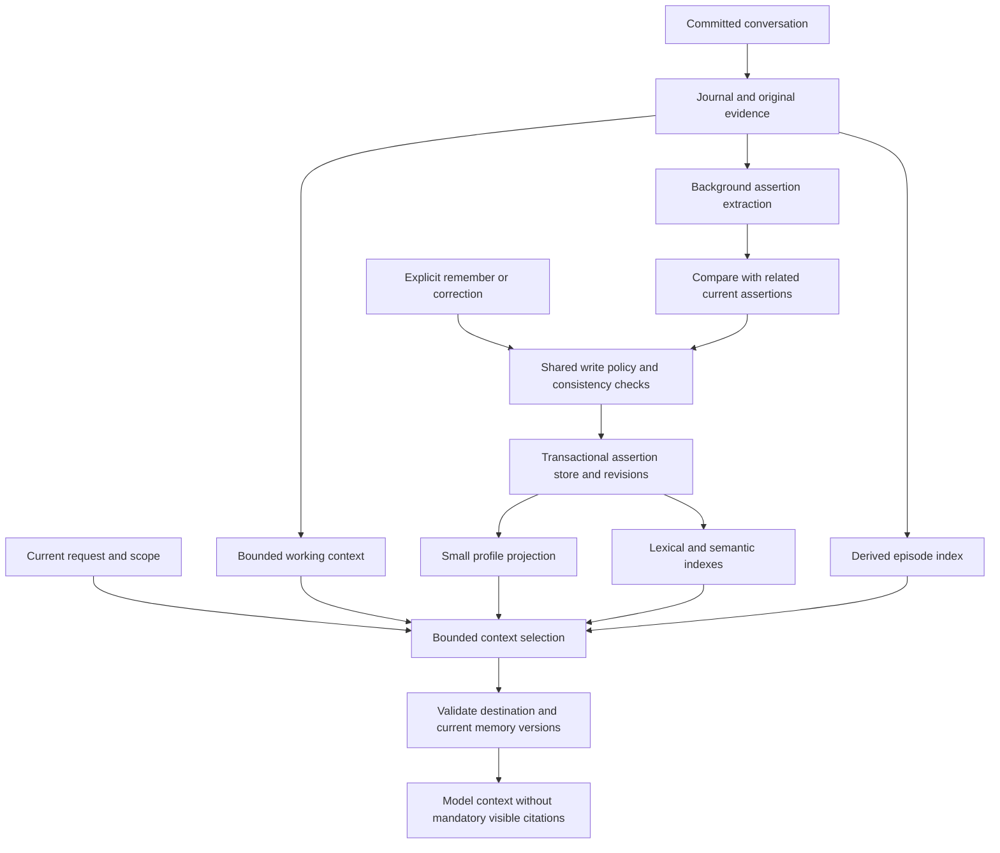

# Agent memory architecture research

Date: 2026-09-15; updated 2026-09-16
Status: Research and recommendation; not an approved replacement contract.
Scope: Mira's local, single-user, Swift application with BYOK model access.
Code inspected: `543a6f5` plus the existing uncommitted changes on `codex/tool-verification`.

## Recommendation

Use a layered memory design with session-linked facts, retrievable episodes, a small profile projection, and bounded retrieval. Keep durable conversation history, transactional memory updates, scope controls, and deletion behavior. Simplify extraction provenance: the model should not have to reproduce exact quotations to create a useful memory. Internal derivation metadata supports maintenance without requiring citations in ordinary replies.

The first experiment should compare three small implementations on the same conversations: a compact profile plus lexical recall, a profile plus hybrid lexical/semantic recall, and a bounded observation summary. Add a full temporal graph only if relationship-heavy tasks demonstrate a useful gain. A framework's published score does not establish that its complete runtime is appropriate for a native Swift app.

This report contains source findings followed by Mira-specific design recommendations. Recommendations are engineering judgments, not claims that the cited systems implement Mira's proposed contracts. No framework was installed, no benchmark or paid model experiment was run, and no application behavior or memory permissions were changed for this research.

## Product direction clarified in discussion

The user wants memory to operate unobtrusively without confirmation for each item. Ordinary replies need no memory citation. An optional source link may lead to a conversation. This supersedes the earlier recommendation for a user-facing candidate review workflow; it does not yet change production code.

A conversation link is sufficient for presentation. Internally, retain a lightweight extraction-batch record containing the session ID, the processed conversation boundary/range, and derivation version. A memory can refer to one or more such batches when multiple conversations support it. This identifies the input snapshot and supports corrections, deduplication, and deletion without requiring the model to supply exact quotations or a proof chain for every fact.

There is a tradeoff: batch-level lineage cannot precisely isolate every contributing sentence. A deletion within a batch may conservatively invalidate its dependent memories and regenerate them from surviving allowed inputs. Define deletion of a conversation separately from an explicit request to forget a fact; regeneration must respect forgotten-fact suppression. Preserved original history must not be reprocessed to resurrect an explicitly forgotten memory.

### Proposed runtime scheduling

Use one runtime-owned memory service with a durable queue and per-session progress. These triggers select urgency; they are not separate stores or separate agents.

| Trigger | Work | User-visible behavior |
| --- | --- | --- |
| Explicit remember, clear correction, or forget | Priority write/maintenance through the common memory service; commit before claiming success | No repeated confirmation; an ordinary response can acknowledge the completed request |
| Completed conversation turn | Persist a dirty watermark; evaluate local batch eligibility without dispatching a model request by default | Main reply completes without waiting for background inference |
| Rapid sequence of short turns | Coalesce queued work up to a message/token or quiet-time threshold | One extraction can understand the whole exchange and avoid repeated calls |
| Idle period or accumulated changes | Reconcile duplicate facts and refresh compact projections when needed | No notification or approval task for routine housekeeping |
| Restart after unfinished work | Resume from durable progress and revalidate source availability | No dependence on a view task or an app remaining open |

The user rejected a separate extraction request after every turn. Start with a durable dirty watermark and local eligibility rules based on accumulated turns/tokens, a meaningful quiet interval, maximum pending age, and a model budget. Do not use a short debounce that effectively recreates one request per ordinary turn. Threshold values remain experimental. Do not add a separate model call merely to decide whether extraction is needed. A topic-change hint already available from normal processing can raise priority, but must not be the sole trigger.

The extractor sees more than one turn when context is required. Trigger frequency and input-window size are separate choices. Do not extract from streaming drafts or split an unfinished tool exchange. If new messages arrive while a job is running, preserve its captured boundary and enqueue/coalesce the remaining delta afterward; completion must not mark unseen messages as processed.

Current-session replies already see recent user input, so they need not wait for durable memory formation. Cross-session visibility starts when the background result commits. Explicit saves/corrections receive priority; uncertain observations should not be promoted merely to hide lag. A fresh-session acceptance test must measure this lag, including fast conversation switching and immediate app exit. Background inference cannot continue inside a terminated desktop process; pending jobs resume at the next launch.

## 1. What the primary sources establish

| Approach | Observed design | What to borrow for Mira | Tradeoff / limit |
| --- | --- | --- | --- |
| LangGraph / LangMem | Separates thread state from cross-thread stores; discusses semantic facts, episodes, procedures, profile documents, collections, and foreground/background writes. [Official memory overview](https://docs.langchain.com/oss/python/concepts/memory) | Give each representation a clear purpose; combine a small profile with individual facts. | A growing profile is difficult to update accurately; collections move complexity into reconciliation and retrieval. |
| MemGPT / Letta | MemGPT manages a context hierarchy. Letta's current SDK documents a memory repository: `system/` files are in context, other files are read on demand, and background dreaming consolidates experience. [MemGPT paper, 2023](https://arxiv.org/abs/2310.08560), [current Letta SDK](https://docs.letta.com/agent-sdk/memory) | A small always-available layer and a larger searchable layer solve different problems. | Keep the hierarchy, but agent-editable files and git-backed state are not a direct substitute for Mira's provenance and purge contracts. Older Letta block/archive documentation is explicitly a legacy API and should not be presented as its only current architecture. |
| Mem0 | Its paper separates extraction from updating. Extraction sees the new exchange, recent messages, and a summary; proposed facts are compared with similar stored memories before an add/update/delete/no-op decision. [Mem0 paper, section 2.1, 2025](https://arxiv.org/html/2504.19413v1#S2.SS1) | Extract with context, then reconcile against existing facts. | A model's proposed update must still pass Mira's authorization, evidence, scope, and revision checks. Semantic contradiction is not permission to physically forget data. |
| Zep / Graphiti | Maintains episodes, entities, relationships, validity intervals, and provenance; combines semantic, keyword, and graph retrieval. [Graphiti repository](https://github.com/getzep/graphiti), [Zep paper, 2025](https://arxiv.org/abs/2501.13956) | Preserve when a fact was true and why it is believed; represent replacement explicitly. | Python and graph infrastructure add integration and operational work. Mira can first model a few temporal relations in its existing database. |
| Hindsight | Separates evidence, experiences, synthesized observations, and opinions. Its paper combines semantic, keyword, graph, and temporal retrieval, followed by rank fusion, reranking, and a token budget. [Hindsight paper, sections 3–5, 2025](https://arxiv.org/html/2512.12818v1) | Keep inference distinct from evidence; retrieve a useful context packet within a budget. | Multiple retrieval channels and reflection stages add models, latency, and tuning. Mira does not need agent opinion formation to remember user preferences. |
| Mastra observational memory | An Observer condenses conversation into dated notes; a Reflector further reorganizes them. The current layer documentation distinguishes stored original messages from the compressed context representation. July 2026 extractors add structured outputs to observation passes. [Research, February 2026](https://mastra.ai/research/observational-memory), [layer documentation, July 2026](https://mastra.ai/blog/agent-memory-layers), [extractors, July 2026](https://mastra.ai/blog/introducing-memory-extractors) | Preserve conversational continuity through bounded observations; avoid treating every sentence as an isolated fact. | Compression can omit details. The observation log needs source dependencies and a size limit; a large all-user summary complicates selective disclosure and deletion. |
| A-Mem | Produces contextual notes with keywords and tags, links them to related notes, and evolves their representations. [A-Mem paper, 2025](https://arxiv.org/html/2502.12110v1) | Derived search descriptions and lightweight links can help discover related memories. | Automatically rewritten descriptions must not overwrite source evidence or silently change a user-authored assertion. |

These approaches offer different units of memory and different read/write policies. They do not establish a single best storage engine. In particular, semantic memory means remembered facts; semantic search is one way to retrieve them. [LangGraph terminology](https://docs.langchain.com/oss/python/concepts/memory)

Anthropic's engineering account treats context selection, compaction, and persistent notes as separate mechanisms. This supports preserving source material while selecting a compact working context; compression quality still requires evaluation. [Effective context engineering, September 2025](https://www.anthropic.com/engineering/effective-context-engineering-for-ai-agents)

## 2. Mira's current gaps

| Current behavior verified in code | Consequence | Proposed direction |
| --- | --- | --- |
| `memory.remember` creates a draft with `allowsRemoteUse: false`; model recall requires that flag to be true. | A successful save can remain unavailable to every subsequent model request. | One shared storage/use policy inherited by explicit saves, editor saves, and automatic capture; no approval for each ordinary memory. |
| Background extraction receives only the current original user message, its timestamp, and timezone. | References such as “use the second option from now on” lack the preceding context. | Supply a bounded context window while preserving speaker attribution; the host attaches the source session and extraction batch. |
| Automatic activation requires the quote to equal the whole message, along with narrow preference/constraint and lexical checks. | Valid assertions inside ordinary mixed messages are forced into review. | Assess each assertion in its conversational context; remove mandatory exact-quote and whole-message matching requirements. |
| Extraction reconciliation joins active extraction metadata using an exact `aspectKey`, kind, subject, and scope. | Equivalent facts with different aspect labels can be missed. The automatic join does not cover all manually saved facts. | Retrieve plausible existing facts across save origins, then propose an evidence-backed reconciliation operation. |
| Recall uses lexical matching and seven hand-authored topic rules, with at most six returned memories. | Paraphrases, indirect constraints, and less common topics can be missed. | Evaluate hybrid retrieval and a small profile; size the final context by tokens and relevance. |
| The memory contributor reads memory records; session search is a separate local capability. | Information omitted by extraction has no fallback through this memory contributor. | Add an explicitly authorized episode retrieval path; a local search hit alone never grants model disclosure. |
| Management and capture-feedback screens were removed pending replacement. | Candidate review, local-only status, correction, and undo lack a complete visible workflow. | Provide optional inspection, editing, and forgetting; automatic capture must not create a required review inbox. |

Code anchors:

- [Save definition and disclosure flag](../../Packages/MiraKit/Sources/MiraCore/Memory/MemoryTools.swift).
- [Extraction input](../../Packages/MiraKit/Sources/MiraCore/Memory/MemoryExtractionWorker.swift) and [activation gate](../../Packages/MiraKit/Sources/MiraCore/Memory/MemoryExtractionValidator.swift).
- [Reconciliation](../../Packages/MiraKit/Sources/MiraData/Domains/SQLiteMemoryExtractionCommit.swift).
- [Recall contributor](../../Packages/MiraKit/Sources/MiraCore/Memory/MemoryModule.swift), [lexical search](../../Packages/MiraKit/Sources/MiraData/Domains/SQLiteMemorySearch.swift), and [topic expansion](../../Packages/MiraKit/Sources/MiraCore/Resources/MemoryRecallLexicon.json).
- [Local session search contracts](../../Packages/MiraKit/Sources/MiraCore/Runtime/Session/SessionSearch.swift).
- [Current management UI status](../product/MEMORY_AND_KNOWLEDGE.md).

Preserve the strong parts: journal-backed evidence, idempotent operations, transactional receipts, revision checks, separation of source authority from domain plans, source/workspace disclosure restrictions, and suppression of forgotten sources. The current failures do not justify removing those boundaries.

## 3. Recommended representations

These are logical representations, not a proposal for four databases or four autonomous agents.

| Representation | Contains | Ownership and lifetime | Read policy |
| --- | --- | --- | --- |
| Working context | Current objective, recent turns, unresolved references, compact progress notes | Current execution/session; derived summaries carry source dependencies | Included while relevant to the current session |
| Evidence and episodes | Original user statements, attributed assistant replies, verified outcomes, bounded summaries of an exchange | Existing journal/payloads remain authoritative; episode indexes and summaries are derived | Search on demand, then verify the source and fetch a bounded excerpt |
| Durable assertions | User preferences, stable facts, decisions, goals, constraints, and contextual qualifications | Memory domain; current revision plus evidence, validity, and explicit replacement relations | Relevant eligible assertions are retrieved across sessions |
| Profile projection | A small selected view of frequently applicable, sufficiently supported user/workspace assertions | Rebuildable projection of assertion IDs and revisions | A tightly budgeted subset is included without requiring an exact topic match |

Procedural lessons, such as a recurring tool failure and its tested remedy, are a possible later extension. Store their environment/version and outcome evidence separately from user facts. Do not let a remembered lesson grant tool authority or rewrite trusted prompts automatically. Tasks, reminders, and mutable business state retain their existing domain owners; memory may reference them but must not become a second task database.

### Proposed data flow



Extraction, embedding, summarization, and remote reranking also need destination checks before receiving content. The final diagram check is an additional checkpoint, not the only authorization boundary.

## 4. Write path: contextual extraction and controlled reconciliation

### Foreground and background responsibilities

- Explicit saves and corrections commit through the foreground path so the response can acknowledge an actual durable result.
- Ordinary conversation produces asynchronous extraction work after a completed exchange, retaining the existing durable consumer and worker design.
- Both paths use the same policy and reconciliation rules. Explicit saves must not be duplicated by the later background job.
- Background consolidation can combine related assertions or refresh an episode summary when justified by accumulated changes. It need not run after every message.

### What the extractor should see

Supply the new exchange, enough preceding turns to resolve references, and a bounded session summary when necessary. Preserve speaker roles and relevant timestamps. The host records the supplied conversation interval and attaches the extraction batch to the resulting memories. Bound the input by tokens and conversation boundaries; neither reading the entire history nor returning exact quotations is required.

The extractor proposes assertions. A subsequent bounded reconciliation step sees related stored assertions with their current revisions. This keeps evidence extraction distinct from deciding what changed. For a small workload, the two steps may share one model call after a local candidate lookup; that is an experiment, not a requirement to add another call.

### Draft extraction instruction, for later evaluation

```text
Identify durable user or workspace assertions supported by the supplied exchange.
Use preceding turns to resolve references, but preserve who said each statement.
An assistant suggestion is not a user preference unless the user adopts it.
Return self-contained assertions supported by the supplied conversation.
Do not reproduce quotations or invent source identifiers; the host records provenance.
Preserve negation, conditions, exceptions, scope, and uncertainty.
Distinguish a statement, a confirmed choice, a report about someone else,
a temporary condition, and an inference.
Separate when something was said from when it is true.
Propose add, support, revise, supersede, or no-change against supplied candidates.
Never invent evidence, grant disclosure permission, or execute a deletion.
Return an empty set when there is nothing useful to retain.
```

This is an original prompt sketch, not a tested prompt or a copy of a vendor template. Its output should include content, type, subject, temporal qualifiers, assertion status, and the proposed relationship to existing memory. Exact quotations are optional diagnostic material, not a required output or activation condition. Scope, authorization, durable IDs, source-session/batch links, and target revisions remain host-controlled. Model confidence is a signal, not a calibrated probability or an authorization decision.

### Reconciliation rules

| New evidence | Result |
| --- | --- |
| Repeats an existing assertion | Add supporting evidence; avoid another active duplicate |
| Adds a qualification without changing the assertion | Revise its wording/conditions with a new revision |
| Clearly changes the same attribute in the same scope | Supersede the previous assertion and preserve its historical validity |
| Describes another person, time, setting, or attribute | Coexist; textual similarity alone is not a conflict |
| Contradicts an existing assertion ambiguously | Preserve the current fact; defer uncertain new information to a later background pass |
| Explicitly asks to forget | Execute the existing authorized maintenance path, including derived data |

For example, “I prefer coffee” and “I prefer tea in the evening” can coexist. “I have switched from coffee to tea” may replace the applicable preference. “My colleague prefers tea” must not alter the user's profile. These synthetic cases test meaning beyond a shared topic key.

Keep confidence, lifecycle, and disclosure policy separate internally. Uncertain observations do not require a user review queue: leave them in the conversation or a bounded internal pending state until later evidence resolves them. Normal memory formation, update, and permitted recall happen automatically. Optional details can explain why information was skipped or is unavailable.

## 5. Read path: select context, then verify its use

### Recommended sequence

1. Resolve the user/workspace, current model destination, current time, and memory-use policy.
2. Load the small eligible profile projection. Store assertion references in the projection so revocation and replacement can invalidate it precisely.
3. Form search intent from the current request and bounded recent context. Expand to constraints the task depends on, not only synonyms of its surface words.
4. Search eligible assertions through lexical and semantic channels. Exact names and identifiers favor lexical retrieval; paraphrases favor semantic retrieval.
5. Fuse ranked results, remove duplicates, account for temporal intent, and include supporting qualifications. Start with a simple local ranking; evaluate a reranker only if it improves the cost/quality tradeoff.
6. When the user asks about a past discussion or assertion recall is insufficient, search authorized episodes and inspect the original exchange. Label historical statements as historical.
7. Pack relevant items into a context token budget. A hard count can remain a protection limit, but six items should not be the relevance strategy.
8. Revalidate scope, disclosure, lifecycle, source dependencies, and exact revisions before model dispatch and at the existing publication checkpoints.

All retrieval paths must enforce policy. A graph neighbor, profile, summary, lexical fallback, or episode search must not restore a fact blocked from this destination. Do not send ineligible text to a remote embedding model or reranker and filter it afterward.

### Example: useful association

Stored assertion: “I avoid caffeine after 2 pm.”
Later request: “Suggest something to drink this evening.”

The intended behavior is to apply a beverage constraint even without the word “caffeine” in the request. A small relevant profile and broader query intent can help; embeddings alone do not guarantee this association. A second case, “What exact drink did we choose last Thursday?”, should retrieve the relevant episode and time, not invent a historical event from the general preference.

### Consistency and diagnosis

A successful foreground save should be immediately eligible for the permitted read path, even while its embedding is pending. Commit lexical/index work and a durable index job with the fact, then use bounded recent-commit visibility until the semantic index catches up. An unavailable embedding adapter must produce an explicit degraded mode, not a silent claim of full semantic recall.

Expose enough local diagnostics to distinguish: not extracted, candidate, local-only, wrong scope, superseded, expired, index pending, no match, excluded by context budget, injected, and used in an answer/tool call. Ordinary logs should contain reason codes and IDs/counts, not user content. A “used” claim needs an observable citation or grounded output; injection alone only proves availability.

## 6. Storage, model adapters, and policy

### Fit to the existing modules

| Module | Proposed responsibility |
| --- | --- |
| `MiraCore` | Assertion/episode value types, orchestration, evidence and policy rules, retrieval request/result ports; Foundation only |
| `MiraData` | SQLite transactions, revisions, lexical index, derived embedding/index records, durable jobs, lineage and purge |
| `MiraProviders` | Explicitly selected extraction, embedding, and optional reranking implementations; no implicit provider fallback |
| `MiraMac` | Composition, any platform-local model adapter, settings, optional memory inspection and correction UI |

Prefer local multilingual embeddings as the initial candidate for a local-first product, subject to testing package size, startup cost, memory, latency, and Chinese/English retrieval quality. A remote embedding route is a separate disclosed operation. A model appearing in the catalog is not proof that an embedding execution adapter exists; Mira's current memory recall has none.

The user has proposed Qwen3-Embedding-0.6B through Apple's MLX. The [source-based assessment](QWEN_MLX_EMBEDDING_EVALUATION.md) recommends this as the leading local candidate, with a BF16 reference and a community 4-bit distribution candidate. MLX Swift has an implementation; correctness, packaging, resource use, and retrieval quality still require runtime validation. DeepSeek can remain the only configured remote provider. A lexical-only design remains a useful baseline and degraded mode, rather than a requirement imposed by the absence of an embedding API key.

Vectors, profile text, generated search keys, episode summaries, and relationship indexes are derived artifacts. Bind them to source IDs/revisions, content fingerprints, and model/prompt versions. Rebuild indexes without changing fact authority. Source hashes are internal bookkeeping and must be cleared with the corresponding forgotten material under the existing contract.

The product direction is automatic memory without per-item confirmation. Apply the configured memory scope and use policy consistently to all capture paths, so normal stored memories can assist later conversations in that scope. Keep a global/workspace control and respect explicit exclusions. Content outside the configured capture policy is skipped instead of producing an approval prompt. The implementation plan must separately define the treatment of existing local-only development records; this research does not mutate them.

Forgetting must invalidate all derived representations and late jobs, not just a vector row. Background extraction must respect suppressed evidence. Preserved local conversation history must not become a back door for model recall of forgotten or blocked content. Exported or remotely sent data needs separately stated retention boundaries; a local purge cannot promise erasure at an external provider.

## 7. Evaluate behavior before selecting infrastructure

### What public benchmarks cover

- **LongMemEval** evaluates extraction, cross-session reasoning, time, knowledge updates, and abstention. Its analysis separates indexing, retrieval, and reading; it is useful for diagnosing where a memory pipeline fails. [Paper](https://arxiv.org/html/2410.10813v1), [official benchmark repository](https://github.com/xiaowu0162/LongMemEval).
- **LoCoMo** supplies long multi-session dialogues and tasks involving factual answers, event summaries, and multimodal continuity. It supplements rather than replaces product-specific tests. [ACL 2024 paper](https://aclanthology.org/2024.acl-long.747/).
- **LongMemEval-V2** addresses environment experience, including workflows, changing states, and recurring gotchas in web-agent trajectories. Its workload differs from personal preference recall, so use it later for procedural memory. [May 2026 paper](https://arxiv.org/html/2605.12493v1).
- **Mem2ActBench** evaluates whether memory actually informs tool selection and parameter grounding, rather than only answers to explicit recall questions. This is directly relevant to the tool-validation motivation for this investigation. [ACL 2026 paper](https://aclanthology.org/2026.acl-long.370/).

Published results require matching the dataset variant, included categories, reader model, extraction model, context budget, grader, aggregation, and inference cost. Mastra's research reports 84.23% with one reader and 94.87% with another for the same overall approach; those figures alone do not isolate an architectural advantage. Mem0's cited paper excludes the adversarial question category from its LoCoMo evaluation. Treat these as author-reported experiments, not a comparable league table or an independent Mira result. [Mastra methodology](https://mastra.ai/research/observational-memory), [Mem0 evaluation setup](https://arxiv.org/html/2504.19413v1#S3)

### Mira acceptance design

Use synthetic Chinese and English conversations with human-reviewed expected facts, supporting conversation intervals, valid-time ranges, expected retrievals, and forbidden retrievals. Test labels may include exact spans for grading without making them part of the production memory contract. Separate development cases from held-out cases and include ordinary paraphrases not present in topic lexicons.

| Boundary | Cases and measurements |
| --- | --- |
| Save/use | Explicit save, editor save, automatic save; fresh conversation, app restart, same permitted destination; local-only and sensitive counterparts |
| Extraction | Multi-fact messages, adopted assistant options, ellipsis, reported speech, negation, temporary conditions, uncertain and sensitive assertions |
| Update | Repetition, qualification, clear replacement, separate attributes, separate people, concurrent corrections, manual-versus-automatic origins |
| Retrieval | Paraphrases, implicit task constraints, names, time ranges, multi-session evidence, unrelated distractors, no-answer cases |
| Application | Correct answer and tool parameters; current request overriding a general preference; stale task state resolved through its domain |
| Maintenance | Forget while jobs are queued/running, profile invalidation, index rebuild, archive/restart, forbidden-source fallback attempts |

Report extraction precision and recall separately, candidate rate, wrong replacements, authorized evidence recall at fixed token budgets, answer accuracy, tool parameter correctness, irrelevant-memory use, and abstention. Also report indexing lag, foreground and background tokens/cost, p50/p95 latency, and storage. Use exact assertions for policy boundaries; retain actual model outputs for controlled evaluation under the repository's synthetic-data rules. Review a sample of model-graded results manually.

Run ablations with the same reader and cost accounting:

1. Current lexical implementation, with allowed fixtures so permission failures do not masquerade as retrieval failures.
2. Improved extraction/reconciliation with lexical retrieval unchanged.
3. Add a small profile.
4. Add semantic retrieval and rank fusion.
5. Add episode fallback.
6. Compare an observation-summary baseline under the same context budget.
7. Add graph traversal only to a relationship-heavy subset if earlier variants leave measurable gaps.

Also run the real user workflow end to end from an empty synthetic library; never pre-enable fixture disclosure and then claim the user-facing save path passed. Ground-truth answer questions must not be shown during memory ingestion, and future statements must not leak into earlier evaluation steps.

Existing Mira evidence distinguishes synthetic host gates from model quality: the later natural-evolution gate accepted 16 authored positives, while its live evidence remained one bounded scenario. The earlier 2/16 result is historical, not the current acceptance rate. Neither closes broad extraction/recall quality. [Current historical verification note](NATURAL_MEMORY_EVOLUTION_VERIFICATION.md)

## 8. Proposed order and remaining decisions

1. **Specify the user promise and build the evaluation corpus.** Define saved versus usable, consistent scope/disclosure policy, optional inspection/correction, and fresh-conversation tool-use acceptance without confirmation dialogs.
2. **Improve writes.** Replace whole-message/mandatory-quote activation with contextual assertion assessment, add bounded conversational context, and reconcile all save origins through one domain service.
3. **Improve reads.** Add the small profile, evaluate hybrid retrieval, and provide an authorized episode fallback with useful local diagnostics.
4. **Optimize measured costs.** Batch background work, cache derivations by revision, tune context budgets, and test local adapters on target hardware.
5. **Expand only with evidence.** Consider temporal graph traversal or procedural lessons when the relevant workload warrants them.

The user has selected unobtrusive capture without per-item confirmation, optional conversation-level source presentation, and batched background extraction rather than a separate request per turn. Qwen3-Embedding-0.6B through MLX Swift is the leading embedding candidate under evaluation. Remaining design values include precise scope/use settings, profile selection, extraction thresholds, the production checkpoint, uncertain-replacement handling, and background latency/cost. This research and the embedding assessment inform the requested implementation design; neither changes current application behavior or closes a runtime acceptance gate.
