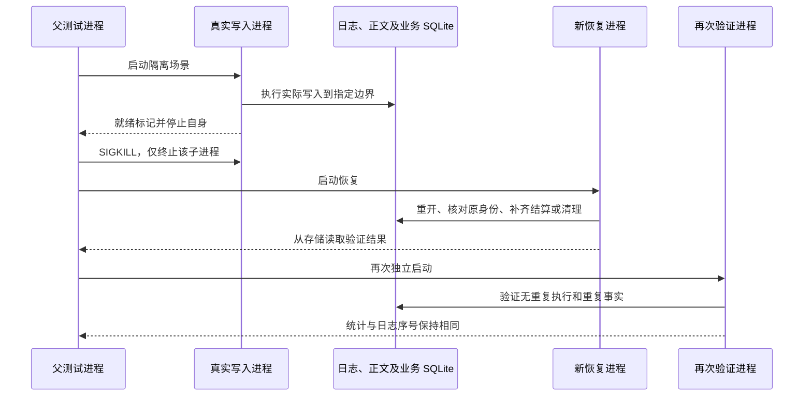

# Agent 进程终止与恢复验收

<!-- Simplified Chinese documentation is explicitly requested by the user on 2026-09-12. -->

日期：2026-09-14。分支：`codex/agent-core`，基线：`bc7305d`。最初 12 个场景之外，2026-09-14 在 `104ef86` 基础上新增 4 个待发布正文场景，共 16 个。本记录验证[实施计划 P6](AGENT_CORE_IMPLEMENTATION_PLAN.md#9-p6--证明核心可扩展且可靠)的真实进程中断边界，补充既有同进程故障注入与重开测试。

## 方法和所有权

[AgentProcessCrashTests.swift](../../Packages/MiraKit/Tests/MiraDataTests/AgentProcessCrashTests.swift) 为每个场景创建独立合成目录，启动 [MiraCrashProbe](../../Packages/MiraKit/Tests/MiraCrashProbe/MiraCrashProbe.swift)。探针到达指定边界后通过标准输出发出单字节就绪标记，并用 SIGSTOP 冻结自身；父进程只向该 Process 的 PID 发送 SIGKILL，确认终止原因为信号且状态为 9，再启动恢复进程。正常关闭、异常抛出或同进程重新创建对象不能替代这一断言。

每个场景随后启动两个独立验证进程。第一个检查并完成恢复，第二个核对幂等性；两次的事实统计和日志序号必须一致。父进程等待子进程实际退出后才删除临时目录。每次子进程调用都有 20 秒看门狗，阻塞管道读取和 waitpid 在 Dispatch 工作项中执行。没有固定等待一段时间再猜测写入已到达某阶段的测试逻辑。

探针是 `Tests/MiraCrashProbe` 下的独立 SwiftPM 可执行目标，由测试通过子进程启动；它不链接进 `MiraDataTests` 或 App，也没有注册为生产能力。普通 `swift test` 构建测试与可执行产物；使用 `--skip-build` 时须先完成相应配置的构建。此前的摘要编码规模增量发现并移除了原先对 executable 的链接依赖，避免 Release 测试入口冲突，见[规模记录](AGENT_CORE_SCALE_VERIFICATION.md)。所有扩展实现只普通导入公开 Core／Data API。测试输入清单只携带合成身份和预期字节；日志、检查点、回执和维护状态仍从真实适配器读取，不能由清单中的计数代替。

此前的规模增量删除已生成的 Debug `MiraCrashProbe` 后，普通 `swift test --package-path Packages/MiraKit` 自动重新链接独立探针，当时完整包中的 12 个终止场景全部通过。Debug 与 Release 测试链接清单都没有探针对象文件；验证没有依赖遗留可执行产物。

## 已验证的 16 个边界

| 场景 | 终止点与新进程中的实际断言 |
|---|---|
| `payloadStaged` | 新正文 stage 完成后、尚未追加引用批次。只有原先已提交记录可见，新正文不可读取；回收无主正文后验证物理目录无未发布文件。 |
| `beforeJournalWrite` | 已暂存正文，但尚未写入下一批日志。重开保持原前缀，不暴露未提交批次或正文。 |
| `afterJournalWrite` | 下一完整批次写入已返回、同步尚未执行。进程被杀后，新进程识别完整批次及其两个事件；核对和重复追加原批次都不增加序号。此断言针对进程终止，不推导断电后的页缓存持久性。 |
| `afterJournalSync` | 日志同步完成、调用方尚未收到确认。完整批次与正文可读，同一批次身份核对成功且不重复。 |
| `pendingPayloadMarked` | 零字节标记及其目录已同步，下一正文和批次目录尚未创建。重开保持旧批次身份、head 和正文，新批次不可见，恢复目录为空。 |
| `pendingPayloadWritten` | 同一写入路径的临时正文已同步，但尚未独占发布。重开通过标记找到并删除临时文件；旧会话保持，新批次不存在；直接全量验证无孤儿，不先执行额外 purge 替启动补工作。 |
| `pendingPayloadClearing` | 新批次已提交，同批未引用正文已删除且批次目录已同步，标记即将删除。新进程保留新旧正文与准确批次身份，未引用正文实际不存在，再次恢复幂等。 |
| `pendingPayloadCleared` | 上述标记已 unlink，但待发布目录尚未同步。新进程保持已提交前缀和正文，孤儿物理删除不被撤销，恢复记录为空；此场景不推导断电耐久性。 |
| `tornJournalTail` | 在真实库仍持有写锁时，受控写入一个没有换行结束的部分记录，再终止进程。重开只保留完整前缀，截断尾部后归约结果一致。这是明确制造半条物理记录，不是随机命中系统调用内部。 |
| `admissionPublished` | 用户正文与 queued execution 的接纳批次已提交，应用尚未收到结果。新进程保留一个执行和原始用户消息，记为 interrupted；零模型调用、零业务写入，原命令重试不产生新事实。 |
| `thinkingDraft` | 实际模型流只输出 6,080 字节思考及未完成 opaque continuation，持久 thinking／transcript 检查点已提交。重开逐字核对草稿与续接数据，再恢复可见思考；没有答案或可重放的助手历史，只有一次模型调用和一个终态。 |
| `businessCommitted` | `SQLiteBusinessEffects` 的事务已提交，`afterCommitHook` 中终止，尚无会话工具结果。原业务计数为一、回执待发布；`AgentApplicationRuntime` 启动恢复只核对原回执、写入工具终态并确认发布，不再次执行模型或业务处理器。 |
| `toolResultPublished` | 引用业务回执的真实 `toolResolved` 批次已同步，待发布回执尚未确认。重开保留相同回执身份，清空待发布项；业务和模型计数仍各为一。 |
| `terminalPublished` | 完整模型／工具往返结束，`finished` 终态批次已提交而尚未向应用返回。重开保持 completed 与原回答；只有两次模型调用、一次业务写入和一个终态，重复接纳原命令不改日志。 |
| `privacyInvalidated` | 实际对话完成并排空后，先保存 pending 操作、完整不可变隐私计划并清除关联业务结果；会话失效批次提交后、正文清理尚未开始时终止。重开仍禁止普通访问，使用原操作和原计划恢复，全部验证后才解除 pending。 |
| `privacyBodyDeleted` | 同一真实隐私流程中，首个正文 unlink 后、目录同步前终止。重开继续删除并验证受管路径物理不存在；用户消息和助手回答字节不变，执行的排除标记保持，业务结果正文为空；再次启动不增加失效事实或模型调用。 |

执行／回执／隐私场景共享[真实组装夹具](../../Packages/MiraKit/Tests/MiraCrashProbe/CrashProbeFixture.swift)：实际 `AgentApplicationRuntime`、模块目录、模型适配器、工具管线、来源授权、配置存储和 SQLite 事务处理器。模型与业务处理器各自在真实数据库中增加调用计数，所以恢复错误地重新分派会使断言失败。隐私场景使用实际请求、工具、重放与执行计划，另由 `SQLiteBusinessPrivacyStore` 清除关联结果。

## 待发布正文恢复增量

待发布记录与启动职责见[正文发布与恢复契约](../architecture/AGENT_SESSION_LOG.md)。新的四个场景使用真实 FileSessionLibrary 和原有父进程 SIGSTOP → SIGKILL → 两次独立恢复流程。清单只保存合成身份；正文、head、批次和物理文件从实际存储核对。`verifyNoUnpublished` 直接验证第一次打开已完成恢复，没有先调用 purge 掩盖初始化遗漏。

本轮完整 `swift test --package-path Packages/MiraKit` 退出 0：972 个注册测试／139 个套件，其中 970 个通过、2 个可选规模基准跳过，7.732 秒（`/tmp/mira-payload-recovery-package.log`）。全部 16 个真实终止场景通过。聚焦过程中仅有一个新增测试把大写合法 UUID 当作非法名称而失败；改为固定小写 UUID 后保留严格规范名称断言，生产实现没有为该夹具放宽规则。

## 结果与限制

聚焦测试 `swift test --package-path Packages/MiraKit --filter AgentProcessCrashTests` 退出 0：1 个参数化测试／1 个套件、12 个场景通过，2.173 秒（`/tmp/mira-process-crash-expanded.log`）。格式整理后完整包回归退出 0：949 个注册测试／133 个套件，其中 948 个通过、1 个可选大库基准跳过，7.034 秒（`/tmp/mira-process-crash-final-tests.log`）。完整包负载下，12 个子进程场景均通过，耗时 6.900 秒；这不是性能门槛测量。

这些证据证明选定持久化边界的真实进程终止恢复。没有修改生产 Core、Data、Provider 或平台实现来通过测试；没有引入旧格式迁移或兼容运行时。App 构建及语言检查汇总在[核心验证记录](AGENT_CORE_VERIFICATION.md)。

仍不能据此声称已经测试物理断电、内核崩溃、真实磁盘耗尽、备份安装中途被终止、每种领域清理组合或完整并行取消矩阵。已有故障注入测试继续承担对应软件失败边界；完整 P6 验收、规模性能和原生交互仍按原计划推进。全部资料库均为临时合成数据，无真实凭据、付费模型或用户会话；iOS 不在范围内。
