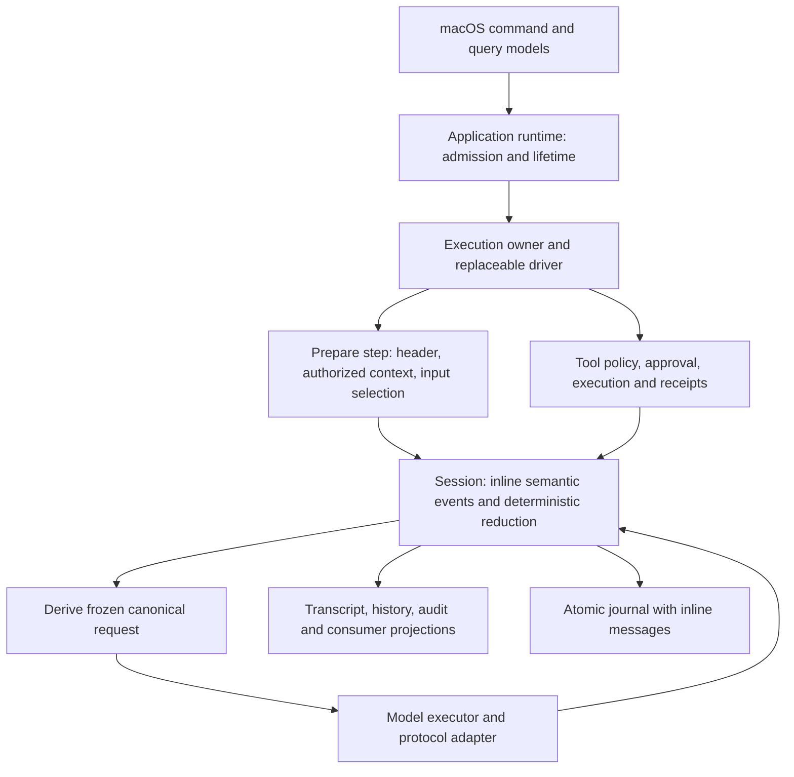

# Agent session flow refactor plan

Date: 2026-09-17. Status: approved and implemented; acceptance is tracked in [verification](AGENT_SESSION_REFACTOR_VERIFICATION.md).
Branch: `codex/settings-session-analysis`.
Scope revision: the user explicitly chose DSH-style inline session content and no session-content privacy subsystem. This decision supersedes the earlier external-body/retention proposal and the old session-privacy requirements for this refactor.
Field alignment: [Session log field alignment with DSH](AGENT_SESSION_LOG_SCHEMA_PLAN.md) defines the shared keys, types, nesting, and intentional Mira extensions. Its field decisions replace the earlier approximate example.

## Outcome and scope

Refactor the conversation lifecycle around explicit session messages, request headers, steps, and tool exchanges, following DSH's append-only session and derived-message flow. Store message content directly in the session log. A committed session prefix must be sufficient to derive the canonical input used at each model attempt. Stable configuration is recorded once per effective version, and execution state no longer dictates the external log schema.

This is a direct redesign of the current session model and its callers, not an alternate runtime or a readable export layered over unchanged persistence. Keep Foundation-only MiraCore, the application-owned lifetime, scoped modules, provider adapters, SQLite business stores, and native conversation behavior. Preserve the public capability to replace the driver; adapt its internal operation interface where necessary rather than retaining obsolete APIs.

The initial request's provider-settings defect remains a separate repair with its own reproduction and acceptance case. It must not drive the agent-loop architecture.

Excluded: iOS, a general input queue or steering API, new shell/browser tools, a Cordis-style framework, a new plugin event bus, compaction or forks, automatic restart of interrupted executions, format migrations, historical-data compatibility, and a session-content privacy subsystem. Do not design external text bodies, retention groups, hidden-content erasure, transitive source-revocation cleanup, or journal redaction/rewrite. Session configuration UI remains deferred; the new header describes facts already needed by the current runtime.

## Reference baseline

Mira source: `543a6f5`. DSH source: `0d1f50007f`, inspected at `/Users/alwyn/repos/deepseek-harness`.

The supplied DSH session contains 3 turns, 14 steps, and 12 tool calls. The three-turn Mira sample contains 5 requests and 2 tool calls. These are structural examples, not equivalent performance workloads. The Mira sample repeats an identical 3,725-byte route eight times and an identical 4,689-byte instruction/tool header three times. Its 58 physical records include 22 commit markers; those markers occupy about 5% of bytes, so their principal cost is reading interruption rather than total size.

The on-disk Mira samples use expanded `turn/start`, `request/start`, and `transaction_commit` encodings absent from the current source. Establish the actual implementation baseline before changing runtime data. Do not attribute those sample measurements to a newly built binary.

| DSH source | Verified mechanism | Mira application |
|---|---|---|
| `packages/core/agent-loop/src/agent.ts:270` | A turn owns steps; each step handles a model result and its tools | Explicit turn/step lifecycle with a small driver |
| `packages/core/agent-loop/src/agent.ts:353` | Admit system and user messages before deriving a request | Commit model-visible facts before dispatch |
| `packages/core/agent-loop/src/agent.ts:554` | Compare canonical request headers; derive messages from the session | Reuse stable header snapshots and one message derivation |
| `packages/core/session/src/request-header.ts:15` | One canonicalization, equality, and fold contract | Deterministic header equality and reconstruction |
| `packages/core/session/src/surface.ts:119` | Only message-producing events enter model history | Separate conversation content from operational facts |
| `packages/core/session/src/types.ts:426` | Explicit append/replace placement | Stable message identities and explicit retry replacement |
| `packages/core/agent-loop/src/invariant.ts:21` | Compare outgoing input with session-derived input | An independent request-reconstruction acceptance check |
| `packages/session/session-checkpoint-policy/src/index.ts` | Durability checkpoints before model and tool dispatch | Mandatory barriers owned by Mira's runtime/storage boundary |

DSH is the reference for event content, message derivation, header folding, and turn/step orchestration. Port these responsibilities into Swift without adding a TypeScript implementation dependency. Mira retains atomic input admission and periodic recoverable drafts. DSH's released-format migrations and broader dynamic prompt/series capabilities remain outside the current scope.

## Target responsibilities



- `AgentApplicationRuntime` owns library/session admission, active execution reservation, recovery, and shutdown. Views never own the loop.
- The execution owner orchestrates preparation, model attempts, tool completion, cancellation, and terminal settlement. Scheduler leases, deadlines, and tool authorization stay explicit.
- Session commands publish typed semantic facts through one serialized reducer and atomic writer. Live notifications are post-commit hints, not another authority.
- Message/history/audit projections interpret the same facts. Model projection additionally applies recorded context scope, whole-exchange selection, and provider replay rules.
- `AgentModelExecutor` owns transport and stream drain; `AgentToolExecutor` owns tool lifecycle and business receipts. Neither independently invents another conversation history.
- MiraData owns physical framing, integrity, indexes, and archive I/O. Internal structs are not automatically the persisted JSON schema.

## Semantic format decisions

Use DSH's `type` / `seq` / `time` / `data` event envelope and exact shared payload shapes. The first `session` line has top-level metadata and no `data` wrapper. Event positions start at zero; `time` and header `createdAt` are integer Unix milliseconds. Every message has `id`, `role`, ordered `content`, and `source`; message-producing events carry `surfaceOp`. IDs remain typed in Swift but encode as scalar values; eliminate `rawValue`, enum `_0`, and nested generic `payload/json` wrappers. References identify existing events/messages, rather than external text objects. Persistent event positions are not UI list indices.

| Event family | Responsibility |
|---|---|
| `session` file header and separate metadata events | Top-level DSH header fields; actual directory in optional `cwd`; Mira workspace/title/model-selection facts remain separate |
| `system/message` | One version of trusted base instructions and fixed host context; initial version precedes the first user message |
| `request/header`, `request/context` | DSH generation config and tool schemas, with capacity/capabilities in context; Mira endpoint/credential/adapter binding in a reused `mira/route-snapshot` |
| `turn/start`, `user/message`, `mira/turn-admitted` | Shared boundary and independently identified user message; Mira admission association commits with that message |
| `step/start`, `mira/request-start` | Numeric turn/step and physical attempt identity, committed input-prefix watermark, and exceptional input selections when required |
| Injected `user/message` | Inline retrieval/environment text with explicit source and turn scope, following DSH's injected-message convention; distinguish it from human input in the transcript |
| `assistant/message` | DSH `message`, `stream`, optional `usage`/`interrupted`; thinking is `reasoning` content and continuation is `message.source.replayState` |
| `assistant/attempt` and draft checkpoints | Failed/cancelled attempt state and recoverable partial output; do not masquerade as a successful answer |
| `tool/call`, approval/effect events, `tool/result` | Call identity, policy/dispatch facts, business receipt and result; effect-specific boundaries remain explicit |
| `step/end`, `turn/end` | DSH `{ turn, step }` and `{ turn, reason }`; derive final messages and totals without repeated output, usage, or message lists |
| retry events | Explicit supersession and the replacement answer's original conversation position |

The normal displayed conversation projects only user/assistant content. Model history additionally includes system, selected context and tool exchanges. Operational records and failed-attempt diagnostics do not become prompts merely because they are logged.

Do not implement DSH's general range-replacement engine just for hypothetical compaction. Support the replacement semantics already required by retry: stable original user identity, explicit superseded execution/message set, and the new answer in the original slot.

The companion field plan contains a complete synthetic shared-field trace, including message identity/source, surface markers, timestamps, and an actual compact stream. P0 adds the required Mira admission/request and physical commit facts to the integrated trace. Preserve DSH's shared fields instead of putting `user` on `turn/start`, `attempt` on assistant events, or `status/messages` on `turn/end`.

The next unchanged turn derives the system and header in force from its committed prefix. It does not copy either body, the preceding answer, or a full replay transcript. `mira/request-start` records the attempt boundary using `throughSeq`; the normal path needs only a prefix position. Explicit selection/projection facts are added when trimming or provider replay makes the effective input differ from the default fold. Shared field alignment does not promise full reconstruction by an unmodified DSH reader.

### Inline content and readability

Store system instructions, user text, assistant text/thinking, injected context, tool arguments/results, and required provider continuation directly in their owning session events. A decompressed JSONL file must show the conversation without resolving an external text store. Remove the old external session-body descriptors, retention groups, and privacy-cleanup machinery and adapt their callers directly.

Follow DSH's distinction between assembled message content and the compact per-attempt stream: the message is the model-history input, while the stream preserves attempt diagnostics and protocol detail. Keep stream records nested under the settled assistant message/attempt instead of creating a top-level log row for every delta. Mira's bounded durable draft checkpoints remain for process-loss recovery. Avoid additional full-turn replay copies and repeated full request bodies. Compression is a physical-storage choice and does not introduce another logical transcript.

Visible thinking and opaque provider continuation still have different protocol meanings; both are inline, with no separate erasure or retention policy. Preserve exact signed/encrypted continuation and ordered blocks, including thinking-only and zero-visible-block output. Never reconstruct continuation from displayed text. Interrupted output is explicitly marked and follows the partial-answer replay policy; failed attempt diagnostics do not become successful history.

API credentials remain in Keychain and out of session headers/streams; persisted routes contain only the credential reference/version needed by the runtime. Ordinary application diagnostics remain distinct from the intentionally content-bearing session log. These existing credential/diagnostic boundaries do not require a session-content privacy subsystem.

### Physical commit boundary

Keep one canonical journal with bounded atomic batches and the existing three append outcomes: committed, not committed, indeterminate. Define semantic event encoding separately from the physical commit wrapper. A compact transaction identifier, range and integrity record remains legitimate; there is no target of zero commit metadata.

Batch related semantic events at actual correctness boundaries. Do not commit separate facts for rebuildable UI phases. Combine assistant settlement, final step end and turn end when all required effects are settled and one terminal transaction is valid. Never merge across a model/tool side effect merely to reduce line count. Phase P0 supplies a concrete physical sample and P1 verifies it before runtime integration; no dual-writing legacy implementation is accepted.

## Header and request reconstruction

1. Assemble trusted base instructions and stable host information through a narrow core contract, with the host supplying platform facts. Current time and changing retrieved data are scoped context, not a permanently repeated system prefix. Built-in text stays English and output-language policy remains independent of display language.
2. Resolve and freeze the effective route, tool set and limits before admission. Apply DSH's canonical header equality to generation config, adapter defaults, and ordered tool schemas. Compare Mira route/credential bindings independently in `mira/route-snapshot`, with capability metadata in `request/context`. Record changes only in their owning snapshots; use DSH's `resume` header reason at the first new request in a reopened loop. Preserve configuration evidence once with its version instead of copying it into every request.
3. On a first model-bound send, atomic admission opens the turn and first step, records the initial system before the original user message, records required header/context/route snapshots, and publishes `mira/turn-admitted` after its user message. Shared `turn/start.data` remains `{ turn }`; all associations point backward. Validate the complete candidate on a private state copy, including exact matching user/turn identities, before publishing any reduced state. The input and queued execution become visible together; no network call is part of this transaction. Preparation failure or cancellation closes the admitted step explicitly. A local response admits only its turn/user/execution and has no model step or request.
4. Each new step chooses complete eligible exchanges and collects the required context. Ordinary turn-scoped retrieved context freezes at its first request and remains stable through tool continuation, as required by the thinking/replay contract. The next user turn rebuilds that context; tools add explicit same-turn result messages. Tool authorization and approval still run before dispatch.
5. Record the committed input-prefix position and derive its active system/header and messages through the same deterministic fold used by the live session. Record only exceptional input selections, omissions, replay/projection choices, and adapter identity/revision needed to reconstruct the actual request. Avoid a repeated full message-ID manifest on the normal path. An exceptional range must decode to exact ordered messages including complete tool pairs.
6. Materialize the canonical input from that committed prefix and any recorded exceptional selection. After protocol replay transformation, any model-visible variant not reconstructable from an existing message must have an explicit inline representation. A current adapter must not silently reinterpret an old request.
7. Encode the outgoing request and check it against the reconstructed canonical input. The prepared wire body remains owned by the attempt/step for byte-identical in-process retry; do not persist a second full history merely because a prepared object contains it. Historical audit promises exact recorded model-visible content and options, not re-encoding through an unavailable historical adapter implementation.
8. Preserve explicit same-step retry identity: only confirmed zero-event transient failures qualify; attempts share the frozen request and never recollect context, duplicate the user message, or change provider.

Historical audit reconstructs the recorded inline content, selection, and header. It does not rerun today's retrieval or silently substitute today's prompt. Constructing a new outgoing request separately checks the current provider route and tool capabilities. Corrupt or unresolved references fail explicitly.

Header reuse never mutates an old header or resolves an old request against current settings. Preserve retrieval provenance needed for citations alongside the injected content; do not add privacy epochs or transitive deletion graphs. Input ranges must expand to the exact frozen selection of complete exchanges and tool pairs; malformed or unresolved selections block dispatch.

This replaces the independently accumulated kernel `trace`, the separately persisted full-turn replay transcript, and whole-`AgentContextBuild` serialization as sources of conversation content. Incremental derived caches are allowed when they are keyed by a verified committed prefix and rebuild through the same fold.

## Turn and step lifecycle

```text
resolve immutable instructions / route / tools
atomic admission: turn/start + initial model step if needed + system/user + snapshots + mira/turn-admitted
  prepare step from committed session and frozen execution configuration
  atomic request boundary: context if new + step/start if not already opened + mira/request-start
  dispatch model after confirmed persistence
  stream to live UI and bounded durable draft checkpoints
  settle assistant message or failed attempt
  if tools were proposed:
    validate policy and approval; persist required effect intent
    dispatch only after intent is confirmed
    settle each result / known business receipt
    close step; derive the next request from the updated session
  otherwise:
    close step and turn with DSH boundary fields; derive output and totals
```

Local deterministic responses remain supported through an explicit `mira/local-response` event without a fake model source or request. An execution retains its frozen route, capability lease, instructions, and limits throughout the turn. DSH's ability to renegotiate configuration each step does not override Mira's frozen-execution contract.

Cancellation fences new effects immediately, cancels owned work, waits for transport/tool drain, reconciles known receipts, and publishes one terminal outcome. Reopening settles interrupted work without issuing model requests or replaying unknown writes. An interrupted visible prefix remains available under the existing incomplete-history policy; an incomplete signed continuation never becomes successful replay.

A combined successful assistant/step/turn settlement requires every proposed tool invocation to be resolved and every required business receipt to be confirmed. Pending durable consumers that asynchronously schedule later background work are not a foreground completion dependency. Unknown side effects remain explicitly unknown in the failed/interrupted outcome; compact framing cannot convert them to success.

Query/search/audit projections and their indexes are disposable. Business consumer checkpoints, queued domain jobs, deduplication keys and outbox/receipt records are business facts, survive projection deletion, and must not be regenerated by blindly replaying effects. Consumers continue to receive complete committed batches and commit domain changes and their exact batch checkpoint in the same business transaction. Batch grouping is decided before publication; later replay never re-groups already committed batches across cursor boundaries.

## Implementation sequence and completion gates

| Phase | Work and owned paths | Required completion evidence |
|---|---|---|
| P0: contract and baseline | Apply the companion field matrix; freeze exact Mira extension/commit fields and format generation; produce inline event, prefix-selection and transaction examples; update proposed contracts in `docs/architecture`; map obsolete privacy APIs/callers; define synthetic comparison fixtures | Reviewable three-turn trace including tools and retry; exact shared-field fixtures and event-to-consumer matrix; explicit inline message and atomicity rules; no production behavior changes yet |
| P1: semantic session and storage | Replace event schema/reduction in `Runtime/Session/SessionFacts.swift`, `SessionState.swift`, `SessionRuntime.swift`, `SessionJournal.swift`; add message/header derivation; adapt `MiraData/Session/FileSession*` directly; remove external session-text storage | Codec round trips, readable inline text, unknown required events rejected, concurrent admission uniqueness, atomic append/reconcile, truncated-tail handling; runnable synthetic log requiring no external text resolution |
| P2: preparation and minimal loop | Adapt `AgentApplicationRuntime`, `AgentExecutionKernel`, `AgentExecutionPlan`, `AgentDriver`; replace whole-build persistence in `Runtime/Model`; remove independent accumulated history/replay content | First system before user and header before dispatch; unchanged headers reused; every request reconstructs exactly; a simple turn and local response complete; same-step retry preserves input identity |
| P3: streaming and tools | Adapt `AgentModelExecutor`, draft/live output, `AgentToolExecutor`, effect resolver and finalizer; retain provider wire implementations while adapting their input boundary | Ordered text/thinking/tools, protocol continuation, partial EOF and cancellation; tool calls paired exactly; approval and known/unknown business effects preserved; zero duplicate settlement |
| P4: recovery and consumers | Adapt recovery, retry supersession, query/search/audit, consumer cursors and archive/restoration; remove old full-turn replay readers and session-content privacy/retention machinery | Rebuild equivalence from the inline journal; no automatic dispatch after restart; original user preserved on retry; consumer business checkpoint atomicity; archive restores inline content and valid event references |
| P5: native composition | Rewire `MacLibrary*`, `ConversationModel`, `ConversationPageState`, `MacSessionReadModel`, inspector and approval presentation; remove controls/callers tied to retired session-content erasure; update owning product/design documents for actual UI changes | Native synthetic send/tool/thinking/stop/continue/retry/reopen/switch flows, citations and reading position; light/dark, English/Chinese, minimum size; no view-owned execution or orphaned cleanup controls |
| P6: acceptance and removal | Remove obsolete schemas, readers, fixtures, generated data and architecture-coupled tests; run boundary and growth checks; record evidence and update `docs/MVP.md` only for achieved status | One production flow; no compatibility or legacy dual-write; exact scoped test results, crash cases and unverified platform items; same-workload log measurements |

Implement one vertical capability at a time through these dependencies. P1/P2 are development scaffolding until their consumers move; do not ship a parallel fallback core. Tests tied only to removed struct shapes are rewritten or removed; tests expressing product guarantees remain acceptance requirements.

The settings follow-up is independent: reproduce activation of a new catalog provider when another provider exists, and key replacement on an existing provider. Check the selected destination, connection/editor identity, refresh completion, and immediately enabling a model without reopening. Repair the demonstrated transition instead of assuming a storage-cache race from static inspection.

## Acceptance matrix

| Area | Minimum acceptance |
|---|---|
| Canonical reconstruction | For every synthetic dispatch, independently read the committed prefix and assert exact instructions, ordered content, tools, normalized invocation options and continuation equality; the fixture needs no external session-text files |
| Stable prefix | A three-turn/five-request fixture in one loop with unchanged configuration emits one initial header and one initial system version; a real generation-config change emits one new header; a credential-only change updates only its route snapshot; reopening then sending records the defined resume snapshot; old attempts retain their exact versions |
| Log growth | Compare identical fixtures before/after: total bytes including previous external text, message/stream/checkpoint/metadata bytes, stable-snapshot writes and input-selection growth; use 1/10/100 turns with an explicit sufficient context limit. Report raw and compressed sizes separately. No per-request duplicate route, tool schema or full historical body; no arbitrary percentage target based on unrelated conversations |
| Output | One settled assistant owner per attempt; turn-end contains only turn/reason. Thinking-only, mixed block ordering, zero visible content with opaque state, oversized chunks, split UTF-8 and EOF all retain defined outcomes; source replay state and disjoint token counters retain their exact meanings |
| Admission | Duplicate command, concurrent send, selection revision conflict and uncertain fsync preserve all-or-nothing user-plus-execution admission and one active execution |
| Tool effects | Parallel reads/exclusive writes, denied/expired approval, cancellation before/after dispatch, business commit before log acknowledgment, unknown external effect and late results |
| Retry and recovery | Zero-event automatic retry, explicit re-answer in original position, interrupted visible history, thinking-only interruption, process loss at each changed durable boundary and no automatic redispatch |
| Inline content and archive | Decompressed JSONL directly contains messages, thinking, injected context, tool exchanges and required continuation; archive/restore preserves those values and consumer cursors; no external session-text/retention dependency |
| Extension boundaries | Existing driver/tool/provider/context module challenges continue without domain branches in the default loop; unavailable required extensions fail explicitly |

Reuse focused suites around `SessionStateTests`, `SessionRuntimeTests`, `SessionModelSelectionTests`, `AgentApplicationRuntimeIntegrationTests`, `AgentExecutionKernelIntegrationTests`, model preparation/retry/draft/live-output integration, tool/effect integration, `JournalAgentHistoryReaderTests`, session query/archive and business-consumer tests. Remove tests that enforce the explicitly retired session-content privacy contract; replace external-body fixtures with inline events. Adapt `MiraCrashProbe` scenarios for changed commit boundaries. Run Chat, Anthropic, Responses and thinking protocol fixtures for the affected provider boundary.

Use `swift test --package-path Packages/MiraKit --filter ...` with the relevant suites at each phase. Regenerate the Xcode project after file/target changes. Run affected MiraHostTests and the app Debug build using the repository's pinned-package command; run language checks when presentation/localization changes. A final affected-boundary regression is mandatory; unrelated suites are not the default.

No paid endpoint, real credential, or personal conversation is needed. Store only synthetic fixtures and structural measurements in the repository. macOS 15 runtime and real-provider acceptance remain explicitly unverified unless actually exercised.

## Development-data cutover and documentation

At the production switch, stop affected Mira instances, delete the identified obsolete development library and generated session/index/checkpoint artifacts, and recreate the current library at the same configured path. This cleanup is already authorized. Do not retain versioned development libraries, precautionary backups, old-format decoders, or migration bridges. Do not delete source, design assets, unrelated app data, or Keychain credentials.

Update the owning contracts together with callers: `AGENT_APPLICATION_RUNTIME.md`, `AGENT_EXECUTION_KERNEL.md`, `AGENT_SESSION_READS.md`, `AGENT_TOOL_EXECUTION.md`, `AGENT_MODEL_RETRY.md`, `AGENT_PAYLOAD_RECOVERY.md`, `THINKING.md`, affected consumer/archive contracts, and the architecture overview. Retire the old `AGENT_SESSION_PRIVACY.md` contract and remove stale cross-references and contributor/product requirements for external session text, retention groups, and content erasure. Preserve distinct credential storage and tool-authorization rules. Reconcile the context contributor cadence with the frozen same-turn prefix explicitly; do not leave the old per-step collection description contradicting the new flow.

Record validation under `docs/engineering`; this plan is not evidence that any acceptance gate has passed. Preserve atomic admission, cancellation, tool-effect authority and protocol replay correctness when replacing old implementation tests. The user has explicitly removed the session-content privacy requirements from the target design.
