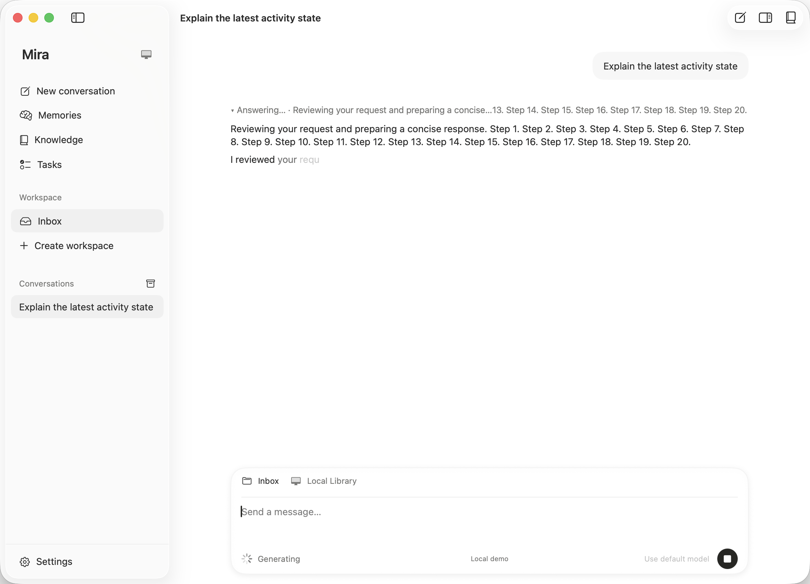
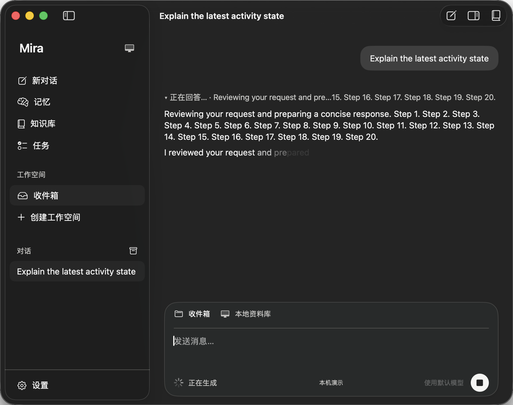

# Conversation activity and interrupted continuation

Date: 2026-09-14. Branch: `codex/agent-core`.

## Corrections

The title now uses the detail pane's leading margin when the sidebar is expanded. A collapsed sidebar reserves room for the native window buttons; sidebar collapse observation refreshes the inset, including during native animation. Trailing toolbar clearance remains measured from native controls.

The runtime publishes a process-local output phase separately from retained thinking text. A new text block changes the phase to answering even if the provider leaves its earlier reasoning block open. Block completion can publish a phase-only update. The assistant row replaces its avatar/name with a compact status and bounded latest thinking/tool preview. Expanding it retains visible reasoning and the latest eight tool activities. Preview reads share the page byte budget and respect invalidation; opaque provider state is never rendered.

Cancelled and interrupted history now retains the original question, optional partial answer verbatim, and a separate neutral incomplete notice. Thinking-only interruptions still retain the question. This required changing both history reconstruction and the real journal source authorization path, which previously accepted only successful replayable executions. Partial history does not replay incomplete tool calls, results, or provider continuation data. Original-user evidence, request provenance, workspace policy, source budgets and privacy invalidation still apply.

## Reference

The interaction follows DeepSeek Harness's separation of expandable reasoning, current run phase and tool status, reviewed at commit `c291e7961a515f6d7af9304e7fd1d257929aef26`: [ReasoningRow](https://github.com/deepseek-ai/deepseek-harness/blob/c291e7961a515f6d7af9304e7fd1d257929aef26/packages/client/ui-chat/src/client/chat/ReasoningRow.tsx), [ChatView](https://github.com/deepseek-ai/deepseek-harness/blob/c291e7961a515f6d7af9304e7fd1d257929aef26/packages/client/ui-chat/src/client/chat/ChatView.tsx), and [ToolRow](https://github.com/deepseek-ai/deepseek-harness/blob/c291e7961a515f6d7af9304e7fd1d257929aef26/packages/client/ui-tool/src/client/tool/ToolRow.tsx). Mira keeps its native renderer and journal contracts.

## Focused verification

Only affected behavior and its direct boundaries were tested. No full package, host or UI suite was run for this change. All fixtures use local synthetic data; no paid model endpoint was called.

- Core: 50 tests in six selected suites passed (`AgentModelOutputTests`, `AgentLiveOutputIntegrationTests`, `SessionOutputTests`, `JournalAgentHistoryReaderTests`, `SessionActivityTests`, `SessionExecutionSourceTests`). These cover live phase changes, partial and thinking-only context assembly, reopening journal data, actual journal source authorization, invalidation, and bounded tool previews.
- Native host: 25 checks passed: 13 native row/state tests, 7 page-state tests, and 5 localization tests. Result: `.build/xcode/Logs/Test/Test-MiraHostTests-2026.09.14_15-44-39-+0800.xcresult`.
- Native UI: 3 selected cases passed: deterministic thinking then answer streaming in English/light and Chinese/dark, 850 pt minimum width, activity expansion, stop then continue, and title geometry with expanded/collapsed sidebar and inspector. Stop/continue and Chinese/dark passed in `.build/xcode/Logs/Test/Test-MiraUI-2026.09.14_15-39-11-+0800.xcresult`; the final title correction passed the English/light case in `.build/xcode/Logs/Test/Test-MiraUI-2026.09.14_15-43-39-+0800.xcresult`. Both runs build the Debug app with committed dependency resolutions and signing disabled.
- Language policy: 2,018 bilingual entries passed. Project regenerated after adding the UI test file. No theme token values changed.

Initial native checks exposed the real source-authorization rejection after cancellation and title overlap when collapsing the sidebar; both were corrected. Title assertions moved to the real app's accessibility hierarchy because hostless SwiftUI did not expose the title's virtual accessibility child. A row-height fixture was lengthened after removing the avatar indentation made its old sample fit the row's minimum height.

## Native evidence

Window-only screenshots use synthetic content. Visual inspection confirmed the title remains clear of native buttons when collapsed, remains left aligned with the inspector open, and answering appears while retained thinking is expanded.

Additional captures: [collapsed sidebar](evidence/2026-09-14-flow-collapsed.png), [inspector open](evidence/2026-09-14-flow-inspector.png), [stopped then continued](evidence/2026-09-14-flow-continued.png).

## Limits

Verification ran on macOS 26.6.2 / Apple Silicon, not a macOS 15 runtime. Native streaming screenshots exercise the local demo adapter. Provider block ordering is covered by synthetic core fixtures, not live endpoints. Tool activity status, privacy and expanded row sizing are covered by core/native-host tests and self-contained previews; a live provider tool workflow was not exercised. The continuation UI fixture confirms the request succeeds; prepared-input tests establish that prior question and partial answer are included.

## Superseding process presentation

The bounded tool-preview presentation and its visual coverage limits above are historical. [Multiround process verification](MULTIROUND_PROCESS_VERIFICATION.md) records the ordered full-argument/result presentation and includes final-round reasoning in the collapsed process.
