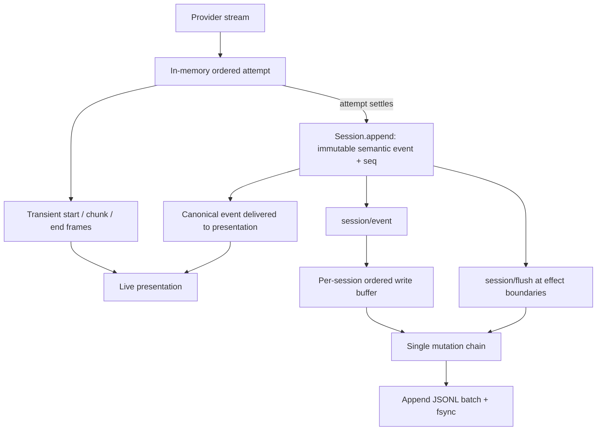

# DSH session logging: semantic boundaries and ordering

Date: 2026-09-16.
Status: implemented in Mira's v5 journal path. Focused implementation evidence is recorded in [semantic journal verification](SEMANTIC_SESSION_JOURNAL_VERIFICATION.md); this note records the DSH source findings and design rationale.

## Conclusion

The v5 journal now uses semantic session and step boundaries. Completed model attempts publish one ordered assistant settlement; unfinished output remains in the replaceable active-attempt sidecar. Request manifests reference direct message components instead of copying a complete request body into every attempt.

The relevant DSH pattern is: accumulate a model attempt in memory, publish transient stream frames to presentation, append one settled assistant event, and let storage persist the ordered semantic events. This is a change to ownership and projections, not another event-name or JSON-key-order adjustment.

## Reference and evidence scope

Inspected official `deepseek-ai/deepseek-harness` commit `0d1f50007f9bca3f52b06e1c3074fa14d5fb0720` (2026-09-15), including Session, AgentLoop, the JSONL backend, checkpoint policy, stream accumulator, web settlement fold, and crash-test source. The current logical/physical session format at that revision is v3.

The read-only source checkout is `/tmp/mira-dsh-log-reference`. The official public synthetic fixture was extracted unchanged to `/tmp/dsh-public-session-v3.jsonl`; it is not a private conversation or an execution produced during this investigation. Source tests were inspected, not executed. No DSH installation, model request, credential read, or Mira runtime/data change was needed for this research.

## 1. Physical record structure

A session-owned directory under `<root>/--<normalized-cwd>--/<encoded-session-id>/` contains one current logical log (`_no-cwd` replaces the project directory when absent). Default encoding is `session.v3.jsonl.zstd`; `compression: none` writes `session.v3.jsonl`. The first line is a `type: session` header with version, id, creation time and optional workspace/lineage metadata. Subsequent events carry `type`, contiguous `seq`, epoch-millisecond `time`, and `data`. Message-producing events also declare `surfaceOp`; operational events do not masquerade as messages. See [physical format][format] and [event types][types].

Illustrative shape below; names/content are synthetic, and request/tool/stream details are abbreviated. It is not an importable recording:

```json
{"type":"session","version":3,"id":"example","createdAt":1789531200000,"isSeeded":false,"delegationDepth":0}
{"type":"turn/start","seq":0,"time":1789531200001,"data":{"turn":1}}
{"type":"step/start","seq":1,"time":1789531200002,"data":{"turn":1,"step":1}}
{"type":"user/message","seq":2,"time":1789531200003,"data":{"role":"user","content":[{"type":"text","text":"Inspect the configuration."}]},"surfaceOp":"append"}
{"type":"assistant/message","seq":3,"time":1789531200010,"data":{"turn":1,"step":1,"message":{"role":"assistant","content":[{"type":"reasoning","text":"Check the active configuration."},{"type":"text","text":"I will read the configuration."},{"type":"tool-call","id":"call-1","name":"read_config","arguments":"{}"}]},"stream":[]},"surfaceOp":"append"}
{"type":"tool/call","seq":4,"time":1789531200011,"data":{"turn":1,"step":1,"callId":"call-1","name":"read_config","arguments":"{}"}}
{"type":"tool/result","seq":5,"time":1789531200012,"data":{"turn":1,"step":1,"message":{"content":[{"type":"tool-result","toolCallId":"call-1","content":[{"type":"text","text":"Configuration loaded."}]}]}},"surfaceOp":"append"}
{"type":"step/end","seq":6,"time":1789531200013,"data":{"turn":1,"step":1}}
{"type":"step/start","seq":7,"time":1789531200014,"data":{"turn":1,"step":2}}
{"type":"assistant/message","seq":8,"time":1789531200020,"data":{"turn":1,"step":2,"message":{"role":"assistant","content":[{"type":"text","text":"The configuration is valid."}]},"stream":[]},"surfaceOp":"append"}
{"type":"step/end","seq":9,"time":1789531200021,"data":{"turn":1,"step":2}}
{"type":"turn/end","seq":10,"time":1789531200022,"data":{"turn":1,"reason":{"kind":"completed"}}}
```

`content[]` order carries the model's block order; object key order does not. A turn can contain multiple steps. In the default loop, a step consists of a model call (possibly retried) and the tool executions it requested. See the actual [public fixture][fixture] and [AgentLoop][loop].

## 2. When output enters the log

`AssistantStreamAttempt.push` feeds an in-memory block assembler and compact stream accumulator, then emits `agent/assistant-stream` frames. It does not call `Session.append` per chunk. On successful attempt completion, AgentLoop appends one `assistant/message` with assembled ordered content, usage and replay state. A started attempt that fails without a surface message becomes one `assistant/attempt`; failures before stream start can have no assistant settlement. Cancellation can settle a visible partial message with `interrupted: true`; undispatched incomplete tools do not become completed tool calls. Each attempt settles separately, so a multi-step turn can contain several assistant messages and retry-attempt records. See [attempt accumulation][attempt] and [attempt settlement][loop].

The embedded `stream` preserves received chunk boundaries/timing in compact runs such as `text-chunks`, `reasoning-chunks`, and `tool-call-chunks`; an attempt with no received chunks can have an empty stream. A run stores `time0`, time deltas and text/argument fragments. These runs are written inside the single settled attempt event. DSH therefore retains some repetition between assembled content and the stream, but does not produce one top-level JSONL event for every streamed token. See [stream codec][stream].

Boundaries and tool lifecycle records can append before a whole turn ends. Waiting for the entire turn before recording tool intent would defeat recovery around side effects. The requested boundary should apply to assembled assistant output, not delay every kind of event until `turn/end`.

## 3. How local persistence is synchronized



There are two different append boundaries:

1. `Session.append` validates, snapshots, freezes and synchronously accepts an event into the in-memory canonical log, assigning `seq` and `time` and publishing `session/event`.
2. The persistence listener enqueues that event in the session's write handle. A fixed **200 ms maximum intentional batching delay** coalesces already-created semantic events. A single-flight drain preserves their order. The file adapter appends and fsyncs each batch; a caught partial-write/sync failure attempts rollback to the earlier file length, while the queued batch remains available for a loud retry.

The semantic append/assistant end notification is **not itself a promise that fsync has finished**. `sessions.flush` drains the routed buffer and establishes the storage barrier. The checkpoint policy flushes before model dispatch, before top-level tool execution, and at pre-step. `turn/end` itself does not synchronously await flush; explicit consumers/close can require it. This distinction is visible in [Session.append][session], [buffering/listeners][storage], [file append][fileio] and [checkpoint policy][checkpoint].

## 4. Why live output and restored history stay aligned

Both settled messages and model input come from the same session events, with explicit projections:

- Human transcript material comes from append-origin message events; a later model-context replacement must not erase what the human already saw.
- Model history uses the ordered surface and its replacement operations.
- Within an assistant message, ordered content blocks retain reasoning, text and tool-call placement.
- Parallel tools may finish out of order, but the default scheduler holds results until it can commit them in model-call order.

See [surface projections][surface] and [tool scheduling][tools]. UI nodes can group/hide process details; physical management-event rows are not one-to-one chat bubbles. Ordering is anchored to semantic events and block positions, not to separately reconstructed answer/thinking strings.

Live frames carry attempt identity, revision and chunk index. The web client stages the matching settled assistant event until the end frame identifies its `seq`, then replaces the transient attempt rather than rendering both. Missing/out-of-order frames trigger a fresh baseline. A reconnect can obtain the still-running attempt's compact prefix from host memory. This reconnect feature does not make the unfinished attempt durable across a host process crash. See [host live baseline][baseline] and [client settlement fold][client].

## 5. Request history is not re-serialized for every call

`buildRequest` records request configuration/tool headers at initial/resume, relevant changes or new series, and route/context metadata when changed. Messages come from `session.deriveMessages()`. System prompt changes have explicit events. It does not place a second complete `messages[]` history inside every request event. This reduces the repeated-prefix growth remaining in Mira's `AgentRequestRecord`. See [request reconstruction][loop].

The historical request must still be reproducible from the corresponding event prefix and configuration. For Mira this must preserve frozen routes, exact ordered inputs, source authorization, context selections/omissions and provider-specific continuation; simply dropping request data would break those guarantees.

## 6. Crash behavior and the Mira-specific requirement

A DSH process crash can lose an unfinished assistant attempt because its live prefix exists only in process memory. Recovery retains the committed prefix and appends missing tool/step/turn closers. A recorded tool intent without a durable result is marked as outcome unknown; it is not silently replayed. The implementation and synthetic crash-test source distinguish dispatch-before-crash from a missing intent. See [repair][repair] and [crash tests][crashtests].

Mira's recoverable-draft contract is implemented as one replaceable active-attempt sidecar outside the conversation log. It is bound to session/execution/attempt identities and authorization, has bounded storage, and is retired after settled-event durability. Recovery may turn a verified sidecar into one interrupted semantic event exactly once. It does not authorize admission, replay external effects, survive privacy erasure, or create another growing token log.

## 7. Mira changes required together

| Implemented boundary | Storage/runtime rule |
|---|---|
| Active output is accumulated in memory and a replaceable sidecar | Canonical JSONL receives one semantic assistant settlement per attempt; sidecar checkpoints are bounded and retired after durability |
| Settled output carries ordered text, thinking and tool blocks | Live, restored and paginated presentation consume the same ordered block identity |
| Request records use a manifest header and direct message-component references | Readers resolve components through the payload port; no copied full request body is required |
| A bounded sidecar carries unfinished blocks | Settlement and reopening consume the same ordered block representation |
| Visible final answer/thinking and hidden generated continuation have separate privacy ownership | `.retainVisibleHistory` preserves visible summaries while erasing hidden generated history; intentional summary duplication remains |

Relevant Mira paths:

- `Packages/MiraKit/Sources/MiraCore/Runtime/Model/AgentModelExecutor.swift`: active-draft sidecar publication, attempt accumulation and settlement.
- `Packages/MiraKit/Sources/MiraCore/Runtime/Session/SessionActivity.swift`: completed model blocks/tool result assembly and draft reconstruction.
- `Packages/MiraKit/Sources/MiraCore/Runtime/Session/AgentExecutionFinalizer.swift`: independent terminal visible summaries and reference-based replay.
- `Packages/MiraKit/Sources/MiraCore/Runtime/Model/AgentRequestRecord.swift`: materialized per-attempt input backed by `AgentRequestManifest` references.
- `Packages/MiraKit/Sources/MiraData/Session/SQLiteSessionProjection.swift` and `Apps/MiraMac/Presentation/ConversationPageState.swift`: separate message, activity and temporary presentation paths.

## Implementation sequence and focused acceptance

1. Define semantic message/step records, ordered content and reference-based request snapshots; keep admission, authorization, atomic commit and tool-effect barriers authoritative.
2. Replace periodic canonical draft facts with an active-checkpoint port, or explicitly revise the crash-draft product guarantee. Implement settlement, cancellation, failure, crash recovery and privacy cleanup together.
3. Make transcript/query, history, request inspection and memory extraction use the new records. Preserve distinct human transcript versus model-context selection without copying full message bodies.
4. Switch the current-format writer/readers directly, update owning architecture contracts, and rebuild authorized development data without migrations.
5. Verify a synthetic multi-step interaction containing reasoning → text → tool calls/results → later reasoning/text. Assert identical semantic block order while live, after settlement and after reopening. During a long unfinished model stream, assert no assistant settlement line is appended to canonical JSONL; completion adds one settlement regardless of chunk count.
6. Verify only directly affected boundaries: partial cancellation, failed/retried attempts, pending draft recovery, out-of-order parallel tools, pre-effect fsync failure, no duplicated settlement, request reconstruction/prefix reuse, and privacy erasure of both canonical content and active checkpoint.

The implementation verification covers ordered settlement, exact request reconstruction, sidecar recovery and native replay. Request-manifest and sidecar checks are distinct from whole-library size measurements.

Research checks verified all 16 pinned source paths and parsed the public synthetic fixture's eight JSON lines, including contiguous event sequences. A separate read-only review checked semantic append versus fsync and attempt settlement. The user's specific live ordering discrepancy was not replayed in this investigation; the current multiple projection paths and patch ordering are source findings, not a reproduced provider/UI trace. That research-only commit did not rerun package or app tests. The subsequent implementation has separate verification evidence.

[format]: https://github.com/deepseek-ai/deepseek-harness/blob/0d1f50007f9bca3f52b06e1c3074fa14d5fb0720/packages/session/session-persistence-jsonl/src/format.ts
[types]: https://github.com/deepseek-ai/deepseek-harness/blob/0d1f50007f9bca3f52b06e1c3074fa14d5fb0720/packages/core/session/src/types.ts
[fixture]: https://github.com/deepseek-ai/deepseek-harness/blob/0d1f50007f9bca3f52b06e1c3074fa14d5fb0720/packages/experimental/webworker-runtime/tests/fixtures/vfs-example/home/sessions/--dsh-workspace--/preview-follow-up-builder/session.v3.jsonl
[loop]: https://github.com/deepseek-ai/deepseek-harness/blob/0d1f50007f9bca3f52b06e1c3074fa14d5fb0720/packages/core/agent-loop/src/agent.ts
[attempt]: https://github.com/deepseek-ai/deepseek-harness/blob/0d1f50007f9bca3f52b06e1c3074fa14d5fb0720/packages/core/agent-loop/src/assistant-stream.ts
[stream]: https://github.com/deepseek-ai/deepseek-harness/blob/0d1f50007f9bca3f52b06e1c3074fa14d5fb0720/packages/llm/llm/src/assistant-stream.ts
[session]: https://github.com/deepseek-ai/deepseek-harness/blob/0d1f50007f9bca3f52b06e1c3074fa14d5fb0720/packages/core/session/src/index.ts
[storage]: https://github.com/deepseek-ai/deepseek-harness/blob/0d1f50007f9bca3f52b06e1c3074fa14d5fb0720/packages/session/session-persistence-jsonl/src/storage.ts
[fileio]: https://github.com/deepseek-ai/deepseek-harness/blob/0d1f50007f9bca3f52b06e1c3074fa14d5fb0720/packages/session/session-persistence-jsonl/src/index.ts
[checkpoint]: https://github.com/deepseek-ai/deepseek-harness/blob/0d1f50007f9bca3f52b06e1c3074fa14d5fb0720/packages/session/session-checkpoint-policy/src/index.ts
[surface]: https://github.com/deepseek-ai/deepseek-harness/blob/0d1f50007f9bca3f52b06e1c3074fa14d5fb0720/packages/core/session/src/surface.ts
[tools]: https://github.com/deepseek-ai/deepseek-harness/blob/0d1f50007f9bca3f52b06e1c3074fa14d5fb0720/packages/core/agent-loop/src/tool-calls.ts
[baseline]: https://github.com/deepseek-ai/deepseek-harness/blob/0d1f50007f9bca3f52b06e1c3074fa14d5fb0720/packages/api/session-controller/src/assistant-stream.ts
[client]: https://github.com/deepseek-ai/deepseek-harness/blob/0d1f50007f9bca3f52b06e1c3074fa14d5fb0720/packages/api/session-controller/src/client/sessions/assistant-stream.ts
[repair]: https://github.com/deepseek-ai/deepseek-harness/blob/0d1f50007f9bca3f52b06e1c3074fa14d5fb0720/packages/core/session/src/repair.ts
[crashtests]: https://github.com/deepseek-ai/deepseek-harness/blob/0d1f50007f9bca3f52b06e1c3074fa14d5fb0720/packages/session/session-checkpoint-policy/tests/crash-recovery.e2e.ts
