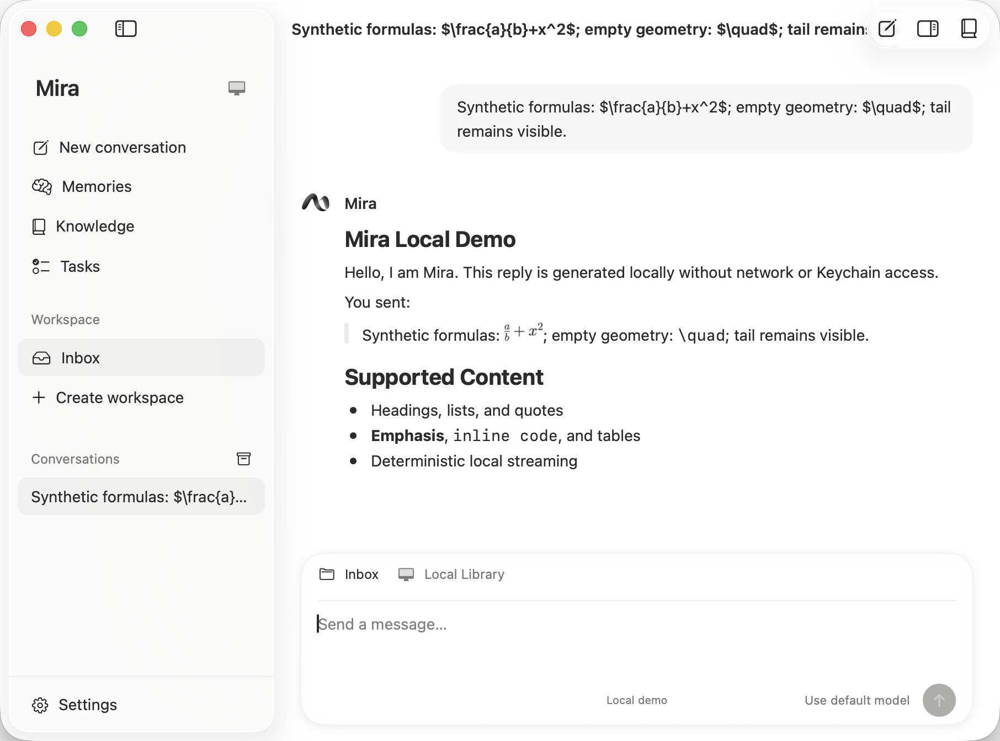
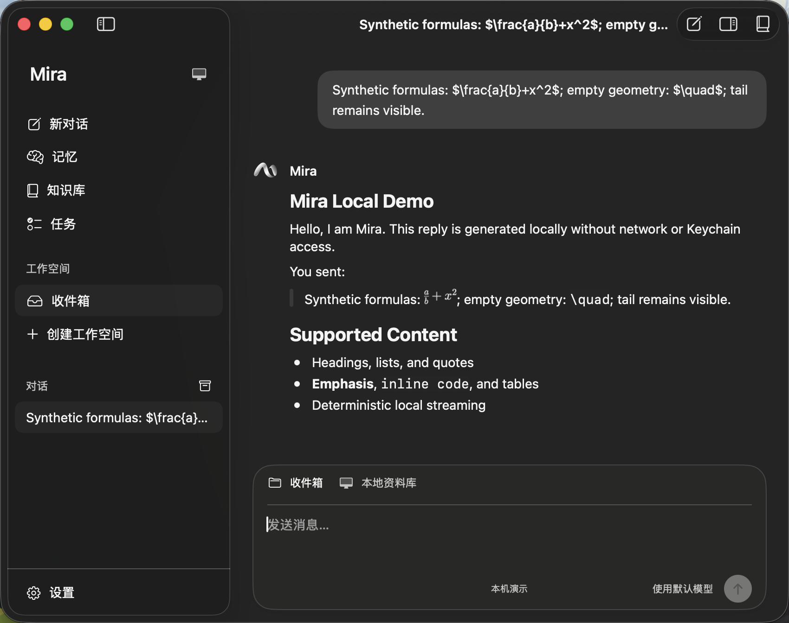

# Formula rendering crash correction

Date: 2026-09-14. Branch: `codex/agent-core`.

## Failure and correction

Four local Mira crash reports on September 14 show `EXC_BREAKPOINT / SIGTRAP` on the main thread in `MarkdownInlineNode.render`, called from Litext's line drawing. Symbolication of the most recent report places it at MarkdownView `InlineNode+Render.swift:191`: the formula has an `NSImage`, but `cgImage(forProposedRect:context:hints:)` returns nil and the Debug renderer asserts. The reports do not establish the original formula text.

The synthetic expression `$\quad$` confirms one trigger: SwiftMath returns an image with zero height. A positive-sized `NSImage` with no representations exercises the separate pixel-conversion failure. Neither requires a provider request or real conversation data.

`MiraMarkdownView.apply` now prepares the rendered-content map before installing it upstream. Finite positive image geometry and successful pixel conversion are required. Successful images are retained as bitmap-backed template images, so line drawing does not repeat SwiftMath's lazy drawing. Failed entries retain their replacement identifier and original LaTeX with a nil image, selecting MarkdownView's text fallback. Blocks, locale, and highlight maps are preserved. Original prepared content is not mutated. Native tables and subsequent highlight rebuilds consume the normalized content stored by MarkdownView. Answers and expanded thinking share this boundary.

The fix is in tracked host source; it does not modify a generated package checkout or change dependency revisions. No library reset, credential change, or model-output rewrite is involved.

## Regression coverage

- Native bitmap drawing with zero-sized, zero-height, and positive-sized undrawable images, both in paragraphs and table cells; verbatim fallback, redraw, resize, and reuse.
- Actual SwiftMath zero-height output for `$\quad$`.
- Mixed valid and empty-geometry formulas, native drawing actions, 320/720 pt renderer widths, English/light and Chinese/dark configuration, retained prefix selection, streaming and terminal updates.
- A synchronous unkeyed highlight notification forces the pinned upstream rebuild path, followed by actual bitmap drawing. This avoids assuming a rebuild occurred after a delay.
- Native offline conversation tests send synthetic math through the demo echo, wait for the full reply, capture the window, restart the app, explicitly select the persisted conversation, and verify the reply reappears. The first harness attempts assumed a transient Stop button would remain visible and that launch would select the previous conversation automatically; those test assumptions were corrected without changing production conversation behavior.

## Verification results

| Check | Result |
| --- | --- |
| `swift test --package-path Packages/MiraKit` | 1,052 tests in 147 suites passed |
| `MiraHostTests` scheme, including `MiraCompositionTests` | 248 Swift Testing tests and 24 XCTest tests passed; 1 opt-in live evaluation skipped |
| Focused native math UI tests | 2 passed: English/light and Chinese/dark at 850 pt window width; completed reply and explicit reopen after restart |
| Debug app build with committed dependency resolutions | Passed |
| Language policy | 2,008 bilingual strings passed |
| `git diff --check` | Passed |

The native runs used isolated temporary demo libraries and made no paid model calls. Screenshot inspection confirmed the fraction and superscript remain visible, `\quad` appears as text, and the reply tail remains intact. The Chinese/dark window measured 850 × 672 pt including native chrome. Final UI result bundle: `.build/xcode/Logs/Test/Test-MiraUI-2026.09.14_14-59-15-+0800.xcresult` (local generated evidence).

## Limits

The original user formula is unknown; the synthetic tests cover the observed failing image-conversion boundary. Native screenshots verify the valid fraction/superscript, raw `\quad` fallback, and following text. Accessibility checks verify the original reply source and persistence; fallback pixels are checked by host tests and screenshot inspection. This is macOS 26.6.2 / Apple Silicon verification, not a macOS 15 runtime test. Full VoiceOver navigation and dragging a selection through a formula remain unverified.
