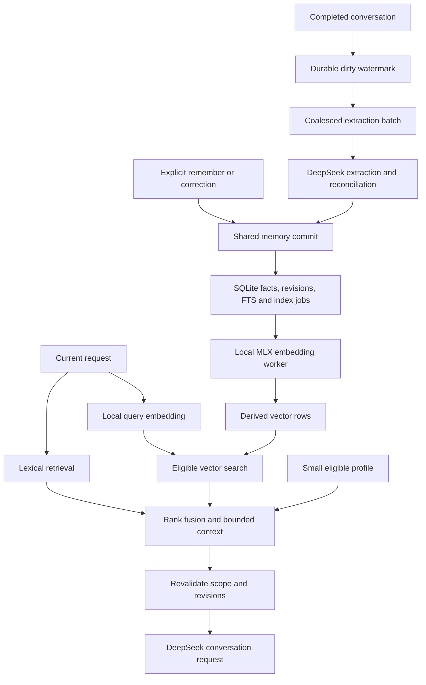

# Qwen3 local embedding assessment

Date: 2026-09-16
Status: Source-based assessment and proposed integration; runtime validation pending.
Scope: Qwen3-Embedding-0.6B through MLX Swift for Mira's macOS memory retrieval.

Follow-up: the user-authorized [native prototype](MEMORY_EMBEDDING_PROTOTYPE.md) now records real inference, resource and retrieval results. The source-based assessment below is preserved as the pre-experiment rationale; runtime status and checkpoint limitations are maintained in that evidence document.

## Decision

Proceed with this model/runtime as the leading local embedding candidate. Evaluate the original BF16 checkpoint as the reference and the MLX community 4-bit conversion as the distribution candidate. Select the production checkpoint after correctness, retrieval-quality, and resource measurements.

This permits DeepSeek to remain the only configured remote model provider. DeepSeek handles conversational reasoning and batched memory extraction; local Qwen handles text-to-vector inference. SQLite remains the durable store. MLX itself neither persists memories nor supplies Mira's retrieval policy.

The assessment inspected upstream documentation, tagged Swift source, model metadata, and Mira's architecture. No weights were downloaded, no inference or performance benchmark was run, and no application dependency, schema, memory-use policy, or runtime data was changed. The earlier tool-verification changes remain separate.

## Verified fit

| Area | Evidence | Assessment |
| --- | --- | --- |
| Model | 0.6B parameters; 1024-dimensional output; multilingual; supports shortened dimensions and up to 32K input tokens | Suitable candidate for short Chinese/English assertions. Published benchmarks do not establish Mira recall quality. [Qwen model card](https://huggingface.co/Qwen/Qwen3-Embedding-0.6B) |
| Swift implementation | `mlx-swift-lm` 3.31.4 exposes `MLXEmbedders`, registers `qwen3`, and includes the community Qwen embedding model configuration | A native adapter can use the existing implementation. Python, Ollama, and a local HTTP server are unnecessary product dependencies. [Factory](https://github.com/ml-explore/mlx-swift-lm/blob/3.31.4/Libraries/MLXEmbedders/ModelFactory.swift) |
| Package requirements | Tagged package uses Swift tools 6.1, supports macOS 14+, and depends on MLX Swift from 0.31.4 within its minor series | Compatible with Mira's declared macOS 15 / Swift 6.1 package baseline at the manifest level; actual dependency resolution and app build remain untested. [Manifest](https://github.com/ml-explore/mlx-swift-lm/blob/3.31.4/Package.swift) |
| Local evaluation host | Apple M1 Pro, 16 GiB unified memory, macOS 26.6.2, Xcode 26.6 / Swift 6.3.3 | Appropriate Apple Silicon evaluation host. This does not verify macOS 15 runtime behavior or establish performance. |
| Packaging | MLX uses Metal; its instructions require Xcode for building the Metal shader library | Validate a packaged native app, including shader resources. A package-only `swift test` result is insufficient. [MLX Swift build guidance](https://github.com/ml-explore/mlx-swift/blob/0.31.4/README.md) |

### Checkpoints and sizes

Metadata queried from Hugging Face on the assessment date:

| Checkpoint | Inspected revision | Weight file bytes | Role |
| --- | --- | ---: | --- |
| [Qwen original](https://huggingface.co/Qwen/Qwen3-Embedding-0.6B/tree/97b0c614be4d77ee51c0cef4e5f07c00f9eb65b3) | `97b0c614be4d77ee51c0cef4e5f07c00f9eb65b3` | 1,191,586,416 | BF16 reference, about 1.19 GB |
| [MLX community 4-bit DWQ](https://huggingface.co/mlx-community/Qwen3-Embedding-0.6B-4bit-DWQ/tree/6c3ae70858513f1a78e9cdca3cae330d9075cd2a) | `6c3ae70858513f1a78e9cdca3cae330d9075cd2a` | 335,296,756 | Quantized candidate, about 335 MB |

Sizes exclude tokenizer/configuration files and framework resources. Resident memory also includes activations and allocator caches; weight size is not a RAM measurement. The community conversion is a separate artifact, not an official Qwen checkpoint. Its quality loss has not been measured here. Both repositories declare Apache-2.0; retain model and dependency notices when distributing artifacts.

The original checkpoint's model type and weight layout match the inspected loader design, but successful direct loading has not been demonstrated. Use the embedding fine-tune, not ordinary Qwen3 chat/base weights. Pin model revisions, package versions, and resolved dependencies for the experiment.

## Inference correctness before speed

The reference recipe adds a retrieval instruction to queries, embeds documents without that instruction, selects the last valid token, and L2-normalizes the output. Use raw embedding inputs rather than a chat template. Start with the full 1024 dimensions; assess smaller dimensions separately. [Qwen reference usage](https://huggingface.co/Qwen/Qwen3-Embedding-0.6B#usage)

A proposed fixed query template is:

```text
Instruct: Given a conversation request, retrieve relevant user memories that help answer it.
Query:{query}
```

This instruction is a Mira experiment, not a Qwen-prescribed memory prompt. Store preprocessing and instruction versions in the retrieval configuration. Freeze them during quality comparisons.

### Tagged implementation has a padding constraint

Static inspection of `mlx-swift-lm` 3.31.4 found:

- Its Qwen embedding entry point accepts `attentionMask` but does not pass that mask to the inner transformer, which builds a causal mask. [Qwen implementation](https://github.com/ml-explore/mlx-swift-lm/blob/3.31.4/Libraries/MLXEmbedders/Models/Qwen3.swift)
- Its `.last` pooler selects position `sum(mask) - 1`. That position describes right-padded input, not left-padded input. [Pooling implementation](https://github.com/ml-explore/mlx-swift-lm/blob/3.31.4/Libraries/MLXEmbedders/Pooling.swift)

For a mask `[0, 0, 1, 1, 1]`, the pooler selects position 2 although the last valid position is 4. Copying the reference's left-padding configuration into this tagged pipeline would therefore be incorrect. This is a source-level finding, not an observed Mira regression.

Start with unpadded single inputs. Then validate right-padded, length-bucketed batches against single-input results and the BF16 reference. The causal mask should prevent valid positions from attending to subsequent right padding, but tokenizer, positions, masks, and pooling still need end-to-end verification. Do not accept a returned vector as sufficient proof of a correct adapter. Reject empty input and non-finite or incorrectly sized output. Explicitly enable normalization.

Use short assertion inputs initially, with a bounded token limit and no silent truncation of meaningful qualifications. Benchmark 128/512-token inputs before selecting the production limit. The model's 32K capacity is not a recommended memory-item size.

## Proposed Mira integration



These are proposed responsibilities; they do not change current contracts:

| Owner | Responsibility |
| --- | --- |
| `MiraCore` | Foundation-only embedding/retrieval ports, plain Sendable values, policy and orchestration. No MLX arrays or GPU resources across the boundary. |
| `MiraMac` platform adapter | Own the MLX container, tokenizer, download/install lifecycle, serialized inference scheduling, cancellation, and memory-pressure handling. Prioritize query inference over background indexing. |
| `MiraData` | SQLite vector rows, durable indexing jobs, revision checks, retrieval snapshots, and purge. |
| `MiraProviders` | Existing remote DeepSeek extraction/chat adapter; embedding does not require an additional remote provider. |

Keep the model resident during active use; unload according to measured memory pressure and idle cost. Swift task cancellation alone does not prove submitted GPU work has stopped. Drain in-flight work before releasing resources and discard stale results before commit. Profile actual executor behavior to ensure neither inference nor vector scanning blocks the main actor.

### Write and index

1. Commit an eligible fact revision, lexical projection, and an embedding job through the existing authoritative journal/transaction flow. A vector row is always a derived projection.
2. Embed only new or changed assertion text in bounded local batches. Do not re-embed the whole library or raw conversation on every turn.
3. Before committing the vector, verify the current revision, content fingerprint, scope, and deletion/suppression state. An obsolete job must never restore a forgotten memory.
4. Retain immediate lexical/recent-commit visibility while indexing is pending. Do not delay an explicit successful save solely for GPU work.

Store memory ID/revision, model artifact identity, tokenizer/preprocessing/pooling versions, dimension, normalization scheme, content fingerprint, and the vector. Changed model spaces must not be mixed. A query-instruction change also requires reevaluation and versioned query caches; document-affecting changes require re-embedding. An index rebuild must leave fact authority intact and keep a consistent active generation until the new generation is ready.

### Storage and retrieval

Start by evaluating Float32 vector blobs in the existing SQLite store and an exact cosine scan of eligible rows. For normalized vectors, cosine ranking is a dot product. A platform implementation can use Accelerate for scanning; keep that framework outside `MiraCore`.

At 1024 dimensions, vector payload alone is 4096 bytes per memory: approximately 39.1 MiB for 10,000 memories and 390.6 MiB for 100,000. Model-weight quantization does not automatically quantize stored vectors. Metadata and any in-memory matrix add storage/RAM beyond those figures.

This simple scan is a candidate for personal-memory scale, not a verified latency result. Measure the existing 10,000-memory target before selecting a vector extension or approximate nearest-neighbor index. Avoid fetching and decoding the entire database on every keystroke; a derived matrix needs generation/revision invalidation and purge handling.

Search semantic and lexical channels independently, enforce scope/lifecycle before each top-K selection, then fuse ranked results, for example with reciprocal rank fusion. Do not restrict semantic search to lexical hits: that loses the paraphrases it is meant to recover. Revalidate authorization and exact revisions before injecting selected text into a remote request. Embedding similarity does not establish truth, identity, contradiction, or current validity.

### Scheduling and availability

- A completed turn updates extraction progress; it does not automatically dispatch another DeepSeek request. Coalesce by unprocessed turns/tokens, quiet time, maximum age, and budget. Explicit saves/corrections remain prioritized.
- Local embedding jobs follow committed changes. Query embeddings are computed when retrieval needs them and can be cached within a bounded lifecycle. Neither operation consumes DeepSeek API tokens.
- Download public model files through a pinned manifest with integrity checks, resumable temporary files, and atomic installation. Once installed, embedding can run offline. Keep downloaded artifacts outside git and personal-library exports.
- Missing weights, unavailable acceleration, failed loading, or unsupported hardware leave lexical/profile recall available with diagnosable degraded status. Do not silently send embedding inputs to a remote endpoint. Intel support needs its own decision; this assessment covers Apple Silicon.
- Local embedding does not mean the full memory pipeline is offline: DeepSeek extraction and chat still receive their authorized inputs.

## Required validation before adoption

| Gate | Evidence to collect |
| --- | --- |
| Correct inference | Fixed synthetic tokenizer inputs; BF16 reference comparison; finite 1024-dimensional normalized vectors; single-input versus unequal-length batch agreement; query/document formatting; empty/overlong input handling |
| Quantization quality | Compare BF16 and 4-bit on the same held-out Chinese/English recall corpus, using fixed extraction, ranking, and context budgets |
| Retrieval value | Lexical + profile baseline versus hybrid + profile; paraphrases, exact names, implicit constraints, negation, temporal changes, distractors, and no-answer cases; report Recall@K and final answer usefulness separately |
| Performance | Cold load, warm query p50/p95, background batches of 1/8/16 at 128/512 tokens, peak process/GPU allocation, app responsiveness, and save-to-search lag on the M1 Pro host |
| Scale | 10,000-memory exact scan, filtered searches, index rebuild and cache footprint; compare the total prefetch path against the existing local 300 ms p95 target |
| Lifecycle | Restart during download/indexing, offline use, failed load, memory pressure, cancellation, concurrent correction/deletion, stale job rejection, and lexical fallback |
| Product correctness | Explicit save then fresh-session recall with real production policy; zero deleted, superseded, wrong-scope, or blocked-source injection; no per-item approval required |
| Shipping | Reproducible native Xcode build, packaged shader/tokenizer resources, notices, and a macOS 15 runtime check separate from the current host |

Do not promise a latency or RAM figure before these measurements. Release selection requires measurable recall benefit within the application budget, not merely successful model loading. See [QUALITY.md](QUALITY.md) for current acceptance definitions; changing their budget or citation requirements is a separate contract update.

## Relationship to the current recall failure

The current `memory.remember` path saves `allowsRemoteUse: false`, while model recall excludes such records. Qwen cannot repair this policy mismatch. The redesign must first unify normal capture/use policy, then measure semantic retrieval independently. See [the memory research diagnosis](AGENT_MEMORY_RESEARCH.md#2-miras-current-gaps).

Next implementation sequence: an isolated native inference/quality experiment; the agreed memory write/use redesign; durable indexing plus hybrid retrieval; end-to-end privacy, recall, and performance acceptance. The current assessment completes the model/runtime feasibility review and leaves those runtime gates explicitly open.
